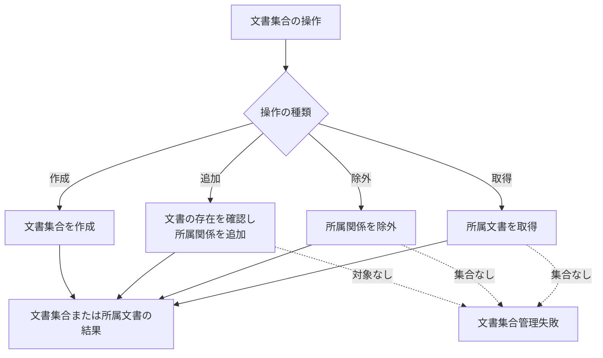

# 文書集合管理設計

> [!abstract] この文書の役割
> 検索や実験の対象として文書をまとめて扱う文書集合と、文書集合への文書の所属関係を管理する機能を定義する。

## 1. 目的と適用範囲

文書集合は、複数の文書を検索や実験の対象としてまとめて扱うための単位である。文書集合が参照するのは文書の識別子であり、文書本文や文書バージョンを複製して保持しない。

この機能は、文書集合の作成、文書の追加、文書の除外、所属文書の取得を扱う。文書の内容更新、文書バージョンの切り替え、文書チャンクや検索用データの生成は扱わない。

## 2. 責務と入出力

### 2.1 責務と境界

この機能は、文書集合と文書の所属関係を保存し、文書集合を構成する文書を識別できる状態にする。文書集合は文書をまとめる参照単位であり、文書そのものを複製しないため、1つの文書を複数の文書集合へ所属させることを許容する。同じ文書集合と文書の組み合わせは1つの所属関係として扱い、重複させない。

文書集合への所属変更によって、文書、文書バージョン、文書チャンク、検索用データを作成・更新・削除しない。

### 2.2 入力・成功結果・失敗結果

| 操作 | 入力 | 成功結果 |
|---|---|---|
| 文書集合を作成する | 文書集合の情報 | 新しい文書集合を識別できる結果 |
| 文書を追加する | 文書集合の識別子、文書の識別子 | 所属関係を確認できる状態 |
| 文書を除外する | 文書集合の識別子、文書の識別子 | 指定した所属関係が除外された状態 |
| 所属文書を取得する | 文書集合の識別子 | 所属する文書の識別子の集合 |

文書集合の具体的な属性、識別子の形式、保存制約はSchemaとmigrationを正本とする。

## 3. 処理設計

### 3.1 全体フロー

### 3.2 処理規則

文書を追加するときは、対象文書が存在することを確認してから所属関係を保存する。すでに同じ所属関係が存在する場合は、重複した所属関係を作らず、所属済みとして扱う。

文書を除外しても、文書そのものの識別、文書バージョン、文書チャンク、検索用データは変更しない。別の文書集合に所属している場合も、除外した所属関係以外を変更しない。すでに除外済みの所属関係を除外する場合は、何も変更せず成功として扱う。

文書集合から検索対象を作る処理では、文書集合が保持する文書の識別子を検索側へ渡す。文書の現在の文書バージョンをどの時点で解決し、検索中に変更されない集合として固定するかは、[検索対象設計](<../retrieval-generation/検索対象設計.md>)が担当する。

## 4. 失敗時の扱い

| 失敗 | 判定 | 扱い |
|---|---|---|
| 文書集合なし | 指定した文書集合が存在しない | 所属関係を変更しない |
| 文書なし | 追加対象の文書が存在しない | 所属関係を追加しない |
| 保存失敗 | 文書集合または所属関係を保存できない | 部分的な変更を成功結果にしない |
| 不変条件違反 | 所属関係を維持できない | 操作を失敗させる |

## 5. 契約と受け渡し

### 5.1 不変条件

- 文書集合は文書をまとめて扱う単位である。
- 同じ文書集合と文書の組み合わせに所属関係を重複させない。
- 文書集合への所属変更は、文書本文や文書バージョンを変更しない。
- 文書集合への所属変更は、文書チャンクや検索用データを自動生成・削除しない。
- 所属文書の取得結果は、文書の識別子を単位とする。

### 5.2 他機能・コンポーネントへの受け渡し

| 受け渡し先 | 渡すもの | 渡してよい条件 | 相手が担当すること |
|---|---|---|---|
| 文書・文書バージョン管理 | 追加対象の文書識別子の存在確認 | 文書を所属させるとき | 文書の識別と文書バージョンの管理 |
| 検索・回答生成 | 文書集合に所属する文書識別子 | 文書集合を検索対象として解決するとき | 現在版または固定版の文書バージョン集合の確定 |
| 実験・評価 | 文書集合の識別子 | 実験条件が文書集合を参照するとき | 実験で利用する文書集合の指定と結果への記録 |

## 関連文書

- [RAGScope要求定義「1.1 文書」](<../../../RAGScope要求定義.md#1.1 文書>)
- [RAGScope用語集「文書集合」](<../../../RAGScope用語集.md#文書集合>)
- [RAGScopeドメインモデル](../../RAGScopeドメインモデル.md)
- [システムアーキテクチャ](../../システムアーキテクチャ.md)
- [文書・文書バージョン管理設計](<./文書・文書バージョン管理設計.md>)
- [検索対象設計](<../retrieval-generation/検索対象設計.md>)
