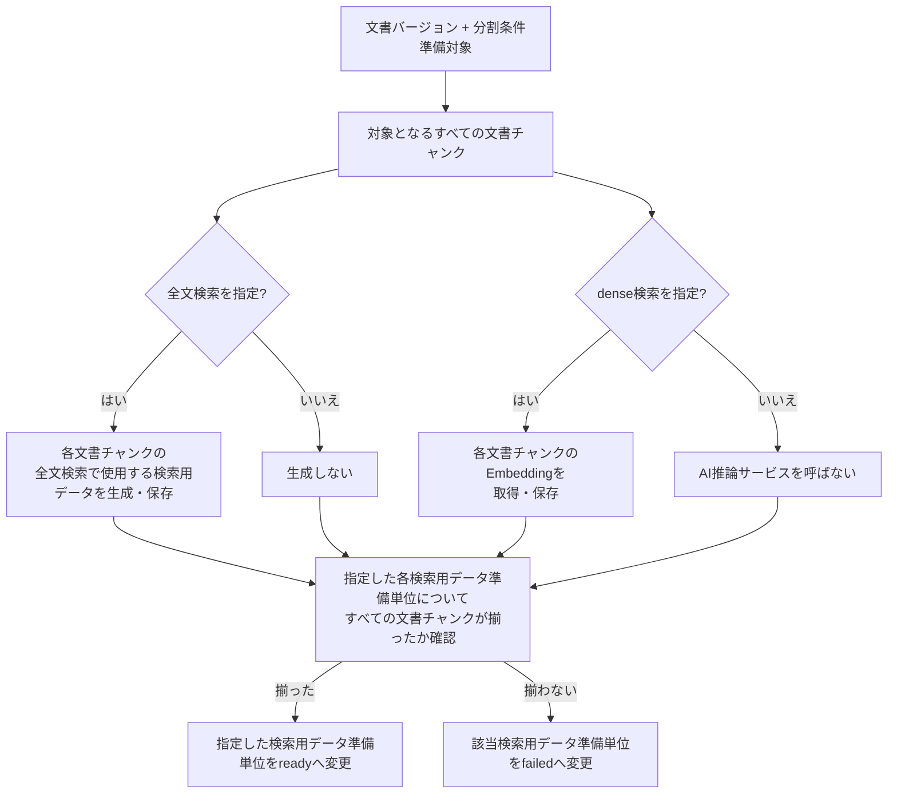

# 検索用データ準備設計

> [!abstract] この文書の役割
> 文書チャンクから、指定された検索方式に必要な検索用データを準備し、準備完了したデータだけを「検索・回答生成」ドメインの検索処理が利用できる契約を定義する。

## 1. 入力と準備対象

検索用データ準備は、1つの文書バージョンと1つの分割条件に対応する文書チャンク列を対象とする。

入力は次を持つ。

| 項目 | 内容 |
|---|---|
| 文書バージョン | 準備対象となる文書バージョン |
| 分割条件 | 対象の文書チャンク列を識別する条件 |
| 準備対象 | `全文検索`、`dense検索`の1つ以上 |
| 全文検索設定 | 全文検索を指定した場合に必須。PostgreSQL text search configuration名 |
| Embeddingプロファイル | dense検索を指定した場合に必須。[Embedding生成設計](../../Embedding生成設計.md)で定義する不変なEmbeddingプロファイルID |

`hybrid検索`は独立した検索用データを持たず、全文検索で使用する検索用データと文書チャンクのEmbeddingの両方が準備済みであることを前提に「検索・回答生成」ドメインで実行する。

準備対象に指定していない検索方式のデータは生成しない。そのため、全文検索だけを準備する要求ではAI推論サービスを呼び出さず、AI推論サービスが停止していても全文検索で使用する検索用データを準備できる。

## 2. 検索用データ準備単位と完了状態

検索用データは、次の単位ごとに準備状態を管理する。

**全文検索**

```text
文書バージョン
+ 分割条件
+ 全文検索
+ PostgreSQL text search configuration
```

**dense検索**

```text
文書バージョン
+ 分割条件
+ dense検索
+ EmbeddingプロファイルID
```

各検索用データ準備単位は `preparing`、`ready`、`failed` のいずれかの状態を持つ。

- `preparing`: 個々の文書チャンクの検索用データを生成・保存している途中。
- `ready`: 対象となるすべての文書チャンクについて、その検索用データ準備単位に必要な検索用データが揃っている。
- `failed`: 処理を終了した時点で `ready` にできなかった。

「検索・回答生成」ドメインの検索処理が利用できるのは `ready` の検索用データ準備単位だけである。個々の検索用データ行が保存されていても、検索用データ準備単位が `preparing` または `failed` なら検索対象へ含めない。

準備状態をデータベースでどのtable・columnとして表すかはmigrationを正本とするが、`ready`へ遷移する条件と検索処理の利用可否はこの設計を正本とする。

## 3. 処理



### 3.1 全文検索で使用する検索用データ

全文検索で使用する検索用データは、文書チャンクの本文と指定されたPostgreSQL text search configurationから導出する。

同じ全文検索で使用する検索用データとして再利用できるのは、文書チャンクとtext search configurationが同じ場合だけである。「検索・回答生成」ドメインの検索処理も同じconfigurationで質問を解析し、異なるconfigurationの検索用データを混在させない。

正確なSQL式、生成列、indexの構成はmigrationと検索実装を正本とする。

### 3.2 文書チャンクのEmbedding

dense検索を指定した場合、RAGScopeアプリケーションは[Embedding生成設計](../../Embedding生成設計.md)と[AI推論サービスOpenAPI](../../../../contracts/ai-inference.openapi.yaml)に従い、文書チャンクの本文とEmbeddingプロファイルIDをAI推論サービスへ渡す。

AI推論サービスから返された`profile_fingerprint`は、指定したEmbeddingプロファイルIDについて取得したfingerprintと一致しなければならない。一致しない応答は契約違反として保存しない。

文書チャンクのEmbeddingを検索用データとして保持するときは、元の文書チャンク、EmbeddingプロファイルID、`profile_fingerprint`を対応付ける。EmbeddingプロファイルIDは不変であり、Embeddingプロファイルの内容を変更する場合は別のEmbeddingプロファイルIDを使用する。

## 4. 再実行と部分保存

同じ検索用データ準備単位がすでに`ready`なら再生成せず、その検索用データ準備単位を再利用する。

`preparing`または`failed`を再実行する場合は、既に正常保存されている文書チャンク単位の検索用データを検証して再利用し、不足分だけを生成してよい。ただし、最後に対象となるすべての文書チャンクが揃ったことを検証するまでは`ready`へ変更しない。

1回の準備要求が複数の準備対象を指定した場合、検索用データ準備単位ごとの状態は独立して保存する。要求全体は、指定したすべての検索用データ準備単位が`ready`になった場合だけ成功とする。

例えば全文検索が`ready`になった後にdense検索が最終失敗した場合、要求全体は失敗するが、全文検索の`ready`状態は残る。後続の全文検索だけの要求はそのデータを利用できる。

文書または分割条件を更新した場合は、新しい文書バージョンまたは分割条件に対する別の検索用データ準備単位を作る。過去の検索用データ準備単位を上書きしない。

## 5. 文書チャンクのEmbedding生成要求のretryとtimeout

retryとtimeoutを制御するのは、RAGScopeアプリケーション内でAI推論サービスへ文書チャンクのEmbedding生成を要求する内部処理である。検索用データ準備UseCaseは、その内部処理が最終的に文書チャンクのEmbeddingを取得できたかどうかを受け取る。

AI推論サービスによる文書チャンクのEmbedding生成はデータベースを書き換えず、同じ入力に対して計算結果を返す処理であるため、同じHTTP requestの再試行を許可する。

初期設定は次とする。

| 項目 | 値 |
|---|---:|
| 最大attempt数 | 3。最初のattemptを含む |
| 1 attemptのtimeout | 60秒 |
| 文書チャンクのEmbedding生成要求全体のtimeout | 180秒 |
| 初期待機 | 250ms |
| backoff | attemptごとに2倍 |
| 最大待機 | 1秒 |
| jitter | 待機時間の±20% |

文書チャンクのEmbedding生成要求全体のtimeoutは、attemptの実行時間とattempt間の待機時間をすべて含む。残り時間がなくなった場合は最大attempt数に達していなくても打ち切る。

次は再試行対象とする。

- 接続開始に失敗した。
- 接続が応答完了前に切断された。
- 1 attemptがtimeoutした。
- HTTP 408、429、502、503、504を受け取った。

次は再試行しない。

- その他の4xx。
- HTTP 500、501。
- AI推論サービスが返した明示的な入力・モデル・プロファイルの機能error。
- JSONを契約どおりに解釈できない。
- 入力件数と応答件数が一致しない。
- item IDの対応が壊れている。
- `profile_fingerprint`が一致しない。
- vector次元不一致、NaN、無限大など応答内容の検証に失敗した。

retry途中のattempt失敗は、後続attemptで回復した場合に検索用データ準備UseCaseの最終失敗としない。再試行対象外の失敗、最大attempt数到達、文書チャンクのEmbedding生成要求全体のtimeoutで文書チャンクのEmbeddingを得られなかった場合に内部処理の最終失敗とし、その検索用データ準備単位を`ready`にしない。

具体的なHaskellの実行機構と設定表現はコード・設定を正本とする。各attemptのTrace / Spanは[実行追跡設計](../../observability/実行追跡設計.md)とHTTP client instrumentationに従う。

## 6. 「検索・回答生成」ドメインへの受け渡し

「検索・回答生成」ドメインの検索処理は[検索対象設計](<../retrieval-generation/検索対象設計.md>)に従い、検索開始時に使用する具体的な文書バージョン集合、分割条件、検索方式、検索条件を確定する。

その指定に対応する検索用データ準備単位が1つでも`ready`でない場合、検索はその対象について失敗する。

- 以前の文書バージョンの`ready`データへ暗黙にフォールバックしない。
- `preparing`または`failed`の文書を検索対象から黙って除外しない。
- 異なる分割条件、全文検索configuration、Embeddingプロファイルの検索用データを混ぜない。

これにより、文書の現在の文書バージョンだけが先に更新され、検索用データが未準備である状態でも、検索処理の動作を一意に決められる。

## 7. 失敗時の扱い

次の場合は、該当する検索用データ準備単位を`ready`にせず、準備要求を失敗とする。

- 対象の文書バージョンまたは文書チャンク列が存在しない。
- 準備対象が空である。
- 全文検索を指定したのにtext search configurationがない。
- dense検索を指定したのにEmbeddingプロファイルIDがない、または存在しない。
- 全文検索で使用する検索用データを生成・保存できない。
- 文書チャンクのEmbedding生成要求が5章の実行制御を経ても最終失敗した。
- AI推論サービスの応答が契約を満たさない。
- 文書チャンクのEmbeddingまたはその他の検索用データを保存できない。
- 対象となるすべての文書チャンクについて必要なデータを揃えられない。

## 関連文書

- [RAGScope要求定義「1.1 文書」](<../../../RAGScope要求定義.md#1.1 文書>)
- [RAGScope要求定義「1.3.1 検索」](<../../../RAGScope要求定義.md#1.3.1 検索>)
- [RAGScope要求定義「2.3 信頼性と保守性」](<../../../RAGScope要求定義.md#2.3 信頼性と保守性>)
- [システムアーキテクチャ「4.1 文書を登録し、検索可能にする」](<../../システムアーキテクチャ.md#4.1 文書を登録し、検索可能にする>)
- [Embedding生成設計](../../Embedding生成設計.md)
- [検索対象設計](<../retrieval-generation/検索対象設計.md>)
- [文書分割設計](./文書分割設計.md)
