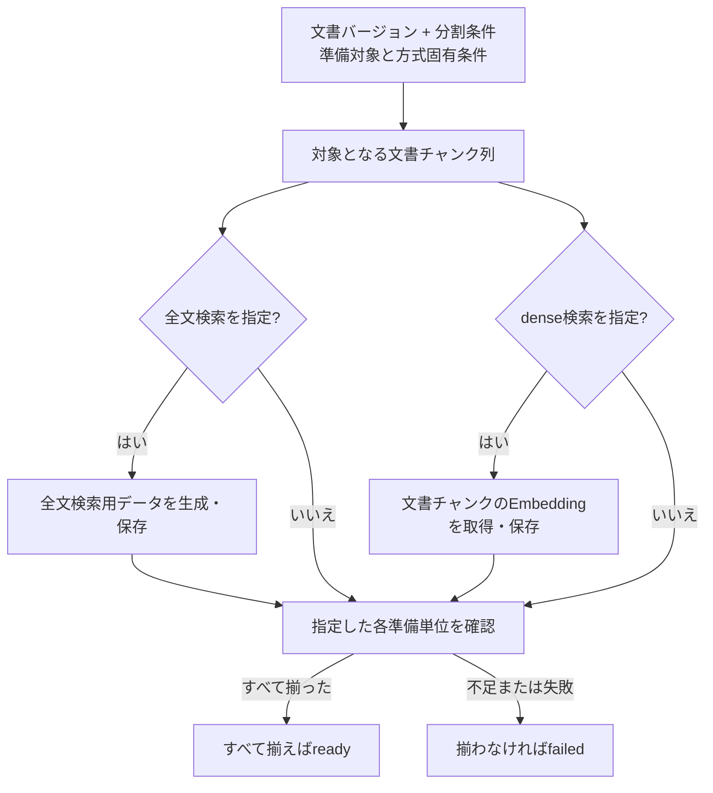

# 検索用データ準備設計

> [!abstract] この文書の役割
> 文書チャンクから指定された検索方式に必要な検索用データを準備し、準備完了したデータだけを「検索・回答生成」ドメインが利用できる契約を定義する。

## 1. 目的と適用範囲

検索用データ準備は、1つの文書バージョンと1つの分割条件に対応する文書チャンク列を、全文検索またはdense検索で利用できる状態にする。指定された方式だけを準備し、準備単位ごとに利用可否を管理する。

`hybrid検索`は独立した検索用データを持たない。全文検索用データとdense検索用データの両方が準備済みであることを前提に、「検索・回答生成」ドメインが実行する。

## 2. 責務と入出力

### 2.1 責務と境界

この機能は、検索方式固有の条件を識別し、文書チャンクから検索用データを生成・保存し、すべての対象チャンクが揃ったときだけ検索用データ準備単位を`ready`にする。

RAGScopeアプリケーションが処理全体、AI推論サービスへの依頼、保存、再試行・タイムアウトを制御する。AI推論サービスはEmbeddingを計算するが、RAGScopeの文書や検索用データを保存しない。検索開始時にどの文書バージョン集合を選ぶかは[検索対象設計](<../retrieval-generation/検索対象設計.md>)が担当する。

### 2.2 入力・成功結果・失敗結果

| 項目 | 内容 |
|---|---|
| 文書バージョン | 準備対象の文書バージョン |
| 分割条件 | 対象の文書チャンク列を識別する条件 |
| 準備対象 | `全文検索`、`dense検索`の1つ以上 |
| 全文検索設定 | 全文検索を指定した場合に必要なPostgreSQL text search configuration |
| Embeddingプロファイル | dense検索を指定した場合に必要な不変のEmbeddingプロファイルID |

成功時は、指定したすべての検索用データ準備単位が`ready`であることを確認できる。1つの方式だけが準備できた場合、その方式の`ready`状態は保持するが、複数方式を指定した要求全体は失敗とする。

## 3. 処理設計

### 3.1 全体フロー

### 3.2 処理規則

検索用データ準備単位は、次の組み合わせごとに管理する。

| 検索方式 | 準備単位を識別する条件 |
|---|---|
| 全文検索 | 文書バージョン + 分割条件 + 全文検索 + PostgreSQL text search configuration |
| dense検索 | 文書バージョン + 分割条件 + dense検索 + EmbeddingプロファイルID |

各準備単位は`preparing`、`ready`、`failed`の状態を持つ。

- `preparing`: 個々の文書チャンクの検索用データを生成・保存している途中
- `ready`: 対象となるすべての文書チャンクの検索用データが揃っている
- `failed`: 処理を終了した時点で`ready`にできなかった

指定していない検索方式のデータは生成しない。全文検索だけを指定した場合はAI推論サービスを呼ばない。

全文検索用データは、文書チャンクの本文と指定されたPostgreSQL text search configurationから導出する。正確なSQL、生成列、indexの構成はmigrationと検索実装を正本とする。

dense検索では、[Embedding生成設計](../../Embedding生成設計.md)と[AI推論サービスOpenAPI](../../../../contracts/ai-inference.openapi.yaml)に従い、文書チャンクの本文とEmbeddingプロファイルIDをAI推論サービスへ渡す。応答の`profile_id`、`profile_fingerprint`、`dimension`、item ID、vectorを検証し、文書チャンクとEmbeddingの対応を保ったまま保存する。`profile_fingerprint`が同じプロファイルIDの確認済みfingerprintと一致しない応答は保存しない。

同じ準備単位がすでに`ready`なら再生成せず再利用する。`preparing`または`failed`を再実行する場合は、正常保存済みの文書チャンク単位のデータを検証して再利用し、不足分を生成してよい。ただし、すべての文書チャンクが揃うまで`ready`へ変更しない。

文書バージョンまたは分割条件が変わった場合は、新しい準備単位を作る。過去の準備単位と検索用データを上書きしない。

#### 文書チャンクのEmbedding要求に適用するretryとtimeout

retryとtimeoutを制御するのは、RAGScopeアプリケーション内でAI推論サービスへ文書チャンクのEmbedding生成を要求する内部処理である。検索用データ準備は、その処理が最終的にEmbeddingを取得できたかどうかを受け取る。

AI推論サービスのEmbedding生成はデータベースを書き換えず、同じ入力に対して計算結果を返すため、同じHTTP requestの再試行を許可する。

| 項目 | 値 |
|---|---:|
| 最大試行回数 | 3。最初の試行を含む |
| 1試行のtimeout | 60秒 |
| 要求全体のtimeout | 180秒 |
| 初期待機 | 250ms |
| backoff | 試行ごとに2倍 |
| 最大待機 | 1秒 |
| jitter | 待機時間の±20% |

要求全体のtimeoutは、試行の実行時間と試行間の待機時間を含む。残り時間がなくなった場合は、最大試行回数に達していなくても打ち切る。

次は再試行対象とする。

- 接続開始に失敗した
- 応答完了前に接続が切断された
- 1試行がtimeoutした
- HTTP 408、429、502、503、504を受け取った

次は再試行しない。

- その他の4xx
- HTTP 500、501
- AI推論サービスが返した入力・モデル・プロファイルの機能error
- JSONを契約どおりに解釈できない
- 入力件数と応答件数が一致しない
- item IDの対応が壊れている
- `profile_fingerprint`が一致しない
- vectorの次元不一致、NaN、無限大など応答内容の検証に失敗した

具体的な実行機構と設定表現はコード・設定を正本とする。各試行のTrace / Spanは[実行追跡設計](../../observability/実行追跡設計.md)とHTTP client instrumentationに従う。

## 4. 失敗時の扱い

| 失敗 | 扱い |
|---|---|
| 対象なし | 文書バージョンまたは文書チャンク列が存在しない場合は失敗 |
| 準備対象なし | 全文検索・dense検索のどちらも指定されていない場合は失敗 |
| 条件不足 | 指定した方式固有の設定がない場合は失敗 |
| 全文検索用データの生成・保存失敗 | 全文検索の準備単位を`ready`にしない |
| Embedding要求の最終失敗 | dense検索の準備単位を`ready`にしない |
| 契約違反応答 | Embeddingを保存せずdense検索の準備単位を`ready`にしない |
| 途中保存後の失敗 | 正常保存済みデータは検証可能な状態で保持し、準備単位は`failed`のままとする |

複数の準備対象を指定した場合、準備単位ごとの状態は独立して保存する。全文検索が`ready`になった後にdense検索が最終失敗しても、全文検索の`ready`状態は残す。ただし、指定した両方が揃うまで要求全体は成功にしない。

## 5. 契約と受け渡し

### 5.1 不変条件

- `ready`の準備単位には、対象となるすべての文書チャンクの必要な検索用データが揃っている。
- `preparing`または`failed`の準備単位に属する個別データを、検索処理が直接利用しない。
- 文書チャンクのEmbeddingは、文書チャンク、EmbeddingプロファイルID、`profile_fingerprint`と対応付いている。
- 同じ準備単位で、異なる文書バージョン、分割条件、text search configuration、Embeddingプロファイルのデータを混在させない。
- 文書の現在の文書バージョンが更新されても、以前の文書バージョンの準備単位を上書きしない。

### 5.2 他機能・コンポーネントへの受け渡し

| 受け渡し先 | 渡すもの | 渡してよい条件 | 相手が担当すること |
|---|---|---|---|
| AI推論サービス | 文書チャンクのitem ID、本文、EmbeddingプロファイルID | dense検索用データを準備するとき | Embeddingの計算と契約に従う応答 |
| データベース | 検索用データと準備単位の状態 | 対象単位と文書チャンクの対応を検証した場合 | 永続化と検索用indexの提供 |
| 検索・回答生成 | `ready`の検索用データ準備単位 | 検索開始時に必要な単位がすべて`ready`の場合 | 検索対象の確定、検索、結果の順位付け |

検索対象の文書バージョンが未準備の場合、検索・回答生成ドメインは以前の文書バージョンへ暗黙にフォールバックせず、検索対象未準備として扱う。詳細は[検索対象設計](<../retrieval-generation/検索対象設計.md>)を参照する。

## 関連文書

- [RAGScope要求定義「1.1 文書」](<../../../RAGScope要求定義.md#1.1 文書>)
- [RAGScope要求定義「1.3.1 検索」](<../../../RAGScope要求定義.md#1.3.1 検索>)
- [RAGScope要求定義「2.3 信頼性と保守性」](<../../../RAGScope要求定義.md#2.3 信頼性と保守性>)
- [RAGScopeドメインモデル](../../RAGScopeドメインモデル.md)
- [システムアーキテクチャ「2.1 RAGScopeアプリケーション」](<../../システムアーキテクチャ.md#2.1 RAGScopeアプリケーション>)
- [システムアーキテクチャ「2.2 AI推論サービス」](<../../システムアーキテクチャ.md#2.2 AI推論サービス>)
- [システムアーキテクチャ「4.1 文書を検索可能にする」](<../../システムアーキテクチャ.md#4.1 文書を検索可能にする>)
- [Embedding生成設計](../../Embedding生成設計.md)
- [検索対象設計](<../retrieval-generation/検索対象設計.md>)
- [文書分割設計](./文書分割設計.md)
- [AI推論サービスOpenAPI](../../../../contracts/ai-inference.openapi.yaml)
