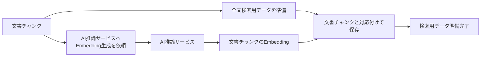

# 検索用データ準備設計

> [!abstract] この文書の役割
> 文書チャンクから全文検索とdense検索に必要な検索用データを準備し、どの文書チャンクと生成条件から作られたかを追跡できる状態で保持する。

## 1. 入力と結果

検索用データ準備は、同じ文書バージョンと分割条件から作られた文書チャンク列を対象とする。

現在、次の検索用データを準備する。

| 検索用データ | 生成 |
|---|---|
| 全文検索用データ | 文書チャンクの本文からRAGScopeアプリケーションまたはデータベースで生成する |
| 文書チャンクのEmbedding | 文書チャンクの本文をAI推論サービスへ渡して生成する |

全文検索で使用する正確な解析方法やインデックス構造は検索設計とDBのmigrationを正本とする。Embeddingのモデル、次元数、入力形式、AI推論サービスとの通信契約は、対応する検索設計と機械可読な契約を正本とする。

成功した場合は、対象の全文書チャンクについて必要な検索用データが保存され、各データから元の文書チャンクと生成結果に影響する条件を識別できる状態になる。

## 2. 処理

RAGScopeアプリケーションが処理全体を制御する。AI推論サービスは文書チャンクのEmbeddingを計算して返すだけで、文書チャンクや検索用データをDBへ保存しない。

Embedding生成を1件ずつ行うか複数件をまとめて行うかは通信・性能上の実装詳細であり、この設計では固定しない。

## 3. 対応関係と不変条件

検索用データは、少なくとも次を満たす。

- すべての検索用データは、生成元の文書チャンクを識別できる。
- 文書チャンクをたどれば、文書バージョン、分割条件、文書内位置へ遡れる。
- Embeddingは、生成に使用したモデルなど、ベクトルの意味が変わる条件を識別できる状態で保存する。
- 異なる文書バージョン、分割条件、Embedding生成条件のデータを同じ検索対象として暗黙に混ぜない。
- 既存の文書チャンクや検索用データを、新しい文書バージョンや分割条件の結果で上書きしない。

質問Embeddingは文書チャンク由来の検索用データではないため、この設計では生成しない。[検索・回答生成](../retrieval-generation/README.md)側で扱う。

## 4. 完了と再実行

1回の検索用データ準備は、対象とした文書チャンクすべてについて、その検索方式に必要なデータが揃ったときに成功とする。

一部の文書チャンクだけ生成済みの状態は、準備完了として検索側へ渡さない。ただし、正常に保存できた文書チャンク単位の検索用データは残してよく、同じ条件で再実行したときに再利用できる。

文書が更新された場合は新しい文書バージョンから生成した文書チャンクについて検索用データを準備する。分割条件が変わった場合も、新しい文書チャンク列について準備する。過去の版・分割条件の検索用データは上書きしない。

この扱いにより、更新後の条件で検索できる状態を作りながら、過去の実験が参照した検索対象を保持できる。

## 5. 失敗時の扱い

次の場合は検索用データ準備を失敗とする。

- 対象の文書チャンク列が存在しない、または文書バージョン・分割条件が混在している。
- 全文検索用データを生成または保存できない。
- AI推論サービスへEmbedding生成を依頼できない。
- AI推論サービスの応答が、依頼した文書チャンクと対応付けられない。
- Embeddingまたはその他の検索用データを保存できない。
- 対象の文書チャンクすべてについて必要な検索用データを揃えられない。

AI推論サービスへのretryとtimeoutはRAGScopeアプリケーションが制御する。同じ文書チャンクと同じ生成条件の結果は重複して増やさず、保存済みの正常な結果を再利用できるようにする。

## 6. 境界

この機能は検索できるデータを準備するところまでを担当する。質問を受け取ること、質問Embeddingを生成すること、全文検索・dense検索・hybrid検索を実行すること、検索結果を順位付けすることは「検索・回答生成」ドメインの責務である。

正確なDB表現、ベクトル型、全文検索用インデックス、AI推論サービスのAPIは、migration、Schema、API Contractなどの機械可読な正本で定義する。

## 関連文書

- [RAGScope要求定義「1.1 文書」](<../../../RAGScope要求定義.md#1.1 文書>)
- [RAGScope要求定義「1.3.1 検索」](<../../../RAGScope要求定義.md#1.3.1 検索>)
- [RAGScope要求定義「2.2 再現性」](<../../../RAGScope要求定義.md#2.2 再現性>)
- [システムアーキテクチャ「4.1 文書を登録し、検索可能にする」](<../../システムアーキテクチャ.md#4.1 文書を登録し検索可能にする>)
- [文書分割設計](./文書分割設計.md)
