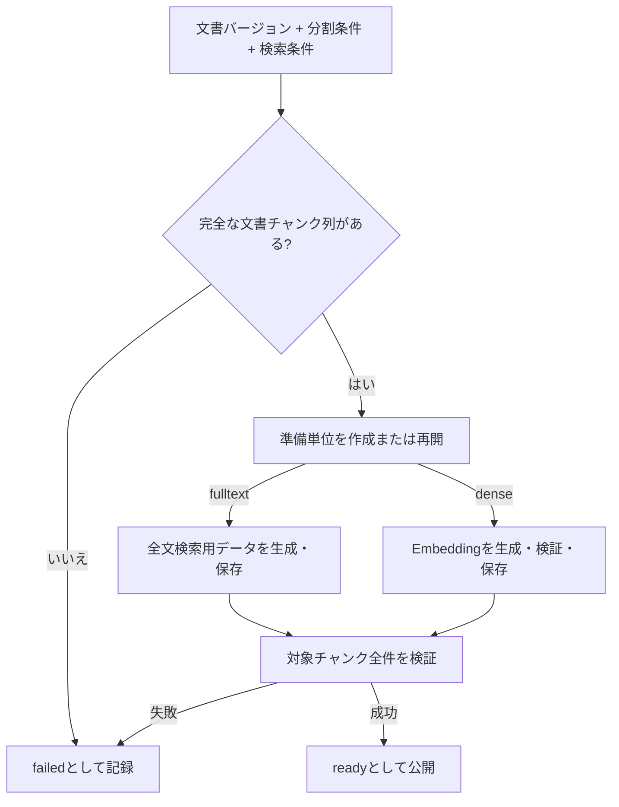

# 検索用データ準備設計

> [!abstract] この文書の役割
> 文書バージョンと分割条件に対応する文書チャンクから、検索方式ごとの検索用データを生成し、検索へ公開できる状態を定義する。

## 1. 目的と適用範囲

検索用データ準備は、文書チャンク列を入力として、全文検索またはdense検索で利用するデータを作り、準備単位の状態を管理する機能である。検索処理そのもの、検索結果の順位付け、回答生成はこの機能の責務に含めない。

初期対象は次の2方式とする。

| 検索方式 | 作成するデータ |
|---|---|
| 全文検索 | 文書チャンク本文とPostgreSQL text search configurationに基づく全文検索用データ |
| dense検索 | 文書チャンク本文からAI推論サービスで生成したEmbedding |

hybrid検索は、全文検索とdense検索の準備済みデータを組み合わせる検索方式であり、独立したデータ生成方式としては扱わない。

## 2. 責務と入出力

### 2.1 責務と境界

この機能は、対象の文書バージョン、分割条件、検索方式固有の条件を識別し、対象文書チャンク全体の検索用データを準備する。文書の正規化は[文書取り込み設計](./文書取り込み設計.md)、文書チャンクの生成は[文書分割設計](./文書分割設計.md)、Embeddingの計算契約は[Embedding生成設計](../../Embedding生成設計.md)が担当する。

この機能は、文書チャンクを別の文書バージョンや別の分割条件のチャンクと混ぜない。準備途中のデータを検索へ公開せず、対象範囲の全データを検証してから`ready`へ遷移させる。

### 2.2 入力・成功結果・失敗結果

| 項目 | 内容 |
|---|---|
| 文書バージョン | 対象本文を識別する不変の文書バージョンID |
| 分割条件 | 文書チャンク列を識別する分割条件 |
| 検索方式 | `fulltext`または`dense` |
| 全文検索条件 | PostgreSQL text search configuration |
| dense検索条件 | EmbeddingプロファイルID |
| 成功結果 | 条件に対応する全チャンクの検索用データと`ready`状態 |
| 失敗結果 | `failed`状態、失敗理由、再実行可能な準備単位 |

## 3. 処理設計

### 3.1 全体フロー

### 3.2 検索用データ準備単位と状態

準備単位は、次の組み合わせで一意に識別する。

- 文書バージョンID
- 分割条件IDまたは分割条件の不変な識別子
- 検索方式
- 全文検索の場合はPostgreSQL text search configuration
- dense検索の場合はEmbeddingプロファイルIDと、そのfingerprint

状態は`preparing`、`ready`、`failed`を持つ。

- `preparing`: 対象チャンクのデータを作成中。検索へ公開しない。
- `ready`: 対象チャンク全件のデータが存在し、識別条件と内容の検証が完了している。検索へ公開できる。
- `failed`: 準備に失敗した。失敗理由を保持し、同じ準備単位を再実行できる。

文書バージョン、分割条件、検索方式、検索方式固有の条件のいずれかが変わる場合は、既存の準備単位を更新せず、新しい準備単位として扱う。

### 3.3 共通処理

1. 文書分割が完了した文書チャンク列を取得する。
2. 準備単位を作成または取得し、状態を`preparing`にする。
3. 対象チャンクごとに検索方式のデータを生成して保存する。
4. すべてのチャンクについて、文書バージョン、分割条件、方式固有条件、チャンクIDの対応を検証する。
5. 全件の検証に成功した場合だけ、準備単位を`ready`にする。

同じ準備単位が`ready`の場合は再生成せず再利用する。`preparing`または`failed`を再実行する場合は、既存データをそのまま信頼せず、検証できるデータだけを再利用し、不足または不整合のデータを再生成する。

### 3.4 全文検索用データ

全文検索用データは、文書チャンク本文と指定されたPostgreSQL text search configurationから生成する。生成結果は元の文書チャンクIDと準備単位へ対応付けて保存する。

全文検索用データの生成に失敗したチャンクが1件でもある場合、準備単位を`ready`にしない。

### 3.5 dense検索用データ

dense検索用データは、文書チャンク本文を`input_kind = document`としてAI推論サービスへ渡して生成する。requestのitem IDには文書チャンクIDを使用し、responseの件数、ID集合、プロファイルID、fingerprint、次元数、vectorを検証してから保存する。

Embeddingのプロファイル、AI推論サービスの契約、vectorの検証項目は[Embedding生成設計](../../Embedding生成設計.md)に従う。検証できないresponseを検索用データとして保存しない。

### 3.6 再実行と冪等性

同じ準備単位に対する処理は、同じ文書チャンクIDへ同じ条件で書き込めるようにする。処理結果が不明になった場合も、準備単位とチャンクIDをキーに状態を確認してから再実行する。

準備単位の条件が同じでも、文書チャンクの本文または識別情報が一致しない場合は既存データを再利用せず、準備単位を失敗として扱う。異なる文書バージョンや分割条件のデータで`ready`を補完してはならない。

## 4. 失敗時の扱い

| 失敗 | 判定 | 扱い |
|---|---|---|
| 文書チャンク未準備 | 完全な文書チャンク列を取得できない | 準備単位を`ready`にしない |
| 条件不備 | 方式または方式固有条件が不正 | データを生成しない |
| 全文検索データ生成失敗 | 対象チャンクの生成または保存に失敗 | `failed`として理由を記録 |
| AI推論サービス失敗 | 通信、推論、または契約検証に失敗 | `failed`として理由を記録 |
| 対応不一致 | chunk ID、文書バージョン、条件などが一致しない | 不一致データを保存・公開しない |
| 完了検証失敗 | 対象チャンク全件の存在または内容を確認できない | `ready`へ遷移しない |

AI推論サービスへの再試行は、一時的な通信失敗など再実行可能な失敗に限る。入力不備、契約違反、プロファイル不整合は再試行せず失敗として記録する。再試行回数とタイムアウト値は、実行制御の共通設定として定義し、この文書で未定義の数値を仮置きしない。

## 5. 契約と受け渡し

### 5.1 不変条件

- 準備単位は文書バージョン、分割条件、検索方式、方式固有条件の組み合わせに対応する。
- `ready`の準備単位には、対象文書チャンク全件の検索用データが存在する。
- 検索用データは、対応する文書チャンクIDと準備単位を一意に参照できる。
- 異なる文書バージョン、分割条件、検索方式固有条件のデータを同じ準備単位へ混ぜない。
- `preparing`または`failed`の準備単位を検索へ公開しない。
- dense検索用データは、対象EmbeddingプロファイルのID、fingerprint、次元数と整合する。
- 検証未完了の準備単位を`ready`へ遷移させない。

### 5.2 他機能・コンポーネントへの受け渡し

| 受け渡し先 | 渡すもの | 渡してよい条件 | 相手が担当すること |
|---|---|---|---|
| AI推論サービス | 文書チャンクID、本文、`input_kind = document`、EmbeddingプロファイルID | dense検索用データを生成する場合 | Embedding計算と契約に従うresponse |
| 検索対象 | `ready`の準備単位と検索用データの参照 | 対象チャンク全件の検証が完了した場合 | 検索開始時の対象確定と方式別検索 |
| 実行制御 | 準備単位ID、状態、失敗理由、再実行可能性 | 準備処理の開始・完了・失敗時 | ジョブ実行、再試行、監視 |

## 関連文書

- [RAGScope要求定義「1.1 文書」](<../../../RAGScope要求定義.md#1.1 文書>)
- [RAGScope要求定義「1.3.1 検索」](<../../../RAGScope要求定義.md#1.3.1 検索>)
- [RAGScope要求定義「2.1 追跡可能性」](<../../../RAGScope要求定義.md#2.1 追跡可能性>)
- [RAGScope要求定義「2.2 再現性」](<../../../RAGScope要求定義.md#2.2 再現性>)
- [RAGScope用語集「検索用データ準備単位」](<../../../RAGScope用語集.md#検索用データ準備単位>)
- [RAGScopeドメインモデル](../../RAGScopeドメインモデル.md)
- [システムアーキテクチャ](../../システムアーキテクチャ.md)
- [文書分割設計](./文書分割設計.md)
- [Embedding生成設計](../../Embedding生成設計.md)
- [検索対象設計](../retrieval-generation/検索対象設計.md)
