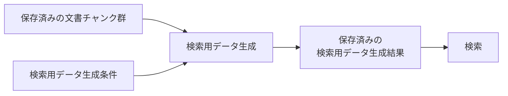

# 検索用データ生成基本設計

> [!abstract] この文書の役割
> 保存済みの文書チャンクから全文検索やdense検索で使用する検索用データを生成し、生成元と検索用データ生成条件を追跡できる状態で保存する機能の責務と境界を定義する。
> 具体的な生成、検証、再生成、失敗時の扱い、不変条件は[検索用データ生成詳細設計](./検索用データ生成詳細設計.md)で定義する。

## 1. 目的と適用範囲

検索用データ生成は、文書チャンクを検索方式が利用できる形へ準備し、異なる文書バージョン、分割条件、モデルなどから作ったデータを混同せず検索へ渡せる状態にする。

| 扱うこと | 扱わないこと |
|---|---|
| 全文検索で文書チャンクを検索するための情報を準備する | 質問を使った全文検索の実行 |
| 文書チャンクのEmbeddingを生成・保存する | 質問Embeddingの生成、dense検索の実行 |
| 生成元の文書チャンクと検索用データ生成条件を追跡する | 検索結果の順位付け、hybrid検索、`reranking` |
| 変更後の文書バージョンまたは分割条件に対応する検索用データを生成する | 文書取り込み、文書チャンク化 |

この機能は`REQ-DOC-005`を実現し、`REQ-RET-001`と`REQ-RET-002`が利用する検索用データを準備する。検索そのものは「検索・回答生成」ドメインの責務である。

## 2. 責務と境界

検索用データ生成は、保存済みの文書チャンク群と検索用データ生成条件から検索用データを生成し、生成元との関係を保って検索用データ生成結果として保存するところまでを担当する。

文書取り込み、文書チャンク化、質問を使った検索、検索順位の作成は担当しない。文書チャンクのEmbedding生成に必要なモデル依存計算はAI推論サービスへ依頼し、RAGScopeアプリケーションが生成結果の検証と保存を担当する。

## 3. 概念上の入出力

| 区分 | 内容 |
|---|---|
| 入力 | 同じ文書バージョンと分割条件から生成して保存した文書チャンク群、検索用データ生成条件 |
| 前提 | 文書チャンクの生成が完了しており、各文書チャンクの本文と生成元を取得できる |
| 成功結果 | 文書チャンクと検索用データ生成条件へ関連付けて保存し、検索へ渡してよい検索用データ生成結果 |
| 失敗結果 | 検索用データ生成を完了できないことを表す処理失敗 |
| 後続処理への入力 | 検索で使用する検索用データ生成結果 |

文書チャンク群、検索用データ生成条件、検索用データ生成結果を機能間でどの型や識別子として渡すかは、この基本設計では固定しない。

## 4. 主要な設計

### 4.1 生成条件と生成結果を区別する

検索用データ生成条件は、検索用データの種類、方式、モデル、モデルの版、Tokenizer、設定など、同じ生成処理を再現し、異なる条件の結果を区別するために必要な情報をまとめた条件である。文書チャンクを作る分割条件とは別の概念である。

同じ文書バージョンと分割条件から生成した文書チャンク群と、1つの検索用データ生成条件から得た検索用データを、1つの検索用データ生成結果として扱う。

具体的な条件項目は現時点では未決定である。

### 4.2 生成元を追跡できる状態を保つ

検索用データ生成結果から、含まれる検索用データ、生成元の文書チャンク、文書バージョン、分割条件、検索用データ生成条件へ追跡できなければならない。

生成完了後の検索用データ生成結果と、それに含まれる検索用データは変更しない。

## 5. 検索への受け渡し

検索へは、使用する検索用データ生成結果を渡す。複数の検索用データの種類を使う検索では、種類ごとに結果を指定する。

各結果はほかの生成結果と一意に区別でき、文書集合、文書バージョン、分割条件、検索用データ生成条件を一貫して追跡できなければならない。

## 6. 詳細設計と機械可読な正本

全文検索用情報と文書チャンクEmbeddingの生成、生成結果の検証、再生成と利用可能な結果の切り替え、保存単位、失敗時の扱い、Observability、不変条件は[検索用データ生成詳細設計](./検索用データ生成詳細設計.md)を正本とする。

正確な型、検索用データ生成条件の項目、AI推論サービスの入出力、DBのテーブル・索引・制約、再試行回数とタイムアウトは、コード、設定Schema、OpenAPI、migration、テストなど実装時に追加する機械可読な正本で定義する。

## 関連文書

- [RAGScope要求定義「1.1 文書」](<../../../RAGScope要求定義.md#1.1 文書>)
- [RAGScope要求定義「1.3.1 検索」](<../../../RAGScope要求定義.md#1.3.1 検索>)
- [RAGScope要求定義「2.2 再現性」](<../../../RAGScope要求定義.md#2.2 再現性>)
- [RAGScopeドメインモデル「2.1 文書」](<../../RAGScopeドメインモデル.md#2.1 文書>)
- [システムアーキテクチャ「2. コンポーネントの責務」](<../../システムアーキテクチャ.md#2 コンポーネントの責務>)
- [文書チャンク化基本設計](./文書チャンク化基本設計.md)
- [検索用データ生成詳細設計](./検索用データ生成詳細設計.md)
