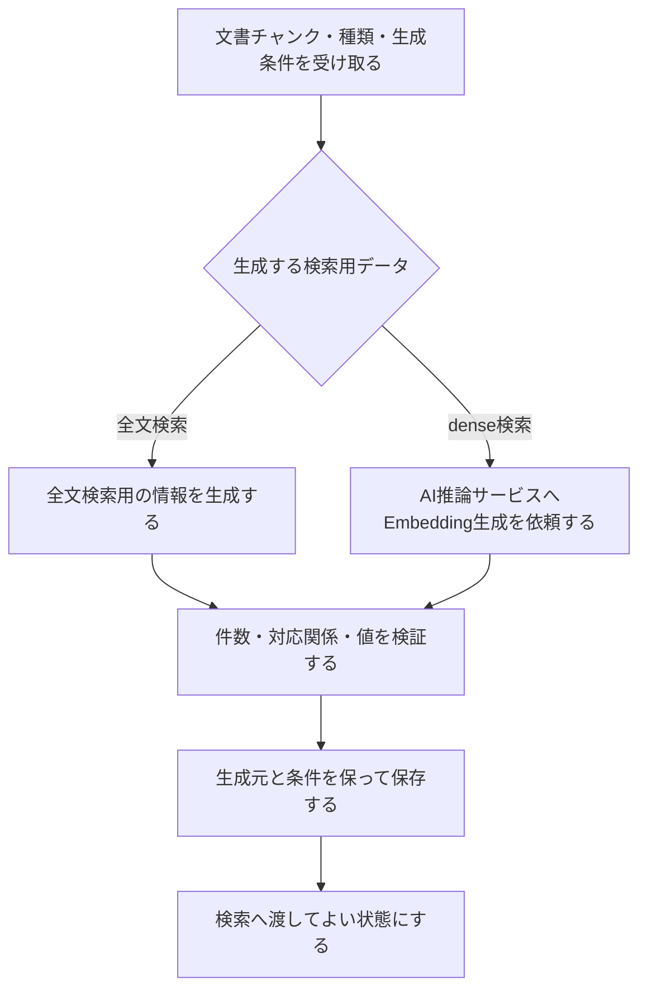

# 検索用データ生成設計

> [!abstract] この文書の役割
> 保存済みの文書チャンクから、全文検索やdense検索で使用する検索用データを生成し、生成元と条件を追跡できる状態で保存する機能を定義する。
> 文書バージョンまたは分割条件が変わった場合も、同じ処理によって対応する検索用データを再生成する。

## 1. 目的と適用範囲

検索用データ生成は、文書チャンクを検索方式が利用できる形へ準備し、異なる文書バージョン、分割条件、モデルなどから作ったデータを混同せず検索へ渡せる状態にする。

| 扱うこと | 扱わないこと |
|---|---|
| 全文検索で文書チャンクを検索するための情報の生成・保持 | 質問を使った全文検索の実行 |
| 文書チャンクのEmbeddingの生成・検証・保存 | 質問Embeddingの生成、dense検索の実行 |
| 生成元の文書チャンクと生成条件の追跡 | 検索結果の順位付け、hybrid検索、`reranking` |
| 変更後の文書バージョンまたは分割条件に対応する再生成 | 文書取り込み、文書チャンク化 |

この機能は`REQ-DOC-005`を実現し、`REQ-RET-001`と`REQ-RET-002`が利用する検索用データを準備する。検索そのものは「検索・回答生成」ドメインの責務である。

## 2. 責務と入出力

| 区分 | 内容 |
|---|---|
| 入力 | 同じ文書バージョンと分割条件から生成した保存済みの文書チャンク、生成する検索用データの種類、その生成に必要な条件 |
| 前提 | 文書チャンクの生成が完了しており、各文書チャンクの本文と生成元を取得できる |
| 成功結果 | 各文書チャンクと生成条件へ関連付けて保存し、検索へ渡してよい検索用データ |
| 失敗結果 | 文書チャンクを取得できない、生成できない、生成結果が不正、または保存できないことを表す処理失敗 |
| 後続処理への入力 | 同じ文書バージョン・分割条件・生成条件に属する検索用データを選択できる情報 |

生成条件には、検索用データの種類に応じて使用した方式、モデル、モデルの版、Tokenizer、設定など、同じ結果を再生成し、異なる条件の結果を区別するために必要な情報を含める。正確な項目は型、設定Schema、保存Schemaを正本とする。

## 3. 処理設計

### 3.1 全体フロー

検索用データの種類ごとに生成処理は異なるが、生成元の文書チャンクと生成条件を保ち、検証済みの結果だけを検索へ渡す規則は共通とする。

### 3.2 全文検索用の情報

全文検索用の情報は、文書チャンク本文から生成する。データベースの索引が本文から直接構築される場合も、その索引をどの文書チャンクと条件から作ったかを区別できなければならない。

言語ごとの解析、正規化、辞書、重み付けなどを利用する場合は、それらを生成条件として識別する。検索時は、異なる生成条件で作った情報を意図せず同じ検索対象へ混在させない。

### 3.3 文書チャンクのEmbedding

RAGScopeアプリケーションは、文書チャンクを識別する情報と本文を対応付けてAI推論サービスへ渡す。AI推論サービスはモデル依存の計算だけを担当し、文書チャンクやEmbeddingをデータベースへ保存しない。

RAGScopeアプリケーションは、受け取ったEmbeddingについて少なくとも次を検証する。

1. 要求した各文書チャンクに結果が1件ずつ対応する。
2. 要求していない文書チャンクの結果が含まれない。
3. 同じ生成条件のEmbeddingは同じ次元数を持つ。
4. 各要素が採用する数値表現として有効であり、検索に使用できない値を含まない。
5. 使用したモデルとその版を、保存する生成条件から特定できる。

検証後、文書チャンクのEmbeddingを生成元の文書チャンクおよび生成条件へ関連付けて保存する。AI推論サービス固有の応答形式は、RAGScope内の保存形式へそのまま持ち込まない。

### 3.4 再生成と利用可能な結果の切り替え

文書の内容が変わった場合は、文書取り込みによって新しい文書バージョンを作り、その版から文書チャンクと検索用データを生成する。分割条件が変わった場合は、新しい条件の文書チャンクから検索用データを生成する。生成条件が変わった場合も、以前の検索用データを上書きせず、条件を区別して生成する。

新しい検索用データの生成と検証が完了するまでは、その新しい条件の結果を検索へ渡さない。検索側は、文書バージョン、分割条件、生成条件がそろった結果だけを使用し、旧条件と新条件のデータを1つの検索対象へ意図せず混在させない。

過去の実験が参照する文書バージョン、文書チャンク、検索用データは保持し、新しい結果への切り替えによって意味を変えない。

### 3.5 保存の単位

同じ入力と生成条件で処理を繰り返した場合は、同じ論理的な検索用データを再利用または置換できるようにし、重複した結果を検索へ公開しない。

複数の文書チャンクをまとめて生成している途中で失敗した場合は、成功分だけを完了した生成結果として検索へ渡さない。再開方法と物理的なトランザクション境界は、データ量、AI推論サービスの要求単位、保存Schemaを具体化するときに定めるが、部分結果と完了結果は必ず区別する。

## 4. 失敗時の扱い

| 失敗 | この機能の扱い | 再試行 |
|---|---|---|
| 文書チャンクまたは生成条件が存在しない | 入力を取得できない処理失敗を返す | 行わない |
| 生成条件が不正 | 条件の処理失敗を返す | 行わない |
| AI推論サービスが一時的に応答できない、または試行がタイムアウトする | Embedding生成の試行失敗として扱う | 同じ要求を安全に繰り返せる場合に、RAGScopeアプリケーションが定めた回数と待機方法で行う |
| AI推論サービスの結果が件数・対応・次元などの契約を満たさない | 不正な生成結果として処理失敗を返す | 同じ条件のままでは行わない |
| データベースへ保存できない | 保存の処理失敗を返す | 呼び出し側が一時的失敗と判断し、同じ処理を安全に繰り返せる場合だけ行う |

再試行の途中で失敗しても、最終的に有効な検索用データを生成・保存できた場合、この機能の最終結果は成功である。最終的に成功結果を作れなかった場合だけ処理失敗を返す。具体的な失敗型と変換境界は[RAGScopeアプリケーション失敗設計](../../RAGScopeアプリケーション失敗設計.md)に従う。

### 4.1 観測

AI推論サービスへの依頼には、適用できるGenAIとHTTPのOpenTelemetry Semantic Conventionおよび標準計装を使用する。データベース処理も標準計装を使用する。検索用データ生成専用のRAGScope独自Spanや、開始・成功・失敗を表すEventRecordは追加しない。

呼び出し側がこの機能を含む処理をSpanで追跡する場合、検索用データ生成の最終結果がそのSpan自身の失敗になったときだけ、具体的な処理失敗からSpan Statusと`error.type`を決める。再試行途中の失敗を最終失敗として記録しない。Telemetryの記録や送信が失敗しても、生成と保存が成功した検索用データを失敗結果へ変えない。Trace・Logs・Metricsの共通規則は[Observability設計](../../observability/README.md)に従う。

## 5. 契約と受け渡し

### 5.1 不変条件

1. 検索用データから、生成元の文書チャンク、文書バージョン、分割条件、生成条件へ追跡できる。
2. 文書チャンクのEmbeddingは、入力に使用した文書チャンクと1対1に対応する。
3. 異なる生成条件の検索用データを、同じ結果として上書きまたは混在させない。
4. 検証と保存が完了していない検索用データを、検索へ渡さない。
5. 再生成後も、過去の実験が参照する結果の意味を変えない。

### 5.2 検索への受け渡し

検索へは、使用する文書集合、文書バージョン、分割条件、検索用データの生成条件を一貫して選べる情報を渡す。検索用データ生成は質問を受け取らず、検索順位を作らない。

全文検索、dense検索、hybrid検索、`reranking`の実行規則と検索結果は、「検索・回答生成」ドメインの機能設計で定義する。

## 6. 機械可読な正本

正確な型、AI推論サービスのAPI Schema、モデル識別子、Embeddingの数値型と次元、DBのテーブル・索引・制約、再試行回数、待機方法、タイムアウト、完了状態の表現は、実装時のコード、OpenAPI、migration、設定、テストを正本とする。

## 関連文書

- [RAGScope要求定義「1.1 文書」](<../../../RAGScope要求定義.md#1.1 文書>)
- [RAGScope要求定義「1.3.1 検索」](<../../../RAGScope要求定義.md#1.3.1 検索>)
- [RAGScope要求定義「2.2 再現性」](<../../../RAGScope要求定義.md#2.2 再現性>)
- [RAGScopeドメインモデル「2.1 文書」](<../../RAGScopeドメインモデル.md#2.1 文書>)
- [システムアーキテクチャ「2. コンポーネントの責務」](<../../システムアーキテクチャ.md#2 コンポーネントの責務>)
- [文書チャンク化設計](./文書チャンク化設計.md)
- [Observability設計](../../observability/README.md)
