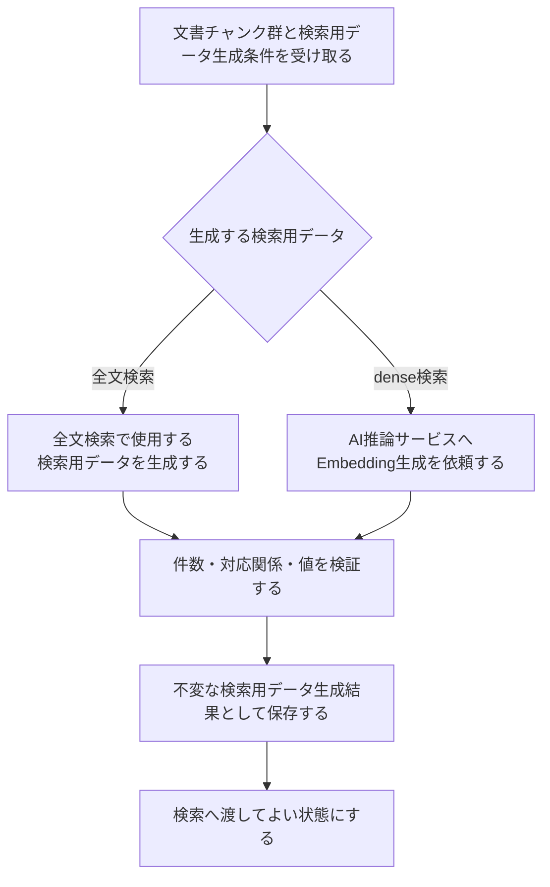

# 検索用データ生成詳細設計

> [!abstract] この文書の役割
> [検索用データ生成基本設計](./検索用データ生成基本設計.md)で定義した責務と境界を前提に、全文検索で使用する検索用データと文書チャンクのEmbeddingの生成、検証、再生成、保存、失敗時の扱い、不変条件を定義する。

## 1. 前提と未決定事項

検索用データ生成条件の具体的な項目、モデル識別子、Embeddingの数値型と次元、AI推論サービスの正確な入出力、DBの保存Schema、再試行回数・待機方法・タイムアウトは現時点では未決定である。

これらは実装時に型、設定Schema、OpenAPIまたは同等のAPI Schema、migration、契約テストなどで定義する。

## 2. 処理フロー

検索用データの種類ごとに生成処理は異なるが、生成元の文書チャンクと検索用データ生成条件を保ち、検証済みの検索用データ生成結果だけを検索へ渡す規則は共通とする。

## 3. 全文検索で使用する検索用データ

全文検索で使用する検索用データは、文書チャンク本文から生成する。データベースの索引が本文から直接構築される場合も、その索引がどの検索用データ生成結果を物理的に表現しているかを区別できなければならない。

言語ごとの解析、正規化、辞書、重み付けなどを利用する場合は、それらを検索用データ生成条件として識別する。検索時は、異なる検索用データ生成条件で作った情報を意図せず同じ検索対象へ混在させない。

## 4. 文書チャンクのEmbedding

RAGScopeアプリケーションは、生成対象の文書チャンク本文をAI推論サービスへ渡してEmbedding生成を依頼する。AI推論サービスはモデル依存の計算だけを担当し、文書チャンクやEmbeddingをデータベースへ保存しない。

AI推論サービスへ渡す具体的な項目と、返されたEmbeddingを元の文書チャンクへ対応付ける方法は、この設計書では固定しない。ただし、RAGScopeアプリケーションは生成結果を保存する前に、各Embeddingを生成元の文書チャンクへ一意に対応付けられなければならない。

RAGScopeアプリケーションは、受け取ったEmbeddingについて少なくとも次を検証する。

1. 要求した各文書チャンクに結果が1件ずつ対応する。
2. 要求していない文書チャンクの結果が含まれない。
3. 同じ検索用データ生成条件のEmbeddingは同じ次元数を持つ。
4. 各要素が採用する数値表現として有効であり、検索に使用できない値を含まない。
5. 使用したモデルとその版を、保存する検索用データ生成条件から特定できる。

検証後、文書チャンクのEmbeddingを生成元の文書チャンクおよび検索用データ生成条件へ関連付け、検索用データ生成結果に含めて保存する。AI推論サービス固有の応答形式は、RAGScope内の保存形式へそのまま持ち込まない。

## 5. 再生成と利用可能な結果の切り替え

文書の内容が変わった場合は、新しい文書バージョンから文書チャンクと検索用データを生成する。分割条件が変わった場合は、新しい条件の文書チャンクから検索用データを生成する。検索用データ生成条件が変わった場合も、以前の検索用データ生成結果を上書きせず、条件を区別して生成する。

新しい検索用データの生成と検証が完了するまでは、その検索用データ生成結果を検索へ渡さない。検索側は、使用する検索用データの種類ごとに、文書バージョン、分割条件、検索用データ生成条件がそろった特定の検索用データ生成結果を選ぶ。同じ種類について旧条件と新条件のデータを1つの検索対象へ意図せず混在させない。

保存済みの検索用データ生成結果と、それに含まれる論理的な検索用データは不変とする。過去の実験は使用した検索用データ生成結果を一意に識別する情報を保持し、新しい結果への切り替えによって参照先や値を変えない。

## 6. 保存の単位

同じ生成元の文書チャンク群と検索用データ生成条件について、同一の検索用データを含む完了済みの検索用データ生成結果が存在する場合は、その結果を再利用できる。再実行によって検索用データの値が異なった場合は、既存結果を置換せず、別の検索用データ生成結果として保存する。どの結果を検索へ渡すかは一意に選び、複数の結果を1つの結果として扱わない。

データベースの全文検索索引やベクトル索引など、検索用データ生成結果から再構築できる物理的な索引は、論理的な検索用データ生成結果を変えない範囲で再構築または置換できる。索引の再構築を、過去の実験が参照する検索用データの置換として扱わない。

複数の文書チャンクをまとめて生成している途中で失敗した場合は、成功分だけを完了した生成結果として検索へ渡さない。再開方法と物理的なトランザクション境界は、データ量、AI推論サービスの要求単位、保存Schemaを具体化するときに定めるが、部分結果と完了結果は必ず区別する。

## 7. 失敗時の扱い

| 失敗 | この機能の扱い | 再試行 |
|---|---|---|
| 文書チャンクまたは検索用データ生成条件が存在しない | 入力を取得できない処理失敗を返す | 行わない |
| 検索用データ生成条件が不正 | 条件の処理失敗を返す | 行わない |
| AI推論サービスが一時的に応答できない、または試行がタイムアウトする | Embedding生成の試行失敗として扱う | 同じ要求を安全に繰り返せる場合に、RAGScopeアプリケーションが定めた回数と待機方法で行う |
| AI推論サービスの結果が件数・対応・次元などの契約を満たさない | 不正な生成結果として処理失敗を返す | 同じ条件のままでは行わない |
| データベースへ保存できない | 保存の処理失敗を返す | 呼び出し側が一時的失敗と判断し、同じ処理を安全に繰り返せる場合だけ行う |

再試行の途中で失敗しても、最終的に有効な検索用データを生成・保存できた場合、この機能の最終結果は成功である。最終的に成功結果を作れなかった場合だけ処理失敗を返す。具体的な失敗型と変換境界は[RAGScopeアプリケーション失敗設計](../../RAGScopeアプリケーション失敗設計.md)に従う。

## 8. Observability

AI推論サービスへの依頼には、適用できるGenAIとHTTPのOpenTelemetry Semantic Conventionおよび標準計装を使用する。データベース処理も標準計装を使用する。検索用データ生成専用のRAGScope独自Spanや、開始・成功・失敗を表すEventRecordは追加しない。

呼び出し側がこの機能を含む処理をSpanで追跡する場合、検索用データ生成の最終結果がそのSpan自身の失敗になったときだけ、具体的な処理失敗からSpan Statusと`error.type`を決める。再試行途中の失敗を最終失敗として記録しない。Telemetryの記録や送信が失敗しても、生成と保存が成功した検索用データを失敗結果へ変えない。

## 9. 不変条件

1. 検索用データ生成結果から、含まれる検索用データ、生成元の文書チャンク、文書バージョン、分割条件、検索用データ生成条件へ追跡できる。
2. 文書チャンクのEmbeddingは、入力に使用した文書チャンクと1対1に対応する。
3. 保存済みの検索用データ生成結果と、それに含まれる検索用データを上書きしない。
4. 検証と保存が完了していない検索用データを、検索へ渡さない。
5. 過去の実験は使用した検索用データ生成結果を一意に参照し、再生成後も参照先と値を変えない。

## 10. 機械可読な正本

| 定義対象 | 現在参照できる正本 | 実装時に追加する機械可読な正本 |
|---|---|---|
| 責務と境界 | [検索用データ生成基本設計](./検索用データ生成基本設計.md) | なし |
| 生成規則、不変条件 | この設計書、[RAGScope用語集](../../../RAGScope用語集.md)、要求定義 | なし |
| 検索用データ生成条件の項目、モデル識別子、Embeddingの数値型と次元 | 未決定。この設計書の1節から4節が決定状態を示す | 型、設定Schema、テスト |
| AI推論サービスの入出力 | 現時点では存在しない | OpenAPIまたは同等のAPI Schema、契約テスト |
| DBのテーブル・索引・制約、完了状態 | 現時点では存在しない | migration、コード、テスト |
| 再試行回数、待機方法、タイムアウト | 現時点では存在しない | 設定Schema、コード、テスト |

存在しないコード、migration、OpenAPIを現在の参照先として扱わない。

## 関連文書

- [検索用データ生成基本設計](./検索用データ生成基本設計.md)
- [文書チャンク化基本設計](./文書チャンク化基本設計.md)
- [RAGScopeアプリケーション失敗設計](../../RAGScopeアプリケーション失敗設計.md)
- [Observability設計](../../observability/README.md)
