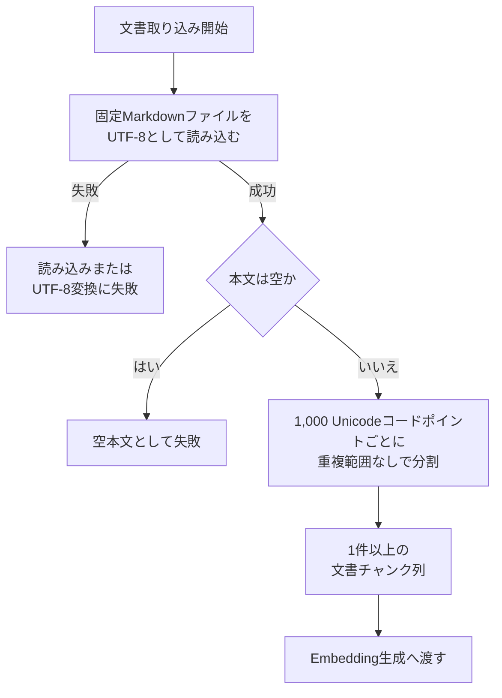

# 文書処理設計

> [!warning] 第4章は文書処理機能の実装時に新しい実行追跡・構造化ログ設計へ合わせて再設計する
> 第4章「エラーとログ」は、現在の[実行追跡・構造化ログ契約設計](../logging/実行追跡・構造化ログ契約設計.md)に合わせて再設計する対象である。文書処理機能を実装する際に、実装対象となる具体的な失敗条件、`error_type`、子`span`、ログイベント、属性を確認し、第4章も同じ作業で現在設計へ更新する。
> 第4章に現在残る内容は再設計対象の中間内容であり、それまでは現在設計として採用しない。第1〜3章の文書読み込み・チャンク化・文書チャンク契約は、この警告の対象ではない。

> [!abstract] この文書の役割
> RAGScope v0.0で、固定されたUTF-8 Markdown文書1件を読み込み、正常な文書チャンク列を後続のEmbedding生成へ渡すまでの処理フロー、責務境界、チャンク契約を定義する。文書処理固有の実行追跡・構造化ログは第4章で扱い、文書処理機能の実装時に現在の共通契約へ合わせて再設計する。

## 1. 目的と適用範囲

v0.0では、固定Markdownファイル1件を読み込み、本文を1,000 Unicodeコードポイントごとに分割する。検索品質に最適な分割方式や恒久的な文書データモデルの確立は対象としない。

| 現在の設計で扱うこと | 現在は扱わないこと |
|---|---|
| 固定Markdownファイル1件の読み込み | 複数文書、TXT、PDF、画像の取り込み |
| UTF-8として文字列へ変換した本文の保持 | Unicode・改行コードの正規化、Markdown構造の解析 |
| 空本文の拒否 | 空白だけ、空行だけ、Markdown記号だけの本文を意味上の空として扱うこと |
| 1,000コードポイント、重複範囲なしの固定分割 | Tokenizer、意味境界、可変チャンクサイズ、比較実験 |
| 元文書、順序、本文を識別できるチャンク列 | offset、文書バージョン、文書集合、チャンク条件・チャンク集合の管理 |
| 文書処理固有のエラーとログイベント（第4章は再設計待ち） | Embedding生成API、通信、保存、dense検索 |

## 2. 処理フローと境界



実行対象の固定パスはRAGScopeアプリケーション側が選択し、文書読み込みはパスを受け取る独立した境界とする。

いずれかの段階で失敗した場合は処理を終了し、部分的な本文、途中まで生成したチャンク、空のチャンク列を正常結果として返さず、Embedding生成へ進まない。

### 2.1 文書読み込み

- 対象は固定されたUTF-8 Markdownファイル1件とする。
- ファイル全体をUTF-8として文字列へ変換し、本文として扱う。
- Unicode正規化、改行コードの統一、Markdown記法の除去・解析、前後空白の削除、文字列置換は行わない。
- 本文の同一性は元ファイルのバイト列ではなく、UTF-8として文字列へ変換した本文に対して定義する。

### 2.2 空本文の検証

Unicodeコードポイント数が0件の場合は処理全体を失敗とする。

空白だけ、空行だけ、Markdown記号だけの本文は、内容の意味を解釈せず有効な本文としてチャンク化する。

### 2.3 自動再試行

v0.0の文書読み込みとチャンク化では自動再試行を行わない。

| 処理 | 理由 |
|---|---|
| 文書読み込み | ファイル不存在、不正なUTF-8などは、同じ入力のまま再試行しても解消しない |
| チャンク化 | 同じ入力に対して同じ結果を返す決定的な処理であり、再試行しても結果が変わらない |

原因を修正した後に、利用者がCLIコマンド全体を再実行する。

## 3. 文書チャンクの契約

各文書チャンクは、少なくとも次の概念を保持する。

```text
source      元文書を識別する情報
chunkIndex  文書内の順序を表す0始まりのindex
content     分割された本文
```

チャンク化はファイル入出力とEmbedding生成から分離した副作用のない処理とし、本文を先頭から1,000 Unicodeコードポイントごとに分割する。チャンク間に重複範囲は設けない。

ここでいうUnicodeコードポイントは、UTF-8のバイト数でも書記素クラスタでもない。結合文字や複数コードポイントからなる絵文字の途中がチャンク境界になることを許容する。

入力本文のコードポイント数を $$n$$、チャンクサイズを $$s = 1000$$ とすると、チャンク数 $$m$$ は次のとおりである。

$$
m = \left\lceil \frac{n}{s} \right\rceil
$$

0始まりの $$i$$ 番目のチャンク本文 $$C_i$$ は、入力本文 $$T$$ の次の半開区間とする。

$$
C_i =
T\left[
is :
\min\left((i+1)s,\ n\right)
\right]
\qquad
0 \le i < m
$$

正常に生成したチャンク列は、次をすべて満たす。

1. チャンク数は1件以上である。
2. `chunkIndex`は0から始まる欠番のない連続した値である。
3. 各`content`は1以上1,000以下のUnicodeコードポイントである。
4. 最後のチャンク以外は1,000 Unicodeコードポイントである。
5. `chunkIndex`順に全`content`を連結すると入力本文と完全に一致する。
6. すべてのチャンクは同じ`source`を持つ。
7. 同じ`source`と同じ本文からは、同じ順序・同じ本文のチャンク列を生成する。

チャンク本文へ見出し、接頭文字列、正規化結果などを追加せず、分割によって得た本文そのものを後続処理へ渡す。

## 4. エラーとログ

本章は、[実行追跡・構造化ログ契約設計](../logging/実行追跡・構造化ログ契約設計.md)に合わせて再設計する対象である。以下の`error_type`、子`span`、ログイベント、属性は再設計対象の中間内容であり、再設計が完了するまでは確定済みの現在設計として扱わない。

### 4.1 `error_type`

文書処理で処理が成立しなかった理由は、次の`error_type`で識別する。

| 失敗 | `error_type` |
|---|---|
| 固定Markdownファイルが存在しない | `document.file_not_found` |
| ファイルを開けない、または読み込み中にI/Oエラーが発生した | `document.read_failed` |
| UTF-8として文字列へ変換できない | `document.invalid_utf8` |
| 本文が空 | `document.empty` |
| チャンク化で予期しない失敗が発生した | `document.chunk_failed` |

失敗理由を示す値は`error_type`だけで表し、人向けメッセージやエラー発生ごとの追加情報を`error_type`へ含めない。

### 4.2 子`span`

文書を検索可能にするユースケースのroot `span`の配下で、文書読み込みとチャンク化を個別の子`span`として追跡する。

| `span` | 表す処理 | Span Status |
|---|---|---|
| `document.read` | ファイル読み込み開始から、UTF-8変換と空本文検証の結果確定まで | `document.file_not_found`、`document.read_failed`、`document.invalid_utf8`、`document.empty`のいずれかで失敗した場合は`Error`として同じ`error_type`を関連付け、それ以外は`Unset` |
| `document.chunk` | 有効な本文を受け取ってから、正常なチャンク列またはチャンク化失敗が確定するまで | `document.chunk_failed`で失敗した場合は`Error`として同じ`error_type`を関連付け、それ以外は`Unset` |

文書読み込みまたはチャンク化の処理時間は各`span`の開始・終了から確認し、構造化ログの属性へ処理時間を重複して記録しない。

### 4.3 ログイベント

文書読み込みまたはチャンク化の結果を確定する境界で失敗した場合は、対応する`.failed`イベントを1回記録する。下位処理やエラー値自身は、同じ失敗を重複して記録しない。

| イベント名 | 記録する時点 | 既定の重要度 | 属性 |
|---|---|---|---|
| `document.read.started` | ファイル読み込み開始直前 | `info` | `source` |
| `document.read.succeeded` | 読み込み・UTF-8変換・空本文検証完了後 | `info` | `source`, `byte_count`, `code_point_count` |
| `document.read.failed` | 文書読み込みの失敗結果を確定した後 | `error` | `source`, `error_type` |
| `document.chunk.started` | 有効な本文を受け取り、チャンク化開始直前 | `info` | `source`, `input_code_point_count` |
| `document.chunk.succeeded` | 正常なチャンク列を生成した後 | `info` | `source`, `input_code_point_count`, `chunk_count` |
| `document.chunk.failed` | チャンク化の失敗結果を確定した後 | `error` | `source`, `input_code_point_count`, `error_type` |

各イベントは、そのイベントが起きた`document.read`または`document.chunk`の`span`へ`TraceId`・`SpanId`で関連付ける。文書処理の失敗によってユースケース全体が最終失敗する場合は、これらの機能固有イベントとは別に、共通契約に従ってroot `span`のStatusとユースケースの最終失敗イベントを記録する。

属性の意味は次のとおりとする。

| 属性 | 意味 |
|---|---|
| `source` | 固定パスそのものではない、元文書を識別する安全な値 |
| `byte_count` | ファイルから読み込んだバイト数。0以上 |
| `code_point_count` | 空本文検証に成功した本文のUnicodeコードポイント数。1以上 |
| `input_code_point_count` | チャンク化へ渡した本文のUnicodeコードポイント数。1以上 |
| `chunk_count` | 正常に生成した文書チャンク件数。1以上 |

固定パスの全文、Markdown本文、部分的に読み込んだ本文、チャンク本文、元の例外メッセージ、スタックトレース、`cause`はログへ記録しない。

実装では、ここで定義したイベントと属性の組を閉じた型で表現し、通常の機能処理から任意のイベント名、重要度、属性を渡せないようにする。

## 関連文書

- [RAGScope要求定義「1.1 文書」](<../../RAGScope要求定義.md#1.1 文書>)
- [ユースケース基本設計「2.1.1 文書を検索可能にする」](<../ユースケース基本設計.md#2.1.1 文書を検索可能にする>)
- [システムアーキテクチャ「4.1 文書を検索可能にする」](<../システムアーキテクチャ.md#4.1 文書を検索可能にする>)
- [実行追跡・構造化ログ契約設計](../logging/実行追跡・構造化ログ契約設計.md)