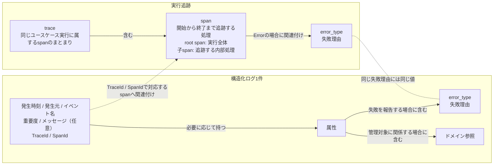

# 実行追跡・構造化ログ契約設計

> [!abstract] この文書の役割
> RAGScopeでは、OpenTelemetryの`trace`・`span`で1回のユースケース実行とその内部処理を追跡し、ユースケース実行中の出来事を構造化ログへ記録する。この文書は、`trace`・`span`の使い方、構造化ログの共通構造と記録規則、失敗理由を表す`error_type`、ログからRAGScopeの管理対象を参照する規則を定義する。

## 1. 実行追跡と構造化ログの関係

RAGScopeは、1回のユースケース実行を、**1個のroot `span`と、その配下の0個以上の子`span`からなる1つの`trace`**として追跡する。各`span`は開始から終了まで追跡する処理を表し、構造化ログはある時点で起きたイベントを表す。構造化ログには`TraceId`・`SpanId`を記録し、そのイベントが起きた`span`へ関連付ける。この文書で扱う構造化ログはユースケース実行中のイベントを対象とする。

失敗した`span`と、その失敗を報告する構造化ログの両方を記録する場合は、同じ失敗理由を`error_type`で記録する。構造化ログがRAGScopeの管理対象に関係する場合は、その対象の識別子を属性として記録する。構造化ログには、そのイベントを記録した発生元コンポーネントも記録する。



図中の実線はそれぞれの内部構造を表し、点線は実行追跡と構造化ログをまたぐ関係を表す。

## 2. 構造化ログ

### 2.1 ログ1件の構造

構造化ログ1件は、ある時点で起きた1つのイベントを記録する。

| 情報 | 必要性 | 意味 |
|---|---|---|
| 発生時刻 | 必須 | イベントが発生した時刻 |
| 発生元 | 必須 | イベントを観測して記録したコンポーネントを識別する |
| イベント名 | 必須 | 何が起きたかの種類を機械的に識別する安定した名称 |
| 重要度 | 必須 | そのイベントを運用上どの程度重く扱うか |
| メッセージ | 任意 | 人が読むための補足説明 |
| 属性 | 任意 | イベント固有の名前付きの値。失敗を報告する場合の`error_type`や、必要なドメイン参照も属性として記録する |
| `TraceId` / `SpanId` | 必須 | イベントが起きた`span`へ構造化ログを関連付ける |

属性は、属性名と値の組を0件以上持つ。属性名は値の意味を安定して識別する。1件の構造化ログでは同じ属性名を複数回使用せず、属性の並び順には意味を持たせない。

属性値は、文字列、数値、真偽値、array、objectのいずれかとする。arrayは0件以上の属性値を順序付きで持つ。objectは0件以上の名前と属性値の組を持ち、同じ名前を複数回使用せず、組の並び順には意味を持たせない。arrayの要素とobjectの値には、同じ属性値を再帰的に使用できる。属性値として`null`に相当する値は定義しない。値が存在しない属性やobjectの項目は、その名前自体を持たない。

イベント固有の属性の意味、記録条件、使用する属性値の型、その値に対する制約は、そのイベントを定義する各機能設計で定める。

発生元として使用する値は各コンポーネントの構造化ログ設計で定める。正確な項目名・外部表現上の型・各外部形式での表現は、外部表現を担当する設計とSchemaなどの機械可読な正本で定める。

### 2.2 記録するイベント

構造化ログには、処理の進行や失敗を後から確認するために意味のある出来事を記録する。具体的なイベント、その記録条件、既定の重要度、必要な属性は、そのイベントを定義する各機能設計で定める。

| 状況 | 記録規則 |
|---|---|
| 主要な処理段階への到達、検索候補の取得、再試行など | その処理を定義する機能設計で定めたイベントを、その設計で定めた条件で記録する |
| 処理の開始・完了 | 処理の進行をログとして残すイベントに定めた場合に記録する。処理時間の計測は`span`が担当する |
| ユースケースの最終失敗 | RAGScopeアプリケーションが失敗を確定した時点で1件記録する。root `span`へ関連付け、root `span`と同じ`error_type`を記録する |
| ユースケース内部の処理失敗 | その失敗を扱う機能設計で失敗イベントとして定めた場合に記録する |

RAGScopeアプリケーションが最終失敗を確定する前にプロセスが強制終了するなど、イベントを記録する処理自体を実行できない終了は、最終失敗イベントの保証対象外である。

### 2.3 イベント名

イベント名には次の共通規則を適用する。

- 小文字を使用し、意味のまとまりを`.`で区切る。1つのまとまりが複数語なら`_`でつなぐ。
- 出来事の種類だけを表し、識別子、エラーメッセージ、件数など発生ごとに変わる値を含めない。
- 同じ意味のイベントには同じ名前を使用し、同じ名前へ異なる意味を割り当てない。
- 処理の開始、成功、失敗を記録する場合は、それぞれ`.started`、`.succeeded`、`.failed`を使用する。
- 発生元コンポーネントはイベント名へ含めず、構造化ログの発生元として記録する。

### 2.4 重要度

ログの重要度には`debug`、`info`、`warn`、`error`、`fatal`の5段階を使用する。

| 重要度 | 意味 |
|---|---|
| `debug` | 通常運用では不要だが、問題を詳しく調べるときに利用する診断情報 |
| `info` | 通常の処理進行や結果を知らせるイベント |
| `warn` | エラーではないが、通常とは異なる状態や注意が必要なイベント |
| `error` | エラーが起きたイベント。発生元コンポーネントがその後も処理を続けられる場合に使用する |
| `fatal` | 発生元コンポーネントが、その後の通常処理を続けられない致命的なエラーイベント |

重要度は、そのイベントを運用上どの程度重く扱うかを表す。イベントの既定の重要度は、そのイベントを定義する機能設計で定める。`span`が表す処理の結果は、3.4のSpan Statusで表す。

## 3. 実行追跡

### 3.1 `trace`とroot `span`

[ユースケース設計](../ユースケース設計.md)で定義する1回のユースケース実行を、1つの`trace`として追跡する。`trace`は、そのユースケース実行に属する`span`のまとまりであり、同じ`TraceId`で識別する。

RAGScopeアプリケーションがユースケースの入力に対する処理を開始するとき、新しい`TraceId`を持つroot `span`を開始する。root `span`は、その`trace`の起点となる1つの`span`であり、処理開始から結果または失敗の確定までのユースケース実行全体を表す。`TraceId`はユースケース実行に属する`span`全体を識別し、root `span`の`SpanId`はその中のroot `span`自身を識別する。

ユースケースを構成する内部処理は同じ`trace`で追跡する。インターフェース固有の受付や表示など、ユースケース実行に含まれない処理はroot `span`に含めない。

```text
1回のユースケース実行
└─ TraceId: T1
   └─ root SpanId: S1
      ├─ SpanId: S2
      └─ SpanId: S3

別のユースケース実行
└─ TraceId: T2
   └─ root SpanId: S4
```

### 3.2 子`span`

root `span`だけでは、ユースケース内部の処理ごとの開始・終了、所要時間、エラーを個別に確認できない。これらを独立して確認する必要がある内部処理を、親`span`の子`span`として追跡する。RAGScopeでは、AI推論サービスで開始する処理や、RAGScopeが再試行を制御する場合の各試行がこの例である。

同じ`trace`に属する`span`は同じ`TraceId`を共有し、それぞれ異なる`SpanId`を持つ。子`span`は1つの親`span`を持ち、内部処理の親子関係を表す。

どの内部処理を子`span`として追跡し、その`span`をどの条件で`Error`とするかは、その処理を定義する機能設計で定める。

子`span`は親`span`の時間全体を隙間なく覆う必要はない。子`span`を作らない内部処理や待機時間も、ユースケース実行に含まれる限りroot `span`の時間区間には含まれる。

### 3.3 再試行

RAGScopeが再試行を制御し、各試行の境界を識別できる場合は、再試行を含む処理全体を親`span`として追跡し、各試行をその子`span`として追跡する。次は、1回目が失敗し、2回目で成立した場合の例である。

```text
再試行を含む処理全体 span（親）: Status Unset
├─ 試行1 span（子）: Status Error
├─ 再試行待機（子spanなし）
└─ 試行2 span（子）: Status Unset
```

- 処理全体の`span`は最初の試行前に開始し、最終結果または失敗が確定した時点で終了する。
- 各試行の`span`は、その試行の開始から結果確定までを表す。試行間の待機は処理全体の`span`には含めるが、各試行の`span`には含めない。
- 各試行のSpan Statusはその試行自身の結果から、処理全体のSpan Statusは全試行を含む最終結果から決める。

下位ライブラリの内部だけで再試行が完結し、RAGScopeから各試行の境界を識別できない場合は、RAGScopeから見える処理全体の`span`だけを追跡する。

### 3.4 Span Status

Span Statusは、その`span`が表す処理自身の最終結果から決める。RAGScopeがエラーとして扱う場合は`Error`にし、それ以外は`Unset`のまま終了する。

ユースケース全体で見ると、代表的な扱いは次の3パターンである。

| パターン | 状況 | 途中の`span` | root `span` | 失敗ログ |
|---|---|---|---|---|
| 1 | 内部処理も含め、エラーとして扱う処理がなくユースケースが成立した | `Unset` | `Unset` | 不要 |
| 2 | 内部処理に失敗があったが、再試行や代替処理などによってユースケースが最終的に成立した | 失敗として扱う`span`は`Error`とし、対応する`error_type`を関連付ける。それ以外は`Unset` | `Unset` | その失敗を扱う機能設計で記録対象とした内部失敗だけ記録する |
| 3 | ユースケースの結果を成立させられず、最終失敗を確定した | 失敗として扱う`span`は`Error`とし、対応する`error_type`を関連付ける | `Error`とし、最終失敗の`error_type`を関連付ける | root `span`へ関連付けた最終失敗イベントを1件記録し、root `span`と同じ`error_type`を記録する |

`Unset`はRAGScopeの機能上の`success`を意味しない。成功、回答拒否、対象なしなど、その機能の仕様どおりに成立した結果は、`span`をエラーとして扱わない限り`Unset`である。機能が保存する状態や実行結果は、その機能のデータモデルを正本とする。

各`span`のStatusは、その`span`が表す処理自身の最終結果から決める。このため、子`span`が`Error`でも、親`span`やroot `span`はそれぞれが表す処理の最終結果に従ってStatusを決める。内部処理の失敗ログは2.2で定めた記録条件に従う。

パターン3では、RAGScopeアプリケーションがユースケースの最終失敗を確定したとき、root `span`を`Error`にして最終失敗の`error_type`を関連付け、同じ`error_type`を持つ最終失敗イベントを1件記録する。

### 3.5 コンポーネント間の引き継ぎ

RAGScopeアプリケーションがAI推論サービスへ処理を依頼するときは、AI推論サービス側でも同じ`trace`を継続できるように実行追跡情報を通信で渡す。AI推論サービスは同じ`TraceId`を使用し、呼び出し元の`SpanId`で識別される`span`を親とする新しい`span`を開始する。

通信で渡す正確な項目と形式は、その通信方式を定義する設計と機械可読な契約で定める。

## 4. 失敗理由と`error_type`

### 4.1 `error_type`が表すもの

イベント名が「何が起きたか」を表すのに対し、`error_type`は「なぜ処理が成立しなかったか」の種類を機械的に識別する安定した名称である。

具体的な値は、その失敗条件を定義する設計で定める。機能処理の失敗はその機能設計を正本とする。ログ基盤自身の失敗などコンポーネント実装に固有の失敗は、各コンポーネントの構造化ログ設計で扱いを定める。同じ失敗理由には同じ値を使い、識別子やメッセージなど発生ごとに変わる情報は値に含めない。

### 4.2 `span`と構造化ログへの記録

1つの失敗を`span`と構造化ログの両方へ記録する場合は、両方に同じ`error_type`の値を使用する。

| 記録先 | 規則 |
|---|---|
| `span` | `Error`で終了する場合、その失敗理由を表す`error_type`を関連付ける |
| 構造化ログ | 失敗を報告するイベントに、その失敗理由を表す`error_type`を属性として記録する |

## 5. ドメイン参照と識別子の使い分け

ドメイン参照とは、構造化ログのイベントがRAGScopeのどの管理対象に関係するかを、その対象の識別子によって示すことである。構造化ログには、その対象の正本が定める識別子を属性として記録する。

実行追跡の識別子と、RAGScopeが継続して管理する対象の識別子は分けて使用する。

| 識別子 | 識別するもの |
|---|---|
| `TraceId` | 1回のユースケース実行に属する処理のまとまり |
| `SpanId` | `trace`の中で追跡する個別の`span` |
| ドメイン対象の識別子 | `実験`、`評価データごとの実行結果`、`文書バージョン`などRAGScopeが継続して管理する対象 |

`TraceId`・`SpanId`は実行中の処理を追跡するための識別子であり、RAGScopeが継続して管理する対象の識別子とは役割が異なる。1つの管理対象が複数の`trace`に関係することも、1つの`trace`が複数の管理対象に関係することもある。

`TraceId`と`SpanId`の生成アルゴリズム、ドメイン参照の正確な属性名・型・外部表現は、この論理契約では定義しない。

## 6. 責務の分担

機能処理に属する具体的なログイベント、記録条件、既定の重要度、イベント固有の属性とその記録条件・値の型・値の制約、機能固有の`error_type`、子`span`は、その処理を定義する機能設計を正本とする。各コンポーネントの構造化ログ設計は、この共通契約をそのコンポーネントで成立させるための設計を担当する。

| 正本 | 担当すること |
|---|---|
| この文書 | 構造化ログ、`trace`・`span`、Span Status、`error_type`、属性、ドメイン参照の共通の意味と規則 |
| 各機能設計 | 機能上の処理、成功・失敗条件、具体的なイベントと記録条件、既定の重要度、イベント固有の属性の意味・記録条件・値の型・値の制約とドメイン参照、機能処理として作成する子`span`とその`Error`条件、機能固有の`error_type` |
| 構造化ログの外部表現設計 | この論理契約を外部形式へ写す項目名、外部表現上の型、任意情報の省略方法、形式固有の補助情報 |
| 各コンポーネントの構造化ログ設計 | 共通契約をそのコンポーネントで成立させる方法、発生元として使用する値、実行追跡情報の扱い、ログ受付・出力の境界、ログ基盤自身の失敗の扱い |
| 利用インターフェースの設計・契約 | 失敗時に利用者へ返す情報と`error_type`との対応 |
| 通信方式を定義する設計・契約 | 同じ`trace`と親子関係を継続するために通信で渡す項目と形式 |
| コード、Schema、OpenAPIなど | 正確な型、項目名、必須条件など、機械的に検証できる定義 |

`実験`や`評価データごとの実行結果`として保存する状態、処理時間、エラーなどは、それらを管理する機能設計とデータモデルで定める。構造化ログとSpan Statusは実行追跡・運用確認の情報として扱う。

## 関連文書

- [RAGScope要求定義](../../RAGScope要求定義.md)
- [RAGScope用語集](../../RAGScope用語集.md)
- [RAGScopeドメインモデル](../RAGScopeドメインモデル.md)
- [ユースケース設計](../ユースケース設計.md)
- [システムアーキテクチャ](../システムアーキテクチャ.md)
- [構造化ログ外部表現共通設計](./構造化ログ外部表現共通設計.md)
- [ADR-0005 — 実行追跡をOpenTelemetryのtrace・spanで表現し、イベントを構造化ログとして記録する](<../../adr/ADR-0005 実行追跡をOpenTelemetryのtrace・spanで表現し、イベントを構造化ログとして記録する.md>)
- [OpenTelemetry Logs Data Model](https://opentelemetry.io/docs/specs/otel/logs/data-model/)
- [OpenTelemetry Trace API](https://opentelemetry.io/docs/specs/otel/trace/api/)
