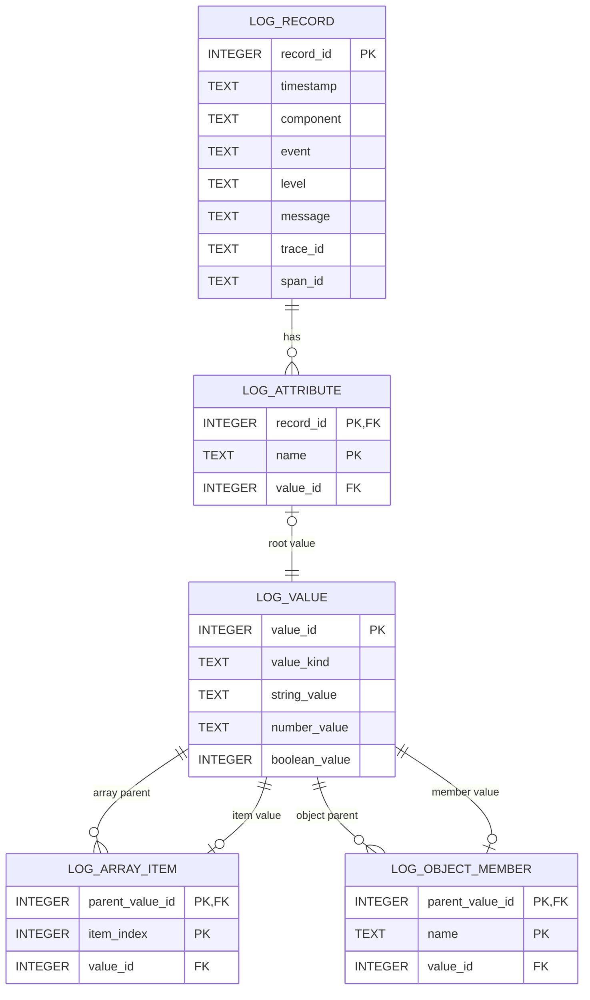

# 構造化ログSQLite表現設計

> [!abstract] この文書の役割
> [実行追跡・構造化ログ契約設計](./実行追跡・構造化ログ契約設計.md)で定義する構造化ログを、[構造化ログ外部表現共通設計](./構造化ログ外部表現共通設計.md)の共通情報と属性の規則を使ってSQLiteへどう配置するかを定義する。イベントや属性の意味・記録条件は論理契約と各機能設計を正本とし、この文書はSQLite固有のtable、column、relation、値型、省略方法を担当する。
>
> 本設計はSQLite表現そのものを定義するものであり、SQLiteを本番の構造化ログ出力として実装・サポートすることまでは要求しない。

## 1. SQLite表現の全体像

1つのSQLite databaseに0件以上の構造化ログを格納する。構造化ログ1件の共通情報は`log_record`の1 rowで表し、属性とその値は別tableへ分けて関連付ける。arrayとobjectはJSON文字列へ変換せず、子の値とのrelationとして表す。

`log_record`は0件以上の`log_attribute`を持つ。`log_attribute.value_id`は属性のroot値を表す`log_value`を指す。`value_kind=array`の`log_value`は`log_array_item`を介して順序付きの子値へ、`value_kind=object`の`log_value`は`log_object_member`を介して名前付きの子値へつながる。

各tableは`STRICT` tableとし、relationはforeign keyで結ぶ。SQLite connectionではforeign key enforcementを有効にする。

## 2. 論理情報からSQLiteへの対応

### 2.1 共通情報

`log_record`は構造化ログ1件につき1 rowを持つ。

| column | SQLite上の型 | 内容 |
|---|---|---|
| `record_id` | `INTEGER` | SQLite内でrowを関連付けるためのlocal key |
| `timestamp` | `TEXT` | 共通外部表現の`timestamp` |
| `component` | `TEXT` | 共通外部表現の`component` |
| `event` | `TEXT` | 共通外部表現の`event` |
| `level` | `TEXT` | 共通外部表現の`level` |
| `message` | `TEXT` / `NULL` | 共通外部表現の`message` |
| `trace_id` | `TEXT` | 共通外部表現の`trace_id` |
| `span_id` | `TEXT` | 共通外部表現の`span_id` |

`timestamp`、`component`、`event`、`level`、`trace_id`、`span_id`は`NOT NULL`とする。`message`の扱いは4章で定める。

`record_id`はSQLite表現のrelationを作るためだけに使用する。論理契約や共通外部表現の項目ではなく、復元した構造化ログへ含めない。値の開始番号、連番、ログの発生順や出力順に意味を持たせず、`AUTOINCREMENT`も要求しない。

### 2.2 属性

`log_attribute`は構造化ログの属性1件につき1 rowを持つ。

| column | 内容 |
|---|---|
| `record_id` | 属性が属する`log_record` |
| `name` | 論理上の属性名 |
| `value_id` | 属性値を表す`log_value` |

同じ`record_id`では`name`を一意とし、rowの並び順には意味を持たせない。`value_id`が指す属性値は3章の規則で表す。

## 3. 属性値の表現

論理上の属性値1件を`log_value`の1 rowとして表す。arrayの各要素とobjectの各値も、それぞれ独立した`log_value` rowを持つ。

| column | SQLite上の型 | 内容 |
|---|---|---|
| `value_id` | `INTEGER` | SQLite内で値を関連付けるためのlocal key |
| `value_kind` | `TEXT` | `string`、`number`、`boolean`、`array`、`object`のいずれか |
| `string_value` | `TEXT` / `NULL` | `string`の値 |
| `number_value` | `TEXT` / `NULL` | `number`を元の論理値へ戻せる文字列表現 |
| `boolean_value` | `INTEGER` / `NULL` | `false`を`0`、`true`を`1`として表す |

`value_id`はSQLite表現のrelationを作るためだけに使用し、復元した属性値へ含めない。

### 3.1 文字列・数値・真偽値

`value_kind=string`では`string_value`だけ、`value_kind=number`では`number_value`だけ、`value_kind=boolean`では`boolean_value`だけを使用する。`value_kind=array`または`object`では3つのscalar columnを使用しない。この組み合わせは`CHECK` constraintで制約する。

論理上の数値をSQLiteの`REAL`へ変換すると、値によっては精度を失い、投影前と同じ論理値へ復元できない。そのため、`number_value`は数値として読み戻せる10進または指数形式の`TEXT`とし、投影前と同じ論理上の数値へ復元する。

### 3.2 array

`value_kind=array`の値は、`log_array_item`のrowで子の値へ関連付ける。

| column | 内容 |
|---|---|
| `parent_value_id` | arrayを表す`log_value` |
| `item_index` | 0から始まる要素位置 |
| `value_id` | その位置にある子の`log_value` |

同じ`parent_value_id`では`item_index`を一意とし、0から隙間なく並ぶ値として出力する。arrayの要素がarrayやobjectの場合も、子の`log_value`から3章の規則を再帰的に適用する。

### 3.3 object

`value_kind=object`の値は、`log_object_member`のrowで名前付きの子の値へ関連付ける。

| column | 内容 |
|---|---|
| `parent_value_id` | objectを表す`log_value` |
| `name` | object内の論理上の名前 |
| `value_id` | その名前に対応する子の`log_value` |

同じ`parent_value_id`では`name`を一意とし、rowの並び順には意味を持たせない。objectの値がarrayやobjectの場合も、子の`log_value`から3章の規則を再帰的に適用する。

投影処理は論理上の値1件ごとに新しい`log_value` rowを作り、循環するrelationは作らない。

## 4. 任意情報

任意情報と空の値は、rowまたは`NULL`の有無で区別する。

- `message`が存在しない場合は`log_record.message`を`NULL`にする。
- `message`が空文字列として存在する場合は空の`TEXT`として保持する。
- 属性が0件の場合は、その`record_id`に対応する`log_attribute` rowを持たない。
- 各機能設計の記録条件を満たさず属性が存在しない場合は、その属性の`log_attribute` rowを持たない。
- 空arrayは`value_kind=array`の`log_value`だけを持ち、`log_array_item` rowを持たない。
- 空objectは`value_kind=object`の`log_value`だけを持ち、`log_object_member` rowを持たない。

この規則により、「情報が存在しないこと」と「空文字列・空array・空objectという値が存在すること」を区別したまま論理情報へ戻せる。

## 5. 復元

SQLiteから論理ログへ戻すときは、`log_record`から共通情報を取得し、同じ`record_id`の`log_attribute`から各属性のroot `value_id`を取得する。`log_value`の`value_kind`に従い、arrayでは`log_array_item`を`item_index`の昇順でたどり、objectでは`log_object_member`をたどって属性値を再帰的に復元する。

有効なSQLite表現は、次を満たす。

- foreign keyがすべて解決できる。
- `log_attribute`では同じ`record_id`に同じ`name`を複数持たない。
- `log_array_item`のparentは`value_kind=array`であり、`item_index`は0から隙間なく並ぶ。
- `log_object_member`のparentは`value_kind=object`であり、同じparentに同じ`name`を複数持たない。
- `log_value`のscalar columnは`value_kind`に対応するものだけが値を持つ。
- `boolean_value`は`0`または`1`である。
- 値のrelationに循環がない。

## 6. 出力単位

SQLite databaseは0件以上の`log_record`を保持できる。`record_id`の大小やrowの物理順序を、構造化ログの論理上の順序として扱わない。

構造化ログ1件をSQLiteへ投影するときは、`log_record`とその属性・子値を1 transactionで書き込む。途中で失敗した場合は、その構造化ログ1件に対応する変更をcommitしない。

具体的なdatabase fileの配置、rotation、保持期間、同時書き込み、query用index、buffering、IO失敗時の扱いは本設計では定義しない。SQLiteを本番出力へ採用する場合は、各コンポーネントの構造化ログ設計と実装でその境界を定める。

## 7. 責務と正本

| 正本 | 担当すること |
|---|---|
| [実行追跡・構造化ログ契約設計](./実行追跡・構造化ログ契約設計.md) | 構造化ログ1件が持つ論理情報、属性値、イベント、重要度、`error_type`、`TraceId`・`SpanId`の意味 |
| [構造化ログ外部表現共通設計](./構造化ログ外部表現共通設計.md) | 外部表現で共通する項目名と値表現、属性名と論理上の型・値を形式間で維持する規則 |
| 各機能設計 | 具体的なイベント、記録条件、既定の重要度、属性名・属性値、機能固有の`error_type` |
| この文書 | 共通情報と属性をSQLiteのtable、column、relationへ配置する方法と、SQLiteから論理値へ復元する規則 |
| migration | SQLite表現を実装する場合の正確なtable、column、constraint、index |

## 関連文書

- [実行追跡・構造化ログ契約設計](./実行追跡・構造化ログ契約設計.md)
- [構造化ログ外部表現共通設計](./構造化ログ外部表現共通設計.md)
- [ADR-0005 — 実行追跡をOpenTelemetryのtrace・spanで表現し、イベントを構造化ログとして記録する](<../../adr/ADR-0005 実行追跡をOpenTelemetryのtrace・spanで表現し、イベントを構造化ログとして記録する.md>)
- [SQLite STRICT Tables](https://www.sqlite.org/stricttables.html)
- [SQLite Foreign Key Support](https://www.sqlite.org/foreignkeys.html)
