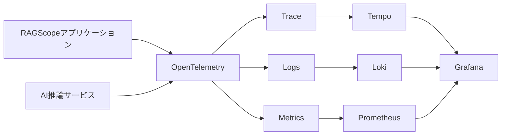
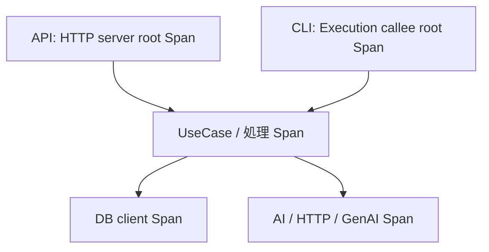

# Observability設計

> [!abstract] この文書の役割
> RAGScopeでTrace、Logs、Metricsをどう使い分けるかを定義する。

## 1. 全体像

RAGScopeはOpenTelemetryをObservabilityの共通基盤として使用する。Telemetryは処理を観測するためのものであり、処理順序、retry、timeout、成功・失敗などの機能上の判断は変更しない。

| Signal | 主な用途 |
|---|---|
| Trace / Span | 1回の実行内の処理のつながり、所要時間、各処理の最終結果 |
| Logs | Spanだけでは表しにくい出来事や診断情報 |
| Metrics | 複数回の実行をまたいだ時間、回数、分布の集約 |

実験や評価で再利用する正確な結果はTelemetryではなく、RAGScopeのドメインデータとして保存する。

## 2. Trace

- APIではHTTPリクエストごと、CLIではコマンド実行ごとに独立したTraceを開始する。
- HTTP、DB、GenAIなどOpenTelemetry Semantic Conventionが適用できる場合は標準のSpanと属性を優先する。
- RAGScopeアプリケーションからAI推論サービスへTrace Contextを伝播し、同じTraceとして追跡する。
- Spanの成功・失敗は、そのSpanが表す処理自身の最終結果で決める。

## 3. Logs

| 情報 | 表現 |
|---|---|
| 時間を持つ処理 | Span |
| Spanを説明する値 | Span attributes |
| 名前を付けて検索・集計したい出来事 | EventRecord |
| その他の診断情報 | 通常のLogRecord |

Spanですでに確認できる事実はLogsへ重複して記録しない。RAGScope独自の名前付きイベントはEventRecordとして記録し、独自のSpan Eventは使用しない。

Severityは`Debug`、`Info`、`Warn`、`Error`の4段階とする。

## 4. Metrics

- OpenTelemetryの標準Metricが適用できる場合はそれを使用する。
- 実験ID、文書ID、TraceIdなど、実行ごとに値が増える識別子をMetric attributesへ入れない。
- 1回の実行の正確な値はTraceやドメインデータで確認し、Metricsから復元することを前提にしない。

## 5. 失敗の観測

| 状態 | Telemetry上の扱い |
|---|---|
| 処理が成功した | 失敗として記録しない |
| 処理自身の最終結果が失敗した | 必要に応じてSpan Statusや`error.type`へ反映する |
| 子処理が失敗したがretry / fallbackで回復した | 回復した上位処理を失敗にしない |
| Telemetryの記録・送信だけが失敗した | 成功した機能処理を失敗へ変更しない |

`error.type`にはIDやメッセージなど実行ごとに変わる値を含めず、同じ種類の失敗を同じ値で表す。Telemetry用の表現は元の失敗を置き換えない。

機能上の失敗の扱いは[システムアーキテクチャ](../システムアーキテクチャ.md)を正本とする。

## 6. ローカル環境とTBD

| Signal | backend |
|---|---|
| Trace | Tempo |
| Logs | Loki |
| Metrics | Prometheus |
| 横断的な可視化 | Grafana |

Collectorを配置するか、どのprotocolで送信するか、productionでどのbackendを使用するかはTBDである。

## 関連文書

- [システムアーキテクチャ](../システムアーキテクチャ.md)
- [RAGScope要求定義](../../RAGScope要求定義.md)
- [ADR-0006 — OpenTelemetryをObservabilityの共通基盤とし、Trace・Logs・Metricsの責務を分ける](<../../adr/ADR-0006 OpenTelemetryをObservabilityの共通基盤とし、Trace・Logs・Metricsの責務を分ける.md>)
- [ADR-0009 — RAGScopeのLogs SeverityをDebug・Info・Warn・Errorに限定する](<../../adr/ADR-0009 RAGScopeのLogs SeverityをDebug・Info・Warn・Errorに限定する.md>)
- [ADR-0010 — RAGScopeアプリケーションの失敗を処理単位の具体型で扱う](<../../adr/ADR-0010 RAGScopeアプリケーションの失敗を処理単位の具体型で扱う.md>)
