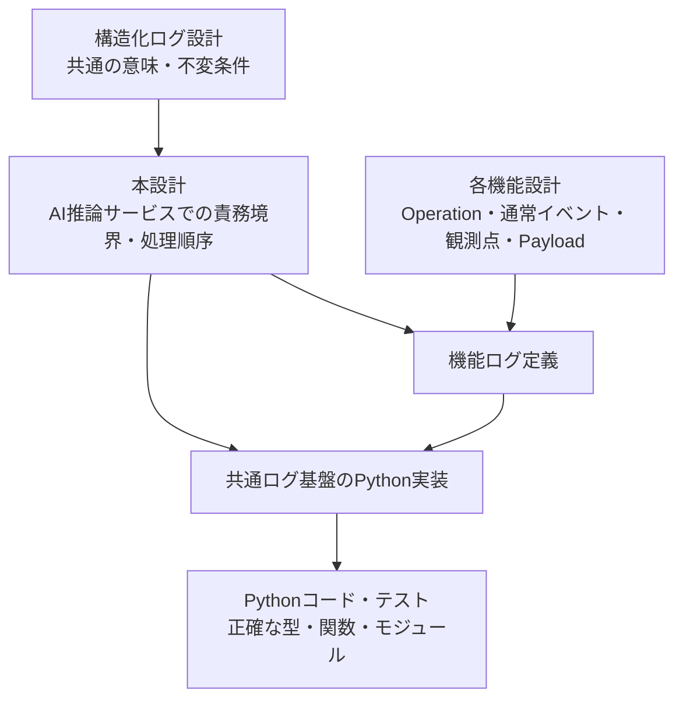
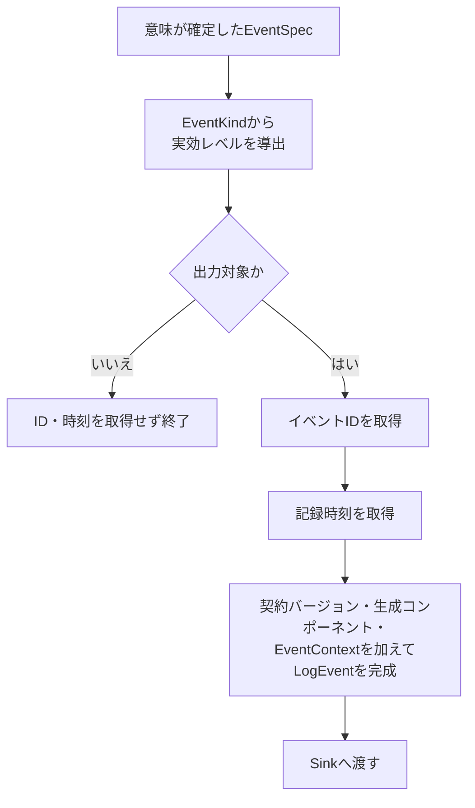

# AI推論サービス構造化ログ設計

> [!abstract] この文書の役割
> [構造化ログ設計](./構造化ログ設計.md)で定義した共通の意味と不変条件を、AI推論サービスのPython実装でどのような責務境界と処理の流れによって成立させるかを定義する。
>
> 本設計の責務は、意味が確定したイベントをAI推論サービス内で完成した`LogEvent`へ組み立て、Sinkへ渡すまでとする。正確なPython型・関数・モジュール構成と具体的なテストケースはコードとテストを正本とする。

| 知りたいこと | 参照先 |
|---|---|
| AI推論サービスのログ基盤全体をどう分けるか | [1. 全体像](#1-全体像) |
| `LogEvent`をいつ、どこで完成させるか | [2. LogEvent完成までの流れ](#2-logevent完成までの流れ) |
| 機能処理・共通ログ基盤・Sinkの責務 | [3. 責務と境界](#3-責務と境界) |
| 共通の意味をPythonでどう成立させるか | [4. Pythonでの実現方針](#4-pythonでの実現方針) |

## 1. 全体像

本設計は、共通の意味をAI推論サービスで成立させる責務境界を定義し、正確なPython実装へ引き渡す。機能固有のログ語彙は各機能設計から機能ログ定義へ入り、共通ログ基盤へ逆流させない。

通常の機能処理は、任意の[`Operation`](<./構造化ログ設計.md#1. ログイベントの意味モデル>)、通常イベント名、ログレベル、[`Payload`](<./構造化ログ設計.md#1. ログイベントの意味モデル>)を直接組み立てず、各機能で定義した閉じたイベントを使用する。機能ログ定義が閉じたイベントを共通[`EventSpec`](<./構造化ログ設計.md#1. ログイベントの意味モデル>)へ変換し、共通ログ基盤は意味が確定した`EventSpec`以降を担当する。

## 2. LogEvent完成までの流れ

共通ログ基盤は次の順序を守る。

| 共通情報 | 確定する場所 | AI推論サービスでの規則 |
|---|---|---|
| 契約バージョン | [`LogEvent`](<./構造化ログ設計.md#1. ログイベントの意味モデル>)完成境界 | 現在使用する共通ログ契約のバージョンを付加する |
| イベント識別子 | `LogEvent`完成境界 | 出力対象のログイベントごとに新しく取得する |
| 記録時刻 | `LogEvent`完成境界 | 出力対象と決まった後、実際に記録する時点で取得する |
| 生成コンポーネント | 本番用のログ記録環境を構成する境界 | AI推論サービスとして固定し、通常の機能処理に選択させない |
| [`EventContext`](<./構造化ログ設計.md#1. ログイベントの意味モデル>) | ログ記録環境を構成する境界 | 共通設計で区別する[Execution](<./構造化ログ設計.md#3. 実行との関連付け>)または[Service](<./構造化ログ設計.md#3. 実行との関連付け>)として確定した状態を保持する |

イベント識別子と記録時刻は機能処理から受け取らない。出力対象外のイベントでは、不要なイベント識別子の生成と時計の参照を行わない。

ログ記録環境は、ExecutionとServiceを実行中に切り替える共有状態として持たず、それぞれ異なる文脈として構成する。Execution用の環境では呼び出し元から引き継いだ[`execution_id`](<./構造化ログ設計.md#3. 実行との関連付け>)を構成時に束縛し、Service用の環境では`execution_id`を持たせない。

## 3. 責務と境界

| 境界 | 担当すること | 担当しないこと |
|---|---|---|
| 機能処理 | 機能固有の処理と、機能で定義した閉じたイベントの生成 | 任意の`EventSpec`や共通ログ情報の組み立て |
| 機能ログ定義 | 閉じたイベントから`EventSpec`への変換、機能固有のOperation・通常イベント名・通常レベル・`Payload`・安全な失敗情報の対応 | イベントID・時刻・生成コンポーネントの決定、Sinkの選択 |
| 共通イベントモデル | 共通設計の意味と不変条件をPython内部で表現する | 機能固有のイベント語彙 |
| ログ記録境界 | 実効レベルによる出力判定、共通情報の付加、完成済み`LogEvent`のSinkへの受け渡し | 機能固有イベントの意味付け、Sinkの具体的な処理 |
| 本番用の構成境界 | 最低ログレベル、生成コンポーネント、`EventContext`、イベントID取得源、時計、Sinkを組み合わせる | 個々の機能イベントの定義 |
| Sink | 完成済み`LogEvent`を受け取り、ログ基盤自身の成功・失敗を返す | `LogEvent`の意味を補完すること、機能処理の結果を変更すること |
| 機能処理と必須ログ記録の合成境界 | 機能処理結果と必須ログ記録結果を独立して保持し、[共通設計の失敗時の意味](<./構造化ログ設計.md#5. ログ記録が失敗した場合>)を保って外側の実行結果へ解釈する | 元の機能失敗をログ基盤失敗で置き換えること |

機能ログ定義だけが低水準の共通`EventSpec`を組み立てる。通常の機能処理に、任意の`operation`、通常イベント名、ログレベル、`payload`を自由に指定できる共通ログAPIを提供しない。

記録してよい情報の意味と許可リスト方式は[構造化ログ設計「4. 情報保護」](<./構造化ログ設計.md#4. 情報保護>)、安全な共通エラーの意味は[エラー設計](../エラー設計.md)を正本とし、本設計では再定義しない。

本番用の構成境界では構造化ログ用Sinkを標準エラー出力へ接続し、通常の機能結果や応答を出力する責務を持たせない。

## 4. Pythonでの実現方針

共通設計で定義された意味と不変条件を、Pythonでは次の方針で成立させる。

| 設計上の意味 | Pythonでの方針 | 理由 |
|---|---|---|
| [通常イベントと失敗イベント](<./構造化ログ設計.md#2. 通常イベントと失敗イベント>)の区別 | unionなど、異なる構造を持つ閉じた選択肢として表現する | 通常・失敗の相関を任意に崩せない内部モデルにするため |
| ExecutionとServiceの区別 | unionなど、異なる構造を持つ閉じた選択肢として表現する | Serviceが`execution_id`を持たないことを内部モデルで維持するため |
| 機能固有イベントから`EventSpec`への変換 | 機能ログ定義の型付き関数を基本とする | 通常の機能処理から低水準の共通ログ組み立てを分離するため |
| [`Envelope`](<./構造化ログ設計.md#1. ログイベントの意味モデル>) | 専用型の作成を要求しない | 共通設計上は意味上のグルーピングであり、独立したPython型そのものが契約ではないため |
| ID取得源・時計・Sink | 実際に差し替える必要がある操作としてログ記録処理へ注入する | ID生成・時刻取得・Sink呼び出しを、LogEvent完成の純粋な判断から分離するため |

正確な型・関数・モジュール分割は[`ai-service/src/ragscope_ai_service/logging/`](../../../ai-service/src/ragscope_ai_service/logging/)を、具体的な検査内容は[`ai-service/tests/logging/`](../../../ai-service/tests/logging/)を正本とする。

## 関連文書

- [構造化ログ設計](./構造化ログ設計.md)
- [エラー設計](../エラー設計.md)
- [ADR-0004 — 構造化ログの内部イベントモデルを通常イベントと失敗イベントの直和として表現する](<../../adr/ADR-0004 構造化ログの内部イベントモデルを通常イベントと失敗イベントの直和として表現する.md>)
- [Pythonコーディング規約](../../rules/Pythonコーディング規約.md)
