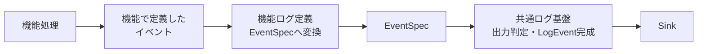
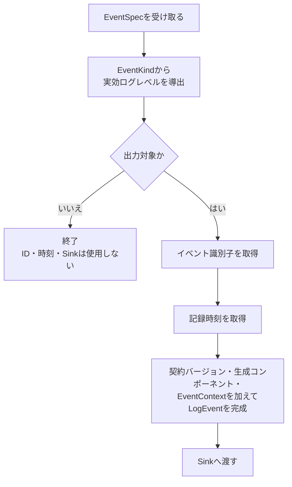

# AI推論サービス構造化ログ設計

> [!abstract] この文書の役割
> AI推論サービスで、各機能が定義したイベントを`EventSpec`へ変換し、出力判定と共通情報の付加によって`LogEvent`を完成させ、Sinkへ渡すまでの処理と責務分担を定義する。
>
> `LogEvent`、`EventSpec`、`EventContext`などの意味と不変条件は[構造化ログ設計](./構造化ログ設計.md)を正本とする。正確なPython型・関数・モジュール構成と具体的なテストケースはコードとテストを正本とする。

## 1. 処理の全体像

AI推論サービスの構造化ログ処理は、機能処理、機能ログ定義、共通ログ基盤、Sinkに責務を分ける。

機能処理は、任意の[`Operation`](<./構造化ログ設計.md#1. ログイベントの意味モデル>)、通常イベント名、ログレベル、[`Payload`](<./構造化ログ設計.md#1. ログイベントの意味モデル>)を直接指定しない。各機能が許可するイベントを機能側の型として定義し、機能ログ定義がそのイベントを共通[`EventSpec`](<./構造化ログ設計.md#1. ログイベントの意味モデル>)へ変換する。

共通ログ基盤は`EventSpec`を受け取った後の出力判定と`LogEvent`完成を担当し、各機能の`Operation`、通常イベント名、`Payload`の内容を決定しない。

## 2. LogEvent完成までの流れ

出力判定には`EventKind`から導出した実効ログレベルを使用する。通常イベントでは通常レベルを使用し、失敗イベントでは失敗を表す実効レベルを導出する。失敗イベント用の実効レベルを、`EventSpec`とは別の入力として機能処理から受け取らない。

出力対象外のイベントでは、イベント識別子の取得、時計の参照、Sink呼び出しを行わない。

| 共通情報 | 確定する場所 | AI推論サービスでの規則 |
|---|---|---|
| 契約バージョン | `LogEvent`完成境界 | 現在使用する共通ログ契約のバージョンを付加する |
| イベント識別子 | `LogEvent`完成境界 | 出力対象のログイベントごとに新しく取得する |
| 記録時刻 | `LogEvent`完成境界 | 出力対象と決まった後、記録時点の時刻を取得する |
| 生成コンポーネント | ログ記録環境の構成時 | AI推論サービスとして固定し、機能処理に選択させない |
| [`EventContext`](<./構造化ログ設計.md#3. 実行との関連付け>) | ログ記録環境の構成時 | ExecutionまたはServiceとして確定した状態を保持する |

Execution用のログ記録環境は、呼び出し元から引き継いだ[`execution_id`](<./構造化ログ設計.md#3. 実行との関連付け>)を構成時に保持する。Service用のログ記録環境は`execution_id`を持たない。ExecutionとServiceを、実行中に切り替える共有状態やnullableな`execution_id`だけで表現しない。

## 3. 責務と境界

| 境界 | 担当すること | 担当しないこと |
|---|---|---|
| 機能処理 | 機能固有の処理と、自機能で定義したイベントの生成 | 任意の`EventSpec`、`Operation`、通常イベント名、ログレベル、`Payload`の直接組み立て |
| 機能ログ定義 | 機能イベントから`EventSpec`への変換、機能固有の`Operation`・通常イベント名・通常レベル・`Payload`・安全な失敗情報の対応付け | イベント識別子、記録時刻、生成コンポーネント、Sinkの決定 |
| Python内部モデル | [`LogEvent`](<./構造化ログ設計.md#1. ログイベントの意味モデル>)、`EventSpec`、`EventContext`の共通不変条件をPythonの型で表現する | 機能固有のイベント定義 |
| ログ記録境界 | 実効ログレベルによる出力判定、共通情報の付加、完成済み`LogEvent`のSinkへの受け渡し | 機能イベントから`EventSpec`への意味付け |
| 本番用の構成境界 | 最低ログレベル、生成コンポーネント、`EventContext`、イベント識別子取得処理、時計、Sinkを組み合わせる | 個々の機能イベントの定義 |
| Sink | 完成済み`LogEvent`を受け取り、ログ基盤自身の成功・失敗を返す | `LogEvent`の意味の補完、機能処理結果の変更 |
| 必須ログ記録の結果合成境界 | 機能処理結果と必須ログ記録結果を独立して保持し、[構造化ログ設計「5. ログ記録が失敗した場合」](<./構造化ログ設計.md#5. ログ記録が失敗した場合>)の規則に従って外側の実行結果へ反映する | 元の機能失敗をログ基盤失敗で置き換えること |

`Payload`と失敗イベントへ渡すエラー情報には、[構造化ログ設計「4. 情報保護」](<./構造化ログ設計.md#4. 情報保護>)と[エラー設計](../エラー設計.md)で記録を許可された情報だけを使用する。

本番用の構成境界では、構造化ログ用Sinkを標準エラー出力へ接続する。構造化ログ基盤は、通常の機能結果や応答を出力する責務を持たない。

## 4. Pythonでの実現方針

| 対象 | Pythonでの方針 | 理由 |
|---|---|---|
| [通常イベントと失敗イベント](<./構造化ログ設計.md#2. 通常イベントと失敗イベント>) | unionなど、異なる構造を持つ選択肢として表現する | 通常イベントに`LogError`を持たせる、失敗イベントへ通常レベルを入力する、といった不正状態を表現しにくくするため |
| ExecutionとService | unionなど、異なる構造を持つ選択肢として表現する | Serviceに`execution_id`を持たせないことを型で表現するため |
| 機能イベントから`EventSpec`への変換 | 機能ログ定義が所有する型付き関数で変換する | 機能処理から低水準の共通ログ組み立てを分離するため |
| [`Envelope`](<./構造化ログ設計.md#1. ログイベントの意味モデル>) | 独立したPython型の作成を要求しない | 共通設計では契約バージョン・イベント識別子・記録時刻・生成コンポーネントの意味上のまとまりであり、専用型そのものを契約としていないため |
| イベント識別子取得処理・時計・Sink | ログ記録処理の外から差し替え可能な依存として渡す | 出力判定と`LogEvent`組み立てを、ID生成・時刻取得・Sink呼び出しの副作用から分離するため |

正確な型・関数・モジュール分割は[`ai-service/src/ragscope_ai_service/logging/`](../../../ai-service/src/ragscope_ai_service/logging/)を、具体的な検査内容は[`ai-service/tests/logging/`](../../../ai-service/tests/logging/)を正本とする。

## 関連文書

- [構造化ログ設計](./構造化ログ設計.md)
- [エラー設計](../エラー設計.md)
- [ADR-0004 — 構造化ログの内部イベントモデルを通常イベントと失敗イベントの直和として表現する](<../../adr/ADR-0004 構造化ログの内部イベントモデルを通常イベントと失敗イベントの直和として表現する.md>)
- [Pythonコーディング規約](../../rules/Pythonコーディング規約.md)
