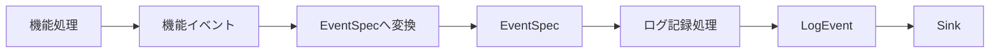
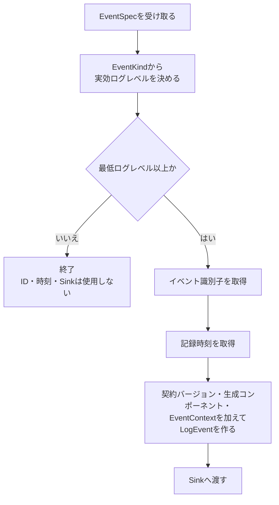

# AI推論サービス構造化ログ設計

> [!abstract] この文書の役割
> AI推論サービスで、機能処理中に発生した出来事を`LogEvent`として記録するまでの処理順序を定義する。対象は、機能イベントから`EventSpec`を作り、ログ記録処理が`LogEvent`を完成させてSinkへ渡すまでとする。
>
> `LogEvent`、`EventSpec`、`EventContext`の意味と共通規則は[構造化ログ設計](./構造化ログ設計.md)を正本とする。正確なPython型と具体的なテストケースはコードとテストを正本とする。

## 1. 全体像

AI推論サービスでは、機能処理が生成した機能イベントを`EventSpec`へ変換し、ログ記録処理が`EventSpec`から`LogEvent`を作ってSinkへ渡す。

## 2. 機能イベントを定義し、EventSpecへ変換する

各機能は、ログへ記録する処理中の出来事や処理結果を表す機能イベントの種類をあらかじめ定義する。機能イベントごとに、その出来事を記録するために必要な値も定める。

実行時には、機能処理で実際に起きた出来事や得られた結果に対応する機能イベントを生成し、必要な値を持たせて機能ごとのログ変換処理へ渡す。

各機能は、機能イベントの種類ごとに、対応する`Operation`、`EventKind`、`Payload`の作り方を定義する。通常イベントでは通常イベント名と通常ログレベルを持つ`NormalEvent`を、失敗イベントでは安全な`LogError`を持つ`FailedEvent`を作る。

機能ごとのログ変換処理が、この対応に従って機能イベントから[`EventSpec`](<./構造化ログ設計.md#1. ログイベントの意味モデル>)を作る。

`Payload`と`LogError`には、[構造化ログ設計「4. 情報保護」](<./構造化ログ設計.md#4. 情報保護>)と[エラー設計](../エラー設計.md)で記録を許可された情報だけを渡す。

## 3. EventSpecからLogEventを作ってSinkへ渡す

ログ記録処理は`EventSpec`を受け取ると、次の順序で処理する。

通常イベントでは、そのイベントが持つ通常ログレベルを実効ログレベルとして使用する。失敗イベントでは`error`を使用する。

出力対象になったイベントでは、`EventSpec`と次の情報から`LogEvent`を作る。

| `EventSpec`以外の情報 | 取得元・決定方法 |
|---|---|
| 契約バージョン | ログ記録処理が使用する現在の契約バージョン |
| イベント識別子 | ログイベントごとに新しく取得する |
| 記録時刻 | 出力対象と決まった後に時計から取得する |
| 生成コンポーネント | ログ記録処理の構成時にAI推論サービスとして固定する |
| `EventContext` | ログ記録処理の構成時に渡された値を使用する |

Sinkは完成済み`LogEvent`を受け取り、ログ記録の成功または失敗を返す。必須ログ記録では、機能処理の結果とSink呼び出しの結果を別々に保持し、[構造化ログ設計「5. ログ記録が失敗した場合」](<./構造化ログ設計.md#5. ログ記録が失敗した場合>)に従って外側の実行結果を決める。

## 4. ログ記録処理を構成する

ログ記録処理を構成するときに、次を渡す。

- 最低ログレベル
- AI推論サービスを表す生成コンポーネント
- `EventContext`
- イベント識別子を取得する処理
- 時計
- Sink

ログ記録処理には、[構造化ログ設計「3. 実行との関連付け」](<./構造化ログ設計.md#3. 実行との関連付け>)に従って構成した`EventContext`を渡す。Executionに属するログでは、AI推論サービスは呼び出し元から受け取った`execution_id`を使用する。

本番用のSinkは標準エラー出力へ接続する。通常の機能結果や応答の出力は構造化ログ基盤では扱わない。

正確な`EventContext`の型は[`context.py`](../../../ai-service/src/ragscope_ai_service/logging/context.py)、`EventSpec`と通常・失敗イベントの型は[`event_spec.py`](../../../ai-service/src/ragscope_ai_service/logging/event_spec.py)を正本とする。具体的な検査内容は[`tests/logging/`](../../../ai-service/tests/logging/)を正本とする。

## 関連文書

- [構造化ログ設計](./構造化ログ設計.md)
- [エラー設計](../エラー設計.md)
- [ADR-0004 — 構造化ログの内部イベントモデルを通常イベントと失敗イベントの直和として表現する](<../../adr/ADR-0004 構造化ログの内部イベントモデルを通常イベントと失敗イベントの直和として表現する.md>)
