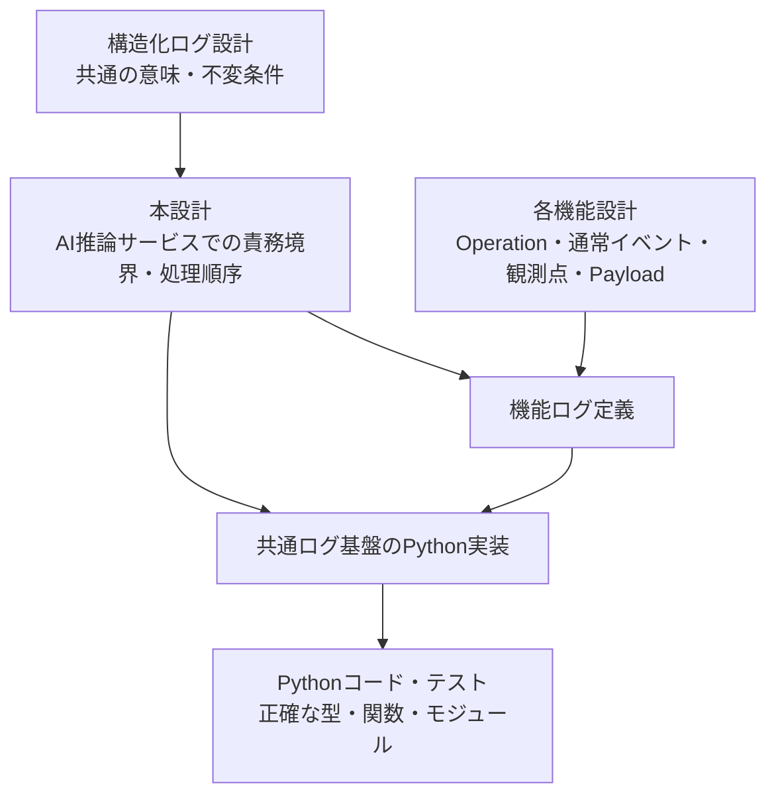
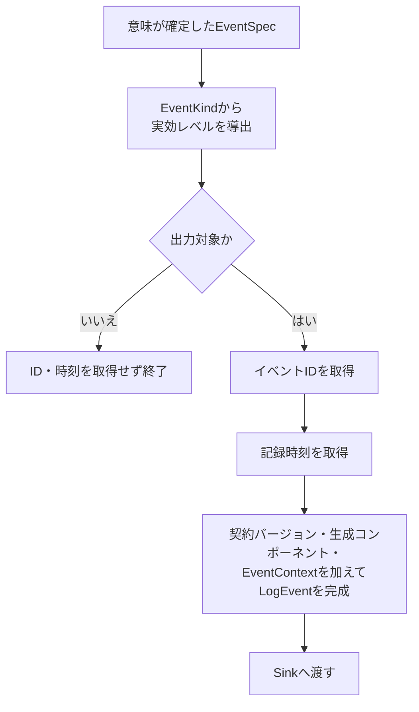

# AI推論サービス構造化ログ設計

> [!abstract] この文書の役割
> [構造化ログ設計](./構造化ログ設計.md)で定義した共通の意味と不変条件を、AI推論サービスのPython実装でどのような責務境界と処理の流れによって成立させるかを定義する。
>
> 外部表現の形式、他コンポーネント固有の実装、正確なPython型・関数・モジュール構成は本設計の対象外とする。正確なPython実装とテストはコードを正本とする。

| 知りたいこと | 参照先 |
|---|---|
| AI推論サービスのログ基盤全体をどう分けるか | [1. 全体像](#1-全体像) |
| `LogEvent`をいつ、どこで完成させるか | [2. LogEvent完成までの流れ](#2-logevent完成までの流れ) |
| 機能処理・共通ログ基盤・Sinkの責務 | [3. 責務と境界](#3-責務と境界) |
| Python内部モデルが必ず守る条件 | [4. Python内部モデルの不変条件](#4-python内部モデルの不変条件) |
| 共通の意味とPython固有の実現をどう分けるか | [5. Pythonでの実現方針](#5-pythonでの実現方針) |
| 必須ログ記録が失敗したときの扱い | [6. 機能処理と必須ログ記録の合成](#6-機能処理と必須ログ記録の合成) |
| ID・時計・Sinkをどうテストで差し替えるか | [7. テストで差し替える境界](#7-テストで差し替える境界) |

## 1. 全体像

本設計は、共通の意味をAI推論サービスで成立させる責務境界を定義し、正確なPython実装へ引き渡す。機能固有のログ語彙は各機能設計から機能ログ定義へ入り、共通ログ基盤へ逆流させない。

通常の機能処理は、任意の[`Operation`](<./構造化ログ設計.md#1. ログイベントの意味モデル>)、通常イベント名、ログレベル、[`Payload`](<./構造化ログ設計.md#1. ログイベントの意味モデル>)を直接組み立てず、各機能で定義した閉じたイベントを使用する。機能ログ定義が閉じたイベントを共通[`EventSpec`](<./構造化ログ設計.md#1. ログイベントの意味モデル>)へ変換し、共通ログ基盤は意味が確定した`EventSpec`以降を担当する。

## 2. LogEvent完成までの流れ

共通ログ基盤は次の順序を守る。

| 共通情報 | 確定する場所 | 規則 |
|---|---|---|
| 契約バージョン | [`LogEvent`](<./構造化ログ設計.md#1. ログイベントの意味モデル>)完成境界 | 現在使用する共通ログ契約のバージョンを付加する |
| イベント識別子 | `LogEvent`完成境界 | 出力対象のログイベントごとに新しく取得する |
| 記録時刻 | `LogEvent`完成境界 | 出力対象と決まった後、実際に記録する時点で取得する |
| 生成コンポーネント | 本番用のログ記録環境を構成する境界 | AI推論サービスとして固定し、通常の機能処理に選択させない |
| [`EventContext`](<./構造化ログ設計.md#1. ログイベントの意味モデル>) | ログ記録環境を構成する境界 | ExecutionまたはServiceの意味が確定した状態で保持する |

イベント識別子と記録時刻は機能処理から受け取らない。出力対象外のイベントでは、不要なイベント識別子の生成と時計の参照を行わない。

### 2.1 ExecutionとService

[Execution](<./構造化ログ設計.md#3. 実行との関連付け>)に属するログ記録環境は、呼び出し元から引き継いだ[`execution_id`](<./構造化ログ設計.md#3. 実行との関連付け>)を持つ`EventContext`を保持する。同じCLIコマンドに由来する処理について、AI推論サービス側で新しい`execution_id`を生成しない。

[Service](<./構造化ログ設計.md#3. 実行との関連付け>)に属するログ記録環境は`execution_id`を持たない。ExecutionとServiceのどちらに属するかを、nullableな`execution_id`の有無や実行中に変更可能な共有状態で表現しない。

## 3. 責務と境界

| 境界 | 担当すること | 担当しないこと |
|---|---|---|
| 機能処理 | 機能固有の処理と、機能で定義した閉じたイベントの生成 | 任意の`EventSpec`や共通ログ情報の組み立て |
| 機能ログ定義 | 閉じたイベントから`EventSpec`への変換、機能固有のOperation・通常イベント名・通常レベル・`Payload`・安全な失敗情報の対応 | イベントID・時刻・生成コンポーネントの決定、Sinkの選択 |
| 共通イベントモデル | 共通設計の意味と不変条件をPython内部で表現する | 機能固有のイベント語彙や外部表現の形式 |
| ログ記録境界 | 実効レベルによる出力判定、共通情報の付加、完成済み`LogEvent`のSinkへの受け渡し | 機能固有イベントの意味付け、Sinkの具体的な出力方法 |
| 本番用の構成境界 | 最低ログレベル、生成コンポーネント、`EventContext`、イベントID取得源、時計、Sinkを組み合わせる | 個々の機能イベントの定義 |
| Sink | 完成済み`LogEvent`を受け取り、ログ基盤自身の成功・失敗を返す | `LogEvent`の意味を補完すること、機能処理の結果を変更すること |
| 機能処理と必須ログ記録の合成境界 | 機能処理結果と必須ログ記録結果を独立して保持し、外側の実行結果へ解釈する | 元の機能失敗をログ基盤失敗で置き換えること |

機能ログ定義だけが低水準の共通`EventSpec`を組み立てる。通常の機能処理に、任意の`operation`、通常イベント名、ログレベル、`payload`を自由に指定できる共通ログAPIを提供しない。

記録してよい情報の意味と許可リスト方式は[構造化ログ設計](./構造化ログ設計.md)、安全な共通エラーの意味は[エラー設計](../エラー設計.md)を正本とする。本設計ではその内容を複製しない。

本番用の構成境界では、構造化ログ用Sinkを標準エラー出力へ接続し、通常の機能結果や応答を出力する責務を持たせない。Sinkが`LogEvent`をどの外部形式へ変換するかは、本設計では定義しない。

## 4. Python内部モデルの不変条件

### 4.1 EventSpec

| 種類 | 内部で保持する意味 | 表現してはならない状態 |
|---|---|---|
| 通常イベント | 通常イベント名、通常レベル | [`LogError`](<./構造化ログ設計.md#1. ログイベントの意味モデル>)、失敗専用のイベント名やレベル |
| 失敗イベント | 安全な`LogError` | 失敗時に固定的に決まるイベント名やレベルを独立した入力として重複保持する状態 |

[通常イベントと失敗イベント](<./構造化ログ設計.md#2. 通常イベントと失敗イベント>)は、同じレコードのnullable項目や真偽値で切り替えるのではなく、意味の異なる2種類として区別する。通常レベルとして表現できるのは共通設計で定めた通常イベント用のレベルだけとする。

失敗イベントへ渡す`LogError`には記録を許可された安全な情報だけを保持し、元の例外や内部原因を持ち込まない。

### 4.2 EventContext

| 文脈 | 必須の意味 | 持たない意味 |
|---|---|---|
| Execution | 呼び出し元から引き継いだ`execution_id` | なし |
| Service | サービス自身の状態変化であること | `execution_id` |

ExecutionとServiceは意味の異なる2種類として表現し、Serviceへダミーの`execution_id`を持たせない。

### 4.3 完成済みLogEvent

Sinkへ渡す`LogEvent`は、次の意味がすべて確定した完成済みイベントとする。

- 現在の共通ログ契約バージョン
- イベント識別子
- 記録時刻
- AI推論サービスという生成コンポーネント
- `EventContext`
- `EventSpec`

共通設計上の[`Envelope`](<./構造化ログ設計.md#1. ログイベントの意味モデル>)は、契約バージョン・イベント識別子・記録時刻・生成コンポーネントをまとめた**意味上のグルーピング**として扱う。Pythonで独立した`Envelope`型を設けることは要求しない。

契約バージョンと生成コンポーネントは`LogEvent`自身が保持すべき意味であり、Sinkの先だけが知る情報にはしない。

## 5. Pythonでの実現方針

共通設計と他コンポーネントで共通にするのは**意味と不変条件**であり、言語固有の型構造や抽象化ではない。

| 設計上の意味 | Pythonでの方針 | 理由 |
|---|---|---|
| 通常イベントと失敗イベントの区別 | unionなど、異なる構造を持つ閉じた選択肢として表現する | 区別そのものが不正状態を防ぐ共通の不変条件だから |
| ExecutionとServiceの区別 | unionなど、異なる構造を持つ閉じた選択肢として表現する | Serviceが`execution_id`を持たないことを内部モデルで維持するため |
| 機能固有イベントから`EventSpec`への変換 | 機能ログ定義の型付き関数を基本とする | 状態を持たない変換へ型クラス相当の仕組みを機械的に導入しないため |
| Envelope | 専用型の作成を要求しない | 共通設計上は意味上のグルーピングであり、独立型そのものが契約ではないため |
| 識別子・時刻・名前などの値 | 他言語に専用wrapper型があることだけを理由に1フィールドのdataclassを作らない | Pythonで必要な不変条件と利用方法に合わせて最小の表現を選ぶため |
| ID取得源・時計・Sink | 実際に差し替える必要がある操作として境界を設ける | 副作用をログ記録処理から分離し、テストで決定的に検査するため |

`Protocol`、class、callableなどの正確なPython表現は、実際の差し替え方と保持する状態に基づいてコードで決める。抽象を揃えること自体を目的にしない。

## 6. 機能処理と必須ログ記録の合成

機能処理の結果と、その結果を記録する必須ログ記録の結果は独立した事実として扱う。各機能設計で定めた結果確定境界では、機能処理の成否にかかわらず必要なログ記録を1回試行し、その後に両方の結果を外側の実行結果へ解釈する。

| 機能処理 | 必須ログ記録 | 外側で維持する結果 |
|---|---|---|
| 成功 | 成功 | 元の成功結果 |
| 成功 | 失敗 | ログ基盤自身の失敗による実行失敗 |
| 失敗 | 成功 | 元の共通エラー |
| 失敗 | 失敗 | 元の共通エラーとログ基盤自身の失敗の両方。元の共通エラーを上書きしない |

ログ基盤自身の失敗を、失敗した同じログ経路へ再帰的に記録しない。

この意味を実現する正確なPython型はコードを正本とする。他言語の`Either`や汎用的な独自`Result`を再現すること自体を設計要件にしない。

## 7. テストで差し替える境界

| 差し替えるもの | 本番時の役割 | テストで確認できること |
|---|---|---|
| イベントID取得源 | 出力対象イベントごとに新しいイベント識別子を供給する | 固定値を使い、完成した`LogEvent`を決定的に検査する |
| 時計 | `LogEvent`を記録する時刻を供給する | 固定時刻を使い、時刻付加の境界を決定的に検査する |
| Sink | 完成済み`LogEvent`を後続の出力処理へ渡す | メモリ保存で`LogEvent`を直接検査し、失敗Sinkでログ基盤失敗を検査する |

最低ログレベル未満のイベントでは、イベントID取得源、時計、Sinkが呼び出されないことを検査できる構成にする。

テストのためだけに本番コードへ外部表現固有の状態を追加しない。正確なfixture、helper、テストケースはPythonテストコードを正本とする。

## 8. 正確な実装の正本

| 正確に定義する内容 | 正本 |
|---|---|
| `EventContext`、`EventSpec`とその不変条件を表すPython型 | [`ai-service/src/ragscope_ai_service/logging/`](../../../ai-service/src/ragscope_ai_service/logging/) |
| 共通エラーと安全なログ情報への変換に使用するPython型 | [`ai-service/src/ragscope_ai_service/error/`](../../../ai-service/src/ragscope_ai_service/error/) |
| LogEvent完成、出力判定、依存の差し替え、Sink呼び出しの正確な実装 | [`ai-service/src/ragscope_ai_service/logging/`](../../../ai-service/src/ragscope_ai_service/logging/) |
| 具体的なテストケース | [`ai-service/tests/logging/`](../../../ai-service/tests/logging/) |

正確なclass名、関数名、フィールド、モジュール分割を本設計へ複製しない。実装上の名称や配置が変わっても、本設計で定義した責務境界、処理順序、不変条件を維持する。

## 関連文書

- [構造化ログ設計](./構造化ログ設計.md)
- [エラー設計](../エラー設計.md)
- [ADR-0004 — 構造化ログの内部イベントモデルを通常イベントと失敗イベントの直和として表現する](<../../adr/ADR-0004 構造化ログの内部イベントモデルを通常イベントと失敗イベントの直和として表現する.md>)
- [Pythonコーディング規約](../../rules/Pythonコーディング規約.md)
