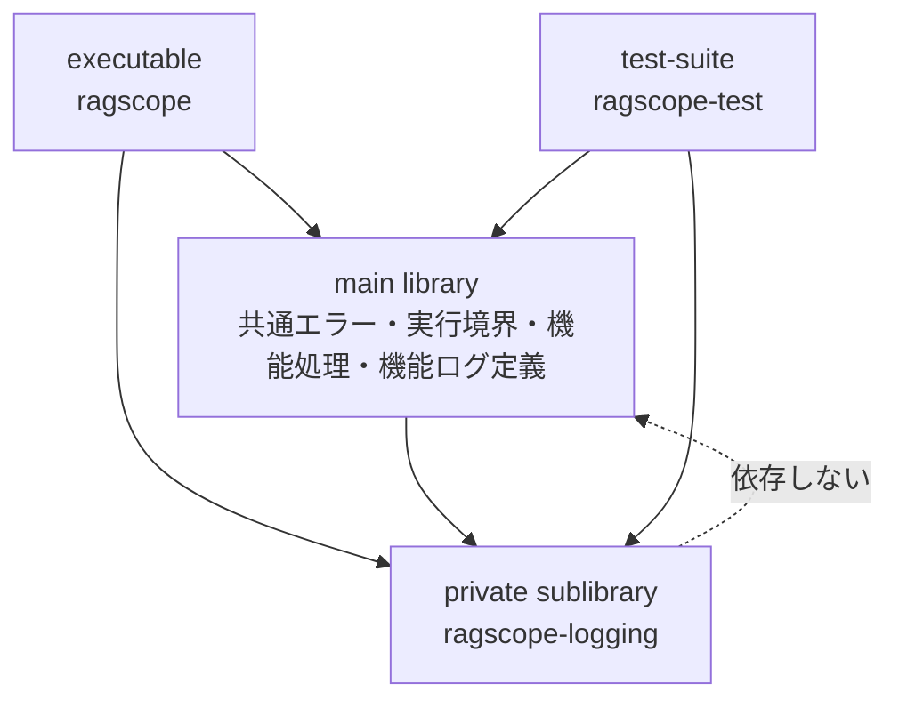
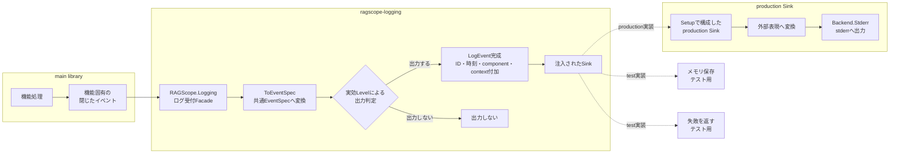
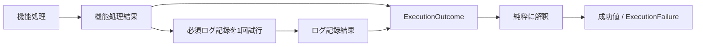

# RAGScopeアプリケーション構造化ログ設計

> [!abstract] この文書の役割
> [構造化ログ設計](./構造化ログ設計.md)で定義した共通の意味と不変条件を、RAGScopeアプリケーションのHaskell実装でどのように成立させるかを、パッケージ境界、型の責務、実行時の流れとして定義する。
>
> 外部表現の形式と変換規則、AI推論サービス固有の実装は本設計の対象外とする。正確な型、関数、export list、依存パッケージはHaskellコードとCabal設定を正本とする。

## 1. パッケージ境界

共通ログ基盤は独立パッケージにはせず、RAGScopeアプリケーションと同じパッケージ内の**private sublibrary `ragscope-logging`**として分離する。main libraryはログ基盤へ依存できるが、ログ基盤からmain libraryへは依存しない。

この境界により、機能固有の処理・エラーとアプリケーション実行結果の合成をmain libraryが所有し、共通ログ型、ID・時刻付加、出力判定、Sink呼び出しをprivate sublibraryへ隔離する。

## 2. ログ記録の流れ

通常の機能処理は、機能固有の閉じたイベントをログ受付処理へ渡す。Runtimeは共通`EventSpec`から実効ログレベルを導出して出力対象かを判定し、出力対象のイベントだけにID・時刻・`component`・`context`を付加して`LogEvent`を完成させ、注入されたSinkへ渡す。

Runtimeは実行環境を判定してSinkを選ばない。Loggerの構築時に用途に合うSinkを注入し、Runtimeは具体的な外部表現や出力先を知らない。

productionでは`RAGScope.Logging.Setup`が外部表現への変換と`Backend.Stderr`への出力を組み合わせたSinkを構築する。外部表現を作る純粋な変換と、その後のIO失敗境界を混在させない。

## 3. モジュールの責務

| モジュール・境界 | 公開範囲 | 責務 |
|---|---|---|
| `RAGScope.Logging` | sublibrary公開Facade | 通常の機能処理から、型付きの機能イベントを受け付ける |
| `RAGScope.Logging.EventSpec` | sublibrary公開Facade | 機能ログ定義が、閉じたイベントを通常・失敗の不変条件を守る共通`EventSpec`へ対応付けるための低水準APIを提供する |
| `RAGScope.Logging.Setup` | sublibrary公開Facade | production用Sink、ID・時刻取得処理、context、設定を組み合わせてLoggerを構築する |
| `RAGScope.Logging.Testing` | sublibraryテスト向け公開Facade | 固定ID・時刻、メモリSink、失敗Sinkなど、ログ基盤を検査する手段を提供する |
| `RAGScope.Logging.Core` | sublibrary内部 | IOや外部表現に依存しない共通ログの純粋な型、通常・失敗イベントの型上の不変条件、実効ログレベルの導出を保持する |
| `RAGScope.Logging.Runtime` | sublibrary内部 | 共通イベントへの変換、実効Levelによる出力判定、ID・時刻等の付加、Sink呼び出し、ログ基盤失敗の返却を行う |
| 外部表現変換境界 | sublibrary内部 | 完成した`LogEvent`を外部表現へ純粋に変換する。内部モデルの形を外部形式へ従属させない |
| `RAGScope.Logging.Backend.Stderr` | sublibrary内部 | 変換済みの1イベントをstderrへ出力し、書き込み・flushのIO失敗を`LoggingSinkFailure`へ変換する |
| `RAGScope.Execution.Result` | main library公開 | 機能処理結果と必須ログ記録結果を独立した事実として保持し、アプリケーション実行結果へ純粋に解釈する |
| `RAGScope.Execution.Observation` | main library公開 | 機能処理と必須ログ記録を順番に1回ずつ実行し、`RAGScope.Execution.Result`の規則へ合成を委ねる |
| 機能ログ定義 | main library内部 | 機能固有の閉じたイベント、`operation`・通常イベント名・`payload`の対応、アプリケーションエラーから安全なログ情報への投影を所有する |

低水準の`RAGScope.Logging.EventSpec`を利用するのは機能ログ定義境界に限定する。通常の機能処理は`RAGScope.Logging`と自機能の閉じたイベントだけを使用する。

`RAGScope.Logging.Setup`によるLogger構築自体は純粋に行い、EventId生成と現在時刻取得は`emit`時に実行するIOアクションとしてRuntimeへ注入する。

## 4. 機能処理と必須ログ記録の合成境界

`RAGScope.Execution.Observation`は機能処理を実行し、その結果を変更せず必須ログ記録へ1回渡す。2つの結果は`ExecutionOutcome`として`RAGScope.Execution.Result`へ渡し、純粋な解釈によって`AppAction`の成功値または`ExecutionFailure`へ変換する。

機能処理とログ基盤が失敗した場合の意味、元の`AppError`を保持する規則、同じログ経路へ再帰的に記録しない規則は[エラー設計「3.1 機能処理と必須ログ記録の結果合成」](<../エラー設計.md#3.1 機能処理と必須ログ記録の結果合成>)を正本とする。

## 5. 実装で保証すること

1. **通常の機能処理から任意のログイベントを組み立てさせない**  
   通常の機能処理は、任意の`operation`、`event`、`level`、`payload`を直接ログ受付処理へ渡さず、機能固有の閉じたイベントを使用する。文字列識別子と共通`EventSpec`の組み立ては機能ログ定義境界へ集める。

2. **通常イベントと失敗イベントの不変条件を型で保証する**  
   共通`EventSpec`は通常イベントと失敗イベントを直和または同等の型表現で区別する。通常イベントは通常イベント名と`debug` / `info` / `warn`に対応する通常レベルだけを持ち、失敗イベントは安全な`LogError`を必須とする。失敗時のイベント名と`error`レベルは失敗variantから導出し、独立した入力として保持しない。

3. **内部モデルを外部表現の構造へ従属させない**  
   `Core`は構造化ログの意味と不変条件をHaskellの型として表し、外部表現の項目構造や変換方法を設計理由にしない。Runtimeも外部表現を知らず、完成した`LogEvent`をSinkへ渡すところまでを担当する。

4. **外部表現への変換と出力IOを分離する**  
   完成した`LogEvent`から外部表現への変換はtotalな純粋変換とし、`Backend.Stderr`は変換済みの値をstderrへ出力するIOだけを担当する。

5. **Sink失敗を元の処理失敗と分離する**  
   Sinkの失敗はログ基盤自身の失敗として呼び出し側へ返し、失敗したSinkへ同じログ経路から再帰的に書き込まない。元の処理も失敗している場合、その失敗をログ基盤の失敗で上書きしない。

6. **stdoutとstderrの責務を分ける**  
   利用者へ返す正常なCLI結果はstdout、productionの構造化ログはstderrへ出力する。ログ基盤のproduction Sinkはstderrだけを担当し、正常結果の出力責務を持たない。

## 6. 正確な実装の正本

| 正確に定義する内容 | 正本 |
|---|---|
| private sublibrary、公開・内部モジュール、依存パッケージ | [`ragscope.cabal`](../../../ragscope-app/ragscope.cabal) |
| 共通ログ型と生成時の不変条件 | [`RAGScope.Logging.Core`](../../../ragscope-app/logging-src/RAGScope/Logging/Core.hs) |
| 出力判定、ID・時刻付加、Sink呼び出し、失敗返却 | [`RAGScope.Logging.Runtime`](../../../ragscope-app/logging-src/RAGScope/Logging/Runtime.hs) |
| stderrへの出力とIO失敗処理 | [`RAGScope.Logging.Backend.Stderr`](../../../ragscope-app/logging-src/RAGScope/Logging/Backend/Stderr.hs) |
| production用LoggerとSinkの組み立て | [`RAGScope.Logging.Setup`](../../../ragscope-app/logging-src/RAGScope/Logging/Setup.hs) |
| 機能処理結果と必須ログ記録結果の合成 | [`RAGScope.Execution.Result`](../../../ragscope-app/src/RAGScope/Execution/Result.hs)、[`RAGScope.Execution.Observation`](../../../ragscope-app/src/RAGScope/Execution/Observation.hs) |

外部表現の形式とその変換実装は、本設計の正本範囲へ含めない。

## 関連文書

- [構造化ログ設計](./構造化ログ設計.md)
- [エラー設計](../エラー設計.md)
- [ADR-0004 — 構造化ログの内部イベントモデルを通常イベントと失敗イベントの直和として表現する](<../../adr/ADR-0004 構造化ログの内部イベントモデルを通常イベントと失敗イベントの直和として表現する.md>)
- [Haskellコーディング規約](../../rules/Haskellコーディング規約.md)
