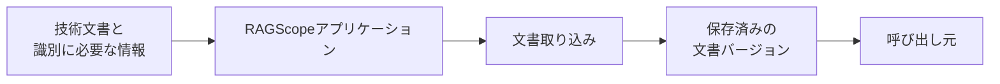

# 文書をRAGScopeに取り込むユースケース設計

> [!abstract] この文書の役割
> 利用者がMarkdown / TXTの技術文書をRAGScopeへ取り込み、保存済みの文書バージョンとして扱える状態にするまでの入力、成功結果、処理の流れ、再実行、失敗時の扱いを定義する。
> 文書内容の取得、正規化、文書バージョンの識別・保存などの内部規則は、文書取り込みの機能設計を正本とする。

## 1. 目的と適用範囲

このユースケースの目的は、利用者が指定した技術文書をRAGScopeへ取り込み、文書集合と文書に関連付いた保存済みの文書バージョンとして扱える状態にすることである。

| 扱うこと | 扱わないこと |
|---|---|
| Markdown / TXTの技術文書をRAGScopeへ取り込む | 文書バージョンを文書チャンクへ分割する |
| 文書集合と文書を識別し、文書バージョンとして保存する | 検索用データを生成する |
| 同じ文書の内容が変わった場合に、新しい文書バージョンとして取り込む | 質問を使って検索する、回答を生成する |
| 同じ内容を再度取り込んだ場合に、既存の文書バージョンを再利用する | CLI引数やAPI Schemaを定義する |

このユースケースは、`REQ-DOC-001`と、`REQ-DOC-004`のうち文書集合・文書・文書バージョンを識別して異なる版を混同せず管理する部分を実現する。

## 2. 入力と成功結果

現在設計で一意に決まっている概念上の入力は次のとおりである。

| 入力 | 意味 |
|---|---|
| 技術文書 | RAGScopeへ取り込むMarkdown / TXTの文書 |
| 文書集合・文書を識別するために必要な情報 | どの文書集合のどの文書として扱うかを特定するための情報 |

利用者がこれらをCLIやAPIのどの項目として指定するか、ファイルパス、バイト列、文字列などのどの形で技術文書を渡すか、識別情報をどの型で表すかは現時点では未決定である。このユースケース設計から推測して固定しない。

成功時は、対象の文書集合と文書に関連付いた保存済みの文書バージョンが得られる。その文書バージョンは正規化済み本文を保持し、文書と文書集合へ追跡できる。

呼び出し元へ返す正確な型や識別子は、このユースケース設計では固定しない。

## 3. 処理の流れ

1. RAGScopeアプリケーションがユースケースの入力を受け取る。
2. [文書取り込み](../domains/documents/文書取り込み基本設計.md)へ、技術文書と文書集合・文書を識別するために必要な情報を渡す。
3. 文書取り込みから、保存済みの文書バージョンを受け取る。
4. 保存済みの文書バージョンが得られたら、このユースケースを成功とする。

文書内容の取得、UTF-8への変換、正規化、検証、文書バージョンの識別と保存は、[文書取り込み詳細設計](../domains/documents/文書取り込み詳細設計.md)を正本とする。このユースケースでは同じ内部規則を重複して定義しない。

## 4. 再実行

同じ文書を再度取り込んだ場合の扱いは、文書取り込みの規則に従う。

| 状態 | 扱い |
|---|---|
| 同じ文書について正規化済み本文が既存の文書バージョンと同じ | 既存の文書バージョンを再利用する |
| 同じ文書について正規化済み本文が既存の文書バージョンと異なる | 新しい文書バージョンとして保存する |

新しい文書バージョンを作る場合も、過去の文書バージョンは上書きしない。

## 5. 失敗時の扱い

文書取り込みが保存済みの文書バージョンを作れない場合、このユースケースは成功結果を返さない。

文書内容の取得、形式、UTF-8変換、正規化、識別、保存で発生する具体的な処理失敗と自動再試行の条件は、[文書取り込み詳細設計](../domains/documents/文書取り込み詳細設計.md)を正本とする。最終失敗を呼び出し元へ返す共通方針は、[RAGScopeアプリケーション失敗設計](../RAGScopeアプリケーション失敗設計.md)に従う。

## 6. 実行境界

このユースケースの実行は、RAGScopeアプリケーションがユースケースの入力を受け取った時点で開始し、保存済みの文書バージョンを成功結果として扱える状態にするか、最終失敗を返して呼び出し元へ制御を戻した時点で終了する。

RAGScope CLIやRAGScope APIが利用者から入力を受け取り、このユースケースの入力へ変換する処理、およびユースケース終了後にCLI表示やHTTPレスポンスへ変換する処理は、このユースケースの実行には含めない。

## 関連文書

- [ユースケース設計](../ユースケース設計.md)
- [RAGScope要求定義](../../RAGScope要求定義.md)
- [RAGScope用語集](../../RAGScope用語集.md)
- [RAGScopeドメインモデル](../RAGScopeドメインモデル.md)
- [システムアーキテクチャ](../システムアーキテクチャ.md)
- [文書取り込み基本設計](../domains/documents/文書取り込み基本設計.md)
- [文書取り込み詳細設計](../domains/documents/文書取り込み詳細設計.md)
- [RAGScopeアプリケーション失敗設計](../RAGScopeアプリケーション失敗設計.md)
