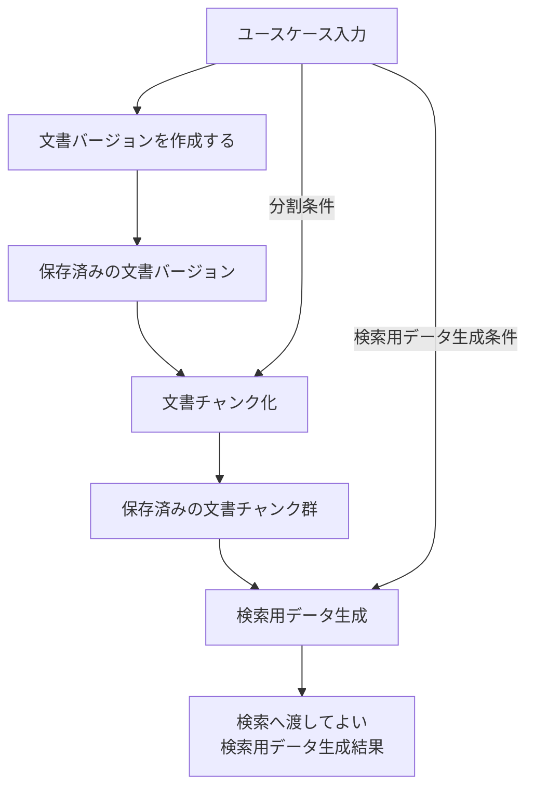

# 文書を検索可能にするユースケース設計

> [!abstract] この文書の役割
> 利用者がMarkdown / TXTの技術文書をRAGScopeへ登録し、指定した条件で検索に使用できる状態にするまでの入力、成功結果、処理の流れ、再実行時と失敗時の扱いを定義する。
> 文書バージョンの作成はこのユースケースで扱い、文書チャンク化と検索用データ生成の内部規則は文書ドメインの機能設計を正本とする。

## 1. 目的と適用範囲

このユースケースの目的は、利用者が指定した技術文書をRAGScopeへ取り込み、文書チャンクと検索用データを生成して、検索で使用できる状態にすることである。

このユースケースは、文書に関する要求 `REQ-DOC-001` から `REQ-DOC-005` を、文書バージョンの作成、文書チャンク化、検索用データ生成を組み合わせて実現する。

| 扱うこと | 扱わないこと |
|---|---|
| Markdown / TXT文書をRAGScopeへ取り込む | 質問を使って検索を実行する |
| 文書バージョンを指定した分割条件で文書チャンク化する | 回答を生成する |
| 全文検索やdense検索で使う検索用データを生成する | 評価や実験を実行する |
| 文書や条件を変更して再実行する | CLI引数やAPI Schemaを定義する |

## 2. 入力

このユースケースを実行するために、次の情報を受け取る。

| 入力 | 意味 |
|---|---|
| 技術文書 | 検索可能にするMarkdown / TXTの文書 |
| 文書集合を識別するための情報 | その文書をどの文書集合として扱うかを特定するための情報 |
| 文書を識別するための情報 | 新しい文書か、既存文書の新しい版かを区別するための情報 |
| 分割条件 | 文書バージョンをどの条件で文書チャンクへ分割するかを表す条件 |
| 検索用データ生成条件 | 生成する検索用データの種類と生成方法を区別するための条件 |

この表はユースケースが必要とする情報の意味を定義する。CLIでどの引数として入力するか、APIでどの項目として送るか、識別情報をどの型で表すかは、対応するインターフェース契約と実装の機械可読な正本で定義する。

## 3. 成功結果

次をすべて満たした状態を、このユースケースの成功とする。

1. 技術文書が、対象の文書集合と文書に関連付いた保存済みの文書バージョンとして扱える。
2. その文書バージョンと分割条件に対応する文書チャンク群が保存されている。
3. 検索用データ生成条件に対応する検索用データ生成結果が保存され、検索へ渡してよい状態になっている。
4. 検索用データ生成結果から、生成元の文書チャンク、文書バージョン、分割条件、検索用データ生成条件へ追跡できる。

成功時に呼び出し元へ返す正確な型や識別子は、このユースケース設計では固定しない。

## 4. 処理の流れ

1. 技術文書を取り込み、対象の文書集合と文書に関連付いた文書バージョンとして保存する。文書バージョンは正規化済み本文を保持する。技術文書を受け取る形、文書集合と文書を識別する正確な項目、正規化規則、文書バージョンの再利用条件は現時点では未決定であり、このユースケース設計から推測して固定しない。
2. [文書チャンク化](../domains/documents/文書チャンク化基本設計.md)へ、保存済みの文書バージョンと分割条件を渡す。
3. 文書チャンク化から、検証と保存が完了した文書チャンク群を受け取る。
4. [検索用データ生成](../domains/documents/検索用データ生成基本設計.md)へ、文書チャンク群と検索用データ生成条件を渡す。
5. 検索へ渡してよい検索用データ生成結果が得られたら成功とする。

文書チャンク化と検索用データ生成の処理規則、再利用条件、不変条件、個別の失敗条件は、それぞれの詳細設計を正本とする。

## 5. 再実行

同じユースケースを再実行した場合、変更された入力に応じて既存結果を再利用するか、新しい結果を生成する。

| 変更 | 扱い |
|---|---|
| 文書内容が同じ | 既存の文書バージョンを再利用するかどうかは未決定である |
| 文書内容が変わった | 新しい文書バージョンとして扱い、その版に対応する文書チャンクと検索用データを生成する |
| 分割条件が変わった | 文書バージョンは変更せず、新しい分割条件に対応する文書チャンクと検索用データを生成する |
| 検索用データ生成条件が変わった | 文書バージョンと文書チャンクを再利用し、新しい条件に対応する検索用データ生成結果を生成する |

過去の文書バージョン、文書チャンク、検索用データ生成結果を上書きして、過去の実験が参照する内容や条件を変更しない。

## 6. 失敗時の扱い

いずれかの内部機能が、この実行で必要な成功結果を作れない場合は、後続の内部機能へ進めず、このユースケースの成功結果を返さない。

前段の機能ですでに保存が完了した有効な結果は、ユースケース全体が失敗したことだけを理由に削除しない。再実行時に各機能の再利用条件を満たす場合は、その結果を再利用できる。

具体的な処理失敗、再試行、タイムアウト、最終失敗の扱いは、各機能設計と[RAGScopeアプリケーション失敗設計](../RAGScopeアプリケーション失敗設計.md)を正本とする。

## 7. 実行境界

このユースケースの実行は、RAGScopeアプリケーションがこのユースケースの入力を受け取った時点で開始し、成功結果を作るか最終失敗を返して呼び出し元へ制御を戻した時点で終了する。

RAGScope CLIやRAGScope APIが利用者から入力を受け取り、このユースケースの入力へ変換する処理、およびユースケース終了後にCLI表示やHTTPレスポンスへ変換する処理は、このユースケースの実行には含めない。

## 関連文書

- [ユースケース設計](../ユースケース設計.md)
- [RAGScope要求定義](../../RAGScope要求定義.md)
- [RAGScope用語集](../../RAGScope用語集.md)
- [RAGScopeドメインモデル](../RAGScopeドメインモデル.md)
- [システムアーキテクチャ](../システムアーキテクチャ.md)
- [文書ドメインの機能設計](../domains/documents/README.md)
- [RAGScopeアプリケーション失敗設計](../RAGScopeアプリケーション失敗設計.md)
- [Observability設計](../observability/README.md)
