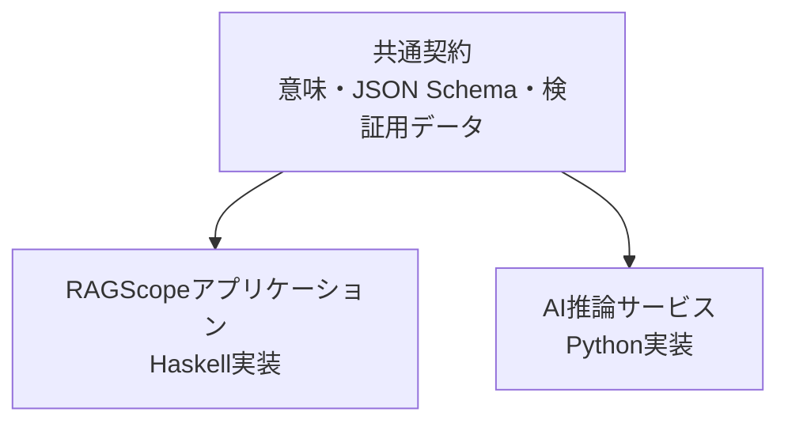
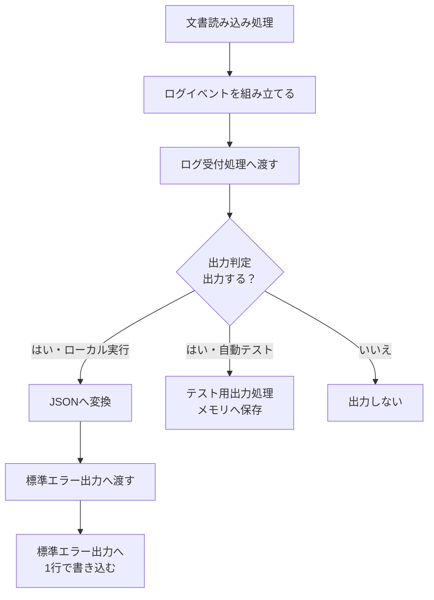
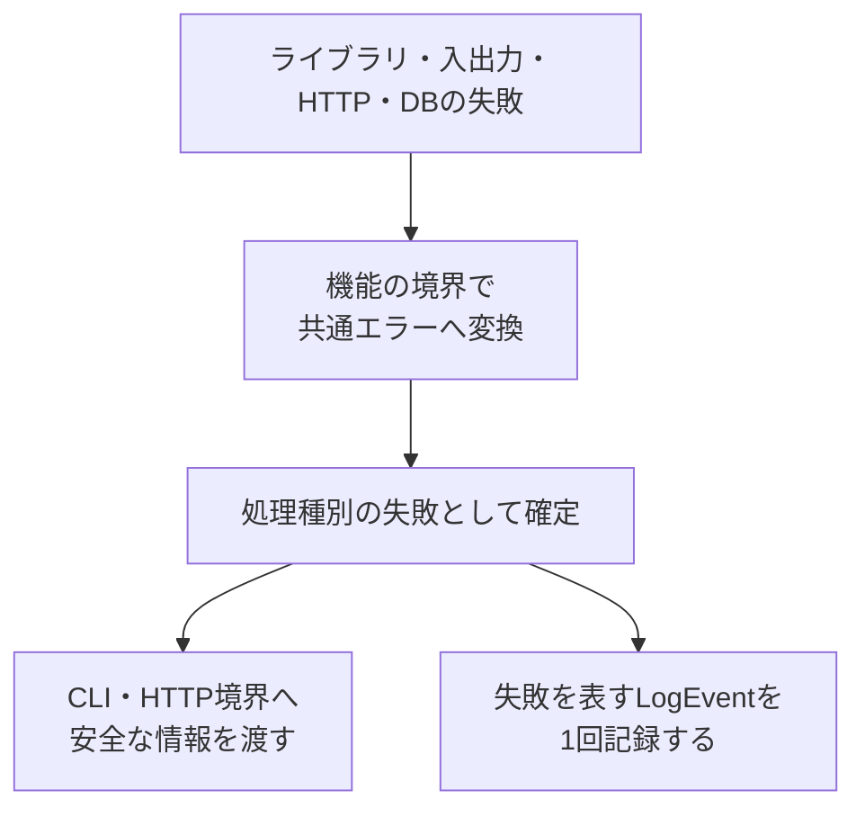
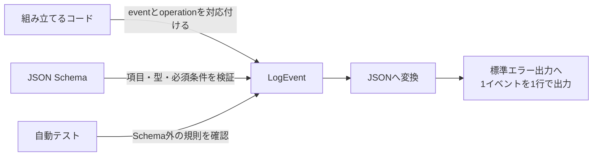

# エラー・ログ設計

> [!abstract] この文書の役割
> RAGScopeでエラーとログをどのように扱うかを説明する。
>
> エラーが発生してからJSON形式のログとして出力されるまでの流れと、各コンポーネントが共通して守る規則を扱う。

## 1. 目的と適用範囲

### 1.1 目的

RAGScopeでは、文書読み込み、AI推論サービスとの通信、PostgreSQLへの保存など、複数の処理が連続して動く。

この設計は、失敗を正常結果と区別し、「どの処理で何が起きたか」を1回の実行単位で追跡できるようにする。

### 1.2 適用範囲

| この設計で決めること | 機能の実装時に決めること |
|---|---|
| エラーが持つ共通情報 | 機能ごとの具体的なエラーコード（`code`） |
| ログ1件分の共通構造 | 機能ごとの具体的なログイベント名（`event`） |
| 1回の実行を追跡する方法 | 再試行回数やタイムアウト値 |
| ローカル環境での出力方法 | HTTPレスポンスの正確な形 |
| ログ出力そのものに失敗したときの扱い | CloudWatchや分散追跡（tracing）の設定 |

v0.0では、RAGScopeアプリケーションとAI推論サービスがこの共通設計を利用する。

### 1.3 この設計を利用する作業

- [RS-0014 共通エラーと構造化ログを設計する](<../project-management/milestones/v0.0/error-logging/RS-0014 共通エラーと構造化ログを設計する.md>)
- [RS-0015 RAGScopeアプリケーションの共通エラー・構造化ログ基盤を実装する](<../project-management/milestones/v0.0/error-logging/RS-0015 RAGScopeアプリケーションの共通エラー・構造化ログ基盤を実装する.md>)
- [RS-0018 AI推論サービスの共通エラー・構造化ログ基盤を実装する](<../project-management/milestones/v0.0/error-logging/RS-0018 AI推論サービスの共通エラー・構造化ログ基盤を実装する.md>)

## 2. 関連する要求と上位設計

### 2.1 要求

[RAGScope要求定義「3.3 信頼性と保守性」](<../RAGScope要求定義.md#3.3 信頼性と保守性>)のうち、次の範囲を担当する。

- 正常結果と失敗を区別する
- 主要な異常系を検証できるようにする
- 処理の進行と失敗を追跡できるようにする

### 2.2 上位設計

| 参照先 | この設計が従う内容 |
|---|---|
| [システムアーキテクチャ「1.4 共通データ表現」](<./システムアーキテクチャ.md#1.4 共通データ表現>) | コンポーネント間で共有するデータ表現 |
| [システムアーキテクチャ「3.4 共通実行基盤の責務境界」](<./システムアーキテクチャ.md#3.4 共通実行基盤の責務境界>) | エラー、ログ、実行制御の責務分離 |
| [ADR-0002](<../adr/ADR-0002 共通実行基盤の契約とコンポーネント実装を分離する.md>) | 共通契約とコンポーネント実装の分離 |

### 2.3 関連するプロジェクト管理文書

- [v0.0 — 最小のdense検索を実行できる](<../project-management/milestones/v0.0/v0.0.md>)
- [v0.0 共通エラーと構造化ログによる実行追跡](<../project-management/milestones/v0.0/error-logging/v0.0 共通エラーと構造化ログによる実行追跡.md>)

## 3. 責務と境界

### 3.1 担当する責務

この設計では、次の3点を決める。

1. エラーへ何を持たせ、何を利用者へ見せないか
2. ログへ何を記録し、同じ実行のログをどう結び付けるか
3. 各コンポーネントが同じ形式のログを出すために何を共有するか

### 3.2 共通するものと個別に実装するもの

各コンポーネントは同じエラー・ログ契約を使うが、その契約を実現するコードは個別に実装する。



| 共通契約で揃える | 各コンポーネントで実装する |
|---|---|
| エラーとログが表す意味 | 型と例外変換 |
| JSONの項目構成 | ログ受付処理（logger）と出力判定（filter） |
| エラー分類（`category`）、ログレベル（`level`）、命名規則 | JSON変換（encoder）と出力処理（sink） |
| JSON Schemaと検証用データ（fixture） | 必要になった場合のJSON復元処理（decoder） |

一方のコンポーネントが、もう一方のログ実装へ依存する構成にはしない。

### 3.3 対象外

v0.0ではローカル実行に必要な共通契約だけを決め、機能固有または将来の実行環境に関する内容は、必要になる段階まで固定しない。

| 対象外 | 決定する場所・時期 |
|---|---|
| 機能ごとのエラーコードとログイベント名 | 各機能の設計とコード |
| HTTPエラーレスポンスとステータス | API設計とOpenAPI |
| 再試行回数、待ち時間、タイムアウト値 | 処理種別（`operation`）ごとの設計 |
| CloudWatchの具体設定 | v0.1.5 |
| 分散追跡、バッチ処理、非同期ジョブの関連付け情報 | v0.5以降 |
| PostgreSQL自身が出力するログ | PostgreSQLの運用設計 |
| 実験状態とエラーの永続化 | 実験管理の設計 |

生存確認（health）や準備完了確認（readiness）などの稼働確認リクエストも、v1の共通ログイベントには含めない。

### 3.4 機械可読な定義を正本とする事項

| 正確に定義する内容 | 正本 |
|---|---|
| JSONの項目、型、必須条件 | [`log-event.schema.json`](../../contracts/logging/v1/log-event.schema.json) |
| Schemaへ適合する例・適合しない例 | [`fixtures/`](../../contracts/logging/v1/fixtures/) |
| HTTPで受け渡す形 | OpenAPI |
| 型、例外変換、ログ受付処理、JSON変換、出力処理 | 各コンポーネントのコード |
| 具体的なテストケース | 各コンポーネントのテストコード |

> [!note] 検証用データ（fixture）の位置付け
> 検証用データは仕様の正本ではなく、Schemaの代表的な検証入力である。
>
> 契約を利用する各コンポーネントは、同じ検証用データをSchema適合テストの共通入力として利用する。

## 4. 基本設計

### 4.1 ログが出力されるまで

文書読み込みが成功した場合は、次の順序でログを出力する。



> [!important] 機能処理が知る範囲
> 文書読み込み処理は、JSONの作り方や標準エラー出力への書き方を知らない。「何が起きたか」を`LogEvent`としてログ受付処理へ渡す。

出力方法を機能処理から分けることで、ログの形式や出力先を変えても機能処理を修正せずに済む。

### 4.2 operation、phase、event

機械可読な契約では、処理種別、処理段階、ログイベント名を次の項目で表す。

| 概念 | JSON・コード上の名称 | 表すもの | 文書読み込みの例 |
|---|---|---|---|
| 処理種別 | `operation` | 追跡したい処理の種類 | `document.read` |
| 処理段階 | `phase` | 処理がどの段階か | `started` / `succeeded` / `failed` |
| ログイベント名 | `event` | 処理種別について実際に起きた出来事 | `document.read.succeeded` |

```text
operation = document.read
phase     = succeeded
                 ↓
event     = document.read.succeeded
```

処理種別（`operation`）は単なる関数名ではなく、ログを調べる人が「何の処理だったか」を追跡する単位である。

> [!important] ログイベント名は手書きしない
> コードでは、定義済みの処理種別と処理段階からログイベント名を作る。`document.read.completed`のような表記揺れを防ぐためである。

### 4.3 LogEventの構造

`LogEvent`は、ログ1件分の情報をまとめたコード内部のデータである。

```text
LogEvent
├── 共通項目（Envelope）      すべてのログイベントが持つ情報
├── 実行との関連情報（Context）どの実行に属するか
├── イベント固有情報（Payload）ログイベントごとに異なる情報
└── エラー情報（Error）       失敗した場合だけ持つ情報
```

4つの部分が担う役割と、詳しい規則の場所を次に示す。

| 概念上の区分 | 主な内容 | 詳しい規則 |
|---|---|---|
| 共通項目（Envelope） | スキーマバージョン、時刻、ログレベル、コンポーネント、処理種別、イベントID | [5.4 JSON出力](<#5.4 JSONとして出力するときの規則>) |
| 実行との関連情報（Context） | 適用範囲（`scope`）、実行ID | [5.1 scope・ID・時刻](<#5.1 scope、ID、時刻>) |
| イベント固有情報（Payload） | 件数、処理時間など | [5.4 JSON出力](<#5.4 JSONとして出力するときの規則>) |
| エラー情報（Error） | エラー分類、コード、安全なメッセージ、許可された補助情報 | [5.5 共通エラー](<#5.5 共通エラーの規則>) |

これは役割を理解するための分け方である。JSONでは、共通項目をルートに置き、`context`、`payload`、`error`を必要に応じて使用する。

> [!note] `context.scope`が表すもの
> `execution`か`service`かを表す。成功・失敗は表さない。

#### JSONの例

```json
{
  "schema_version": 1,
  "event_id": "550e8400-e29b-41d4-a716-446655440000",
  "timestamp": "2026-07-28T10:00:00.123Z",
  "level": "info",
  "event": "document.read.succeeded",
  "component": "ragscope_app",
  "operation": "document.read",
  "context": {
    "scope": "execution",
    "execution_id": "7d9c35b8-7980-4b20-a86c-7220e67276cc"
  },
  "payload": {
    "byte_count": 2048,
    "duration_ms": 12
  }
}
```

正確な項目と条件はJSON Schemaを正本とし、同じ例を[`execution-succeeded.json`](../../contracts/logging/v1/fixtures/valid/execution-succeeded.json)で確認できる。

### 4.4 ログを扱う部品

`LogEvent`を組み立ててから出力またはテストで保存するまでを、6つの役割に分ける。括弧内はコード上の役割名として使用できる原表記である。

| 部品 | 役割 | 知らないこと |
|---|---|---|
| ログイベント組み立て処理（event builder） | 意味のある値から`LogEvent`を組み立てる | 標準エラー出力への書き方 |
| ログ受付処理（logger） | 完成した`LogEvent`を受け取る | 機能処理の詳細 |
| 出力判定（filter） | 現在の設定で出力するか判断する | JSONへの変換方法 |
| JSON変換（encoder） | `LogEvent`をJSONへ変換する | ログイベントを記録した理由 |
| 出力処理（sink） | ログを最終的な行き先へ渡す | 処理種別の内容 |
| JSON復元処理（decoder） | JSONを`LogEvent`へ戻す | JSONを生成した処理 |

このうち、役割を混同しやすいログイベント組み立て処理と出力処理、実装が必須ではないJSON復元処理を補足する。

#### event builder

機能処理は、JSONや完成したログイベント名ではなく、意味のある値を渡す。

```text
operation = DocumentRead
phase     = Succeeded
payload   = ByteCount 2048
```

ログイベント組み立て処理は、共通のID、時刻、コンポーネント、実行との関連情報、ログレベルを加えて`LogEvent`を完成させる。

`event builder`は役割を表す名前である。実際のモジュール名や関数名は、各コンポーネントの実装で決める。

> [!note] JSON変換との違い
> ログイベント名を作るのはログイベント組み立て処理である。JSON変換は、完成した`LogEvent`をJSONへ忠実に変換する。

#### sink

```text
標準エラー出力用のsink ──→ JSONを標準エラー出力へ書く
テスト用のsink           ──→ LogEventをメモリへ保存する
```

テスト用の出力処理を使うと、標準エラー出力の文字列ではなく、ログイベントの意味や`execution_id`を直接検査できる。

#### decoder

JSON復元処理はJSON変換の逆だが、ログを出力するだけのv0.0の本番処理には必須ではない。

JSONから`LogEvent`へ戻す必要が生じたコンポーネントだけが実装する。

### 4.5 エラーが処理されるまで



下位のライブラリや入出力処理で発生した例外を、そのまま利用者表示やログへ流さない。

#### 共通エラーが持つ情報

| 項目 | 役割 | 外部へ公開するか |
|---|---|---|
| エラー分類（`category`） | エラーの大まかな種類 | 公開してよい |
| エラーコード（`code`） | 判定や検索に使う安定した識別子 | 公開してよい |
| メッセージ（`message`） | 利用者へ見せてもよい説明 | 公開してよい |
| 内部原因（`cause`） | 元の例外や下位エラー | 公開しない |
| 補助情報（`context`） | 調査に使う安全な情報 | 許可した項目だけ公開する |

#### 役割の分担

| 境界 | 行うこと |
|---|---|
| 共通エラー | 失敗の意味を保持する。自分ではログを出さない |
| 処理結果を確定する境界 | 失敗を表すログイベントを1回記録する |
| CLI境界 | 終了状態と安全な表示へ変換する |
| HTTP境界 | 安全なレスポンスへ変換する。正確な形はOpenAPIで決める |

同じ失敗を複数の処理層で重複して記録しないため、処理結果を確定する境界だけが失敗を表すログイベントを出す。

## 5. 詳細設計

### 5.1 scope、ID、時刻

#### scope

`scope`は、ログイベントが1回のコマンド実行に属するか、サービス自体の状態変化に属するかを表す。

| `scope` | 対象 | `execution_id` |
|---|---|---|
| `execution` | 1回のCLIコマンドに属するログイベント | 必須 |
| `service` | サービスの起動・終了など | 入れない |

`execution_id`は、CLIコマンドの一番外側で、最初のログイベントより前に1回だけ生成する。

同じコマンドでは、コンポーネント境界を越えて同じ値を引き継ぐ。文書取り込みコマンドと検索コマンドは別の値を使う。

#### IDと時刻

| 項目 | 規則 |
|---|---|
| `execution_id` | 1回のCLIコマンドを識別するUUIDv4 |
| `event_id` | `LogEvent`を1件ずつ識別するUUIDv4 |
| UUIDの表現 | 小文字・ハイフン付きの標準形式 |
| `timestamp` | ログイベントを記録したUTC時刻 |
| 時刻の表現 | RFC 3339、ミリ秒3桁、末尾`Z` |
| 所要時間 | 単調時計で測り、項目名へ単位を含める |

同じ`LogEvent`を複数の出力処理へ渡す場合は、出力処理ごとに`event_id`を作り直さない。

### 5.2 識別子を自由入力させない

JSON Schemaは文字列の形を検証できるが、`document.read`と`document.load`のどちらが正式かは判断できない。

```text
DocumentRead（定義済みoperation）
        +
Succeeded（定義済みphase）
        ↓
document.read.succeeded
```

#### 共通の選択肢

| 識別子 | 使用できる値 |
|---|---|
| `component` | `ragscope_app` / `ai_service` |
| `scope` | `execution` / `service` |
| `phase` | `started` / `succeeded` / `failed` |
| `level` | `debug` / `info` / `warn` / `error` |
| `category` | `input` / `resource` / `data` / `dependency` / `timeout` / `internal` |

処理種別（`operation`）とエラーコードは、機能ごとの閉じた型として定義する。Haskellでは列挙型や直和型、Pythonでは`Enum`や`Literal`などを使用できる。

> [!important] 生の文字列を渡さない
> 機能処理から、任意のログイベント名やエラーコードをログ受付処理へ渡せる形にはしない。文字列への変換は1か所へ集める。

#### 識別子を追加するときの確認

1. 既存の識別子では表せないか
2. いつ使う識別子なのか
3. どの文字列として出力するか
4. 期待した文字列になることをテストしているか

同じ意味の別名を増やさず、既存の識別子へ後から別の意味を割り当てない。

検証用データ内の処理種別やエラーコードは例であり、正式な一覧ではない。

### 5.3 ログlevel

| `level` | 使用する状況 | 既定で出力するか |
|---|---|---|
| `debug` | 開発・調査時だけ必要な詳しい情報 | 出力しない |
| `info` | 通常の処理進行と結果 | 出力する |
| `warn` | 処理は続けられるが注意が必要 | 出力する |
| `error` | 処理種別が失敗した | 出力する |

> [!note] ログレベルとエラー分類は別のもの
> `level`は処理への影響、`category`は失敗の種類を表す。エラー分類からログレベルを機械的に決めない。

`debug`を有効にしても、機密情報を記録しない規則は変わらない。

### 5.4 JSONとして出力するときの規則

`LogEvent`のJSONは、内容に応じてSchema、コード、テストで分担して保証する。



正確なJSONの形は、[`log-event.schema.json`](../../contracts/logging/v1/log-event.schema.json)で定義する。

#### JSONの基本形式

| 項目 | 規則 |
|---|---|
| JSON Schema | Draft 2020-12 |
| 文字コード | UTF-8 |
| 項目名・列挙値 | 小文字の`snake_case` |
| Schemaのバージョン | `contracts/logging/v1/`という配置で管理 |
| `LogEvent`内のバージョン | `"schema_version": 1` |

> [!important] 互換性のない変更
> 項目の削除、名前変更、型の変更、必須条件や意味の変更を行う場合は、新しい契約バージョンを作る。

#### eventごとの規則

| 条件・対象 | 規則 |
|---|---|
| `failed`で終わるログイベント | `error`を持ち、`level`を`error`にする |
| `execution`のログイベント | `execution_id`を入れる |
| `service`のログイベント | `execution_id`を入れない |
| ログイベント名 | 同じ`LogEvent`の`operation`名から始める |
| 関係のない項目 | `null`ではなく省略する |
| `payload` | ログイベントごとに分け、任意項目を多数持つ大きなオブジェクトへまとめない |

標準JSON Schemaだけでは、ログイベント名と処理種別の一致を確認できない。この関係は、`LogEvent`を組み立てるコードと自動テストで保証する。

#### ローカル実行での出力

```text
正常なCLI結果 ──→ stdout
構造化ログ     ──→ stderr ──→ 1イベントを1行のJSON
```

標準エラー出力には、JSON以外の接頭辞、色制御文字、説明文、通常のテキスト形式のエラーを混ぜない。

### 5.5 共通エラーの規則

#### category

| `category` | 意味 |
|---|---|
| `input` | 入力内容や指定方法に問題がある |
| `resource` | 必要なファイルなどの資源を利用できない |
| `data` | 読み込んだデータが壊れている、または整合しない |
| `dependency` | 外部サービス、DB、モデルなどの依存先が失敗した |
| `timeout` | 決められた時間内に処理が完了しなかった |
| `internal` | 上記では表せない、RAGScope内部の予期しない失敗 |

#### code、message、cause、context

| 項目 | 規則 |
|---|---|
| `code` | `<domain>.<reason>`形式。小文字ASCII、数字、アンダースコアを使う |
| `message` | 利用者へ見せてもよい説明だけを書く |
| `cause` | 元の例外を内部で保持し、`LogEvent`やHTTPレスポンスへ出さない |
| `context` | エラーコードごとに許可した安全な値だけを入れる |

エラーコードへ可変値、ライブラリ名、例外クラス名を埋め込まない。元の例外メッセージやスタックトレースも`message`へ自動的に付け足さない。

> [!important] 再試行はエラー分類だけで決めない
> 共通エラーへ、処理種別をまたぐ単純な`retryable`判定を持たせない。副作用、再実行しても安全か、途中まで成功していないかなど、処理種別ごとの条件で判断する。

### 5.6 logger自身が失敗した場合

```text
ログ受付処理の失敗
├── JSON変換の失敗  LogEventをJSONへ変換できない
└── 出力の失敗      JSONを出力先へ書き込めない
```

| 状況 | 扱い |
|---|---|
| JSON変換の失敗 | `logging.encode_failed`として区別する |
| 出力の失敗 | `logging.sink_failed`として区別する |
| 処理は成功、必須ログイベントの出力は失敗 | 外側の境界へ内部エラーとして返す |
| 処理とログ受付処理の両方が失敗 | 処理のエラーを主な原因として残す |

> [!warning] 同じログ受付処理へ失敗を記録しない
> ログ受付処理の失敗を、同じログ受付処理や失敗した出力先へ再び書くと、処理が繰り返される可能性がある。

v0.0では代替出力を採用しない。壊れたJSONや代わりの通常テキストを標準エラー出力へ出さず、代替出力自身が失敗する経路も作らない。

### 5.7 ログへ記録しない情報

| 情報の種類 | そのまま記録しないもの | 代わりに使う情報 |
|---|---|---|
| 文書・生成内容 | 文書、チャンク、回答の全文 | 安定したID、件数、バイト数 |
| AI入力 | プロンプト、`context`の全文、Embedding | トークン数、モデルID |
| 認証・接続情報 | 秘密情報、認証情報、DB接続文字列 | 記録しない |
| HTTP | 本文、ヘッダーの全文 | ステータス、許可した要約 |
| 例外 | スタックトレース、元の例外メッセージ | エラー分類、コード、安全なメッセージ |

> [!important] 許可リストを先に決める
> 何でも入れられる連想配列をログへ渡さず、記録してよい項目を先に決める。後から正規表現で伏せ字にする方法だけには依存しない。

安全性を確認できない値は、一部を伏せ字にするより項目自体を省略する。

### 5.8 HTTPと診断requestの境界

| 内容 | この設計で共有する | API設計で決める |
|---|---|---|
| エラー | エラー分類、コード、安全なメッセージの意味 | レスポンス本文、ステータス |
| 実行追跡 | `execution_id`の意味 | ヘッダーや本文での引き継ぎ方法 |
| 稼働確認リクエスト | アプリケーションのログイベントと分ける方針 | アクセスログ、リクエストID |

生存確認や準備完了確認などの稼働確認リクエストは、v1の共通ログイベントには含めない。

## 6. テスト観点

| 対象 | 確認すること |
|---|---|
| 共通Schema | `valid/`をすべて受理し、`invalid/`を意図した規則で拒否する |
| 各コンポーネント | 生成したJSONがSchemaへ適合する |
| ログイベント組み立て処理 | 処理種別と処理段階から正しいログイベント名を作る |
| 識別子 | 任意のログイベント名やエラーコードを呼び出し側から渡せない |
| 実行との関連情報 | `execution`と`service`で`execution_id`の扱いが変わる |
| JSON | UUID、時刻、エラー情報、任意項目を正しく出力する |
| 出力 | 標準出力と標準エラー出力が混ざらず、JSONの項目順に依存しない |
| 情報保護 | 記録しないと決めた情報が含まれない |
| テスト用出力処理 | 完成した`LogEvent`の意味を検査できる |
| 失敗する出力処理 | ログ出力の失敗が元の処理エラーを上書きしない |

時刻とIDは実行ごとに変わるため、テストでは時計とID生成処理を差し替える。

## 7. 将来設計との境界

将来必要になりそうな項目を先回りして`LogEvent`へ追加せず、利用方法が決まったMilestoneで設計する。

| 時期・設計 | 後から決めること |
|---|---|
| v0.1.5 | CloudWatchでの収集、検索、保持、権限、料金対策 |
| v0.5 | `trace_id`、`span_id`、親子関係、バッチ処理・非同期ジョブの追跡 |
| 実験管理の導入時 | 実験IDと永続化する実行状態 |
| API設計時 | 稼働確認リクエスト、HTTPエラー、`execution_id`のHTTP上の引き継ぎ方法 |

## 8. 変更時の注意

> [!warning] 共通契約の変更は複数コンポーネントへ影響する
> 項目、エラー分類、適用範囲、ログレベル、コンポーネント、命名規則、ID、時刻、バージョンを変更するときは、契約を利用するすべてのコンポーネントを確認する。

変更時に確認する正本を次に示す。

- システムアーキテクチャ
- ADR-0002
- JSON Schemaと検証用データ
- OpenAPI
- 各コンポーネントの型とテスト

保存済みのログを読めなくしないよう、既存の項目や識別子へ別の意味を割り当てない。
