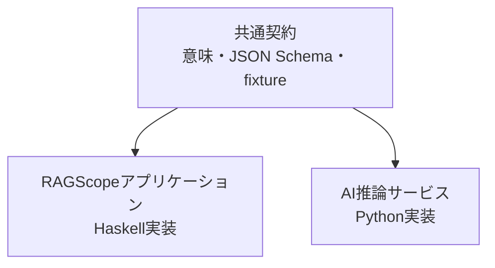
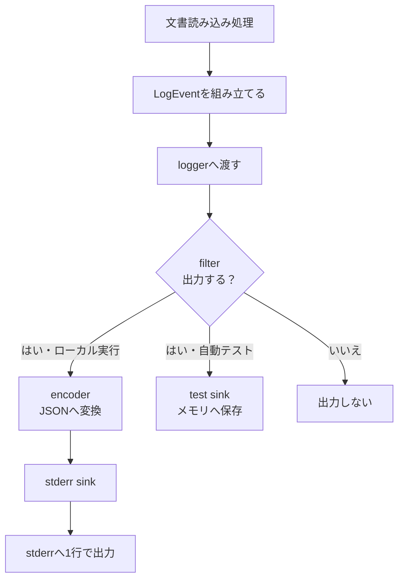
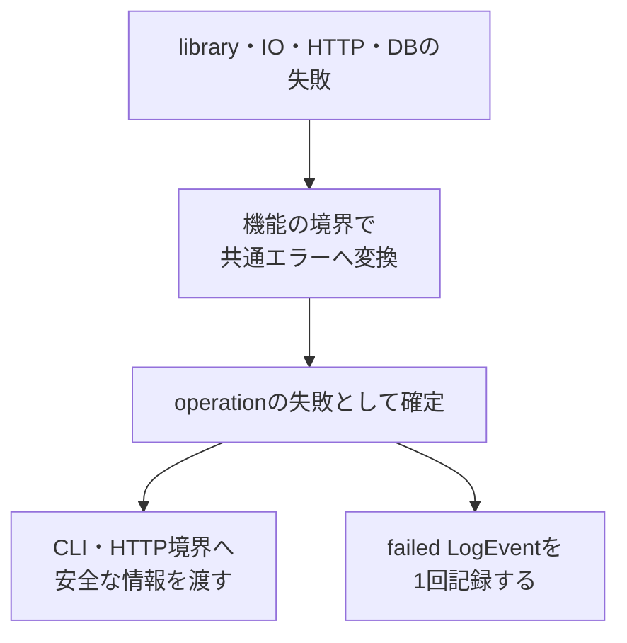
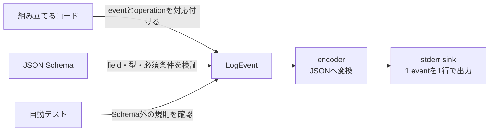

# エラー・ログ設計

> [!abstract] この文書の役割
> RAGScopeでエラーとログをどのように扱うかを説明する。
>
> エラーが発生してからJSONのログとして出力されるまでの流れと、各コンポーネントが共通して守る規則を扱う。

## 1. 目的と適用範囲

### 1.1 目的

RAGScopeでは、文書読み込み、AI推論サービスとの通信、PostgreSQLへの保存など、複数の処理が連続して動く。

この設計は、失敗を正常結果と区別し、「どの処理で何が起きたか」を1回の実行単位で追跡できるようにする。

### 1.2 適用範囲

| この設計で決めること | 機能の実装時に決めること |
|---|---|
| エラーが持つ共通情報 | 機能ごとの具体的なerror code |
| ログ1件分の共通構造 | 機能ごとの具体的なevent |
| 1回の実行を追跡する方法 | retry回数やtimeout値 |
| ローカル環境での出力方法 | HTTP responseの正確な形 |
| ログ出力そのものに失敗したときの扱い | CloudWatchやtracingの設定 |

v0.0では、RAGScopeアプリケーションとAI推論サービスがこの共通設計を利用する。

### 1.3 この設計を利用する作業

- [RS-0014 共通エラーと構造化ログを設計する](<../project-management/milestones/v0.0/error-logging/RS-0014 共通エラーと構造化ログを設計する.md>)
- [RS-0015 RAGScopeアプリケーションの共通エラー・構造化ログ基盤を実装する](<../project-management/milestones/v0.0/error-logging/RS-0015 RAGScopeアプリケーションの共通エラー・構造化ログ基盤を実装する.md>)
- [RS-0018 AI推論サービスの共通エラー・構造化ログ基盤を実装する](<../project-management/milestones/v0.0/error-logging/RS-0018 AI推論サービスの共通エラー・構造化ログ基盤を実装する.md>)

## 2. 関連する要求と上位設計

### 2.1 要求

[RAGScope要求定義「3.3 信頼性と保守性」](<../RAGScope要求定義.md#3.3 信頼性と保守性>)のうち、次の範囲を担当する。

- 正常結果と失敗を区別する
- 主要な異常系を検証できるようにする
- 処理の進行と失敗を追跡できるようにする

### 2.2 上位設計

| 参照先 | この設計が従う内容 |
|---|---|
| [システムアーキテクチャ「1.4 共通データ表現」](<./システムアーキテクチャ.md#1.4 共通データ表現>) | コンポーネント間で共有するデータ表現 |
| [システムアーキテクチャ「3.4 共通実行基盤の責務境界」](<./システムアーキテクチャ.md#3.4 共通実行基盤の責務境界>) | エラー、ログ、実行制御の責務分離 |
| [ADR-0002](<../adr/ADR-0002 共通実行基盤の契約とコンポーネント実装を分離する.md>) | 共通契約とコンポーネント実装の分離 |

### 2.3 関連するプロジェクト管理文書

- [v0.0 — 最小のdense検索を実行できる](<../project-management/milestones/v0.0/v0.0.md>)
- [v0.0 共通エラーと構造化ログによる実行追跡](<../project-management/milestones/v0.0/error-logging/v0.0 共通エラーと構造化ログによる実行追跡.md>)

## 3. 責務と境界

### 3.1 担当する責務

この設計では、次の3点を決める。

1. エラーへ何を持たせ、何を利用者へ見せないか
2. ログへ何を記録し、同じ実行のログをどう結び付けるか
3. 各コンポーネントが同じ形式のログを出すために何を共有するか

### 3.2 共通するものと個別に実装するもの

各コンポーネントは同じエラー・ログ契約を使うが、その契約を実現するコードは個別に実装する。



| 共通契約で揃える | 各コンポーネントで実装する |
|---|---|
| エラーとログの意味 | 型と例外変換 |
| JSONの形 | loggerとfilter |
| category、level、命名規則 | encoderとsink |
| JSON Schemaとfixture | 必要になった場合のdecoder |

一方のlogger実装へ、もう一方のコンポーネントが依存する構成にはしない。

### 3.3 対象外

v0.0ではローカル実行に必要な共通契約だけを決め、機能固有または将来の実行環境に関する内容は、必要になる段階まで固定しない。

| 対象外 | 決定する場所・時期 |
|---|---|
| 機能ごとのerror codeとevent | 各機能の設計とコード |
| HTTP error responseとstatus | API設計とOpenAPI |
| retry回数、待ち時間、timeout値 | operationごとの設計 |
| CloudWatchの具体設定 | v0.1.5 |
| tracing、batch、非同期jobの相関情報 | v0.5以降 |
| PostgreSQL自身が出力するログ | PostgreSQLの運用設計 |
| 実験状態とerrorの永続化 | 実験管理の設計 |

health・readinessなどの診断用requestも、v1の共通application eventには含めない。

### 3.4 機械可読な定義を正本とする事項

| 正確に定義する内容 | 正本 |
|---|---|
| JSONのfield、型、必須条件 | [`log-event.schema.json`](../../contracts/logging/v1/log-event.schema.json) |
| Schemaへ適合する例・適合しない例 | [`fixtures/`](../../contracts/logging/v1/fixtures/) |
| HTTPで受け渡す形 | OpenAPI |
| 型、例外変換、logger、encoder、sink | 各コンポーネントのコード |
| 具体的なテストケース | 各コンポーネントのテストコード |

> [!note] fixtureの位置付け
> fixtureは仕様の正本ではなく、Schemaの代表的な検証入力である。

## 4. 基本設計

### 4.1 ログが出力されるまで

文書読み込みが成功した場合は、次の順序でログを出力する。



> [!important] 機能処理が知る範囲
> 文書読み込み処理は、JSONの作り方やstderrへの書き方を知らない。「何が起きたか」をLogEventとしてloggerへ渡す。

出力方法を機能処理から分けることで、ログの形式や出力先を変えても機能処理を修正せずに済む。

### 4.2 operation、phase、event

| 用語 | 表すもの | 文書読み込みの例 |
|---|---|---|
| operation | 追跡したい処理の種類 | `document.read` |
| phase | 処理がどの段階か | `started` / `succeeded` / `failed` |
| event | operationについて実際に起きた出来事 | `document.read.succeeded` |

```text
operation = document.read
phase     = succeeded
                 ↓
event     = document.read.succeeded
```

operationは単なる関数名ではなく、ログを調べる人が「何の処理だったか」を追跡する単位である。

> [!important] event名は手書きしない
> コードでは、定義済みのoperationとphaseからevent名を作る。`document.read.completed`のような表記揺れを防ぐためである。

### 4.3 LogEventの構造

LogEventは、ログ1件分の情報をまとめたコード内部のデータである。

```text
LogEvent
├── Envelope  すべてのeventが持つ共通情報
├── Context   どの実行に属するか
├── Payload   eventごとに異なる情報
└── Error     失敗した場合だけ持つ情報
```

4つの部分が担う役割と、詳しい規則の場所を次に示す。

| 部分 | 主な内容 | 詳しい規則 |
|---|---|---|
| Envelope | schema version、時刻、level、component、operation、event ID | [5.4 JSON出力](<#5.4 JSONとして出力するときの規則>) |
| Context | scope、execution ID | [5.1 scope・ID・時刻](<#5.1 scope、ID、時刻>) |
| Payload | 件数、処理時間など | [5.4 JSON出力](<#5.4 JSONとして出力するときの規則>) |
| Error | category、code、安全なmessage、許可されたcontext | [5.5 共通エラー](<#5.5 共通エラーの規則>) |

これは役割を理解するための分け方である。JSONでは、Envelopeのfieldをrootへ置く。

> [!note] `context.scope`が表すもの
> `execution`か`service`かを表す。成功・失敗は表さない。

#### JSONの例

```json
{
  "schema_version": 1,
  "event_id": "550e8400-e29b-41d4-a716-446655440000",
  "timestamp": "2026-07-28T10:00:00.123Z",
  "level": "info",
  "event": "document.read.succeeded",
  "component": "ragscope_app",
  "operation": "document.read",
  "context": {
    "scope": "execution",
    "execution_id": "7d9c35b8-7980-4b20-a86c-7220e67276cc"
  },
  "payload": {
    "byte_count": 2048,
    "duration_ms": 12
  }
}
```

正確なfieldと条件はJSON Schemaを正本とし、同じ例を[`execution-succeeded.json`](../../contracts/logging/v1/fixtures/valid/execution-succeeded.json)で確認できる。

### 4.4 ログを扱う部品

LogEventを組み立ててから出力またはテストで保存するまでを、6つの役割に分ける。

| 部品 | 役割 | 知らないこと |
|---|---|---|
| event builder | 意味のある値からLogEventを組み立てる | stderrへの書き方 |
| logger | 完成したLogEventを受け取る | 機能処理の詳細 |
| filter | 現在の設定で出力するか判断する | JSONへの変換方法 |
| encoder | LogEventをJSONへ変換する | eventを記録した理由 |
| sink | ログを最終的な行き先へ渡す | operationの処理内容 |
| decoder | JSONをLogEventへ戻す | JSONを生成した処理 |

このうち、役割を混同しやすいevent builderとsink、実装が必須ではないdecoderを補足する。

#### event builder

機能処理は、JSONや完成したevent名ではなく、意味のある値を渡す。

```text
operation = DocumentRead
phase     = Succeeded
payload   = ByteCount 2048
```

event builderは、共通のID、時刻、component、実行Context、levelを加えてLogEventを完成させる。

event builderは役割を表す名前である。実際のmodule名や関数名は、各コンポーネントの実装で決める。

> [!note] encoderとの違い
> event名を作るのはevent builderである。encoderは、完成したLogEventをJSONへ忠実に変換する。

#### sink

```text
stderr sink  ──→ JSONをstderrへ書く
test sink    ──→ LogEventをメモリへ保存する
```

test sinkを使うと、stderrの文字列ではなく、eventの意味やexecution IDを直接検査できる。

#### decoder

decoderはencoderの逆だが、ログを出力するだけのv0.0の本番処理には必須ではない。

JSONからLogEventへ戻す必要が生じたコンポーネントだけが実装する。

### 4.5 エラーが処理されるまで



低levelの例外を、そのまま利用者表示やログへ流さない。

#### 共通エラーが持つ情報

| 項目 | 役割 | 外部へ公開するか |
|---|---|---|
| category | エラーの大まかな種類 | 公開してよい |
| code | 判定や検索に使う安定した識別子 | 公開してよい |
| message | 利用者へ見せてもよい説明 | 公開してよい |
| cause | 元のexceptionや下位error | 公開しない |
| context | 調査に使う安全な補助情報 | 許可した項目だけ公開する |

#### 役割の分担

| 境界 | 行うこと |
|---|---|
| 共通エラー | 失敗の意味を保持する。自分ではログを出さない |
| operationの境界 | failed eventを1回記録する |
| CLI adapter | 終了状態と安全な表示へ変換する |
| HTTP adapter | 安全なresponseへ変換する。正確な形はOpenAPIで決める |

同じ失敗を複数のlayerで重複して記録しないため、operationの結果を確定する境界だけがfailed eventを出す。

## 5. 詳細設計

### 5.1 scope、ID、時刻

#### scope

| scope | 対象 | `execution_id` |
|---|---|---|
| `execution` | 1回のCLI commandに属するevent | 必須 |
| `service` | serviceの起動・終了など | 入れない |

`execution_id`は、CLI commandの一番外側で最初のeventより前に1回だけ生成する。

同じcommandでは、コンポーネント境界を越えて同じ値を引き継ぐ。文書取り込みcommandと検索commandは別の値を使う。

#### IDと時刻

| 項目 | 規則 |
|---|---|
| `execution_id` | 1回のCLI commandを識別するUUIDv4 |
| `event_id` | LogEventを1件ずつ識別するUUIDv4 |
| UUIDの表現 | 小文字・ハイフン付きの標準形式 |
| `timestamp` | eventを記録したUTC時刻 |
| 時刻の表現 | RFC 3339、ミリ秒3桁、末尾`Z` |
| 所要時間 | 単調時計で測り、field名へ単位を含める |

同じLogEventを複数のsinkへ渡す場合は、sinkごとに`event_id`を作り直さない。

### 5.2 識別子を自由入力させない

JSON Schemaは文字列の形を検証できるが、`document.read`と`document.load`のどちらが正式かは判断できない。

```text
DocumentRead（定義済みoperation）
        +
Succeeded（定義済みphase）
        ↓
document.read.succeeded
```

#### 共通の選択肢

| 識別子 | 使用できる値 |
|---|---|
| component | `ragscope_app` / `ai_service` |
| scope | `execution` / `service` |
| phase | `started` / `succeeded` / `failed` |
| level | `debug` / `info` / `warn` / `error` |
| category | `input` / `resource` / `data` / `dependency` / `timeout` / `internal` |

operationとerror codeは、機能ごとの閉じた型として定義する。Haskellでは列挙型や直和型、Pythonでは`Enum`や`Literal`などを使用できる。

> [!important] 生の文字列を渡さない
> 機能処理から、任意のevent名やerror codeをloggerへ渡せる形にはしない。文字列への変換は1か所へ集める。

#### 識別子を追加するときの確認

1. 既存の識別子では表せないか
2. いつ使う識別子なのか
3. どの文字列として出力するか
4. 期待した文字列になることをテストしているか

同じ意味の別名を増やさず、既存の識別子へ後から別の意味を割り当てない。

fixture内のoperationやerror codeは例であり、正式な一覧ではない。

### 5.3 ログlevel

| level | 使用する状況 | 既定で出力するか |
|---|---|---|
| `debug` | 開発・調査時だけ必要な詳しい情報 | 出力しない |
| `info` | 通常の処理進行と結果 | 出力する |
| `warn` | 処理は続けられるが注意が必要 | 出力する |
| `error` | operationが失敗した | 出力する |

> [!note] levelとcategoryは別のもの
> levelはoperationへの影響、categoryは失敗の種類を表す。categoryからlevelを機械的に決めない。

`debug`を有効にしても、機密情報を記録しない規則は変わらない。

### 5.4 JSONとして出力するときの規則

LogEventのJSONは、内容に応じてSchema、コード、テストで分担して保証する。



正確なJSONの形は、[`log-event.schema.json`](../../contracts/logging/v1/log-event.schema.json)で定義する。

#### JSONの基本形式

| 項目 | 規則 |
|---|---|
| JSON Schema | Draft 2020-12 |
| 文字コード | UTF-8 |
| field名・enum値 | 小文字の`snake_case` |
| Schemaのversion | `contracts/logging/v1/`という配置で管理 |
| LogEvent内のversion | `"schema_version": 1` |

> [!important] 互換性のない変更
> fieldの削除、rename、型の変更、必須条件や意味の変更を行う場合は、新しい契約versionを作る。

#### eventごとの規則

| 条件・対象 | 規則 |
|---|---|
| failed event | Errorを持ち、levelを`error`にする |
| execution scope | `execution_id`を入れる |
| service scope | `execution_id`を入れない |
| event名 | 同じLogEventのoperation名から始める |
| 関係のないfield | `null`ではなく省略する |
| Payload | eventごとに分け、巨大なnullable objectへまとめない |

標準JSON Schemaだけでは、event名とoperation名の一致を確認できない。この関係は、LogEventを組み立てるコードと自動テストで保証する。

#### ローカル実行での出力

```text
正常なCLI結果 ──→ stdout
構造化ログ     ──→ stderr ──→ 1 eventを1行のJSON
```

stderrには、JSON以外のprefix、色制御文字、説明文、plain textのerrorを混ぜない。

### 5.5 共通エラーの規則

#### category

| category | 意味 |
|---|---|
| `input` | 入力内容や指定方法に問題がある |
| `resource` | 必要なfileなどのresourceを利用できない |
| `data` | 読み込んだdataが壊れている、または整合しない |
| `dependency` | 外部service、DB、modelなどの依存先が失敗した |
| `timeout` | 決められた時間内に処理が完了しなかった |
| `internal` | 上記では表せない、RAGScope内部の予期しない失敗 |

#### code、message、cause、context

| 項目 | 規則 |
|---|---|
| code | `<domain>.<reason>`形式。小文字ASCII、数字、underscoreを使う |
| message | 利用者へ見せてもよい説明だけを書く |
| cause | 元のexceptionを内部で保持し、LogEventやHTTP responseへ出さない |
| context | error codeごとに許可した安全な値だけを入れる |

codeへ可変値、library名、exception class名を埋め込まない。元のexception messageやstack traceもmessageへ自動的に付け足さない。

> [!important] retryはcategoryだけで決めない
> 共通エラーへoperation横断の単純な`retryable`判定を持たせない。副作用、再実行しても安全か、途中まで成功していないかなど、operationごとの条件で判断する。

### 5.6 logger自身が失敗した場合

```text
loggerの失敗
├── encode失敗  LogEventをJSONへ変換できない
└── sink失敗    JSONを出力先へ書き込めない
```

| 状況 | 扱い |
|---|---|
| encode失敗 | `logging.encode_failed`として区別する |
| sink失敗 | `logging.sink_failed`として区別する |
| operationは成功、必須eventの出力は失敗 | 外側の境界へinternal errorとして返す |
| operationとloggerの両方が失敗 | operationのerrorを主な原因として残す |

> [!warning] 同じloggerへ失敗を記録しない
> loggerの失敗を、同じloggerや失敗したsinkへ再び書くと処理が繰り返される可能性がある。

v0.0ではfallback出力を採用しない。壊れたJSONや代わりのplain textをstderrへ出さず、fallback自身が失敗する経路も作らない。

### 5.7 ログへ記録しない情報

| 情報の種類 | そのまま記録しないもの | 代わりに使う情報 |
|---|---|---|
| 文書・生成内容 | 文書、chunk、回答の全文 | 安定したID、件数、byte数 |
| AI入力 | prompt、contextの全文、Embedding | token数、model ID |
| 認証・接続情報 | secret、認証情報、DB接続文字列 | 記録しない |
| HTTP | body、headerの全文 | status、許可した要約 |
| 例外 | stack trace、元のexception message | category、code、安全なmessage |

> [!important] allowlistを先に決める
> 何でも入れられるmapをログへ渡さず、記録してよいfieldを先に決める。後から正規表現でmaskする方法だけには依存しない。

安全性を確認できない値は、一部を残してmaskするよりfield自体を省略する。

### 5.8 HTTPと診断requestの境界

| 内容 | この設計で共有する | API設計で決める |
|---|---|---|
| エラー | category、code、安全なmessageの意味 | response body、status |
| 実行追跡 | `execution_id`の意味 | headerやbodyでの伝播方法 |
| 診断request | application eventと分ける方針 | access log、request ID |

health・readinessなどの診断用requestは、v1の共通application eventには含めない。

## 6. テスト観点

| 対象 | 確認すること |
|---|---|
| 共通Schema | `valid/`をすべて受理し、`invalid/`を意図した規則で拒否する |
| 各コンポーネント | 生成したJSONがSchemaへ適合する |
| event builder | operationとphaseから正しいevent名を作る |
| 識別子 | 任意のevent名やerror codeを呼び出し側から渡せない |
| Context | executionとserviceで`execution_id`の扱いが変わる |
| JSON | UUID、timestamp、Error、optional fieldを正しく出力する |
| 出力 | stdoutとstderrが混ざらず、JSONのfield順に依存しない |
| 情報保護 | 記録しないと決めた情報が含まれない |
| test sink | 完成したLogEventの意味を検査できる |
| failing sink | logger失敗がoperationのerrorを上書きしない |

時刻とIDは実行ごとに変わるため、テストではclockとID生成処理を差し替える。

## 7. 将来設計との境界

将来必要になりそうなfieldを先回りしてLogEventへ追加せず、利用方法が決まったMilestoneで設計する。

| 時期・設計 | 後から決めること |
|---|---|
| v0.1.5 | CloudWatchでの収集、検索、保持、権限、料金対策 |
| v0.5 | `trace_id`、`span_id`、親子関係、batch・非同期jobの追跡 |
| 実験管理の導入時 | 実験IDと永続化する実行状態 |
| API設計時 | 診断request、HTTP error、`execution_id`のHTTP上の伝播方法 |

## 8. 変更時の注意

> [!warning] 共通契約の変更は複数コンポーネントへ影響する
> field、category、scope、level、component、命名規則、ID、時刻、versionを変更するときは、契約を利用するすべてのコンポーネントを確認する。

変更時に確認する正本を次に示す。

- システムアーキテクチャ
- ADR-0002
- JSON Schemaとfixture
- OpenAPI
- 各コンポーネントの型とテスト

保存済みのログを読めなくしないよう、既存のfieldや識別子へ別の意味を割り当てない。
