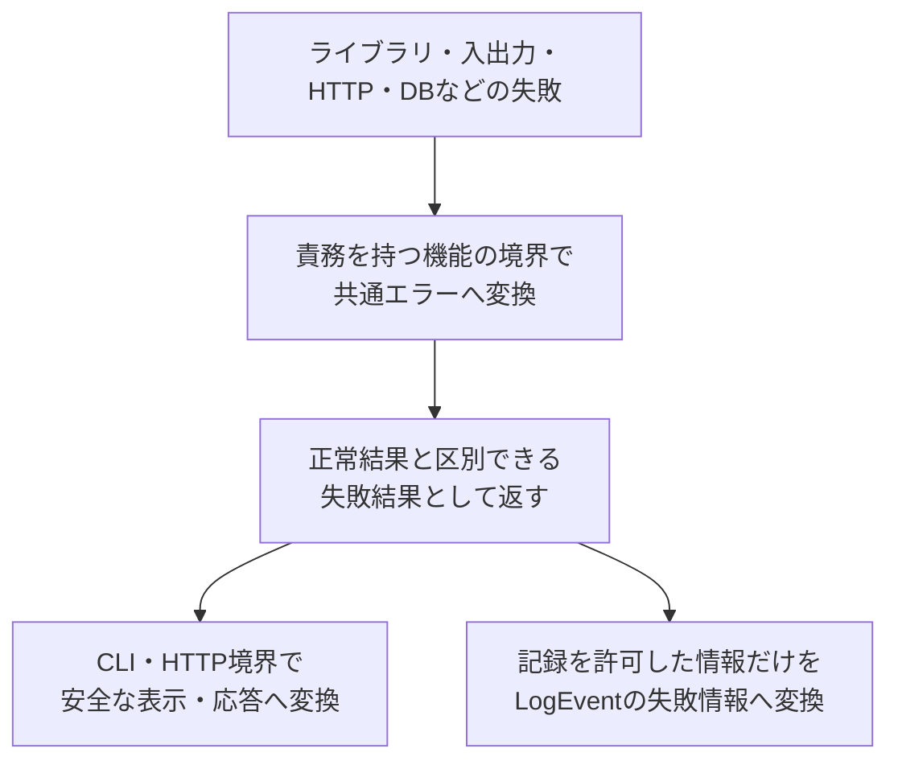

# エラー設計

> [!abstract] この文書の役割
> RAGScopeの各機能が失敗を同じ意味で表現し、**公開してよい情報と内部原因を分離するための共通エラー契約**を定義する。
>
> 機能固有のエラーコード、許可する`context`、CLI・HTTPの正確な表現、再試行方針は、それぞれの機能設計と機械可読な正本へ委ねる。

## 1. 共通エラーの構造

共通エラーは、以下の5項目から構成する。

| 項目 | 例 | 意味・役割 | CLI・HTTPなど外部への公開 | 構造化ログへの記録 |
|---|---|---|---|---|
| `category` | `dependency` | 失敗の大まかな種類 | 公開してよい | 記録する |
| `code` | `model.unavailable` | 判定・検索に使用する安定した識別子 | 公開してよい | 記録する |
| `message` | `The model is unavailable.` | 利用者へ見せてもよい安全な説明 | 公開してよい | 記録する |
| `context` | `{"model_id": "example"}` | 調査や判断に使う安全な補助情報 | 許可した項目のみ | 許可した項目のみ |
| `cause` | 元の外部サービスエラー | 元の技術的な例外 | 公開しない | 記録しない |

> [!important] `cause`の隠蔽ルール
> `cause`、元の例外メッセージ、スタックトレースは、利用者表示、HTTPレスポンス、構造化ログへ渡さない。外部へ渡す説明は、安全な`message`として明示的に作成する。

構造化ログへ記録するエラー情報の意味は[構造化ログ設計](./structured-logging/構造化ログ設計.md)、JSON上の正確な項目、型、必須条件は[`log-event.schema.json`](../../contracts/logging/v1/log-event.schema.json)を正本とする。

## 2. エラー分類とコード体系

### 2.1 エラー分類（`category`）

| `category` | 意味 |
|---|---|
| `input` | 入力内容や指定方法に問題がある |
| `resource` | 必要なファイルなどの資源を利用できない |
| `data` | 読み込んだデータが壊れている、または整合しない |
| `dependency` | 外部サービス、DB、モデルなどの依存先が失敗した |
| `timeout` | 決められた時間内に処理が完了しなかった |
| `internal` | 上記では表せない、RAGScope内部の予期しない失敗 |

`category`は失敗の性質を表す。`category`だけから、ログレベル、HTTPステータス、CLI終了コード、再試行可否を決定しない。

### 2.2 エラーコード（`code`）

`code`は`<domain>.<reason>`形式とし、各要素には小文字ASCII、数字、アンダースコアを使用する。

```text
document.not_found
model.unavailable
```

機能処理から任意の文字列を共通エラーへ渡せる形にせず、各機能で定義した閉じた型から外部表現へ変換する。具体的なコード、失敗条件、許可する`context`は各機能設計とコードを正本とする。

## 3. エラーの変換と受け渡し

下位の例外はそのまま上位へ流さず、責務を持つ機能の境界で共通エラーへ変換する。



- 正常結果と失敗結果は、型または明示的な結果によって区別できる形にする。
- 共通エラーは失敗の意味を保持する値であり、自分ではログを出力しない。
- 同じ失敗を下位関数と呼び出し元で重複して記録せず、各機能設計で定めた処理結果の確定境界で必要な失敗イベントを1回記録する。

### 3.1 機能処理と必須ログ記録の結果合成

機能処理の結果と、その結果を記録する必須ログ処理の結果は、独立した事実として扱う。機能処理の成否にかかわらず必須ログ記録を1回試行した後、両方の結果をアプリケーション実行結果へ解釈する。

- 機能処理が成功しても必須ログ記録が失敗した場合は、アプリケーション実行を失敗とする。
- 機能処理と必須ログ記録の両方が失敗した場合は、元の共通エラーとログ基盤の失敗を両方保持し、元の共通エラーを上書きしない。
- ログ基盤の失敗を、失敗した同じログ経路へ再帰的に記録しない。

正確な型と実行順序は[`RAGScope.Execution.Result`](../../ragscope-app/src/RAGScope/Execution/Result.hs)と[`RAGScope.Execution.Observation`](../../ragscope-app/src/RAGScope/Execution/Observation.hs)を正本とする。

## 4. 責務分担

| 定義・実装する場所 | 担当する内容 |
|---|---|
| 本設計 | 共通エラー5項目の意味、公開境界、共通規則 |
| 各機能設計 | 機能固有の失敗条件、エラーコード、許可する`context`、変換・記録境界、再試行方針 |
| 各コンポーネントのコード | 正確なエラー型、コンストラクタ、下位例外の捕捉・変換 |
| [構造化ログ設計](./structured-logging/構造化ログ設計.md) | LogEventへ記録する安全なエラー情報の意味と失敗イベントの不変条件 |
| [構造化ログJSON表現設計](./structured-logging/構造化ログJSON表現設計.md)・JSON Schema | LogEventのエラー情報をJSONへ表現する規則と正確な外部契約 |
| アプリケーション実行境界 | 機能処理結果と必須ログ記録結果の合成、元の共通エラーの保持 |
| CLI・API設計 | 終了コード、表示形式、HTTPレスポンスとステータス |
