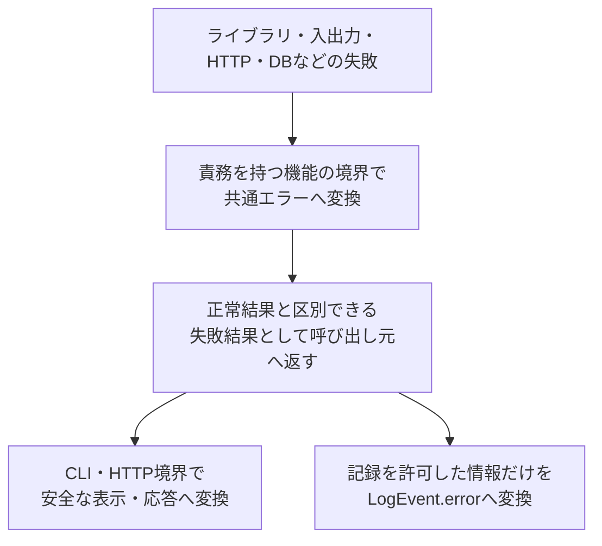

# エラー設計

> [!abstract] この文書の役割
> RAGScopeの各機能が失敗を同じ意味で表現し、公開してよい情報と内部原因を分離するための共通エラー契約を定義する。
>
> 機能固有のエラーコード、CLI・HTTPの正確な表現、再試行方針は、それぞれの機能設計と機械可読な正本へ委ねる。

## 1. 共通エラーの形

### 1.1 代表的な共通エラー

共通エラーは、RAGScopeの処理が失敗したときに、その失敗の意味を保持する内部の値である。コンポーネントごとに実装言語に適した型を持つが、次の5項目の意味を共有する。次は型名や構文を固定しない概念例である。

```text
共通エラー
├── category: resource
├── code: document.file_not_found
├── message: 対象文書を見つけられない
├── cause: <元の入出力エラー。内部だけで保持する>
└── context: {}
```

この例は、[文書処理設計](./文書処理設計.md)で定義する「固定Markdownファイルが存在しない」失敗を表している。

> [!note] 共通エラー自体はJSONではない
> 共通エラーは、各コンポーネントのコード内部で失敗を表す値であり、共通のJSON形式を定義するものではない。
>
> 構造化ログへ記録するときは、安全に記録できる項目だけを`LogEvent.error`のJSONへ変換する。CLI・HTTPへ返す正確な形式も、それぞれの境界で別に定義する。

### 1.2 共通エラーが持つ5項目

ここで示す5項目は、コンポーネント間で共有する意味の区分である。具体的な型での必須・任意や表現は、各コンポーネントのコードを正本とする。

| 項目 | 例 | 意味 | CLI・HTTPなど外部への公開 | 構造化ログへの記録 |
|---|---|---|---|---|
| エラー分類（`category`） | `resource` | 失敗の大まかな種類 | 公開してよい | 記録する |
| エラーコード（`code`） | `document.file_not_found` | 判定・検索に使用する安定した識別子 | 公開してよい | 記録する |
| メッセージ（`message`） | 対象文書を見つけられない | 利用者へ見せてもよい説明 | 公開してよい | 記録する |
| 内部原因（`cause`） | 元の入出力エラー | 元の例外や下位エラー | 公開しない | 記録しない |
| 補助情報（`context`） | `{}` | 調査や判断に使う安全な情報 | エラーコードごとに許可した項目だけ公開する | エラーコードごとに許可した項目だけ記録する |

> [!important] 内部原因を境界の外へ出さない
> `cause`、元の例外メッセージ、スタックトレースを、利用者表示、HTTPレスポンス、`LogEvent`へ渡さない。外部へ渡す説明は、安全な`message`として明示的に作成する。

### 1.3 `category`

| `category` | 意味 |
|---|---|
| `input` | 入力内容や指定方法に問題がある |
| `resource` | 必要なファイルなどの資源を利用できない |
| `data` | 読み込んだデータが壊れている、または整合しない |
| `dependency` | 外部サービス、DB、モデルなどの依存先が失敗した |
| `timeout` | 決められた時間内に処理が完了しなかった |
| `internal` | 上記では表せない、RAGScope内部の予期しない失敗 |

各機能は、失敗の性質に最も近い共通分類を選ぶ。新しい分類を追加する前に、既存分類で表せない理由と、契約を利用するすべてのコンポーネントへの影響を確認する。

`category`は失敗の種類を表す。`category`だけから、ログレベル、HTTPステータス、CLI終了コード、再試行可否を決定しない。

### 1.4 `code`

`code`は次の形式とする。

```text
<domain>.<reason>
```

各要素には小文字ASCII、数字、アンダースコアを使用する。可変値、ライブラリ名、例外クラス名を埋め込まない。

具体的なエラーコード、そのコードを使用する失敗条件、許可する`context`は、各機能設計とコードを正本とする。共通エラー設計へすべての機能のコード一覧を集約しない。

> [!important] エラーコードを自由入力させない
> 機能処理から任意の文字列を共通エラーへ渡せる形にしない。機能ごとの閉じた型から外部表現へ変換する処理を1か所へ集める。

識別子を追加または変更するときは、次を確認する。

1. 既存の識別子では表せないか
2. どの失敗で使用するか
3. どの文字列として外部へ表現するか
4. 期待した文字列になることをテストしているか

保存済みまたは外部へ公開済みのコードへ、後から別の意味を割り当てない。

### 1.5 `message`、`cause`、`context`

| 項目 | 規則 |
|---|---|
| `message` | 利用者へ見せてもよい説明だけを書く。元の例外メッセージを自動的に付け足さない |
| `cause` | 元の例外や下位エラーを内部で保持する。利用者表示、HTTPレスポンス、`LogEvent`へ出さない |
| `context` | エラーコードごとに事前に許可した安全な値だけを入れる。何でも入れられる連想配列を機能処理へ公開しない |

安全性を確認できない値は、一部を伏せ字にするより項目自体を省略する。

## 2. 境界ごとの利用

### 2.1 共通エラーから各境界へ渡す情報

| 利用先 | 使用する情報 | 使用しない情報 | 正確な形式の正本 |
|---|---|---|---|
| 各機能の呼び出し元 | 共通エラー全体 | なし | 各コンポーネントのコード |
| RAGScope CLI | 公開を許可した`category`、`code`、`message`、`context` | `cause`、元の例外メッセージ、スタックトレース | RAGScope CLIのコード |
| HTTP境界 | 公開を許可した`category`、`code`、`message`、`context` | `cause`、元の例外メッセージ、スタックトレース | API設計・OpenAPI |
| 構造化ログ | `category`、`code`、`message`、記録を許可した`context` | `cause`、元の例外メッセージ、スタックトレース | [構造化ログ設計](./構造化ログ設計.md)とJSON Schema |

共通エラーは失敗の意味を保持する値であり、自分ではログを出力しない。具体的な記録境界と観測点は、各機能設計を正本とする。

### 2.2 下位の失敗を共通エラーへ変換する境界



| 境界 | 行うこと |
|---|---|
| 機能の例外変換境界 | 下位エラーや例外を、機能固有の共通エラーへ変換する |
| 処理結果を確定する境界 | 正常結果と失敗結果を確定し、同じ失敗を表すログイベントを必要な場合に1回記録する |
| CLI境界 | 公開可能な情報から終了状態と利用者向け表示を作る |
| HTTP境界 | 公開可能な情報から安全なレスポンスを作る。正確な形とステータスはOpenAPIを正本とする |
| 構造化ログ境界 | `category`、`code`、`message`、記録を許可した`context`だけを`LogEvent.error`へ渡す |

## 3. エラーを作成・受け渡す規則

### 3.1 下位例外をそのまま流さない

下位ライブラリや実行環境の例外は、責務を持つ機能の境界で共通エラーへ変換する。例外クラスやメッセージへ上位処理が直接依存しないようにする。

### 3.2 正常結果と失敗結果を明示的に区別する

呼び出し元は、型または明示的な結果によって成功と失敗を区別できる必要がある。部分的な値や空の値を、失敗を隠した正常結果として返さない。

### 3.3 同じ失敗を重複して記録しない

下位関数、共通エラー、呼び出し元の各層で同じ失敗を繰り返し記録しない。各機能設計で定義した処理結果の確定境界が、失敗イベントを1回記録する。

### 3.4 公開済みの意味を互換性なく変更しない

`category`、`code`の形式、`message`・`cause`・`context`の意味、公開範囲を変更するときは、契約を利用するすべてのコンポーネント、構造化ログ契約、OpenAPI、保存済みデータへの影響を確認する。

## 4. 利用側との責務分担

| 定義・実装する場所 | 担当する内容 |
|---|---|
| 共通エラー設計 | `category`、`code`、`message`、`cause`、`context`の意味、公開境界、共通規則 |
| 各機能設計 | 機能固有の失敗条件、具体的なエラーコード、許可する`context`、変換・記録境界、再試行方針 |
| 各コンポーネントのコード | エラー型、コンストラクタ、下位例外の捕捉と変換、閉じた識別子、テスト |
| RAGScope CLI | 終了コード、安全な表示文、表示形式 |
| API設計・OpenAPI | HTTPレスポンス本文、ステータス、正確なスキーマ |
| 構造化ログ設計 | `LogEvent.error`の構造、失敗イベントの必須条件、出力規則 |
| 実験管理の設計・migration | エラーや処理状態を永続化する時点で、実験状態との対応と保存形式を定義する |

RAGScopeアプリケーションとAI推論サービスは同じ共通エラーの意味を利用するが、型と例外変換は各コンポーネントで個別に実装する。一方のコンポーネントが、もう一方のエラー実装へ依存しない。

### 4.1 再試行との境界

共通エラーへ、処理種別をまたいで使用する単一の`retryable`判定を持たせない。

同じ`category`や`code`で表される失敗でも、副作用、部分成功、冪等性、再実行の安全性、一時的な失敗かどうかによって、再試行できるかは処理ごとに変わる。共通エラーは判断材料となる失敗の意味を保持し、再試行可否、再試行回数、待ち時間、タイムアウト値、実行制御は、具体的な処理を定義する各機能設計が決定する。

## 5. 機械可読な正本

| 正確に定義する内容 | 正本 |
|---|---|
| エラー型、コンストラクタ、下位例外の捕捉と変換 | 各コンポーネントのコード |
| `LogEvent.error`のJSON項目、型、必須条件 | [`log-event.schema.json`](../../contracts/logging/v1/log-event.schema.json) |
| HTTPで受け渡すエラーの形 | OpenAPI |
| 具体的なテストケース | 各コンポーネントのテストコード |

Markdownでは、機械可読な定義を複製せず、意味、責務、公開境界、変更後も維持する規則を定義する。

## 関連文書

- [RAGScope要求定義「3.3 信頼性と保守性」](<../RAGScope要求定義.md#3.3 信頼性と保守性>)
- [システムアーキテクチャ「3.4 共通実行基盤の責務境界」](<./システムアーキテクチャ.md#3.4 共通実行基盤の責務境界>)
- [ADR-0002 — 共通実行基盤の契約とコンポーネント実装を分離する](<../adr/ADR-0002 共通実行基盤の契約とコンポーネント実装を分離する.md>)
- [構造化ログ設計](./構造化ログ設計.md)
