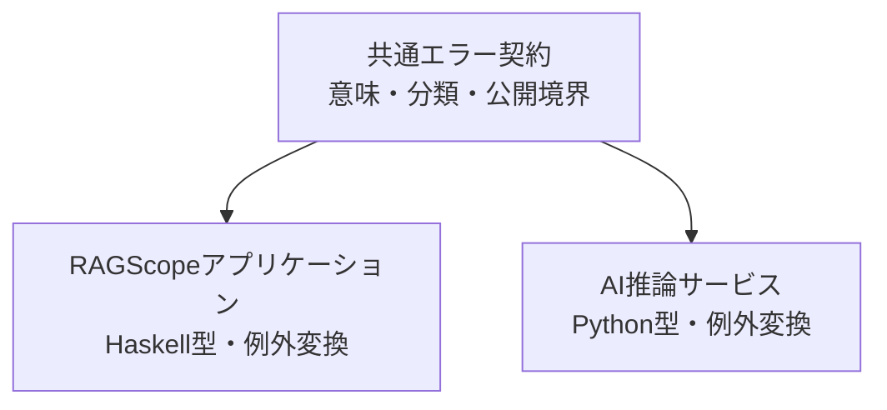
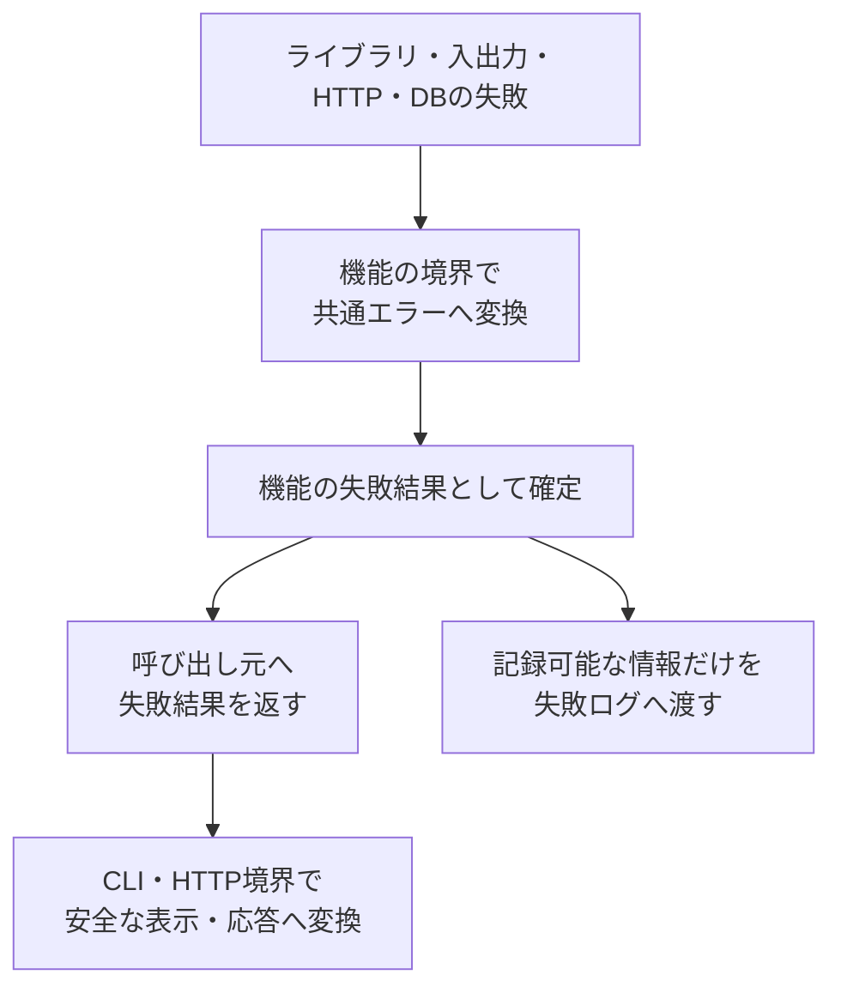

# エラー設計

> [!abstract] この文書の役割
> RAGScopeで発生した失敗を、正常結果と区別して一貫して扱うための共通エラー設計を説明する。
>
> 共通エラーが持つ意味、公開情報と内部原因の境界、機能固有のエラーとの分担、CLI・HTTP・構造化ログへ受け渡す際の規則を扱う。

## 1. 目的と適用範囲

### 1.1 目的

RAGScopeでは、文書読み込み、AI推論サービスとの通信、PostgreSQLへの保存など、複数の処理で異なる種類の失敗が発生する。

この設計は、下位ライブラリや実行環境の例外をそのまま外部へ流さず、利用者と呼び出し元が判断できる安定した失敗として表現するための共通原則を定める。

### 1.2 適用範囲

| この設計で決めること | 各機能または別の設計で決めること |
|---|---|
| 共通エラーが持つ情報と意味 | 機能ごとの具体的なエラーコード（`code`） |
| エラー分類（`category`） | 各失敗をどの分類とコードへ対応付けるか |
| 公開可能な情報と内部原因の境界 | CLIの終了コードと表示文 |
| 例外を共通エラーへ変換する境界 | HTTPレスポンスの正確な形とステータス |
| 構造化ログへ渡してよいエラー情報 | 再試行回数、待ち時間、タイムアウト値 |

v0.0では、RAGScopeアプリケーションとAI推論サービスが同じ共通エラーの意味を利用する。正確な型と例外変換は、各コンポーネントのコードで個別に実装する。

### 1.3 この設計を利用する作業

- [RS-0014 共通エラーと構造化ログを設計する](<../project-management/milestones/v0.0/error-logging/RS-0014 共通エラーと構造化ログを設計する.md>)
- [RS-0015 RAGScopeアプリケーションの共通エラー・構造化ログ基盤を実装する](<../project-management/milestones/v0.0/error-logging/RS-0015 RAGScopeアプリケーションの共通エラー・構造化ログ基盤を実装する.md>)
- [RS-0018 AI推論サービスの共通エラー・構造化ログ基盤を実装する](<../project-management/milestones/v0.0/error-logging/RS-0018 AI推論サービスの共通エラー・構造化ログ基盤を実装する.md>)

## 2. 関連する要求と上位設計

### 2.1 要求

[RAGScope要求定義「3.3 信頼性と保守性」](<../RAGScope要求定義.md#3.3 信頼性と保守性>)のうち、次の範囲を担当する。

- 正常結果と失敗を区別する
- 主要な異常系を検証できるようにする
- 内部情報を不用意に外部へ公開しない

### 2.2 上位設計

| 参照先 | この設計が従う内容 |
|---|---|
| [システムアーキテクチャ「1.4 共通データ表現」](<./システムアーキテクチャ.md#1.4 共通データ表現>) | コンポーネント間で共有するデータ表現 |
| [システムアーキテクチャ「3.4 共通実行基盤の責務境界」](<./システムアーキテクチャ.md#3.4 共通実行基盤の責務境界>) | エラー、ログ、実行制御の責務分離 |
| [ADR-0002](<../adr/ADR-0002 共通実行基盤の契約とコンポーネント実装を分離する.md>) | 共通契約とコンポーネント実装の分離 |
| [構造化ログ設計](./構造化ログ設計.md) | 失敗をログイベントとして記録する境界と、`LogEvent.error`へ格納する規則 |

### 2.3 関連するプロジェクト管理文書

- [v0.0 — 最小のdense検索を実行できる](<../project-management/milestones/v0.0/v0.0.md>)
- [v0.0 共通エラーと構造化ログによる実行追跡](<../project-management/milestones/v0.0/error-logging/v0.0 共通エラーと構造化ログによる実行追跡.md>)

## 3. 責務と境界

### 3.1 担当する責務

この設計では、次を決める。

1. 失敗の意味を共通エラーとして保持する方法
2. 利用者へ見せてよい情報と内部だけに保持する情報
3. 下位の例外を共通エラーへ変換する境界
4. CLI、HTTP、構造化ログへ失敗情報を受け渡すときの共通原則

### 3.2 共通契約とコンポーネント実装

| 共通契約で揃える | 各コンポーネントで実装する |
|---|---|
| `category`、`code`、`message`、`cause`、`context`が表す意味 | エラー型とコンストラクタ |
| 公開情報と内部原因の境界 | ライブラリや実行環境の例外変換 |
| エラーコードの命名形式 | CLI・HTTP境界への具体的な変換処理 |
| 再試行判断を共通エラーだけで決めない原則 | 機能固有のエラーコードと補助情報の閉じた型 |

一方のコンポーネントが、もう一方のエラー実装へ依存する構成にはしない。

### 3.3 対象外

| 対象外 | 決定する場所・時期 |
|---|---|
| 機能ごとの具体的なエラーコードと失敗条件 | 各機能設計とコード |
| CLIの終了コードと正確な表示文 | CLI設計とコード |
| HTTPエラーレスポンスとステータス | API設計とOpenAPI |
| 再試行回数、待ち時間、タイムアウト値 | 処理種別ごとの機能設計 |
| エラーの永続化と実験状態 | 実験管理の設計 |

### 3.4 機械可読な定義を正本とする事項

| 正確に定義する内容 | 正本 |
|---|---|
| エラー型、コンストラクタ、例外の捕捉と変換 | 各コンポーネントのコード |
| `LogEvent.error`のJSON項目、型、必須条件 | [`log-event.schema.json`](../../contracts/logging/v1/log-event.schema.json) |
| HTTPで受け渡すエラーの形 | OpenAPI |
| 具体的なテストケース | 各コンポーネントのテストコード |

Markdownでは、機械可読な定義を複製せず、意味、責務、公開境界、変更時に維持する規則を定義する。

## 4. 基本設計

### 4.1 失敗が処理されるまで

下位のライブラリや入出力処理で発生した例外を、そのまま利用者表示、HTTPレスポンス、構造化ログへ流さない。

### 4.2 共通エラーが持つ情報

| 項目 | 役割 | 外部へ公開するか |
|---|---|---|
| エラー分類（`category`） | エラーの大まかな種類 | 公開してよい |
| エラーコード（`code`） | 判定や検索に使う安定した識別子 | 公開してよい |
| メッセージ（`message`） | 利用者へ見せてもよい説明 | 公開してよい |
| 内部原因（`cause`） | 元の例外や下位エラー | 公開しない |
| 補助情報（`context`） | 調査や判断に使う安全な情報 | エラーコードごとに許可した項目だけ公開する |

> [!important] 共通エラーは記録処理を持たない
> 共通エラーは失敗の意味を保持する値であり、自分ではログを出力しない。どの境界で失敗を記録するかは、各機能設計と[構造化ログ設計](./構造化ログ設計.md)で定める。

### 4.3 境界ごとの役割

| 境界 | 行うこと |
|---|---|
| 機能の例外変換境界 | 下位エラーや例外を、機能固有の共通エラーへ変換する |
| 処理結果を確定する境界 | 正常結果と失敗結果を確定し、呼び出し元へ返す |
| CLI境界 | 終了状態と安全な表示へ変換する |
| HTTP境界 | 安全なレスポンスへ変換する。正確な形はOpenAPIで決める |
| 構造化ログ境界 | `cause`を除き、記録を許可した情報だけを失敗イベントへ渡す |

## 5. 詳細設計

### 5.1 category

| `category` | 意味 |
|---|---|
| `input` | 入力内容や指定方法に問題がある |
| `resource` | 必要なファイルなどの資源を利用できない |
| `data` | 読み込んだデータが壊れている、または整合しない |
| `dependency` | 外部サービス、DB、モデルなどの依存先が失敗した |
| `timeout` | 決められた時間内に処理が完了しなかった |
| `internal` | 上記では表せない、RAGScope内部の予期しない失敗 |

エラー分類は失敗の種類を表す。処理への影響を表すログレベルとは別の概念であり、`category`だけからログレベルを決定しない。

### 5.2 code、message、cause、context

| 項目 | 規則 |
|---|---|
| `code` | `<domain>.<reason>`形式。小文字ASCII、数字、アンダースコアを使う |
| `message` | 利用者へ見せてもよい説明だけを書く |
| `cause` | 元の例外を内部で保持し、利用者表示、`LogEvent`、HTTPレスポンスへ出さない |
| `context` | エラーコードごとに許可した安全な値だけを入れる |

エラーコードへ可変値、ライブラリ名、例外クラス名を埋め込まない。元の例外メッセージやスタックトレースも`message`へ自動的に付け足さない。

具体的なエラーコードと、そのコードで許可する`context`は、各機能設計とコードで定義する。検証用データに含まれるコードは代表例であり、正式な一覧ではない。

### 5.3 識別子を自由入力させない

エラーコードは機能ごとの閉じた型として定義する。Haskellでは列挙型や直和型、Pythonでは`Enum`や`Literal`などを使用できる。

> [!important] 生の文字列を渡さない
> 機能処理から、任意のエラーコードを共通エラーへ渡せる形にはしない。正式な値から文字列への変換は1か所へ集める。

識別子を追加するときは、次を確認する。

1. 既存の識別子では表せないか
2. どの失敗で使用するか
3. どの文字列として外部へ表現するか
4. 期待した文字列になることをテストしているか

同じ意味の別名を増やさず、既存の識別子へ後から別の意味を割り当てない。

### 5.4 再試行との境界

> [!important] 再試行はエラー分類だけで決めない
> 共通エラーへ、処理種別をまたぐ単純な`retryable`判定を持たせない。

再試行するかどうかは、副作用、再実行しても安全か、途中まで成功していないか、一時的な失敗かなど、処理種別ごとの機能設計で判断する。共通エラーは、その判断に必要な失敗の意味を保持するが、実行制御自体は行わない。

### 5.5 構造化ログとの境界

失敗を表すログイベントでは、共通エラーのうち次の情報だけを`LogEvent.error`へ渡す。

- `category`
- `code`
- `message`
- 記録を許可した`context`

`cause`、元の例外メッセージ、スタックトレースはログへ渡さない。

同じ失敗を複数の処理層で重複して記録しない。具体的な記録境界、`operation`、ログイベントの観測点、イベント固有情報は各機能設計を正本とし、共通の出力規則は[構造化ログ設計](./構造化ログ設計.md)を正本とする。

### 5.6 HTTPと利用者向け表示の境界

| 内容 | この設計で共有する | 別の設計で決める |
|---|---|---|
| 共通エラー | エラー分類、コード、安全なメッセージの意味 | 機能ごとの具体的な失敗との対応 |
| CLI | 公開可能な情報だけを使用する原則 | 終了コード、表示文、表示形式 |
| HTTP | 公開可能なエラー情報の意味 | レスポンス本文、ステータス、OpenAPIスキーマ |

## 6. テスト観点

| 対象 | 確認すること |
|---|---|
| 正常結果との区別 | 呼び出し元が成功と失敗を型または明示的な結果として区別できる |
| 例外変換 | 下位の例外を機能固有の共通エラーへ変換できる |
| エラー分類 | 各失敗が定義した`category`へ対応する |
| エラーコード | 任意の文字列を呼び出し側から渡せず、正式な値だけを使用できる |
| 公開情報 | `category`、`code`、安全な`message`、許可した`context`だけを外部へ渡す |
| 内部原因 | `cause`、元の例外メッセージ、スタックトレースを公開しない |
| 構造化ログ | 失敗イベントへ記録可能な情報だけを渡し、同じ失敗を重複して記録しない |
| 再試行 | 共通エラーの分類だけで再試行を決定しない |

具体的なテストケースは各コンポーネントのテストコードを正本とする。

## 7. 将来設計との境界

- HTTP APIを具体化する時点で、エラーレスポンスとステータスをOpenAPIで定義する。
- 実験状態を永続化する時点で、処理失敗と実験状態の対応を設計する。
- 新しい失敗分類が必要になった場合は、既存分類で表せない理由と、すべての利用コンポーネントへの影響を確認する。

将来必要になりそうな情報を先回りして共通エラーへ追加せず、具体的な利用方法が決まったMilestoneで設計する。

## 8. 変更時の注意

> [!warning] 共通エラー契約の変更は複数コンポーネントへ影響する
> `category`、エラーコードの形式、公開範囲、`message`・`cause`・`context`の意味を変更するときは、契約を利用するすべてのコンポーネントを確認する。

変更時に確認する正本を次に示す。

- システムアーキテクチャ
- ADR-0002
- 各機能設計
- 構造化ログ設計とJSON Schema
- OpenAPI
- 各コンポーネントの型とテスト

保存済みまたは外部へ公開済みのエラーコードへ、後から別の意味を割り当てない。
