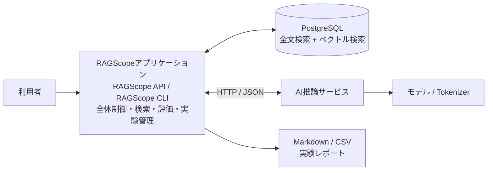
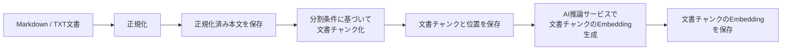
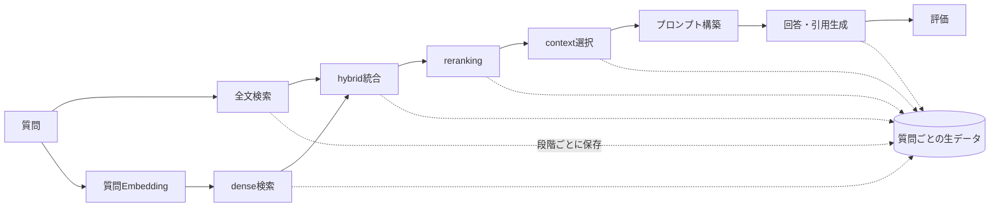
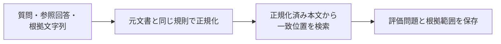

# システムアーキテクチャ

> [!abstract] この文書の役割
> RAGScope全体のコンポーネント構成、責務、依存方向、通信、主要な処理・データフロー、配置・実行環境の基本方針を定義する。
>
> 満たすべき内容は[RAGScope要求定義](../RAGScope要求定義.md)、目的と価値は[RAGScope概要](../RAGScope概要.md)、段階的な実現計画は[ロードマップ](../project-management/ロードマップ.md)を正本とする。

## 1. 設計方針

RAGScopeは、システム全体の制御、AIモデルに依存する計算、永続化を分離する。

| 設計上の観点 | 採用する方針 |
|---|---|
| システム全体の制御 | RAGScopeアプリケーションを司令塔とし、文書、検索、評価、実験の流れを制御する。Haskellで実装する。 |
| AI推論 | AI推論サービスがモデルとTokenizerを利用する計算を担当する。Pythonで実装する。 |
| 永続化と検索 | PostgreSQLを、文書、検索用データ、評価データ、実験条件、実行結果の永続化と検索に使用する。 |
| コンポーネント間通信 | RAGScopeアプリケーションとAI推論サービスはHTTP / JSONで通信する。 |
| 実行環境 | ローカル実行可能性を維持しつつ、AWSへの配置も必須の到達点とする。主要3コンポーネントは独立した実行単位として扱う。 |
| 共通エラー・ログ | エラーとログの意味をコンポーネント間で共有し、構造化ログのv1外部表現は共通JSON契約として定義する。型・例外変換・ログ受付・出力処理は各コンポーネントで実装する。 |
| 再試行・タイムアウト | ログとは別の実行制御とし、一時的な失敗で、同じ処理を繰り返しても安全な場合だけ適用する。 |
| 正確な仕様 | 型、DBスキーマ、APIスキーマ、JSON契約、CLIオプション、テストケースはコードや専用の機械可読な定義を正本とする。 |

> [!important] 最上位の責務分離
> RAGScopeアプリケーションは処理順序とデータ整合性を管理し、AI推論サービスはモデル依存の計算に責務を限定する。AIモデルの変更を、システム全体の制御や永続化へ波及させない。

### 1.1 RAGScope固有の正式用語

RAGScope固有の正式用語と概念間の基本関係は、[RAGScope用語集](../RAGScope用語集.md)を正本とする。本書では用語集で定義した名称を使用し、同じ用語を別の意味で再定義しない。

### 1.2 検索処理の段階と用語

検索、全文検索、dense検索、hybrid検索、`reranking`、検索結果、回答生成用文書チャンク選択など、検索と回答生成にまたがる用語の意味は[RAGScope用語集](../RAGScope用語集.md)を正本とする。

本書では、それらの概念をシステム全体の構成、責務、処理・データフローの説明に使用する。正確な処理段階の識別子と保存形式は、対応する機能設計、コード、migrationなどを正本とする。

### 1.3 モデル利用方針

学習済み重みを利用できるモデルを`open-weight model`、利用者が管理する環境で動かすモデルを`self-hosted model`と呼び、両者を同義として扱わない。

RAGScopeでは、学習済み重みを利用できるモデルを利用者が管理する環境で動かす構成を基本対象とする。具体的なモデルと実行方式は、必要なMilestone、機能設計、Experimentで決定する。

### 1.4 共通データ表現

| 対象 | 共通原則 |
|---|---|
| 識別子 | 意味、生成主体、形式を定義元で一度だけ定め、利用側で再定義しない。 |
| 時刻 | JSONではUTCのRFC 3339形式を使用し、秒未満はミリ秒3桁、末尾は`Z`とする。 |
| 所要時間 | 単調時計で計測し、`duration_ms`のように項目名へ単位を含める。 |
| JSON | UTF-8を使用し、項目名と列挙値は小文字の`snake_case`とする。値がない任意項目は原則として省略する。 |
| 互換性 | 保存・通信される契約を互換性なく変更する場合は契約のバージョンを更新し、既存の項目や識別子へ異なる意味を割り当てない。 |

`execution_id`と`event_id`はUUIDv4とする。永続IDの方式は保存・検索要件を具体化するデータモデル設計で決定する。

正確なJSON項目・型・必須条件はJSON Schema、HTTP契約はOpenAPI、DB制約はmigration、コード上の制約は型とテストを正本とする。

## 2. 全体構成



| 構成要素 | 主な責務 |
|---|---|
| RAGScopeアプリケーション | 利用者向けインターフェース、処理全体の制御、データ管理、検索、評価、実験管理、レポート生成。 |
| AI推論サービス | モデルとTokenizerの読み込み、Embedding生成、`reranking`、回答生成、トークン数計測などのモデル依存処理。 |
| PostgreSQL | 文書、検索用データ、評価データ、実験条件、実行結果の永続化、全文検索、ベクトル検索。 |
| Markdown / CSVレポート | 保存済みの実験結果を人が確認・比較できる形へ出力した成果物。 |

## 3. コンポーネントの責務

### 3.1 RAGScopeアプリケーションの責務境界

RAGScopeアプリケーションは、処理順序とデータ整合性を管理する。

**担当する**

- 文書の取り込みから検索準備までの制御
- 質問ごとの検索段階、`context`選択、プロンプト構築、回答生成段階の制御
- 実験条件、設定、処理結果の関連付け
- 検索結果と`context`を区別した保存
- 保存済みの生データからの評価指標集計
- AI推論サービスやPostgreSQLとの境界で発生する失敗と実行制御の取り扱い

**担当しない**

- モデル固有の読み込み方法や推論実装
- AIライブラリ固有の例外処理
- モデルやTokenizerへ直接依存する計算
- AI推論サービス内部の起動・停止などの状態管理
- 機能処理から標準エラー出力やCloudWatchなど具体的なログ出力先へ直接書き込むこと

### 3.2 AI推論サービスの責務境界

AI推論サービスは、AIモデルとAIライブラリに依存する計算を提供する。

- 文書チャンクのEmbeddingと質問Embeddingを生成する。
- 検索候補を`reranking`する。
- プロンプトと`context`から回答と引用を生成する。
- Tokenizerに基づいてトークン数を計測する。
- モデルの識別情報、利用可能状態、モデル固有の推論パラメータを扱う。
- 文書、実験、評価問題を永続化せず、PostgreSQLへ直接アクセスしない。
- RAG処理全体のワークフローを制御しない。

### 3.3 PostgreSQLの責務境界

PostgreSQLは、比較と追跡に必要な文書、検索用データ、評価データ、実験条件、質問ごとの生データ、評価結果を永続化し、全文検索とベクトル検索を提供する。

正確なテーブル、カラム、制約はmigrationを正本とする。

### 3.4 共通実行基盤の責務境界

| 関心事 | システム全体の原則 | 詳細の正本 |
|---|---|---|
| 共通エラー | 失敗の意味と公開可能な情報を共有し、コンポーネントごとの下位例外を境界で共通エラーへ変換する。 | [エラー設計](./エラー設計.md) |
| 構造化ログ | ログイベントの意味を共有し、コンポーネント固有実装と外部表現を別の責務として扱う。v1の外部表現は共通JSON契約に従う。 | [構造化ログ設計](./structured-logging/構造化ログ設計.md)、[構造化ログJSON表現設計](./structured-logging/構造化ログJSON表現設計.md)、[JSON Schema](../../contracts/logging/v1/log-event.schema.json) |
| 同じ実行の関連付け | 1回のCLIコマンドでは同じ`execution_id`を使用し、AI推論サービスとの通信でも引き継ぐ。別のCLIコマンドは別の実行として扱う。 | [構造化ログ設計](./structured-logging/構造化ログ設計.md)、API設計、OpenAPI |
| 再試行・タイムアウト | ログとは別の実行制御とし、適用条件・回数・時間は処理ごとの設計で決める。 | 各機能設計、コード、テスト |

機能処理は、標準エラー出力やCloudWatchなどの具体的なログ出力先へ直接依存しない。ログ基盤は、再試行するかどうかや回数を決定しない。

共通契約とコンポーネント固有実装を分離する判断は、[ADR-0002](<../adr/ADR-0002 共通実行基盤の契約とコンポーネント実装を分離する.md>)を参照する。

## 4. 依存方向

- RAGScope API / RAGScope CLIは、RAGScopeアプリケーションの処理を呼び出す。
- RAGScopeアプリケーションは、PostgreSQLの永続化・検索とAI推論サービスのモデル依存処理を利用する。
- AI推論サービスはモデル / Tokenizerを利用する。
- RAGScopeアプリケーションは保存済みの実験結果からレポートを生成する。

> [!warning] 禁止する依存
> - AI推論サービスからPostgreSQLへ直接アクセスしない。
> - PostgreSQLやAI推論サービスからRAGScopeアプリケーションの処理を起動しない。
> - 機能処理から標準エラー出力やCloudWatchなどの具体的なログ出力先へ直接依存しない。
> - ログ基盤に再試行・タイムアウトの判断を持たせない。

## 5. RAGScopeアプリケーションとAI推論サービスの通信

RAGScopeアプリケーションとAI推論サービスはHTTP / JSONで通信する。

| API | 主な用途 |
|---|---|
| `POST /embeddings` | 文書チャンクのEmbeddingと質問Embeddingを生成する。 |
| `POST /rerank` | 検索候補を再評価する。 |
| `POST /generate` | 回答と引用を生成する。 |
| `POST /token-count` | Tokenizerに基づくトークン数を確認する。 |
| `GET /models` | 使用中のモデル、モデルの版、能力を確認する。 |
| `GET /health` | プロセスの生存を確認する。 |
| `GET /ready` | 必要なモデルの読み込みが完了し、処理可能か確認する。 |

この文書ではAPIの役割とHTTP / JSONという境界だけを共有する。リクエスト・レスポンス、HTTPステータス、エラー表現、`execution_id`の受け渡し方法、タイムアウト値、再試行条件などの正確な契約は、各APIへ着手する段階で機能設計とOpenAPIを正本として定義する。

## 6. 文書取り込みの全体フロー



正規化、文書チャンク化、文書チャンクのEmbedding生成は、文書または分割条件を登録・更新したときに行い、質問処理のたびには実行しない。

各Milestoneで実装する範囲と具体的な処理規則は[文書処理設計](./文書処理設計.md)を正本とする。この図はRAGScope全体の到達形を示すものであり、すべての段階を同時に実装することを意味しない。

## 7. 質問と実験の全体フロー



全文検索とdense検索は独立した候補取得段階とし、hybrid検索、`reranking`、`context`選択をそれぞれ別の処理段階として保存・評価する。段階ごとに尺度が異なる順位やスコアを、同じ値として直接比較しない。

検索・統合・`reranking`の具体的な方式、`context`の選択上限、プロンプト形式、評価指標、保存スキーマは対応する機能設計と機械可読な正本へ委ねる。

## 8. 評価データ作成の全体フロー



評価問題の正解根拠は元文書内の位置として管理し、利用者が位置情報を手作業で数えなくても登録できるようにする。

同じ根拠文字列が複数箇所に存在する場合は曖昧なまま登録しない。エラーとするか利用者に対象位置を選択させるかは、評価データの機能設計で決定する。

## 9. 保存と再集計

実験では集計値だけでなく、各検索段階の結果、`context`、プロンプト、回答、引用、状態、処理時間など、評価と失敗分析に必要な質問ごとの生データを保存する。

```text
実験条件
  ↓
質問ごとの実行
  ↓
質問ごとの生データ
  ├─→ 質問単位の評価 ─→ 実験全体の集計
  └─→ 評価ロジック変更後の再集計
```

> [!important] 生データを残す
> 評価ロジックを変更した場合は、検索や回答生成を再実行せず、保存済みの生データから評価結果を計算し直せる構成とする。

具体的なデータ要素、関係、保存単位、制約はデータモデル設計とmigrationを正本とする。

## 10. 配置・実行環境

### 10.1 ローカル構成と実行単位

RAGScopeアプリケーション、AI推論サービス、PostgreSQLは、言語、依存、実行資源、更新理由が異なるため、独立した実行単位として扱う。

| 対象 | 実行環境の方針 |
|---|---|
| RAGScopeアプリケーション | Haskellのツールチェーンとアプリケーション依存を持つ。 |
| AI推論サービス | Python、AIライブラリ、モデル実行に必要な依存を持つ。 |
| PostgreSQL | 独立したデータベースサービスとして実行する。 |

ローカル開発では、RAGScopeアプリケーション用のDev ContainerへPython推論環境やPostgreSQLを同居させない。必要なMilestoneで別サービスとして追加し、コンポーネント間は本書で定めた境界を使用する。

Dev Containerは開発用環境であり、AWSへ配置するアプリケーション実行用イメージとは分離する。

正常なCLI結果は標準出力（stdout）、構造化ログは標準エラー出力（stderr）へ出力する。

### 10.2 AWS配置

AWSへの配置は必須の到達点とし、ローカルと同じコンポーネント責務・通信境界を維持する。

最初のAWS配置では、RAGScopeアプリケーションとAI推論サービスを別コンテナとして同じEC2上へ置く構成を選択肢に含め、PostgreSQLはRDSなどの独立した環境へ分離する。**正確な配置構成はv0.1.5の設計と検証で決定する。**

> [!warning] AWS構成を先に固定しない
> AWS配置は必須だが、検証結果を見ずにECS / Fargate、高可用構成、複数ノード構成などを採用構成として固定しない。実施時期と到達点は[ロードマップ](../project-management/ロードマップ.md)を正本とする。

## 11. 機能別設計との分担

| 設計対象 | 扱い |
|---|---|
| [文書処理設計](./文書処理設計.md) | 文書取り込み・チャンク化の現在設計の正本。 |
| [エラー設計](./エラー設計.md) | 共通エラー契約の現在設計の正本。 |
| [構造化ログ設計](./structured-logging/構造化ログ設計.md) | コンポーネント実装と外部表現から独立した、構造化ログの意味と不変条件の現在設計の正本。 |
| [RAGScopeアプリケーション構造化ログ設計](./structured-logging/RAGScopeアプリケーション構造化ログ設計.md) | 共通の構造化ログ設計をRAGScopeアプリケーションで成立させる現在設計の正本。 |
| [構造化ログJSON表現設計](./structured-logging/構造化ログJSON表現設計.md) | 共通の意味モデルをv1のJSONとして表現する現在設計の正本。 |
| データモデル設計 | データ要素の関係、不変条件、永続化単位が必要になった段階で作成する。 |
| 検索設計 | 全文検索、dense検索、hybrid検索、`reranking`、`context`選択を具体化する段階で作成する。 |
| 評価設計 | 評価データ、根拠範囲、評価指標を具体化する段階で作成する。 |
| API設計 | RAGScopeアプリケーションとAI推論サービスの正確なHTTP契約を具体化する段階で作成する。 |
| 再試行・タイムアウト設計 | 外部処理固有の実行制御を具体化する段階で、必要な機能設計として扱う。 |

必要になる前に機能別設計書や空の管理階層を先行作成しない。既存の設計書で責務を自然に扱える場合は、その文書を更新する。
