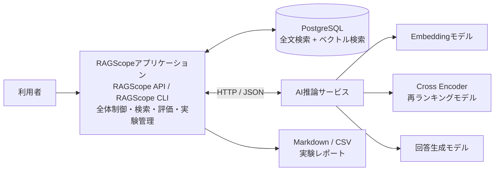
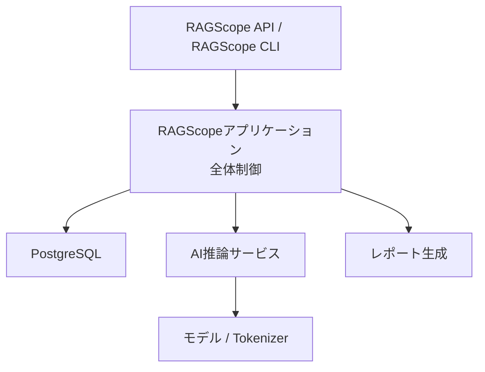
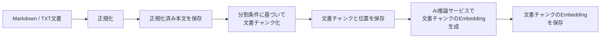
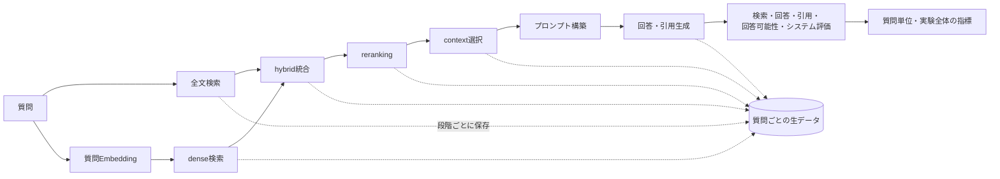
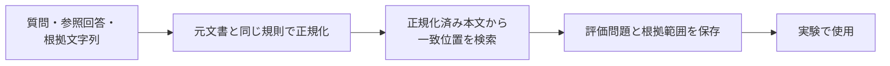
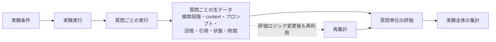

# システムアーキテクチャ

> [!abstract] この文書の役割
> RAGScopeのシステム全体について、コンポーネント構成、責務、依存方向、通信、主要な処理・データフロー、実行環境の基本方針を説明する。
>
> 満たすべき内容は[RAGScope要求定義](../RAGScope要求定義.md)、目的と価値は[RAGScope概要](../RAGScope概要.md)、段階的な実現計画は[ロードマップ](../project-management/ロードマップ.md)を参照する。

| 知りたいこと | 読む場所 |
|---|---|
| システムが何で構成されるか | [2. 全体構成](<#2. 全体構成>) |
| 各コンポーネントが何を担当するか | [3. コンポーネントの責務](<#3. コンポーネントの責務>) |
| 依存方向と通信境界 | [4. 依存方向](<#4. 依存方向>)、[5. RAGScopeアプリケーションとAI推論サービスの通信](<#5. RAGScopeアプリケーションとAI推論サービスの通信>) |
| 文書取り込み、質問、評価の流れ | [6. 文書取り込みの全体フロー](<#6. 文書取り込みの全体フロー>)〜[9. 保存と再集計](<#9. 保存と再集計>) |
| エラー、ログ、ID、再試行・タイムアウトの共通原則 | [1.4 共通データ表現](<#1.4 共通データ表現>)、[3.4 共通実行基盤の責務境界](<#3.4 共通実行基盤の責務境界>) |
| ローカル実行、実行単位、AWS配置の境界 | [10. 配置・実行環境](<#10. 配置・実行環境>) |
| 詳細設計をどこへ分けるか | [11. 機能別設計への分割](<#11. 機能別設計への分割>) |

## 1. 設計方針

RAGScopeは、システム全体の制御、AIモデルに依存する計算、永続化を分離する。

| 設計上の観点 | 採用する方針 |
|---|---|
| システム全体の制御 | RAGScopeアプリケーションをシステムの司令塔とし、文書、検索、評価、実験の流れを制御する。Haskellで実装する。 |
| AI推論 | AI推論サービスがモデルとTokenizerを利用する処理を担当する。Pythonで実装する。 |
| データの永続化と検索 | PostgreSQLを、文書、検索用データ、実験条件、実行結果の永続化と検索に使用する。 |
| コンポーネント間通信 | RAGScopeアプリケーションとAI推論サービスはHTTP / JSONで通信する。 |
| 実行環境 | ローカル実行可能性を維持しつつ、AWSへの配置も必須の到達点とする。RAGScopeアプリケーション、AI推論サービス、PostgreSQLは独立した実行単位として扱う。 |
| エラーとログ | エラーとログが表す意味、およびJSONに変換したときの項目構成をコンポーネント間で共有する。型、例外変換、JSON変換、ログ出力はコンポーネントごとに実装する。 |
| ログと出力先の分離 | ログへ記録する内容を出力先から分離し、同じログイベントを、ローカルでは標準エラー出力へ、AWSではCloudWatchなどの収集先へ渡せる構成にする。 |
| 再試行とタイムアウトの実行制御 | ログとは別の実行制御として扱い、一時的な失敗で、同じ処理を繰り返しても安全な場合にだけ適用する。具体的な利用箇所がない汎用的な実行機構は先行実装しない。 |
| 仕様の正本 | 型、DBスキーマ、APIスキーマ、CLIオプション、テストケースは、コード、migration、OpenAPI、`--help`、テストコードを正本とする。 |

> [!important] 最上位の責務分離
> RAGScopeアプリケーションは処理順序とデータ整合性を管理し、AI推論サービスはモデル依存の計算に責務を限定する。AIモデルの変更を、システム全体の制御や永続化へ波及させない。

### 1.1 RAGScope固有の正式用語

RAGScopeの文書で使用するコンポーネント名と、表記を統一する必要がある中核的な領域用語は、本節を正本とする。一般的なAI・LLM・RAG用語を網羅する用語集ではなく、RAGScope内で責務や対象が曖昧になり得る用語だけを定義する。

| 正式用語 | RAGScopeでの意味 | 表記上の扱い |
|---|---|---|
| RAGScopeアプリケーション | 文書、検索、評価、実験の流れを制御するコンポーネント。Haskellで実装する。 | コンポーネントを指す場合は、`Haskell`、`Haskell側`、`Haskell application`などで代用しない。 |
| AI推論サービス | AIモデルとAIライブラリに依存する推論処理を提供するコンポーネント。Pythonで実装する。 | コンポーネントを指す場合は、`Python AI Service`、`Python service`、`Python側`などで代用しない。 |
| RAGScope API | RAGScopeアプリケーションが利用者または外部ツールへ提供するAPIインターフェース。 | 独立したコンポーネントとして扱わない。 |
| RAGScope CLI | RAGScopeアプリケーションをコマンドラインから操作するインターフェース。 | `Haskell CLI`と表記しない。 |
| 文書チャンク | 文書を検索とEmbedding生成に使用する単位へ分割したもの。元文書、文書バージョン、元文書内の位置へ追跡できる状態で管理する。 | `文書断片`と表記しない。 |
| 文書チャンクのEmbedding | 文書チャンクから生成し、dense検索で質問Embeddingと比較するEmbedding。 | 対象が曖昧になる`文書Embedding`、`文書チャンクEmbedding`を正式表現として使用しない。 |
| 質問Embedding | 質問文から生成し、dense検索で文書チャンクのEmbeddingと比較するEmbedding。 | `質問のEmbedding`、`質問文のEmbedding`を正式表現として使用しない。 |

### 1.2 検索処理の段階と用語

RAGScopeでは、検索から回答生成へ渡す情報を、保存・評価可能な処理段階として区別する。以下は一般的な検索用語の解説ではなく、RAGScopeの検索フローで各用語をどう扱うかを示す。

| 用語・段階 | RAGScopeでの位置づけ |
|---|---|
| 検索（`retrieval`） | 質問に関係する文書チャンクを取得する処理の総称。RAGScopeでは、全文検索とdense検索による取得結果を起点に、後続の統合、再評価、`context`選択を個別の処理段階として追跡する。 |
| 全文検索 | 文書中の語に基づいて候補を取得する、独立した検索段階。 |
| dense検索 | 質問Embeddingと文書チャンクのEmbeddingのベクトル空間での近さに基づいて候補を取得する、全文検索とは独立した検索段階。 |
| hybrid検索 | 全文検索とdense検索の結果を統合する処理段階。 |
| `reranking` | 統合後の候補を別のモデルまたは基準で再評価し、並べ替える処理段階。 |
| `context`選択 | 検索または`reranking`後の候補から、回答生成モデルへ渡す文書チャンクを確定する処理段階。 |
| `context` | `context`選択で確定し、実際に回答生成モデルへ渡す文書チャンク。 |
| 処理段階（`stage`） | 候補、順位、スコア、状態、処理時間を個別に保存・評価する処理単位。 |

> [!important] 検索結果と`context`を分ける
> 全文検索、dense検索、hybrid検索、`reranking`、`context`選択を別の処理段階として扱う。段階ごとの候補、順位、スコア、状態、処理時間を区別して保存・評価し、検索結果と実際に回答生成へ渡した`context`を混同しない。

正確な処理段階の識別子と保存形式は、データモデルと検索を実装するMilestoneで定義し、コード、migrationなどの機械可読な定義を正本とする。

### 1.3 モデル利用方針

RAGScopeでは、学習済み重みを利用できるかどうかと、モデルをどこで動かすかを別の観点として扱う。学習済み重みを利用できるモデルを`open-weight model`、利用者が管理する環境で動かすモデルを`self-hosted model`と呼ぶ。両者は同義ではない。

RAGScopeでは、学習済み重みを利用できるモデルを、利用者が管理する環境で動かす構成を基本対象とする。具体的なモデルと実行方式は、対応するMilestone、機能別設計、Experimentで必要になった時点で決定する。

### 1.4 共通データ表現

コンポーネント間で共有する値は、次の原則に従う。

| 対象 | 共通原則 |
|---|---|
| 識別子 | 意味、生成主体、形式を定義元の設計または機械可読な契約で一度だけ定め、利用側で再定義しない。UUIDは小文字・ハイフン付きの標準文字列で表現し、内部構造を解釈せず識別子として扱う。 |
| 時刻 | JSONではUTCのRFC 3339形式を使用し、秒未満はミリ秒3桁、末尾は`Z`とする。利用者向け表示で必要な場合だけ現地時刻へ変換する。 |
| 所要時間 | 単調時計で計測し、`duration_ms`のように項目名へ単位を含める。 |
| JSON | UTF-8を使用し、項目名と列挙値は小文字の`snake_case`とする。値がない任意項目は原則として省略する。 |
| 互換性 | 保存・通信される形式を互換性なく変更する場合は契約のバージョンを更新し、既存の項目や識別子へ異なる意味を割り当てない。 |

`execution_id`と`event_id`はUUIDv4とする。将来の永続IDは、保存・検索要件を具体化するデータモデル設計でUUIDv7を含めて選定する。

> [!note] 正確な表現の正本
> 正確なJSON、HTTP、DB、コード上の制約は、それぞれJSON Schema、OpenAPI、migration、型とテストを正本とする。

## 2. 全体構成

| 接続 | 意味 |
|---|---|
| 利用者 → RAGScopeアプリケーション | RAGScope APIまたはRAGScope CLIから主要な処理を実行する。 |
| RAGScopeアプリケーション ↔ PostgreSQL | 文書、検索用データ、評価データ、実験条件、実行結果を保存・取得し、全文検索とベクトル検索を利用する。 |
| RAGScopeアプリケーション ↔ AI推論サービス | HTTP / JSONでモデル依存の計算を要求し、結果または失敗情報を受け取る。 |
| AI推論サービス → モデル / Tokenizer | Embedding生成、reranking、回答生成、トークン数計測に使用する。 |
| RAGScopeアプリケーション → Markdown / CSV | 保存済みの実験結果から、人が確認できるレポートを生成する。 |

> [!important] AI推論サービスの境界
> AI推論サービスは、アプリケーション全体の状態や実験進行を管理しない。AIモデルとAIライブラリを利用する計算に責務を限定する。

## 3. コンポーネントの責務

| 構成要素 | 主な責務 | 境界の要点 |
|---|---|---|
| RAGScopeアプリケーション | 利用者向けインターフェース、処理全体の制御、データ管理、検索、評価、実験管理、設定、共通ログ、レポート生成、テスト | モデル固有の読み込み・推論処理を持たない。 |
| AI推論サービス | モデルとTokenizerの読み込み、Embedding生成、reranking、回答生成、トークン数計測、モデル依存の評価 | 文書・実験・評価問題を永続化せず、RAG処理全体を管理しない。 |
| PostgreSQL | 文書、検索用データ、評価データ、実験条件、実行結果の永続化、全文検索、ベクトル検索 | 正確なテーブル、カラム、制約はmigrationを正本とする。 |
| Markdown / CSVレポート | 実験条件、集計値、質問ごとの結果、比較結果、失敗例を人が確認できる形で出力する | 保存済みの実験結果からRAGScopeアプリケーションが生成する。 |

### 3.1 RAGScopeアプリケーションの責務境界

RAGScopeアプリケーションは、RAGScopeの処理順序とデータの整合性を管理する。

| 担当すること | 担当しないこと |
|---|---|
| 文書の取り込みから検索準備までを制御する | AIモデル固有の読み込み方法や推論実装 |
| 質問ごとの検索段階、`context`選択、プロンプト構築、回答生成段階を制御する | AIライブラリ固有の例外処理 |
| 実験条件、設定、実行結果を結び付ける | PostgreSQLの物理スキーマをMarkdownで定義すること |
| 検索結果と`context`を区別して保存する | モデルやTokenizerへ直接依存する計算 |
| 保存済みの生データから評価指標を集計する | AI推論サービス内部の起動・停止などの状態管理 |
| AI推論サービスの失敗、タイムアウト、再試行可能性を処理ごとの設計に従って扱う | ログの記録結果から、再試行するかどうかや回数を決めること |
| 共通エラー・構造化ログ契約を利用し、主要な正常系と異常系をテストできる境界を保つ | 文書処理や検索などの機能処理から、標準エラー出力やCloudWatchへ直接書き込むこと |

### 3.2 AI推論サービスの責務境界

AI推論サービスは、AIモデルとAIライブラリに依存する処理を提供する。

| 担当すること | 担当しないこと |
|---|---|
| 文書チャンクのEmbeddingと質問Embeddingを生成する | 文書、実験、評価問題の永続化 |
| 検索候補をCross Encoderで再評価する | 複数段階のRAG処理全体の制御 |
| プロンプトと`context`から回答と引用を生成する | PostgreSQLへの直接アクセス |
| Tokenizerに基づいてトークン数を計測する | 検索結果と実験条件の管理 |
| モデルの識別情報、利用可能状態、モデル固有の推論パラメータを扱う | RAGScope API・RAGScope CLIの提供 |
| AIライブラリを利用する回答評価を行う | 評価問題や評価結果の永続化 |
| モデル処理の時間、生成トークン数などを返す | ほかのコンポーネントのログ出力機構実装への依存 |
| 共通契約に従ってPython例外を安全なエラーへ変換し、AI推論処理やサービスの起動・停止をログへ記録する | 生存確認（health）・準備完了確認（readiness）などを、RAGScope全体の処理ログとして扱うこと |

### 3.3 PostgreSQLの責務境界

PostgreSQLは、比較と追跡に必要なデータを永続化する。

| 分類 | 永続化する主な情報 |
|---|---|
| 文書 | 元文書、正規化済み本文、文書バージョン、文書集合 |
| 検索準備 | 文書チャンク、元文書内の位置、Embedding |
| 評価データ | 評価問題、正解根拠 |
| 実験 | 実験条件、実験と質問ごとの実行状態 |
| 質問ごとの生データ | 検索段階ごとの順位結果、`context`、プロンプト、回答、引用 |
| 評価 | 評価結果、処理時間 |

正確なテーブル、カラム、制約はmigrationを正本とし、本書ではデータの責務と関係だけを扱う。

### 3.4 共通実行基盤の責務境界

共通実行基盤は、各機能が同じ原則で失敗を表現し、処理を追跡するための横断的な契約を提供する。

| 関心事 | 共通原則 | 詳細の正本 |
|---|---|---|
| 共通エラー | 外部処理を含む失敗を正常結果と区別し、コンポーネント境界で一貫して扱える意味を定める。 | [エラー設計](./エラー設計.md)、各機能設計、コード、OpenAPI |
| 構造化ログ | 処理の開始・成功・失敗などを表すログ項目と、JSONへ変換したときの形式を共有する。文書処理や検索などの機能処理は、標準エラー出力やCloudWatchなどの具体的な出力先へ直接依存させない。 | [構造化ログ設計](./構造化ログ設計.md)、JSON Schema、コード |
| ログのJSON形式 | 共通項目、分類、種別、エラーコードの形式をJSON Schemaで定義する。機能固有のコードの意味は共通の列挙値へ集約しない。 | JSON Schema、各機能設計、コード |
| コンポーネント実装 | 各コンポーネントは、共通のJSON Schemaとテスト用データに適合するログ基盤を個別に実装し、ほかのコンポーネントの実装へ依存しない。 | 各コンポーネントのコードとテスト |
| 同じ実行の関連付け | 1回のCLIコマンドに属するログイベントは同じ`execution_id`を共有し、コンポーネント間の通信でもその値を引き継ぐ。別のCLIコマンドでは別の値を使用する。 | [構造化ログ設計](./構造化ログ設計.md)、API設計、OpenAPI |
| ログイベントの分類 | 1回の実行に属するログイベント、サービスの起動・停止などを表すログイベント、生存確認（health）・準備完了確認（readiness）などの稼働確認リクエストを区別する。 | [構造化ログ設計](./構造化ログ設計.md)、API設計 |
| ログ出力機構の失敗 | ログのJSON変換や出力に失敗しても、元の処理で発生した失敗を上書きしない。 | [構造化ログ設計](./構造化ログ設計.md)、コードとテスト |
| 再試行とタイムアウト | ログとは別の実行制御とし、一時的な失敗で、同じ処理を繰り返しても安全な場合にだけ適用する。 | 処理ごとの機能設計、コードとテスト |
| PostgreSQLのログ | PostgreSQL自身が出力するログは共通のJSON Schemaの対象にせず、アプリケーションが実行・観測するデータベース処理をログイベントとして記録する。 | [構造化ログ設計](./構造化ログ設計.md)、各データベース処理の機能設計とコード |
| 処理間の追跡 | 将来、複数の処理のつながりを追跡できる構成にするが、処理どうしを結び付ける情報と、処理間の関係はv0.5で決定する。 | v0.5の設計、必要な契約 |
| CloudWatch | AWS配置時の収集・検索先として追加し、RAGScopeの中核処理からCloudWatch APIへ直接依存しない。 | AWS配置の設計と設定 |

> [!important] 契約と実装を分ける
> エラーとログが表す意味、およびJSONの項目構成は共有する。ただし、Haskell側とPython側は、それぞれの言語で型、例外変換、JSON変換、ログ出力を実装し、相手側の実装へ依存しない。

> [!important] ログから実行制御へ逆流させない
> 再試行とタイムアウトは処理固有の実行制御である。共通ログ基盤は各試行のログを記録するが、再試行するかどうかや回数は決定しない。

v0.0への段階的な導入範囲と、再試行・タイムアウトの共通原則は、[ADR-0002 — 共通実行基盤の契約とコンポーネント実装を分離する](<../adr/ADR-0002 共通実行基盤の契約とコンポーネント実装を分離する.md>)を参照する。

## 4. 依存方向

| 依存元 | 依存先 | 規則 |
|---|---|---|
| RAGScope API / RAGScope CLI | RAGScopeアプリケーション | 利用者向けインターフェースは、RAGScopeアプリケーションの処理を呼び出す。 |
| RAGScopeアプリケーション | PostgreSQL | 永続化と検索を利用する。PostgreSQLからアプリケーション処理を起動しない。 |
| RAGScopeアプリケーション | AI推論サービス | モデル依存処理を要求する。AI推論サービスからアプリケーション処理を起動しない。 |
| AI推論サービス | モデル / Tokenizer | モデルとTokenizerを利用する。PostgreSQLへ直接アクセスしない。 |
| RAGScopeアプリケーション | レポート生成 | 保存された実験結果を読み出してレポートを生成する。 |
| 機能処理 | 共通エラー・構造化ログ契約 | 処理結果とログへ記録する内容を渡す。標準エラー出力やCloudWatchなどの具体的な出力先へ直接依存しない。 |
| 処理固有の実行制御 | 共通ログ基盤 | 各試行の開始・成功・失敗をログとして渡す。ログ基盤は、再試行するかどうかや回数を決定しない。 |

> [!warning] 禁止する依存
> - AI推論サービスからPostgreSQLへ直接アクセスしない。
> - PostgreSQLやAI推論サービスからRAGScopeアプリケーションの処理を起動しない。
> - 文書処理や検索などの機能処理から、標準エラー出力やCloudWatchなどの具体的なログ出力先へ直接依存しない。
> - ログ基盤に再試行とタイムアウトの判断を持たせない。

この依存方向により、AIモデルの変更と、RAGScope全体の制御・データ管理を分離する。

## 5. RAGScopeアプリケーションとAI推論サービスの通信

RAGScopeアプリケーションとAI推論サービスの通信にはHTTP / JSONを使用する。

| API | 主な用途 |
|---|---|
| `POST /embeddings` | 文書チャンクのEmbeddingと質問Embeddingを生成する。 |
| `POST /rerank` | 検索候補を再評価する。 |
| `POST /generate` | 回答と引用を生成する。 |
| `POST /token-count` | Tokenizerに基づくトークン数を確認する。 |
| `GET /models` | 使用中のモデル、モデルの版、能力を確認する。 |
| `GET /health` | プロセスの生存を確認する。 |
| `GET /ready` | 必要なモデルの読み込みが完了し、処理可能か確認する。 |

| この文書で共有すること | APIごとの機能設計とOpenAPIで決めること |
|---|---|
| HTTP / JSONを使用すること | リクエストとレスポンスの正確なスキーマ |
| APIの役割と分類 | HTTPステータスとエラーの対応 |
| 共通エラーとログの意味 | エラーレスポンスの正確な形 |
| `execution_id`を同じCLIコマンド内で共有すること | HTTP通信で`execution_id`を渡す正確な方法 |
| 再試行とタイムアウトの共通原則 | 一括処理の上限、タイムアウト値、再試行の対象と回数 |
| 生存確認・準備完了確認などの稼働確認を、処理の開始・成功・失敗を表すログイベントと区別すること | モデル未読み込み時の挙動、`GET /health`と`GET /ready`の正確な契約 |

> [!note] APIの正本
> 各APIの正確なスキーマは、OpenAPIなどの機械可読な定義を正本とする。具体的な内容は、そのAPIへ着手する段階で機能別設計として具体化する。

## 6. 文書取り込みの全体フロー

この図は、入力文書を検索に使用できる状態へ準備するまでの処理段階を示す。各段階の具体的な規則と、Milestoneごとの実装範囲は機能別設計で定義する。

| 段階 | この文書で示す役割 |
|---|---|
| 正規化 | 入力文書を、後続処理で一貫して扱える本文へ変換する。正規化の適用有無と具体的な規則は機能別設計で定める。 |
| 正規化済み本文の保存 | 文書チャンク化と元文書への追跡で参照する本文を保持する。 |
| 文書チャンク化 | 採用した分割条件に基づき、本文を元文書と位置へ追跡できる単位に分割する。 |
| 文書チャンクと位置の保存 | 文書チャンク、その順序・位置、元文書との対応を後続処理から参照できるようにする。 |
| Embedding生成と保存 | AI推論サービスで文書チャンクのEmbeddingを生成し、dense検索から利用できる状態にする。 |

> [!important] 質問処理とは分ける
> 正規化、文書チャンク化、文書チャンクのEmbedding生成は、文書または分割条件を登録・更新したときに行い、質問処理のたびには実行しない。

各Milestoneで実装する範囲と具体的な分割規則は、[文書処理設計](./文書処理設計.md)を参照する。この図は全体像を示すものであり、すべての段階が同時に実装されることを意味しない。正確な保存形式と制約は、データモデル設計とmigrationを正本とする。

## 7. 質問と実験の全体フロー

この図は、1つの質問について、検索候補の取得から回答生成・評価までを段階ごとに実行し、その途中結果を保存する流れを示す。

| 段階・データ | この文書で示す役割 |
|---|---|
| 全文検索とdense検索 | 異なる基準で文書チャンクの候補を取得する独立した検索段階。dense検索では、質問Embeddingと文書チャンクのEmbeddingを比較する。 |
| hybrid統合 | 全文検索とdense検索の候補を統合する処理段階。具体的な統合方式は検索設計で定める。 |
| `reranking` | 統合後の候補を別のモデルまたは基準で再評価し、並べ替える処理段階。 |
| `context`選択 | 検索候補から、実際に回答生成モデルへ渡す文書チャンクを確定する処理段階。検索結果そのものとは区別する。 |
| プロンプト構築と回答・引用生成 | 質問と`context`からモデル入力を組み立て、AI推論サービスへ回答と引用の生成を要求する。 |
| 評価 | 検索、回答、引用、回答可能性、処理時間や成功状態を質問単位で評価し、実験全体の指標へ集計する。 |
| 質問ごとの生データ | 各検索段階の結果、`context`、プロンプト、回答、引用、状態、処理時間を、失敗分析と再集計に使用できる形で保存する。 |

> [!important] 処理段階間のスコアを直接比較しない
> 全文検索、dense検索、hybrid検索、`reranking`、`context`選択は別の処理段階として扱う。順位やスコアの尺度が異なる段階を、同じ値として直接比較しない。

検索・統合・`reranking`の具体的な方式、`context`の選択上限、プロンプトの形式、評価指標の計算、保存スキーマは、対応する機能別設計と機械可読な正本で定義する。

## 8. 評価データ作成の全体フロー

この図は、利用者が指定した根拠文字列から、元文書内の根拠範囲を特定し、実験で使用する評価問題として保存する流れを示す。

| 段階 | この文書で示す役割 |
|---|---|
| 入力 | 質問、参照回答、回答可能性、元文書からコピーした根拠文字列を評価問題の材料として受け取る。 |
| 正規化 | 根拠文字列を元文書と同じ規則で変換し、位置を比較できる状態にする。 |
| 一致位置の検索 | 正規化済み本文から根拠文字列と一致する範囲を求め、利用者が位置情報を手作業で数えなくてよいようにする。 |
| 評価問題と根拠範囲の保存 | 質問と正解根拠を同じ評価問題へ結び付け、実験と評価から参照できるようにする。 |

評価問題の正解根拠は、元文書内の位置として管理する。

> [!warning] 一致位置が一意でない場合の扱いは未決定
> 同じ文字列が複数箇所に存在する場合は、曖昧なまま登録しない。エラーとして扱うか、利用者が対象位置を選択できるようにするかは、評価データの機能設計で決定する。

## 9. 保存と再集計

この図は、実験条件から質問ごとの生データを生成・保存し、その生データを質問単位の評価と実験全体の集計へ利用する関係を示す。

| 対象 | この文書で示す役割 |
|---|---|
| 実験条件 | 文書分割、検索、`reranking`、回答生成、評価に使用した条件を、実行結果から特定できるようにする。 |
| 質問ごとの実行 | 1つの評価問題に対する各処理段階と結果を、同じ実行として結び付ける。 |
| 質問ごとの生データ | 各検索段階の結果、`context`、プロンプト、回答、引用、状態、処理時間など、評価と失敗分析の根拠を保持する。 |
| 質問単位の評価 | 保存した生データから、検索・回答・引用・回答可能性などの評価結果を計算する。 |
| 実験全体の集計 | 質問単位の評価をまとめ、条件の異なる実験を比較できる指標を作る。 |
| 再集計 | 評価ロジックを変更したとき、検索や回答生成を再実行せず、保存済みの生データから評価結果を計算し直す。 |

> [!important] 生データを正本として残す
> 実験では集計値だけでなく、評価に必要な質問ごとの生データを保存する。評価ロジックを変更した場合は、検索や回答生成を再実行せず、保存済みの生データから指標を再計算できる構成とする。

文書、設定、実行結果の具体的なデータ要素、関係、値を持たないことを許す条件、保存単位、制約は、データモデルを実装する段階で機能別設計とmigrationへ定義する。

## 10. 配置・実行環境

### 10.1 ローカル構成

RAGScopeの中核機能は、ローカル環境で次の要素を連携させて実行する。

| 要素 | ローカル実行での役割 |
|---|---|
| RAGScopeアプリケーション | 全体制御、検索、評価、実験管理、レポート生成を行う。 |
| PostgreSQL | 文書、検索用データ、評価データ、実験結果を保存し、全文検索とベクトル検索を提供する。 |
| AI推論サービス | 利用者が管理する環境で動かすモデルとTokenizerを利用する計算を提供する。 |
| 利用者が管理する環境で動かすモデル | Embedding生成、reranking、回答生成など、Milestoneで必要なモデル処理を実行する。 |
| Markdown / CSVレポート | 実験条件、結果、比較、失敗例を人が確認できる形で出力する。 |

正常なCLI結果は標準出力（stdout）、構造化ログは標準エラー出力（stderr）へ分ける。ローカル実行でログを確認するためにCloudWatchを必須としない。

v1.0では、第三者がREADMEに従ってローカル環境を構築し、サンプルデータの取り込みから実験レポートの生成まで実行できる状態を目指す。

### 10.2 実行単位と開発環境

RAGScopeアプリケーション、AI推論サービス、PostgreSQLは、言語、依存、実行資源、更新理由が異なるため、独立した実行単位として扱う。

| 対象 | 実行環境の方針 |
|---|---|
| RAGScopeアプリケーション | Haskellのツールチェーンとアプリケーション依存を持つ。 |
| AI推論サービス | Python、AIライブラリ、モデル実行に必要な依存を持つ。 |
| PostgreSQL | データベースとして独立したサービスまたは管理対象環境で実行する。 |

ローカル開発では、RAGScopeアプリケーション用のDev ContainerへPython推論環境やPostgreSQLを同居させない。必要なMilestoneでDocker Composeの別サービスとして追加し、コンポーネント間は本書で定めた通信境界を使用する。

Dev Containerは開発者向けのHaskellツール、formatter、テスト環境を提供する。AWSへ配置するアプリケーション実行用イメージとは分離し、HLS、formatter、REPLなどの開発専用依存を配置用イメージへ含めない。

### 10.3 AWS配置

AWSへの配置はRAGScopeの必須到達点である。ローカル実行の代替ではなく、同じコンポーネント境界を維持したまま、再現可能な定義と手順によって構築・検証する。

最初のAWS配置では、RAGScopeアプリケーションとAI推論サービスを別コンテナとして同じEC2上へ配置する構成を選択肢に含める。PostgreSQLはRDSなどの独立した環境へ分離する。正確な配置構成はv0.1.5の設計と検証で決定し、将来、実行資源や運用要件に応じてRAGScopeアプリケーションとAI推論サービスを別の計算環境へ分割できる境界を保つ。

| 検証対象 | 確認すること |
|---|---|
| Infrastructure as Code（IaC） | 小さな構成を作成・削除できること。 |
| 管理経路 | 管理操作へ到達する経路を説明できること。 |
| 通信 | RAGScopeアプリケーション、AI推論サービス、データベース間の通信を確認できること。 |
| 権限と機密情報 | IAMと機密情報の扱いを確認できること。 |
| ログ | v0.0で定義した構造化ログを収集・検索・保持できること。 |
| 成果物 | 実験成果物を退避できること。 |
| 削除と料金 | 実験後に残るリソースと料金を確認できること。 |

> [!warning] AWS構成を先に固定しない
> AWS配置は必須だが、検証結果を見ずにECS / Fargate、高可用構成、複数ノード構成などを採用構成として固定しない。実施時期と到達点は[ロードマップ](../project-management/ロードマップ.md)を正本とする。

## 11. 機能別設計への分割

次の内容は、現在のMilestoneで実装または変更する必要が生じた時点で、機能別設計として作成または既存文書から分割する。

| 設計対象 | 主な内容 |
|---|---|
| [文書処理設計](./文書処理設計.md) | 正規化、位置情報、文書分割、元文書との対応、Embedding入力 |
| データモデル設計 | データ要素の関係、不変条件、値を持たないことを許す条件、永続化単位 |
| 検索設計 | 全文検索、dense検索、hybrid統合、reranking、`context`選択 |
| 評価設計 | 評価データ、根拠範囲、検索・回答・引用・回答可能性の指標 |
| API設計 | RAGScopeアプリケーションとAI推論サービスの契約、HTTP固有のエラー表現、タイムアウト、一括処理 |
| [エラー設計](./エラー設計.md) | 共通エラー契約、エラー分類、公開情報と内部原因の境界、CLI・HTTP・構造化ログへ受け渡す際の規則 |
| [構造化ログ設計](./構造化ログ設計.md) | `LogEvent`、JSON Schema、同じ実行や処理どうしを結び付ける情報、1回の実行・サービス全体・稼働確認に関するログイベントの境界、ログ出力に失敗したときの扱い、出力先との分離、将来の処理間追跡に備えた拡張境界 |
| 再試行・タイムアウト設計 | RAGScopeアプリケーションからAI推論サービスへ文書チャンクのEmbeddingを要求する処理に必要なタイムアウト、再試行の対象、同じ処理を繰り返しても安全である条件、処理固有の実行制御 |

> [!note] 必要になった設計だけを作る
> 内容が必要になる前に、機能別設計書や空フォルダを先行して作成しない。既存の機能設計で責務を自然に扱える場合は、その文書を更新する。

## 12. 未決定事項

次の内容は現在仕様として固定せず、対応するMilestoneまたは機能別設計で必要になった時点で決定する。

| 分類 | 未決定事項 | 決定する段階 |
|---|---|---|
| 初期データ | 最初の文書コーパス | 対応するMilestoneまたは機能設計 |
| モデル | 最初のEmbeddingモデル | 対応するMilestoneまたは機能設計 |
| モデル | 最初の回答生成モデル | 対応するMilestoneまたは機能設計 |
| API | APIごとの正確なリクエストとレスポンス | 各APIへ着手するMilestone、API設計、OpenAPI |
| 初期値 | 文書処理、検索、評価に使用する具体的な初期値 | 対応する機能設計またはExperiment |
| 処理間の追跡 | どの処理を追跡対象とし、同じ実行や処理どうしをどう結び付けるか | v0.5 |
| CloudWatch | ロググループ、ログストリーム、保持期間、メトリクスフィルター、アラーム | v0.1.5のAWS配置 |
| 一括処理・非同期ジョブ | 再実行と重複防止の方式 | 対応するMilestoneまたは機能設計 |

> [!note] 未決定事項の扱い
> この節は、現在設計に直接関係し、実装時に判断が必要な事項だけを示す。特定の値や方式を、決定前に現在仕様として扱わない。
