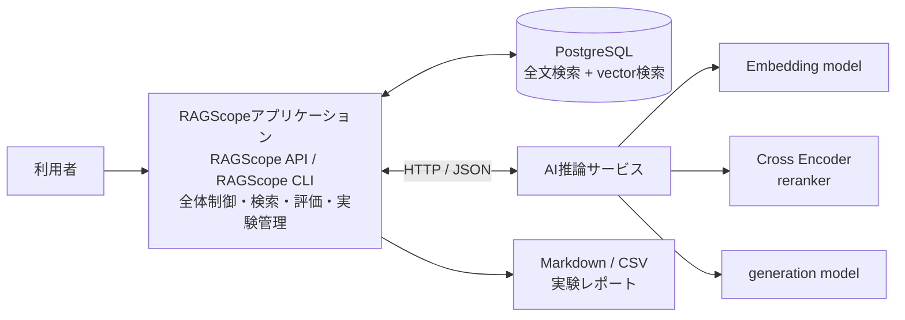
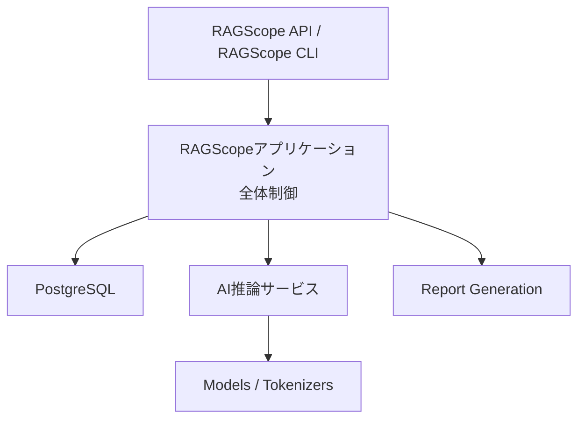
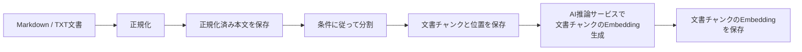
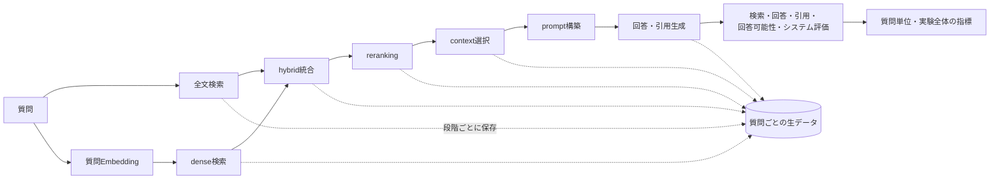
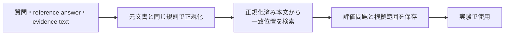
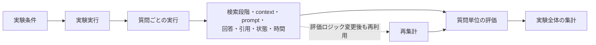

# システムアーキテクチャ

> [!abstract] この文書の役割
> RAGScopeのシステム全体について、コンポーネント構成、責務、依存方向、通信、主要な処理・データフロー、実行環境の基本方針を説明する。
>
> 満たすべき内容は[RAGScope要求定義](../RAGScope要求定義.md)、目的と価値は[RAGScope概要](../RAGScope概要.md)、段階的な実現計画は[ロードマップ](../project-management/ロードマップ.md)を参照する。

| 知りたいこと | 読む場所 |
|---|---|
| システムが何で構成されるか | [2. 全体構成](<#2. 全体構成>) |
| 各コンポーネントが何を担当するか | [3. コンポーネントの責務](<#3. コンポーネントの責務>) |
| 依存方向と通信境界 | [4. 依存方向](<#4. 依存方向>)、[5. RAGScopeアプリケーションとAI推論サービスの通信](<#5. RAGScopeアプリケーションとAI推論サービスの通信>) |
| 文書取り込み、質問、評価の流れ | [6. 文書取り込みの全体フロー](<#6. 文書取り込みの全体フロー>)〜[9. 保存と再集計](<#9. 保存と再集計>) |
| エラー、ログ、ID、retryの共通原則 | [1.4 共通データ表現](<#1.4 共通データ表現>)、[3.4 共通実行基盤の責務境界](<#3.4 共通実行基盤の責務境界>) |
| ローカル実行とAWS検証の境界 | [10. 配置・実行環境](<#10. 配置・実行環境>) |
| 詳細設計をどこへ分けるか | [11. 機能別設計への分割](<#11. 機能別設計への分割>) |

## 1. 設計方針

RAGScopeは、システム全体の制御、AIモデルに依存する計算、永続化を分離する。

| 設計上の観点 | 採用する方針 |
|---|---|
| システム全体の制御 | RAGScopeアプリケーションをシステムの司令塔とし、文書、検索、評価、実験の流れを制御する。Haskellで実装する。 |
| AI推論 | AI推論サービスがモデルとTokenizerを利用する処理を担当する。Pythonで実装する。 |
| データの永続化と検索 | PostgreSQLを、文書、検索用データ、実験条件、実行結果の永続化と検索に使用する。 |
| コンポーネント間通信 | RAGScopeアプリケーションとAI推論サービスはHTTP / JSONで通信する。 |
| 実行環境 | RAG本体はローカル環境で完成させる。AWSへの配置は独立した検証段階として扱う。 |
| エラーとログ | 意味とserialized shapeを技術非依存の契約として共有し、型、例外変換、encoder、logger、sinkはコンポーネントごとに実装する。 |
| ログと出力先の分離 | ログの意味と構造を出力先から分離し、ローカル実行とAWS配置で同じapplication eventを異なるsinkまたは収集経路へ渡せる構成にする。 |
| retry / timeoutの実行制御 | ログとは別の実行制御とし、一時的失敗かつ再試行安全な場合にだけ適用する。具体的な利用箇所がない汎用executorは先行実装しない。 |
| 仕様の正本 | 型、DB schema、API schema、CLI option、テストケースは、コード、migration、OpenAPI、`--help`、テストコードを正本とする。 |

> [!important] 最上位の責務分離
> RAGScopeアプリケーションは処理順序とデータ整合性を管理し、AI推論サービスはモデル依存の計算に責務を限定する。AIモデルの変更を、システム全体の制御や永続化へ波及させない。

### 1.1 正式用語

RAGScopeの文書で使用するコンポーネント名と中核的な領域用語は、本節を正本とする。実装言語はコンポーネントの実装技術として記載し、コンポーネント名の代わりに使用しない。

| 正式用語 | RAGScopeでの意味 | 表記上の扱い |
|---|---|---|
| RAGScopeアプリケーション | 文書、検索、評価、実験の流れを制御するコンポーネント。Haskellで実装する。 | コンポーネントを指す場合は、`Haskell`、`Haskell側`、`Haskell application`などで代用しない。 |
| AI推論サービス | AIモデルとAIライブラリに依存する推論処理を提供するコンポーネント。Pythonで実装する。 | コンポーネントを指す場合は、`Python AI Service`、`Python service`、`Python側`などで代用しない。 |
| RAGScope API | RAGScopeアプリケーションが利用者または外部ツールへ提供するAPIインターフェース。 | 独立したコンポーネントとして扱わない。 |
| RAGScope CLI | RAGScopeアプリケーションをコマンドラインから操作するインターフェース。 | `Haskell CLI`と表記しない。 |
| 文書チャンク | 文書を検索とEmbedding生成に使用する単位へ分割したもの。元文書、文書バージョン、元文書内の位置へ追跡できる状態で管理する。 | `文書断片`と表記しない。 |
| 文書チャンクのEmbedding | 文書チャンクから生成し、dense検索で質問Embeddingと比較するEmbedding。 | 対象が曖昧になる`文書Embedding`、`文書チャンクEmbedding`を正式表現として使用しない。 |
| 質問Embedding | 質問文から生成し、dense検索で文書チャンクのEmbeddingと比較するEmbedding。 | `質問のEmbedding`、`質問文のEmbedding`を正式表現として使用しない。 |

型名、変数名、API field名などのコード上の識別子は、それぞれの機械可読な正本に従う。技術そのものを説明する場合は、Haskell、Pythonなどの実装言語名を使用してよい。

### 1.2 検索処理で使用する用語

RAGScopeでは、検索から回答生成へ渡す情報を段階ごとに区別する。

| 用語 | RAGScopeでの意味 |
|---|---|
| `retrieval` | 質問に関係する文書チャンクを取得する処理。 |
| 全文検索 | 文書中の語を検索対象として文書チャンクを取得する検索方式。dense検索とは独立した検索方式として扱う。 |
| dense検索 | 質問Embeddingと文書チャンクのEmbeddingを比較し、vector上の近さに基づいて文書チャンクを取得する検索方式。全文検索とは独立した検索方式として扱う。 |
| hybrid検索 | 全文検索とdense検索の結果を統合する処理。 |
| `reranking` | 検索候補を別のモデルまたは基準で再評価し、並べ替える処理。 |
| `context` | 検索または`reranking`後の候補から選択し、実際に回答生成モデルへ渡す文書チャンク。 |
| `stage` | 全文検索、dense検索、hybrid検索、`reranking`、`context`選択など、結果を個別に保存・評価する処理段階。 |

> [!important] 検索結果と`context`を分ける
> 全文検索、dense検索、hybrid検索、`reranking`、`context`選択を別の`stage`として扱う。段階ごとの候補、順位、score、状態、処理時間を区別して保存・評価し、検索結果と実際に回答生成へ渡した`context`を混同しない。

正確なstage識別子と保存形式は、データモデルと検索を実装するMilestoneで定義し、コード、migrationなどの機械可読な定義を正本とする。

### 1.3 モデルに関する用語

RAGScopeでは、モデルの公開状態と実行環境の管理形態を区別する。

| 用語 | RAGScopeでの意味 |
|---|---|
| `open-weight model` | 学習済みのmodel weightが利用可能であることを表す。 |
| `self-hosted model` | 利用者が管理する実行環境でmodelを動かすことを表す。 |

両者は同義ではない。RAGScopeでは、open-weight modelを自分の管理する環境でself-hostして使用する構成を基本対象とする。

### 1.4 共通データ表現

コンポーネント間で共有する値は、次の原則に従う。

| 対象 | 共通原則 |
|---|---|
| 識別子 | 意味、生成主体、形式を定義元の設計または機械可読な契約で一度だけ定め、利用側で再定義しない。UUIDは小文字・ハイフン付きの標準文字列で表現し、opaqueな値として扱う。 |
| 時刻 | JSONではUTCのRFC 3339形式を使用し、秒未満はミリ秒3桁、末尾は`Z`とする。利用者向け表示で必要な場合だけlocal timeへ変換する。 |
| 所要時間 | 単調時計で計測し、`duration_ms`のようにfield名へ単位を含める。 |
| JSON | UTF-8を使用し、field名とenum値は小文字の`snake_case`とする。値がないoptional fieldは原則として省略する。 |
| 互換性 | 保存・通信される形式の非互換変更は契約versionを更新し、既存のfieldや識別子へ異なる意味を割り当てない。 |

`execution_id`と`event_id`はUUIDv4とする。将来の永続IDは、保存・検索要件を具体化するデータモデル設計でUUIDv7を含めて選定する。

> [!note] 正確な表現の正本
> 正確なJSON、HTTP、DB、コード上の制約は、それぞれJSON Schema、OpenAPI、migration、型とテストを正本とする。

## 2. 全体構成

| 接続 | 意味 |
|---|---|
| 利用者 → RAGScopeアプリケーション | RAGScope APIまたはRAGScope CLIから主要な処理を実行する。 |
| RAGScopeアプリケーション ↔ PostgreSQL | 文書、検索用データ、評価データ、実験条件、実行結果を保存・取得し、全文検索とvector検索を利用する。 |
| RAGScopeアプリケーション ↔ AI推論サービス | HTTP / JSONでモデル依存の計算を要求し、結果または失敗情報を受け取る。 |
| AI推論サービス → Models / Tokenizers | Embedding生成、reranking、回答生成、token数計測に使用する。 |
| RAGScopeアプリケーション → Markdown / CSV | 保存済みの実験結果から、人が確認できるレポートを生成する。 |

> [!important] AI推論サービスの境界
> AI推論サービスは、アプリケーション全体の状態や実験進行を管理しない。AIモデルとAIライブラリを利用する計算に責務を限定する。

## 3. コンポーネントの責務

| 構成要素 | 主な責務 | 境界の要点 |
|---|---|---|
| RAGScopeアプリケーション | 利用者向けインターフェース、処理全体の制御、データ管理、検索、評価、実験管理、設定、共通ログ、レポート生成、テスト | モデル固有のロード・推論処理を持たない。 |
| AI推論サービス | モデルとTokenizerのロード、Embedding生成、reranking、回答生成、token数計測、モデル依存の評価 | 文書・実験・評価問題を永続化せず、RAGフロー全体を管理しない。 |
| PostgreSQL | 文書、検索用データ、評価データ、実験条件、実行結果の永続化、全文検索、vector検索 | 正確なテーブル、カラム、制約はmigrationを正本とする。 |
| Markdown / CSVレポート | 実験条件、集計値、質問ごとの結果、比較結果、失敗例を人が確認できる形で出力する | 保存済みの実験結果からRAGScopeアプリケーションが生成する。 |

### 3.1 RAGScopeアプリケーションの責務境界

RAGScopeアプリケーションは、RAGScopeの処理順序とデータの整合性を管理する。

| 担当すること | 担当しないこと |
|---|---|
| 文書の取り込みから検索準備までを制御する | AIモデル固有のロード方法や推論実装 |
| 質問ごとの検索段階、`context`選択、prompt構築、回答生成段階を制御する | AIライブラリ固有の例外処理 |
| 実験条件、設定、実行結果を結び付ける | PostgreSQLの物理schemaをMarkdownで定義すること |
| 検索結果と`context`を区別して保存する | モデルやTokenizerへ直接依存する計算 |
| 保存済みの生データから評価指標を集計する | AI推論サービス内部のlifecycle管理 |
| AI推論サービスの失敗、timeout、再試行可能性をoperationごとの設計に従って扱う | ログ出力先をbusiness logicへ埋め込むこと |
| 共通エラー・ログ契約を利用し、主要な正常系と異常系をテストできる境界を保つ | 具体的なlogger・sinkの実装を機能処理へ持ち込むこと |

### 3.2 AI推論サービスの責務境界

AI推論サービスは、AIモデルとAIライブラリに依存する処理を提供する。

| 担当すること | 担当しないこと |
|---|---|
| 文書チャンクのEmbeddingと質問Embeddingを生成する | 文書、実験、評価問題の永続化 |
| 検索候補をCross Encoderで再評価する | 複数段階のRAGフロー全体の制御 |
| promptと`context`から回答と引用を生成する | PostgreSQLへの直接アクセス |
| Tokenizerに基づいてtoken数を計測する | 検索結果と実験条件の管理 |
| モデルの識別情報、利用可能状態、モデル固有の推論パラメータを扱う | RAGScope API・RAGScope CLIの提供 |
| AIライブラリを利用する回答評価を行う | 評価問題や評価結果の永続化 |
| モデル処理の時間、生成token数などを返す | ほかのコンポーネントのlogger実装への依存 |
| 共通契約に従ってPython例外を安全なエラーへ変換し、AI推論とservice lifecycleのapplication eventを出力する | diagnostic requestをRAGScope全体のapplication eventとして独自に定義すること |

### 3.3 PostgreSQLの責務境界

PostgreSQLは、比較と追跡に必要なデータを永続化する。

| 分類 | 永続化する主な情報 |
|---|---|
| 文書 | 元文書、正規化済み本文、文書バージョン、文書集合 |
| 検索準備 | 文書チャンク、元文書内の位置、Embedding |
| 評価データ | 評価問題、正解根拠 |
| 実験 | 実験条件、実験と質問ごとの実行状態 |
| 質問ごとの生データ | 検索段階ごとの順位結果、`context`、prompt、回答、引用 |
| 評価 | 評価結果、処理時間 |

正確なテーブル、カラム、制約はmigrationを正本とし、本書ではデータの責務と関係だけを扱う。

### 3.4 共通実行基盤の責務境界

共通実行基盤は、各機能が同じ原則で失敗を表現し、処理を追跡するための横断的な契約を提供する。

| 関心事 | 共通原則 | 詳細の正本 |
|---|---|---|
| 共通エラー | 外部処理を含む失敗を正常結果と区別し、コンポーネント境界で一貫して扱える意味を定める。 | [エラー・ログ設計](./エラー・ログ設計.md)、各機能設計、コード、OpenAPI |
| 構造化ログ | application eventの意味とserialized shapeを共有し、具体的なsinkをbusiness logicへ埋め込まない。 | [エラー・ログ設計](./エラー・ログ設計.md)、JSON Schema、コード |
| serialized shape | 共通field、category、variant、error codeの形式をJSON Schemaで定義する。機能固有のcodeの意味は共通enumへ集約しない。 | JSON Schema、各機能設計、コード |
| コンポーネント実装 | 各コンポーネントは共通Schemaとfixtureへ適合する個別の基盤を持ち、ほかのコンポーネントの実装へ依存しない。 | 各コンポーネントのコードとテスト |
| 実行の相関 | 1回のCLI commandに属するexecution-scoped eventは同じ`execution_id`を共有し、コンポーネント境界を越えて伝播する。別commandは別の値を使用してよい。 | [エラー・ログ設計](./エラー・ログ設計.md)、API設計、OpenAPI |
| eventのscope | execution-scoped event、service-scoped event、health・readinessなどのdiagnostic requestを区別する。 | [エラー・ログ設計](./エラー・ログ設計.md)、API設計 |
| loggerの失敗 | encodeまたはsinkが失敗しても、元のoperation失敗を上書きしないなど、各実装が守る共通の意味を定める。 | [エラー・ログ設計](./エラー・ログ設計.md)、コードとテスト |
| retry / timeout | ログとは別の実行制御とし、一時的失敗かつ再試行安全な場合にだけ適用する。 | operationごとの機能設計、コードとテスト |
| PostgreSQLのログ | PostgreSQL native logは共通Schemaの対象にせず、アプリケーションが実行・観測するDB operationをapplication eventとして記録する。 | [エラー・ログ設計](./エラー・ログ設計.md)、各DB operationの機能設計とコード |
| tracing | 将来拡張できる境界を保つが、正確な相関情報と処理間関係はv0.5で決定する。 | v0.5の設計、必要な契約 |
| CloudWatch | AWS検証時の収集・検索先として追加し、RAGScopeのcore logicからCloudWatch APIへ直接依存しない。 | AWS検証の設計と設定 |

> [!important] 契約と実装を分ける
> エラーとログの意味およびserialized shapeは共有する。一方のコンポーネントの型、logger、encoder、sinkを、もう一方のコンポーネントから利用する構成にはしない。

> [!important] ログから実行制御へ逆流させない
> retry / timeoutはoperation固有の実行制御である。共通ログ基盤は試行eventを受け取るが、retryの可否や回数を決定しない。

v0.0への段階的な導入範囲とretry / timeoutの共通原則は、[ADR-0002 — 共通実行基盤の契約とコンポーネント実装を分離する](<../adr/ADR-0002 共通実行基盤の契約とコンポーネント実装を分離する.md>)を参照する。

## 4. 依存方向

| 依存元 | 依存先 | 規則 |
|---|---|---|
| RAGScope API / RAGScope CLI | RAGScopeアプリケーション | 利用者向けインターフェースは、RAGScopeアプリケーションの処理を呼び出す。 |
| RAGScopeアプリケーション | PostgreSQL | 永続化と検索を利用する。PostgreSQLからアプリケーション処理を起動しない。 |
| RAGScopeアプリケーション | AI推論サービス | モデル依存処理を要求する。AI推論サービスからアプリケーション処理を起動しない。 |
| AI推論サービス | Models / Tokenizers | モデルとTokenizerを利用する。PostgreSQLへ直接アクセスしない。 |
| RAGScopeアプリケーション | Report Generation | 保存された実験結果を読み出してレポートを生成する。 |
| application処理 | 共通エラー・ログ契約 | operationの結果やeventを渡す。具体的なログsinkをbusiness logicへ埋め込まない。 |
| operation固有の実行制御 | 共通ログ基盤 | 必要な試行eventを渡す。ログ基盤からoperationの実行制御へ制御を逆流させない。 |

> [!warning] 禁止する依存
> - AI推論サービスからPostgreSQLへ直接アクセスしない。
> - PostgreSQLやAI推論サービスからRAGScopeアプリケーションの処理を起動しない。
> - business logicから具体的なログsinkへ直接依存しない。
> - ログ基盤にretry / timeoutの判断を持たせない。

この依存方向により、AIモデルの変更と、RAGScope全体の制御・データ管理を分離する。

## 5. RAGScopeアプリケーションとAI推論サービスの通信

RAGScopeアプリケーションとAI推論サービスの通信にはHTTP / JSONを使用する。

| API | 主な用途 |
|---|---|
| `POST /embeddings` | 文書チャンクのEmbeddingと質問Embeddingを生成する。 |
| `POST /rerank` | 検索候補を再評価する。 |
| `POST /generate` | 回答と引用を生成する。 |
| `POST /token-count` | Tokenizerに基づくtoken数を確認する。 |
| `GET /models` | 使用中のモデル、revision、能力を確認する。 |
| `GET /health` | プロセスの生存を確認する。 |
| `GET /ready` | 必要なモデルがロードされ、処理可能か確認する。 |

| この文書で共有すること | APIごとの機能設計とOpenAPIで決めること |
|---|---|
| HTTP / JSONを使用すること | 正確なrequest / response schema |
| APIの役割と分類 | HTTP statusとエラーの対応 |
| 共通エラーとログの意味 | エラーresponseの正確な形 |
| `execution_id`を同じCLI command内で共有すること | HTTP上の正確な伝播方法 |
| retry / timeoutの共通原則 | batch上限、timeout値、retry対象と回数 |
| diagnostic requestをapplication eventと区別すること | モデル未ロード時の挙動、health・readinessの正確な契約 |

> [!note] APIの正本
> 各APIの正確なschemaは、OpenAPIなどの機械可読な定義を正本とする。具体的な内容は、そのAPIへ着手する段階で機能別設計として具体化する。

## 6. 文書取り込みの全体フロー

> [!important] 質問処理とは分ける
> 正規化、チャンク化、文書チャンクのEmbedding生成は、文書または分割条件を登録・更新したときに行い、質問処理のたびには実行しない。

正規化、offset、文書チャンクの不変条件、Embedding入力の組み立ては、実装に必要となった段階で[文書処理設計](./文書処理設計.md)へ定義する。正確な保存形式と制約は、データモデル設計とmigrationを正本とする。

## 7. 質問と実験の全体フロー

| 区別して扱う対象 | 区別する理由 |
|---|---|
| 全文検索とdense検索 | 独立した検索方式として品質と結果を比較するため。 |
| hybrid検索と`reranking` | 統合と再評価を別の処理段階として評価するため。 |
| 検索結果と`context` | 取得した候補と、実際に回答生成へ渡した情報を区別するため。 |
| 質問ごとの生データと集計値 | 失敗分析と、評価ロジック変更後の再集計を可能にするため。 |

> [!important] stage間のscoreを直接比較しない
> 全文検索、dense検索、hybrid検索、`reranking`、`context`は別の`stage`として扱う。順位やscoreの尺度が異なる段階を、同じ値として直接比較しない。

## 8. 評価データ作成の全体フロー

評価問題の正解根拠は、元文書の位置として管理する。利用者はoffsetを手作業で数えず、元文書からコピーした`evidence text`を指定する。

> [!warning] 一致位置が一意でない場合
> 同じ文字列が複数箇所に存在する場合は、曖昧なまま登録しない。エラーとして扱うか、利用者が対象位置を選択できるようにする。

## 9. 保存と再集計

> [!important] 生データを正本として残す
> 実験では集計値だけでなく、評価に必要な質問ごとの生データを保存する。評価ロジックを変更した場合は、検索や回答生成を再実行せず、保存済みの生データから指標を再計算できる構成とする。

文書、設定、実行結果の具体的なEntityと制約は、データモデルを実装する段階で機能別設計とmigrationへ定義する。

## 10. 配置・実行環境

### 10.1 ローカル構成

RAG本体は、ローカル環境で次の要素を連携させて実行する。

| 要素 | ローカル実行での役割 |
|---|---|
| RAGScopeアプリケーション | 全体制御、検索、評価、実験管理、レポート生成を行う。 |
| PostgreSQL | 文書、検索用データ、評価データ、実験結果を保存し、全文検索とvector検索を提供する。 |
| AI推論サービス | self-hosted modelとTokenizerを利用する計算を提供する。 |
| self-hosted model | Embedding生成、reranking、回答生成など、Milestoneで必要なモデル処理を実行する。 |
| Markdown / CSVレポート | 実験条件、結果、比較、失敗例を人が確認できる形で出力する。 |

正常なCLI結果はstdout、構造化ログはstderrへ分ける。ローカル実行でログを確認するためにCloudWatchを必須としない。

v1.0では、第三者がREADMEに従ってローカル環境を構築し、sample dataの取り込みから実験レポートの生成まで実行できる状態を目指す。

### 10.2 AWS検証との境界

AWSへの配置は、RAG本体の現在アーキテクチャではなく、独立したデプロイスパイクとして扱う。

| 検証対象 | 確認すること |
|---|---|
| Infrastructure as Code | 小さな構成を作成・削除できること。 |
| 管理経路 | 管理操作へ到達する経路を説明できること。 |
| 通信 | アプリケーションとデータベース間の通信を確認できること。 |
| 権限とsecret | IAMとsecretの扱いを確認できること。 |
| ログ | v0.0で定義した構造化ログを収集・検索・保持できること。 |
| 成果物 | 実験成果物を退避できること。 |
| 削除と料金 | 実験後に残るリソースと料金を確認できること。 |

> [!warning] AWS構成を先に固定しない
> 検証結果を見ずに、ECS / FargateなどをRAG本体の採用構成として固定しない。実施時期と到達点は[ロードマップ](../project-management/ロードマップ.md)を正本とする。

## 11. 機能別設計への分割

次の内容は、現在のMilestoneで実装または変更する必要が生じた時点で、機能別設計として作成または既存文書から分割する。

| 設計対象 | 主な内容 |
|---|---|
| [文書処理設計](./文書処理設計.md) | 正規化、offset、文書分割、元文書との対応、Embedding入力 |
| データモデル設計 | Entityの関係、不変条件、nullable条件、永続化単位 |
| 検索設計 | 全文検索、dense検索、hybrid統合、reranking、`context`選択 |
| 評価設計 | 評価データ、根拠範囲、検索・回答・引用・回答可能性の指標 |
| API設計 | RAGScopeアプリケーションとAI推論サービスの契約、HTTP固有のエラー表現、timeout、batch |
| [エラー・ログ設計](./エラー・ログ設計.md) | 共通エラー契約、構造化ログ、JSON Schema、相関情報、execution・service・diagnostic eventの境界、logger失敗時の意味、出力先との分離、将来のtracingへ拡張できる境界 |
| リトライ・タイムアウト設計 | RAGScopeアプリケーションからAI推論サービスへ文書チャンクのEmbeddingを要求するoperationに必要なtimeout、retry対象、再試行安全性、operation固有の実行制御 |

> [!note] 必要になった設計だけを作る
> 内容が必要になる前に、機能別設計書や空フォルダを先行して作成しない。既存の機能設計で責務を自然に扱える場合は、その文書を更新する。

## 12. 未決定事項

次の内容は現在仕様として固定せず、対応するMilestoneまたは機能別設計で必要になった時点で決定する。

| 分類 | 未決定事項 | 決定する段階 |
|---|---|---|
| 初期データ | 最初の文書コーパス | 対応するMilestoneまたは機能設計 |
| モデル | 最初のEmbedding model | 対応するMilestoneまたは機能設計 |
| モデル | 最初のgeneration model | 対応するMilestoneまたは機能設計 |
| API | APIごとの正確なrequest / response | 各APIへ着手するMilestone、API設計、OpenAPI |
| 初期値 | 文書処理、検索、評価に使用する具体的な初期値 | 対応する機能設計またはExperiment |
| tracing | 対象範囲と相関情報の正確な規則 | v0.5 |
| CloudWatch | log group、log stream、保持期間、metric filter、alarm | v0.1.5のAWS検証 |
| batch・非同期job | 再実行と重複防止の方式 | 対応するMilestoneまたは機能設計 |

> [!note] 未決定事項の扱い
> この節は、現在設計に直接関係し、実装時に判断が必要な事項だけを示す。特定の値や方式を、決定前に現在仕様として扱わない。
