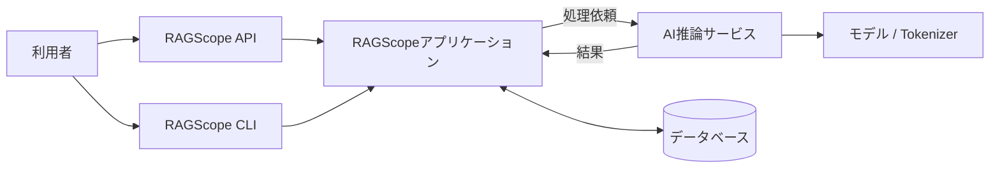
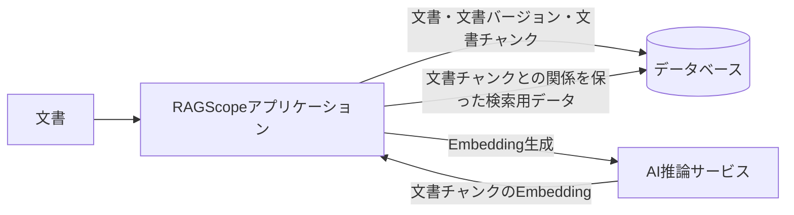
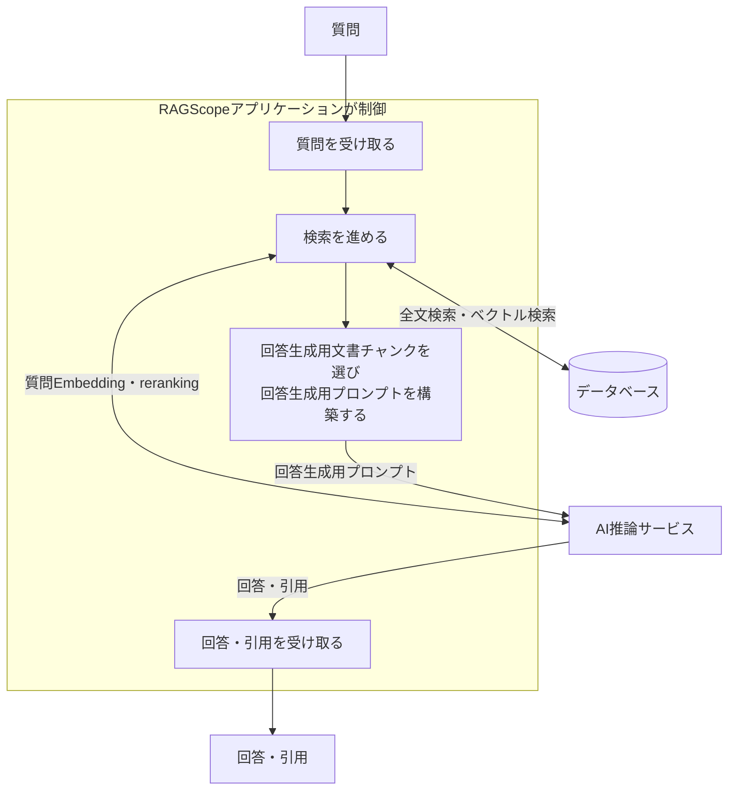
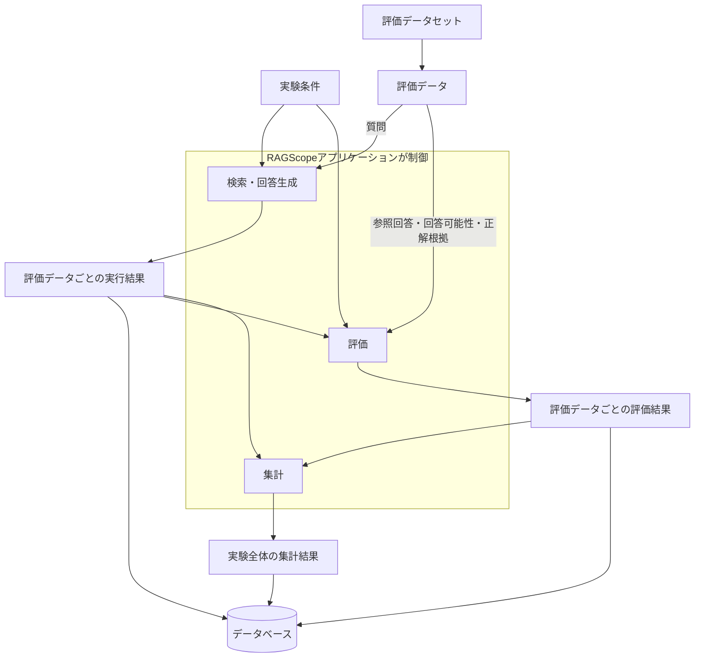
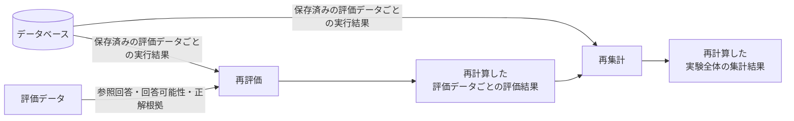

# システムアーキテクチャ

> [!abstract] この文書の役割
> RAGScopeの4つのドメイン領域と要求を、どのコンポーネントがどの責務で実現し、どの境界で連携するかを定義する。
>
> RAGScopeが扱う問題領域は[RAGScopeドメインモデル](./RAGScopeドメインモデル.md)、満たすべき要求は[RAGScope要求定義](../RAGScope要求定義.md)、利用者のトップレベルな操作と1回の実行境界は[ユースケース設計](./ユースケース設計.md)、正式用語と概念間の基本関係は[RAGScope用語集](../RAGScope用語集.md)を正本とする。

## 1. 全体構成

RAGScopeの処理責務を担うコンポーネントは、RAGScopeアプリケーションとAI推論サービスの2つである。

RAGScopeアプリケーションは、文書、検索・回答生成、評価、実験の処理全体を制御する。AI推論サービスは、Embedding生成、`reranking`、回答生成など、モデルやTokenizerに依存する計算を担当する。

RAGScope APIとRAGScope CLIは、利用者がRAGScopeアプリケーションを利用するためのインターフェースであり、独立したコンポーネントではない。

データベースは、RAGScopeアプリケーションがドメインデータの永続化と検索に利用する依存先である。RAGScope内の処理を制御するコンポーネントとしては数えない。v0.0ではPostgreSQLを使用し、dense検索のベクトル検索にはpgvectorを使用する。

この図は、利用者、インターフェース、2つのコンポーネント、依存先の全体的なつながりを示す。どちらが処理を開始し、どちらへ依存するかは「5. 通信と依存方向」で示す。

## 2. コンポーネントの責務

### 2.1 RAGScopeアプリケーション

RAGScopeアプリケーションは、RAGScope全体の処理を開始し、各処理を必要な順序で進めるコンポーネントである。

RAGScopeアプリケーションは、自身が開始した処理について、処理を継続するか、再試行するか、タイムアウトで打ち切るかという実行制御も担当する。再試行は、一時的失敗であり、同じ処理を繰り返しても安全な場合だけ行う。具体的な再試行条件、試行回数、待機方法、タイムアウトを適用する範囲は、対象となる処理種別の機能設計で定める。

RAGScope APIまたはRAGScope CLIから操作を受け付けると、対象となる機能の処理へつなぐ。処理に必要なドメインデータはデータベースから取得し、生成または更新したドメインデータはデータベースへ保存する。

検索では、RAGScopeアプリケーションがデータベースの全文検索やベクトル検索を利用する。Embedding生成、`reranking`、回答生成などモデルやTokenizerに依存する計算が必要な場合は、AI推論サービスへ入力を渡し、計算結果を受け取って後続処理へ使う。

### 2.2 AI推論サービス

AI推論サービスは、RAGScopeアプリケーションから入力を受け取り、モデルやTokenizerを使って計算し、その結果をRAGScopeアプリケーションへ返すコンポーネントである。

主に、文書チャンクのEmbedding生成、質問Embedding生成、`reranking`、回答生成などを担当する。どの処理をどの順序で行うかは決めず、RAGScopeが管理するドメインデータも永続化しない。データベースへ直接アクセスせず、RAGScopeアプリケーションから依頼されたモデル依存処理だけを実行する。

## 3. 4ドメインとコンポーネントの対応

4つのドメイン領域はコンポーネントの分割単位ではない。RAGScopeアプリケーションとAI推論サービスの2つのコンポーネントが、それぞれの責務に応じて複数のドメイン領域に関わる。

| ドメイン領域 | RAGScopeアプリケーション | AI推論サービス |
|---|---|---|
| 文書 | 文書の取り込み、版管理、文書チャンク化、検索用データ準備と永続化の流れを制御する | 文書チャンクからEmbeddingを生成する |
| 評価データ | 評価データセットと評価データを登録・取得し、実験で使用できる状態で永続化する | 評価データの登録・取得・永続化を行わない |
| 検索・回答生成 | 質問を受け取り、検索、回答生成用文書チャンク選択、回答生成用プロンプト構築、回答生成の流れを制御する | 質問Embedding、`reranking`、回答生成などのモデル依存処理を実行する |
| 実験・評価 | 実験条件に従って評価データごとの処理を実行し、結果の永続化、評価、集計、比較、実験レポート生成を制御する | 実験や評価でモデル依存の計算が必要な場合、その計算を実行する |

## 4. 主要な処理の流れ

本章は、主要な処理でRAGScopeアプリケーション、AI推論サービス、データベースがどう連携するかを示す。利用者のトップレベルな操作として、どこからどこまでを1回の実行として扱うかは[ユースケース設計](./ユースケース設計.md)を正本とする。

### 4.1 文書を検索可能にする

RAGScopeアプリケーションは文書を取り込み、その内容を文書バージョンとして管理し、検索や回答生成で使う文書チャンクへ分割する。

文書チャンクからEmbeddingを作る場合は、RAGScopeアプリケーションがAI推論サービスへ生成を依頼する。AI推論サービスから受け取った文書チャンクのEmbeddingなどの検索用データは、それがどの文書チャンクから作られたかを後からたどれるように、文書チャンクとの関係を保ってデータベースへ保存する。

文書の読み込み、検証、文書チャンク化などの具体的な処理規則は[文書処理設計](./features/文書処理設計.md)を正本とする。

### 4.2 検索して回答を生成する

RAGScopeアプリケーションは、質問を受け取ってから回答と引用を得るまで、検索と回答生成の処理順序を制御する。

#### 検索する

全文検索では、RAGScopeアプリケーションが質問を使ってデータベースを検索し、順位付きの検索結果を受け取る。

dense検索では、まずAI推論サービスへ質問Embeddingの生成を依頼する。RAGScopeアプリケーションは返された質問Embeddingを使ってデータベースのベクトル検索を行い、検索結果を受け取る。

`reranking`を行う場合は、RAGScopeアプリケーションが検索候補をAI推論サービスへ渡し、並べ替えた結果を受け取る。hybrid検索で全文検索とdense検索の候補をどう統合するかなど、検索方式ごとの具体的な規則は検索設計で定義する。

#### 回答を生成する

RAGScopeアプリケーションは、検索結果の中から、回答生成モデルに実際に渡す文書チャンクを選ぶ。次に、質問と選んだ文書チャンクを、回答生成条件に従って回答生成用プロンプトへまとめ、AI推論サービスへ渡す。

AI推論サービスは、そのプロンプトをモデルへ入力し、生成された回答と引用をRAGScopeアプリケーションへ返す。

検索方式、回答生成用文書チャンクの選択規則、プロンプト、モデルへの入力・出力などの詳細は、それぞれを具体化する機能設計と機械可読な正本で定義する。

### 4.3 実験して評価する

#### 通常の実験

RAGScopeアプリケーションは、評価データの質問を使って検索・回答生成を行う。各検索段階の結果、回答生成用文書チャンク、回答生成用プロンプト、回答、引用、処理時間、状態、エラーを、その評価データに対応する評価データごとの実行結果として保存する。

次に、RAGScopeアプリケーションは、保存した評価データごとの実行結果と、その評価データが持つ参照回答、回答可能性、正解根拠などを使って評価する。得られた指標や判定を評価データごとの評価結果として保存する。

すべての評価データについて処理した後、RAGScopeアプリケーションは、評価データごとの実行結果と評価データごとの評価結果を実験全体で集計する。評価指標に加えて、処理時間、成功率、タイムアウト率などもまとめ、実験全体の集計結果として保存する。

#### 保存済みの評価データごとの実行結果から再評価する

評価する内容や基準が更新されたとき、必要な情報が保存済みの評価データごとの実行結果に残っていれば、その実行結果と評価データを使って、評価データごとの評価結果を再計算できる。検索と回答生成は再実行せず、以前に保存した評価データごとの評価結果も再評価の入力には使用しない。

再計算した評価データごとの評価結果と、保存済みの評価データごとの実行結果から、実験全体の集計結果も再計算する。新しい評価に必要な情報が保存済みの実行結果と評価データから得られない場合は、再評価できない。

評価データごとの実行結果に含める正確なデータ、評価データごとの評価結果の構造、集計方法は、それぞれの機能設計とデータモデル、migrationなどを正本とする。

## 5. 通信と依存方向

RAGScope API / RAGScope CLI → RAGScopeアプリケーション → AI推論サービス / データベースの方向で処理を開始する。AI推論サービスはRAGScopeアプリケーションの機能処理を開始せず、データベースへ直接アクセスしない。RAGScopeアプリケーションはAI推論サービスへ処理を依頼し、AI推論サービスはその結果をRAGScopeアプリケーションへ返す。

RAGScope API、RAGScope CLI、RAGScopeアプリケーション、AI推論サービスの境界で失敗を扱うときは、失敗理由を`error_type`で識別する共通規則に従う。RAGScopeアプリケーションとAI推論サービスの間では、コンポーネントをまたぐ処理を一連の処理として追跡できるよう、実行追跡に必要な情報を通信時に引き継ぐ。

失敗理由を表す`error_type`の意味と利用方法、実行追跡と構造化ログの詳しい契約は[実行追跡・構造化ログ契約設計](./logging/実行追跡・構造化ログ契約設計.md)を正本とする。

RAGScopeアプリケーションとAI推論サービスの具体的な通信プロトコル、エンドポイント、入出力形式、エラー表現などは、対応する機能設計と機械可読な契約を正本とする。

## 6. 配置・実行環境の境界

RAGScopeの中核機能は、利用者が管理するローカル環境で実行できる構成を維持する。

ローカル環境とAWSのどちらへ配置する場合も、第1章で示したコンポーネント構成と第5章で示した通信・依存方向を維持する。配置先によって、RAGScopeアプリケーション、AI推論サービス、データベースの責務を変えない。

AWSで使用するサービス、ネットワーク、コンテナ、データベースの提供方法、Infrastructure as Codeの具体的な構成は、AWS配置を具体化する設計と構成定義を正本とする。
