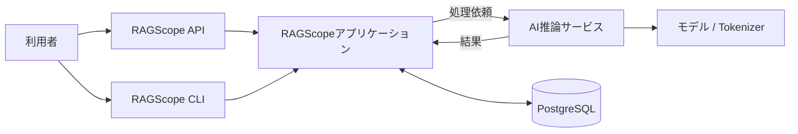
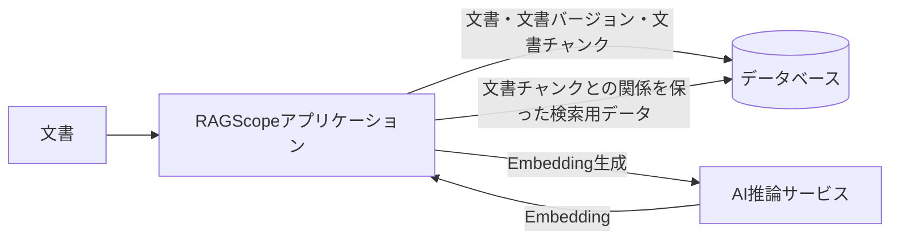
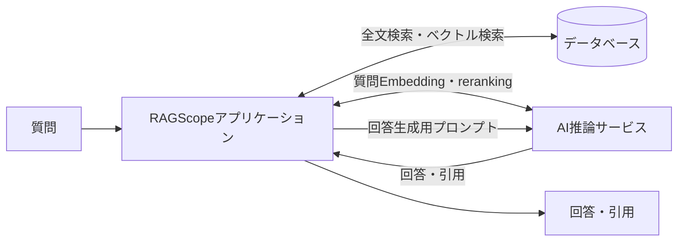
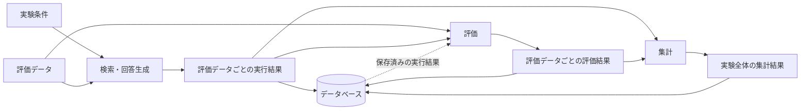

# システムアーキテクチャ

> [!abstract] この文書の役割
> RAGScopeを構成するコンポーネント、責務、依存方向、主要なデータフローを定義する。

## 1. 全体構成

| 要素 | 役割 |
|---|---|
| RAGScope API / CLI | 利用者とRAGScopeアプリケーションの間のインターフェース |
| RAGScopeアプリケーション | 処理全体を制御し、ドメインデータを扱う中核コンポーネント |
| AI推論サービス | モデルやTokenizerに依存する計算を行うコンポーネント |
| データベース | RAGScopeアプリケーションが永続化と検索に利用する依存先 |
| モデル / Tokenizer | AI推論サービスが利用する依存先 |

```mermaid
flowchart LR
    User["利用者"]
    API["RAGScope API"]
    CLI["RAGScope CLI"]
    Application["RAGScopeアプリケーション"]
    AI["AI推論サービス"]
    DB[("PostgreSQL")]
    Models["モデル / Tokenizer"]

    User --> API --> Application
    User --> CLI --> Application
    Application <--> DB
    Application -->|"処理依頼"| AI
    AI -->|"結果"| Application
    AI --> Models
```

RAGScope APIとRAGScope CLIは独立した処理コンポーネントではない。v0.0ではデータベースにPostgreSQLを使用し、dense検索にはpgvectorを使用する。

## 2. コンポーネントの責務

### 2.1 RAGScopeアプリケーション

RAGScopeアプリケーションは、RAGScopeの処理を開始し、必要な処理を順番に進める。

| 責務 | 内容 |
|---|---|
| 処理制御 | 継続、retry、timeout、fallback、終了を判断する |
| データ利用 | ドメインデータをデータベースから取得・保存し、全文検索やベクトル検索を実行する |
| AI推論 | Embedding生成、`reranking`、回答生成などをAI推論サービスへ依頼し、結果を後続処理へ渡す |
| インターフェース接続 | API / CLIから受け取った操作を対象処理へつなぐ |

retryは、一時的な失敗であり、同じ処理を繰り返しても安全な場合だけ行う。具体的なretry条件、回数、待機方法、timeout範囲は対象機能の設計で定める。

#### 失敗の扱い

- アプリケーション全体を1つの共通`AppError`や`RAGScopeError`へまとめない。
- 処理ごとに、呼び出し側が扱うために必要な具体的な失敗を返す。
- 外部library固有の失敗はRAGScopeとの境界で変換する。
- retryやfallbackで回復した途中の失敗を、上位処理の最終失敗として扱わない。
- CLI / APIとTelemetryは、それぞれの境界で必要な表現へ変換する。

Telemetryの失敗だけを理由に、成功した機能処理を失敗へ変更しない。この方針を採用した理由は[ADR-0010](<../adr/ADR-0010 RAGScopeアプリケーションの失敗を処理単位の具体型で扱う.md>)を参照する。

### 2.2 AI推論サービス

AI推論サービスは、RAGScopeアプリケーションから入力を受け取り、モデルやTokenizerを使って計算結果を返す。

主に文書チャンクのEmbedding生成、質問Embedding生成、`reranking`、回答生成を担当する。処理全体の順序は決めず、RAGScopeのドメインデータを永続化せず、データベースへ直接アクセスしない。

## 3. 4ドメインとコンポーネントの対応

| ドメイン | RAGScopeアプリケーション | AI推論サービス |
|---|---|---|
| 文書 | 取り込み、版管理、文書チャンク化、検索用データ準備と永続化を制御する | 文書チャンクからEmbeddingを生成する |
| 評価データ | 評価データセットと評価データを登録・取得・永続化する | 扱わない |
| 検索・回答生成 | 検索、回答生成用文書チャンク選択、プロンプト構築、回答生成を制御する | 質問Embedding、`reranking`、回答生成を行う |
| 実験・評価 | 実験の実行、結果の永続化、評価、集計、比較、レポート生成を制御する | 必要なモデル依存計算を行う |

## 4. 主要なデータフロー

> [!important]
> この章はコンポーネント間のデータフローを示すものであり、ユースケース一覧を定義しない。個別のユースケースは[ユースケース設計](./ユースケース設計.md)でTBDである。

### 4.1 文書処理

```mermaid
flowchart LR
    Input["文書"]
    Application["RAGScopeアプリケーション"]
    AI["AI推論サービス"]
    DB[("データベース")]

    Input --> Application
    Application -->|"文書・文書バージョン・文書チャンク"| DB
    Application -->|"Embedding生成"| AI
    AI -->|"Embedding"| Application
    Application -->|"文書チャンクとの関係を保った検索用データ"| DB
```

RAGScopeアプリケーションは文書を文書バージョンと文書チャンクとして扱い、必要な検索用データを文書チャンクとの関係を保って保存する。モデル依存の生成が必要な場合だけAI推論サービスへ依頼する。

### 4.2 検索・回答生成

```mermaid
flowchart LR
    Question["質問"]
    Application["RAGScopeアプリケーション"]
    DB[("データベース")]
    AI["AI推論サービス"]
    Answer["回答・引用"]

    Question --> Application
    Application <-->|"全文検索・ベクトル検索"| DB
    Application <-->|"質問Embedding・reranking"| AI
    Application -->|"回答生成用プロンプト"| AI
    AI -->|"回答・引用"| Application
    Application --> Answer
```

| 段階 | RAGScopeアプリケーション | AI推論サービス / DB |
|---|---|---|
| 検索 | 検索方式を進め、候補を扱う | DBが検索し、AI推論サービスが質問Embeddingや`reranking`を行う |
| 回答準備 | 回答生成用文書チャンクを選び、プロンプトを構築する | — |
| 回答生成 | 回答生成を依頼し、結果を受け取る | AI推論サービスが回答と引用を生成する |

検索方式、文書チャンク選択、プロンプト、モデル入出力の具体的な規則は、対応する機能設計と機械可読な契約で定義する。

### 4.3 実験・評価

```mermaid
flowchart LR
    Conditions["実験条件"]
    Data["評価データ"]
    Run["検索・回答生成"]
    Execution["評価データごとの実行結果"]
    Evaluate["評価"]
    Evaluation["評価データごとの評価結果"]
    Aggregate["集計"]
    Summary["実験全体の集計結果"]
    DB[("データベース")]

    Conditions --> Run
    Data --> Run
    Run --> Execution --> DB
    Data --> Evaluate
    Execution --> Evaluate --> Evaluation --> DB
    Execution --> Aggregate
    Evaluation --> Aggregate --> Summary --> DB
    DB -. "保存済みの実行結果" .-> Evaluate
```

通常の実験では検索・回答生成の実行結果を保存し、その結果と評価データから評価し、最後に実験全体を集計する。評価条件だけを変更する場合、必要な情報が保存済みであれば検索・回答生成を再実行せず再評価・再集計できる。

正確な保存項目、評価結果の構造、集計方法は対応する機能設計、データモデル、migrationを正本とする。

## 5. 通信と依存方向

| 呼び出し元 | 呼び出し先 | 規則 |
|---|---|---|
| RAGScope API / CLI | RAGScopeアプリケーション | 利用者の入力を渡し、結果を返す |
| RAGScopeアプリケーション | AI推論サービス | モデル依存処理だけを依頼する |
| RAGScopeアプリケーション | データベース | 永続化と検索に利用する |
| AI推論サービス | データベース | 直接アクセスしない |

RAGScopeアプリケーションからAI推論サービスへ処理を依頼するときはOpenTelemetry Trace Contextを伝播する。具体的な通信protocol、endpoint、入出力、エラー表現、Trace ContextのHTTP表現は通信契約と実装を正本とする。

## 6. 配置・実行環境の境界

| 配置 | 方針 |
|---|---|
| ローカル | RAGScopeの中核機能を利用者が管理する環境で実行できる構成を維持する |
| AWS | 配置先が変わっても、RAGScopeアプリケーション、AI推論サービス、データベースの責務と依存方向を変えない |

AWSサービス、ネットワーク、コンテナ、データベースの提供方法、Infrastructure as Codeは、配置を具体化する設計と構成定義で決める。

## 7. Observability

RAGScopeアプリケーションとAI推論サービスはOpenTelemetryを共通基盤としてTrace、Logs、Metricsを生成する。Signalの意味、Trace Context、Logs、Metrics、失敗の観測、ローカルbackendは[Observability設計](./Observability設計.md)を正本とする。

## 関連文書

- [RAGScopeドメインモデル](./RAGScopeドメインモデル.md)
- [ユースケース設計](./ユースケース設計.md)
- [Observability設計](./Observability設計.md)
- [RAGScope要求定義](../RAGScope要求定義.md)
- [RAGScope用語集](../RAGScope用語集.md)
