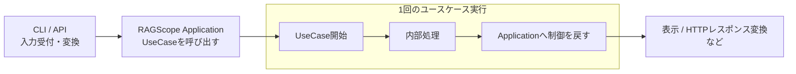

# ユースケース基本設計

> [!abstract] この文書の役割
> 利用者がRAGScopeへ依頼するトップレベルな操作と、その操作全体に内包されるユースケース実行について、入力・結果・主要な処理、実行境界、成功・失敗を定義する。
>
> 各機能で具体的にどのような失敗があるかは[機能設計](./features/README.md)、その失敗をHaskellでどう表現しユースケース境界で受け渡すかは[ユースケース詳細設計](./ユースケース詳細設計.md)を参照する。利用者から受け付けた1回のトップレベルな操作をどの範囲で`trace`として追跡するかは[実行追跡・構造化ログ契約設計](./logging/実行追跡・構造化ログ契約設計.md)を参照する。

## 1. ユースケースの共通ルール

### 1.1 何をユースケースとするか

| 対象 | 扱い |
|---|---|
| 利用者がRAGScopeへ依頼するトップレベルの操作 | 対応するユースケースを持つ |
| Embedding生成、データベース検索、文書チャンク化など、ユースケースから呼び出す処理 | ユースケースを構成する内部処理 |
| CLIやAPIによる入力の受け取り、routing・command判定、入力の変換・検証 | ユースケース実行の外側 |
| ユースケース終了後の表示、HTTPレスポンスなどインターフェース固有の結果処理 | ユースケース実行の外側 |

同じ利用者操作をCLI、APIなど異なるインターフェースから実行しても、同じユースケースとして扱う。

ここで「トップレベルの操作に対応するユースケース」とは、利用者が依頼する目的と、その目的を実現するRAGScopeの機能上の処理を対応付けることを意味する。利用インターフェースが1回の操作を受け付けてから結果を返すまでの処理全体が外側にあり、ユースケース実行はその操作全体に必要な場合だけ含まれる内側の処理である。routing・command判定、入力の変換・検証などで操作を終了し、ユースケースを呼び出さない場合もある。

### 1.2 1回のユースケース実行境界

1回のユースケース実行は、RAGScope Applicationがユースケースを呼び出した時点で開始し、その呼び出しからRAGScope Applicationへ制御が戻った時点で終了する。RAGScope Applicationがユースケースを呼び出さなかった場合、ユースケース実行は発生しない。

各ユースケースの「入力」には、RAGScope Applicationがユースケースを呼び出すときに渡す値を定義する。「結果」には、ユースケースがRAGScope Applicationへ返す値、またはRAGScope Applicationへ制御を戻す前に作る状態を定義する。

このユースケース実行境界は、利用インターフェースが受け付けた1回の操作全体に内包される内側の境界である。1回の利用者操作を追跡する`trace`は、インターフェース固有処理を含む操作全体を対象とし、その中でユースケース実行を独立した`span`として追跡する。正確な実行追跡規則は[実行追跡・構造化ログ契約設計](./logging/実行追跡・構造化ログ契約設計.md)を正本とする。

### 1.3 ユースケース実行の成功と失敗

1回のユースケース実行の結果を、概念上`UseCaseResult`と呼ぶ。`UseCaseResult`は、そのユースケースが結果を成立させた`UseCaseSuccess`か、結果を成立させられなかった`UseCaseFailure`のいずれかである。

`UseCaseSuccess`と`UseCaseFailure`はユースケース実行結果の区分を表す名称であり、具体的な結果値や失敗理由そのものの名称ではない。各ユースケースが成功時に返す値・作る状態と、失敗理由の具体的な定義は、そのユースケースと各機能設計で定める。

| 状況 | `UseCaseResult` |
|---|---|
| 「結果」に定義した値をApplicationへ返した | `UseCaseSuccess` |
| 「結果」に定義した状態を作ってApplicationへ制御を戻した | `UseCaseSuccess` |
| 内部処理で失敗したが、再試行や代替処理によってユースケースの結果が成立した | `UseCaseSuccess` |
| 「結果」を成立させられなかった | `UseCaseFailure` |

内部処理の失敗と、ユースケース自身の失敗は区別する。内部処理が失敗しても、再試行や代替処理によってユースケースの結果を成立させられた場合、そのユースケースは`UseCaseSuccess`とする。この基本設計では各ユースケースについて**何が成立すれば成功で、何を失敗とみなすか**を定める。

ユースケースが失敗する具体的な条件は、その処理を担当する各機能設計で定める。それらをHaskell上でどのような値として表し、ユースケース境界からApplicationへどう受け渡すかは[ユースケース詳細設計](./ユースケース詳細設計.md)で定める。

利用インターフェースでのrouting・command判定、入力の変換・検証、ユースケース終了後の結果処理など、ユースケース実行の外側で起きた失敗は`UseCaseResult`へ含めない。

### 1.4 1回の利用者操作全体の成功と失敗

利用インターフェースが受け付けた1回のトップレベルな操作全体は、ユースケース実行を必要な場合だけ内包する外側の結果境界を持つ。この操作全体の結果を概念上`OperationResult`と呼び、利用者が依頼した結果を成立させられた`OperationSuccess`か、成立させられなかった`OperationFailure`のいずれかとする。

ユースケース実行が発生した場合、その`UseCaseResult`は`OperationResult`を決める内側の結果として扱う。`UseCaseFailure`となった場合は`OperationFailure`となる。一方、`UseCaseSuccess`だけでは`OperationSuccess`は確定せず、その前後を含む操作固有処理が完了して利用者が依頼した結果が成立したときに`OperationSuccess`となる。

1回の利用者操作は、routing・command判定、入力の変換・検証、必要な場合のユースケース実行、ユースケース終了後の結果処理を含む。

代表的な関係は次のとおりである。

| 状況 | `UseCaseResult` | `OperationResult` |
|---|---|---|
| routing・command判定、入力の変換・検証で失敗し、UseCaseを呼び出さない | 発生しない | `OperationFailure` |
| UseCaseが結果を成立させられない | `UseCaseFailure` | `OperationFailure` |
| UseCaseは結果を成立させたが、その後の操作固有の結果処理で失敗する | `UseCaseSuccess` | `OperationFailure` |
| UseCaseとその前後の操作固有処理が完了し、利用者が依頼した結果が成立する | `UseCaseSuccess` | `OperationSuccess` |

失敗を利用者へ通知するためのHTTPエラーレスポンスやCLIエラー表示を正常に構築できたこと自体は、`OperationFailure`となった利用者操作を`OperationSuccess`へ変更しない。`OperationResult`は、利用者が依頼した結果を成立させられたかで判定する。

アプリケーションやプロセスの起動・終了など、特定の利用者操作へ属さないライフサイクルは、`OperationResult`へ含めない。

`UseCaseResult`をHaskellでどう表すか、ユースケースの具体的な失敗理由をどう受け渡すか、`OperationResult`をHaskellでどう表しユースケース前後の失敗をどう統合するかは[ユースケース詳細設計](./ユースケース詳細設計.md)で定める。1回の利用者操作全体のSpan Statusと失敗の観測は[実行追跡・構造化ログ契約設計](./logging/実行追跡・構造化ログ契約設計.md)に従う。

## 2. ユースケース

| ドメイン領域 | ユースケース | 利用者の目的 |
|---|---|---|
| 文書 | [文書を検索可能にする](#211-文書を検索可能にする) | Markdown文書をdense検索の検索対象として利用できる状態にする |
| 検索・回答生成 | [dense検索する](#221-dense検索する) | 質問に近い文書チャンクを順位付きで取得する |

### 2.1 文書

#### 2.1.1 文書を検索可能にする

| 項目 | 内容 |
|---|---|
| 目的 | Markdown文書をdense検索の検索対象として利用できる状態にする |
| 入力 | 取り込み対象のMarkdown文書 |
| 結果 | 文書チャンクとそのEmbeddingが保存され、dense検索で利用できる状態になる |
| 失敗 | 入力された文書をdense検索で利用できる状態まで成立させられない |

主要な処理は次のとおりである。文書の読み込み、検証、チャンク化の具体的な条件と失敗は[文書処理設計](./features/文書処理設計.md)に従う。

1. Markdown文書を読み込み、後続処理へ渡せる本文か確認する。
2. 本文を文書チャンクへ分割する。
3. 各文書チャンクのEmbeddingを生成する。
4. 文書チャンクとEmbeddingを保存し、dense検索で利用できる状態にする。

### 2.2 検索・回答生成

#### 2.2.1 dense検索する

| 項目 | 内容 |
|---|---|
| 目的 | 質問に近い文書チャンクを順位付きで取得する |
| 前提 | dense検索で利用できる検索対象データが保存済みである |
| 入力 | 空でない質問1件 |
| 結果 | 順位付きの文書チャンク。0件も正常な結果として扱う |
| 失敗 | 順位付きの検索結果を成立させられない。検索結果0件は失敗に含めない |

主要な処理は次のとおりである。

1. 質問のEmbeddingを生成する。
2. 質問Embeddingを使って保存済みの文書チャンクをexact vector searchする。
3. 検索結果を順位付きの文書チャンクとして返す。

## 関連文書

- [RAGScope要求定義](../RAGScope要求定義.md)
- [RAGScopeドメインモデル](./RAGScopeドメインモデル.md)
- [ユースケース詳細設計](./ユースケース詳細設計.md)
- [システムアーキテクチャ](./システムアーキテクチャ.md)
- [機能設計](./features/README.md)
- [実行追跡・構造化ログ設計](./logging/README.md)