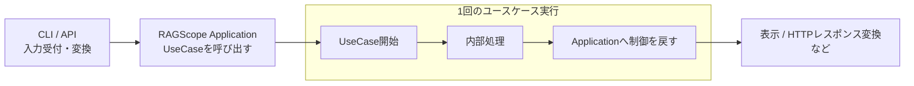

# ユースケース設計（基本設計）

> [!abstract] この文書の役割
> 利用者がRAGScopeへ依頼するトップレベルな操作と、操作ごとの入力・結果・主要な処理、1回の実行がどこからどこまでかを定義する。
>
> Haskellで成功・最終失敗をどう表現し、Feature固有failureや`ErrorType`へどう接続するかは[ユースケース詳細設計](./ユースケース詳細設計.md)を参照する。

## 1. ユースケースの共通ルール

### 1.1 何をユースケースとするか

| 対象 | 扱い |
|---|---|
| 利用者がRAGScopeへ依頼するトップレベルの操作 | ユースケース |
| Embedding生成、データベース検索、文書チャンク化など、ユースケースから呼び出す処理 | ユースケースを構成する内部処理 |
| CLIやAPIによる入力の受け取りと変換 | ユースケース実行の外側 |
| ユースケース終了後の表示やHTTPレスポンスへの変換 | ユースケース実行の外側 |

同じ利用者操作をCLI、APIなど異なるインターフェースから実行しても、同じユースケースとして扱う。

### 1.2 1回の実行境界

1回のユースケース実行は、RAGScope Applicationがユースケースを呼び出した時点で開始し、その呼び出しからRAGScope Applicationへ制御が戻った時点で終了する。RAGScope Applicationがユースケースを呼び出さなかった場合、ユースケース実行は発生しない。

各ユースケースの「入力」には、RAGScope Applicationがユースケースを呼び出すときに渡す値を定義する。「結果」には、ユースケースがRAGScope Applicationへ返す値、またはRAGScope Applicationへ制御を戻す前に作る状態を定義する。

### 1.3 成功と最終失敗

| 状況 | ユースケース実行の判定 |
|---|---|
| 「結果」に定義した値をApplicationへ返した | 成功 |
| 「結果」に定義した状態を作ってApplicationへ制御を戻した | 成功 |
| 内部処理で失敗したが、再試行や代替処理によって最終的な結果が成立した | 成功 |
| 最終的に「結果」を成立させられなかった | 最終失敗 |

内部処理で失敗したこと自体と、ユースケース全体が最終失敗したことは区別する。成功と最終失敗をHaskell実装でどうApplicationへ返すかは[ユースケース詳細設計](./ユースケース詳細設計.md)で定める。

## 2. ユースケース

| ドメイン領域 | ユースケース | 利用者の目的 |
|---|---|---|
| 文書 | [文書を検索可能にする](#211-文書を検索可能にする) | Markdown文書をdense検索の検索対象として利用できる状態にする |
| 検索・回答生成 | [dense検索する](#221-dense検索する) | 質問に近い文書チャンクを順位付きで取得する |

### 2.1 文書

#### 2.1.1 文書を検索可能にする

| 項目 | 内容 |
|---|---|
| 目的 | Markdown文書をdense検索の検索対象として利用できる状態にする |
| 入力 | 取り込み対象のMarkdown文書 |
| 結果 | 文書チャンクとそのEmbeddingが保存され、dense検索で利用できる状態になる |

主要な処理は次のとおりである。文書の読み込み、空本文の判定、チャンク化の条件は[文書処理設計](./features/文書処理設計.md)に従う。

1. Markdown文書をUTF-8として読み込む。UTF-8として読み込めない場合、または読み込んだ本文のUnicodeコードポイント数が0件の場合は、文書チャンクを生成せず終了する。
2. 本文を1,000 Unicodeコードポイントごとに、チャンク間の重複範囲を設けず文書チャンクへ分割する。
3. 各文書チャンクのEmbeddingを生成する。
4. 文書チャンクとEmbeddingを保存し、dense検索で利用できる状態にする。

### 2.2 検索・回答生成

#### 2.2.1 dense検索する

| 項目 | 内容 |
|---|---|
| 目的 | 質問に近い文書チャンクを順位付きで取得する |
| 前提 | dense検索で利用できる検索対象データが保存済みである |
| 入力 | 空でない質問1件 |
| 結果 | 順位付きの文書チャンク。0件も正常な結果として扱う |

主要な処理は次のとおりである。

1. 質問のEmbeddingを生成する。
2. 質問Embeddingを使って保存済みの文書チャンクをexact vector searchする。
3. 検索結果を順位付きの文書チャンクとして返す。

## 関連文書

- [RAGScope要求定義](../RAGScope要求定義.md)
- [RAGScopeドメインモデル](./RAGScopeドメインモデル.md)
- [ユースケース詳細設計](./ユースケース詳細設計.md)
- [システムアーキテクチャ](./システムアーキテクチャ.md)
- [機能設計](./features/README.md)
- [実行追跡・構造化ログ設計](./logging/README.md)
