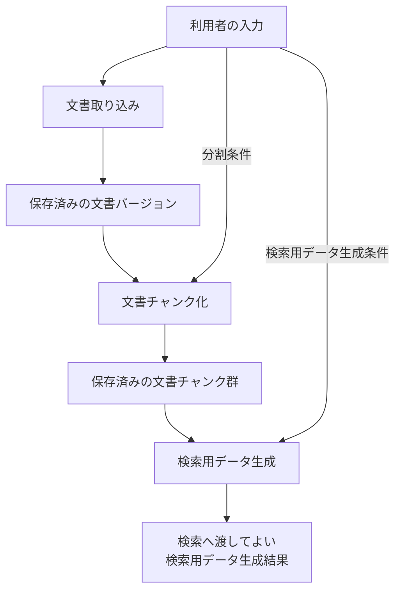

# ユースケース設計

> [!abstract] この文書の役割
> 利用者がRAGScopeへ依頼するトップレベルな操作と、操作ごとの入力・成功結果・主要な処理、1回の実行境界を定義する。
> 個別機能の責務や処理規則は各機能設計を正本とし、この文書では利用者の目的を達成するためにそれらをどう組み合わせるかを定義する。

## 1. ユースケースの考え方

この文書では、利用者がRAGScopeへ依頼する目的単位の操作をユースケースとする。文書取り込み、文書チャンク化、検索用データ生成などは、利用者が直接それぞれの内部処理を操作することを前提にせず、ユースケースから必要に応じて呼び出す機能として扱う。

同じ利用者操作をRAGScope CLIまたはRAGScope APIから実行しても、同じユースケースとして扱う。CLIの引数、APIのSchemaなどインターフェース固有の入力形式は、この文書では定義しない。

1回のユースケース実行は、RAGScopeアプリケーションがユースケースの入力を受け取った時点で開始し、成功結果を作るか最終失敗を返して呼び出し元へ制御を戻した時点で終了する。

## 2. ユースケース一覧

| ユースケース | 利用者の目的 | 主な内部機能 |
|---|---|---|
| [文書を検索可能にする](#3-文書を検索可能にする) | Markdown / TXTの技術文書を取り込み、指定した条件で検索に使用できる状態にする | 文書取り込み、文書チャンク化、検索用データ生成 |

現時点では、文書の内容変更、分割条件の変更、検索用データ生成条件の変更は、別のトップレベルなユースケースへ分けず、「文書を検索可能にする」の再実行として扱う。

## 3. 文書を検索可能にする

### 3.1 目的と範囲

利用者が指定したMarkdown / TXTの技術文書を文書バージョンとして保存し、指定した分割条件で文書チャンクを生成したうえで、全文検索やdense検索に必要な検索用データを生成し、検索で使用できる状態にする。

このユースケースは、文書を検索可能な状態へ準備するところまでを扱う。質問を使った検索の実行、回答生成、評価、実験は扱わない。

このユースケースは、文書に関する要求 `REQ-DOC-001` から `REQ-DOC-005` を、[文書ドメインの機能設計](./domains/documents/README.md)で定義する各機能を組み合わせて実現する。

### 3.2 利用者が指定する入力

| 入力 | 内容 |
|---|---|
| 技術文書 | 検索可能にするMarkdown / TXTの文書 |
| 文書集合を識別するための情報 | その文書をどの文書集合として扱うかを特定するための情報 |
| 文書を識別するための情報 | 新しい文書か、既存文書の新しい版かを区別できるようにするための情報 |
| 分割条件 | 文書バージョンをどの条件で文書チャンクへ分割するか |
| 検索用データ生成条件 | 生成する検索用データの種類と生成条件。必要な検索方式に応じて1件以上指定する |

ここでは利用者が指定する情報の意味だけを定義する。文書集合や文書を識別する具体的な項目、CLIの引数、APIの項目名、既定値の有無は、この文書では固定しない。

### 3.3 成功結果

次をすべて満たした状態を、このユースケースの成功結果とする。

1. 技術文書が、文書集合と文書に関連付いた保存済みの文書バージョンとして扱える。
2. その文書バージョンと指定した分割条件に対応する文書チャンク群が保存されている。
3. 指定した各検索用データ生成条件に対応する検索用データ生成結果が保存され、検索へ渡してよい状態になっている。
4. 検索用データ生成結果から、生成元の文書チャンク、文書バージョン、分割条件、検索用データ生成条件へ追跡できる。

成功時にどの識別子や値を呼び出し元へ返すかという正確な型は、実装時のコードとインターフェース契約で定義する。

### 3.4 処理の流れ

```mermaid
flowchart TD
    Input["利用者の入力"]
    Ingest["文書取り込み"]
    Version["保存済みの文書バージョン"]
    Chunk["文書チャンク化"]
    Chunks["保存済みの文書チャンク群"]
    SearchData["検索用データ生成"]
    Result["検索へ渡してよい<br>検索用データ生成結果"]

    Input --> Ingest
    Ingest --> Version
    Version --> Chunk
    Input -->|"分割条件"| Chunk
    Chunk --> Chunks
    Chunks --> SearchData
    Input -->|"検索用データ生成条件"| SearchData
    SearchData --> Result
```

1. 文書取り込みへ、技術文書と文書集合・文書を識別するために必要な情報を渡す。
2. 文書取り込みから、保存済みの文書バージョンを得る。
3. 文書チャンク化へ、文書バージョンと分割条件を渡す。
4. 文書チャンク化から、検証と保存が完了した文書チャンク群を得る。
5. 検索用データ生成へ、文書チャンク群と各検索用データ生成条件を渡す。
6. 指定した検索用データ生成条件すべてについて、検索へ渡してよい検索用データ生成結果が得られたら成功とする。

文書取り込み、文書チャンク化、検索用データ生成の具体的な処理規則、再利用条件、不変条件、失敗条件は各機能の詳細設計を正本とし、この文書へ重複して定義しない。

### 3.5 内容や条件を変更した場合

同じユースケースを再実行したときは、入力の変更箇所に応じて各機能の既存結果を再利用するか、新しい結果を生成する。

| 変更 | 扱い |
|---|---|
| 文書内容が同じ | 文書取り込みの規則に従い、既存の文書バージョンを再利用できる |
| 文書内容が変わった | 新しい文書バージョンとして扱い、その版に対応する文書チャンクと検索用データを生成する |
| 分割条件が変わった | 文書バージョンは変更せず、新しい分割条件に対応する文書チャンクと検索用データを生成する |
| 検索用データ生成条件が変わった | 文書バージョンと文書チャンクを再利用し、新しい条件に対応する検索用データ生成結果を生成する |

過去の文書バージョン、文書チャンク、検索用データ生成結果を上書きして、過去の実験が参照する内容や条件を変更しない。

### 3.6 失敗時の扱い

いずれかの内部機能が、そのユースケース実行で必要な成功結果を作れない場合は、後続の内部機能へ進めず、このユースケースの成功結果を返さない。

前段の内部機能ですでに保存が完了した有効な結果は、ユースケース全体が失敗したことだけを理由に無効化または削除しない。再実行時に各機能の再利用条件を満たす場合は、その結果を再利用できる。

具体的な処理失敗、再試行、タイムアウト、最終失敗の扱いは、各機能設計と[RAGScopeアプリケーション失敗設計](./RAGScopeアプリケーション失敗設計.md)を正本とする。

## 関連文書

- [RAGScope要求定義](../RAGScope要求定義.md)
- [RAGScope用語集](../RAGScope用語集.md)
- [RAGScopeドメインモデル](./RAGScopeドメインモデル.md)
- [システムアーキテクチャ](./システムアーキテクチャ.md)
- [文書ドメインの機能設計](./domains/documents/README.md)
- [RAGScopeアプリケーション失敗設計](./RAGScopeアプリケーション失敗設計.md)
- [Observability設計](./observability/README.md)
