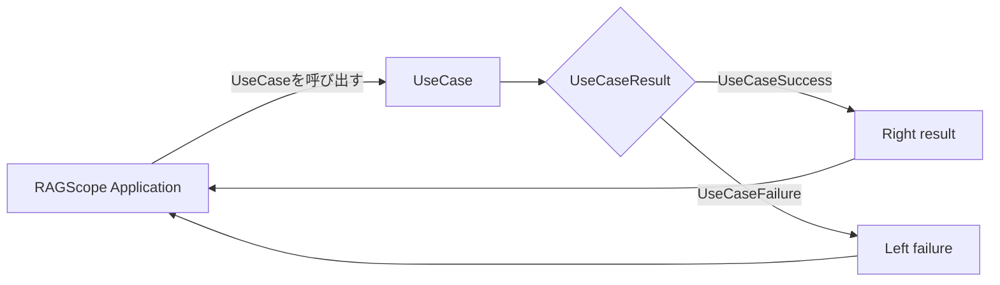

# ユースケース詳細設計

> [!abstract] この文書の役割
> [ユースケース基本設計](./ユースケース基本設計.md)で定義する`UseCaseResult`と、それを必要な場合だけ内包する1回の利用者操作全体の`OperationResult`との関係を、RAGScopeアプリケーションのHaskell実装でどのように表現し受け渡すかを定義する。各[機能設計](./features/README.md)で定義する具体的なユースケース失敗を、ユースケース境界でどう表現するかも扱う。
>
> 個々のユースケースで何を`UseCaseSuccess`・`UseCaseFailure`とみなすか、利用者操作全体で何を`OperationSuccess`・`OperationFailure`とみなすかは基本設計、具体的にどのような失敗理由があるかは各機能設計を正本とする。正確なHaskell型・constructor・関数定義は実装コードを正本とし、この文書では実装が守る表現と受け渡しの契約を扱う。

## 1. 成功と失敗の受け渡し

### 1.1 `UseCaseResult`

1回のユースケース実行の結果は、概念上次の`UseCaseResult`として扱う。

```text
UseCaseResult
├─ UseCaseSuccess
└─ UseCaseFailure
```

`UseCaseSuccess`と`UseCaseFailure`は**ユースケース実行結果の区分**であり、成功時の具体的な結果値の型や、失敗理由を表す具体的なfailure型の名称ではない。

RAGScope Applicationとの呼び出し境界では、この結果をHaskellの`Either failure result`で表す。`Right result`を`UseCaseSuccess`、`Left failure`を`UseCaseFailure`として扱う。



この`Either`は**ユースケース実行の結果だけ**を表す。CLIやAPIのrouting・command判定、入力の変換・検証、ユースケース終了後の結果処理など、[ユースケース基本設計](./ユースケース基本設計.md)でユースケース実行の外側と定める処理の失敗を、ユースケース固有のfailure型へ混在させない。

一般概念として`FeatureResult`や`FeatureFailure`を`UseCaseResult`の成功・失敗区分に使用しない。Featureは、ユースケース、具体的なfailure型、eventなどを所有する設計・実装上の単位である。ユースケースを実行した結果の区分は`UseCaseSuccess`または`UseCaseFailure`で表す。

### 1.2 `OperationResult`との関係

[ユースケース基本設計](./ユースケース基本設計.md)で定義する1回の利用者操作全体は、必要な場合だけ`UseCaseResult`を内包する外側の結果を持つ。この結果を概念上`OperationResult`と呼び、次の2区分とする。

```text
OperationResult
├─ OperationSuccess
└─ OperationFailure
```

関係は次のとおりである。

```text
1回の利用者操作
├─ routing / command判定 / 入力処理
├─ UseCase（必要な場合）
│    └─ UseCaseResult
│         ├─ UseCaseSuccess
│         │    └─ Haskell: Right result
│         └─ UseCaseFailure
│              └─ Haskell: Left failure
├─ UseCase終了後の結果処理
└─ OperationResult
     ├─ OperationSuccess
     └─ OperationFailure
```

UseCaseを実行して`Left failure`となった場合、その`UseCaseResult`は`UseCaseFailure`であり、Operation全体は`OperationFailure`となる。`Left`に保持するfailure値は、なぜそのUseCaseが`UseCaseFailure`となったかを表す具体的な失敗理由である。

UseCaseが`Right result`となった場合、その`UseCaseResult`は`UseCaseSuccess`である。ただし、それだけでは`OperationSuccess`は確定しない。UseCase前後を含む操作固有処理が完了し、利用者が依頼した結果が成立した時点で`OperationSuccess`となる。routing・command判定、入力の変換・検証、ユースケース終了後の結果処理で発生した通常の失敗は、ユースケース固有failureへ変換せず`OperationFailure`の原因として扱う。UseCaseを呼び出さずに入力処理などで`OperationFailure`となる操作もある。

`UseCaseResult`、`UseCaseSuccess`、`UseCaseFailure`、`OperationResult`、`OperationSuccess`、`OperationFailure`は、この設計で結果区分の意味を示すための概念名である。UseCase境界はHaskellの`Either failure result`で表す。`OperationResult`の正確なHaskell型名、constructor名、外側のfailure型の構造は、RAGScope Applicationの実行・失敗境界を実装するコードとテストを正本として確定する。

特定の利用者操作へ属さないアプリケーションやプロセスの起動・終了などのライフサイクル結果は`OperationResult`へ含めない。

通常のユースケース失敗を例外によってRAGScope Applicationへ伝達しない。ユースケース内部で失敗を短絡的に伝播させる実装には`ExceptT`を使用できるが、その基底Monadはこの設計では固定しない。

例外は通常の`UseCaseFailure`とは別の実行上の事象として扱う。同期例外・非同期例外をどこで捕捉し、`OperationFailure`とどう関係付けるかは例外処理の設計で定める。logging基盤自身の失敗を`OperationResult`へどう反映するかも、このユースケース詳細設計では固定しない。

## 2. ユースケース固有の失敗理由の表現

具体的にどの状況をユースケースの失敗とするかは、その処理を担当する各機能設計で定める。この詳細設計では、その具体的な失敗理由をユースケース境界でどのようなHaskellの値として表現するかを定める。

各ユースケースは、`UseCaseFailure`となった理由をそのユースケース固有のfailure型で表す。failure型のconstructorは、各機能設計で定義された失敗理由を区別し、RAGScope Applicationがその失敗を扱うために必要な情報を保持できる。

たとえばdense検索UseCaseでは、具体的なfailure型を`DenseSearchFailure`とする。`DenseSearchFailure`は`UseCaseFailure`という結果区分そのものではなく、dense検索UseCaseが`UseCaseFailure`となった理由を表す値の型である。

```text
各機能設計で定義した具体的な失敗理由
                ↓
      DenseSearchFailure など
                ↓
       Left failureとして返す
                ↓
          UseCaseFailure
                ↓
       OperationFailureの原因
```

ユースケース固有のfailure型は、そのユースケースを所有するFeatureの`RAGScope.<Feature>.Failure`に置く。Featureはfailure型の所有単位であり、`FeatureFailure`という共通の結果区分を導入することは意味しない。どの失敗条件にどのconstructorを対応させるかは各機能設計と実装を整合させ、正確な型定義とconstructorは実装コードを正本とする。

## 3. `ErrorType`への変換契約

ユースケースが`Left`として返す具体的なfailure型は、failure値だけから対応する`ErrorType`を一意に得られるものとする。この共通変換契約を`ToErrorType`で表す。

```text
UseCase固有failure
      │
      │ ToErrorType
      ▼
   ErrorType
```

Haskell実装上の契約は、概念的には次の変換を提供する。

```haskell
class ToErrorType failure where
    toErrorType :: failure -> ErrorType
```

この宣言は責務と入出力を示すための概念表現であり、正確なclass・関数定義は実装コードを正本とする。

`ToErrorType`の変換には、RAGScope Applicationの実行状況など追加のContextを要求しない。同じ失敗値からは同じ`ErrorType`が得られる純粋な変換とし、`ToErrorType`を持つfailure型のすべての値から`ErrorType`を得られるものとする。

`ErrorType`を必要とする公開境界は、具体的なUseCase固有failure型へ固定せず、`ToErrorType`を満たすfailureを受け取り、その境界内で`toErrorType`を適用する。変換より下位の処理にはUseCase固有failureではなく`ErrorType`を渡す。

ユースケース失敗を実行追跡へ反映するときは、[実行追跡・構造化ログ契約設計](./logging/実行追跡・構造化ログ契約設計.md)で定義するユースケース実行`span`を、その`UseCaseResult`に従って更新する。1回の利用者操作全体を表すroot `span`の結果は`UseCaseResult`だけから決めず、操作全体の`OperationResult`に従う。`ToErrorType`による変換を実行追跡のどのHaskell公開APIで行うかは、Observabilityの実装境界を定めるコードとテストを正本とする。

ユースケース外のfailureも、そのfailureを扱う境界で`ErrorType`が必要と決まった場合には同じ契約を利用できる。`ToErrorType`を利用すること自体は、そのfailureを構造化ログへ記録することや`trace`・`span`で追跡することを意味しない。

### 3.1 UseCase固有failureを追加するときの実装契約

Featureが所有するUseCaseに新しいfailureを追加するときは、次を揃える。

1. どの条件をUseCaseの失敗とするかを、その処理を担当する機能設計で定義する。
2. 機能設計で定義した失敗理由を表現するUseCase固有failure型とconstructorを`RAGScope.<Feature>.Failure`に実装する。
3. 同じmoduleにそのfailure型の`ToErrorType` instanceを実装し、各failure値を機能設計で定めた失敗理由に対応する`ErrorType`へ変換する。

正確なfailure型、constructor、`ToErrorType` instanceの定義は実装コードを正本とする。instanceの配置とpackage依存は4節に従う。

### 3.2 構造化ログとの関係

ユースケースが`Left`として返す具体的なfailure型には`ToErrorType`を要求するが、そのfailure型自身には`ToLogSpec`を要求しない。

ユースケースの失敗を構造化ログへ記録する場合は、その失敗を表すFeature eventとして記録する。UseCase固有failureを追加しただけでは構造化ログイベントは追加されない。失敗をログへ記録するFeatureは、その失敗を表すFeature eventと、Feature eventからLogging共通表現へ変換する契約を別に定義する。

ユースケース失敗イベントをどの`span`へ関連付け、同じ失敗を表す`error_type`を`span`とログでどう共有するかは[実行追跡・構造化ログ契約設計](./logging/実行追跡・構造化ログ契約設計.md)を正本とする。具体的なFeature eventとその属性は各機能設計、正確なLogging変換契約と受け渡しAPIは実装コードを正本とする。

## 4. `ErrorType`と`ToErrorType`の配置

`ErrorType`と`ToErrorType`は、Logging、Tracing、Observability、UseCase固有failureのいずれにも所有させず、共通local package `ragscope-error`へ置く。

```text
ragscope-error
└─ public: main
   └─ RAGScope.ErrorType
      ├─ ErrorType
      └─ ToErrorType

ragscope
└─ private: ragscope-features
   └─ RAGScope.<Feature>.Failure
      ├─ <UseCase>Failure
      └─ ToErrorType instance
```

`ToErrorType <UseCaseFailureType>`のinstanceは、その具体的なfailure型を定義する`RAGScope.<Feature>.Failure`へ置く。これにより、Feature自身が所有するUseCaseの具体的な失敗理由から共通の失敗理由への分類を定義し、instanceをorphanにしない。

`ragscope-features`はこの契約を利用するため`ragscope-error`へ依存する。Observability、Tracing、Loggingなど他packageの依存は、それぞれが`RAGScope.ErrorType`を直接importする必要がある場合に各設計で定める。

`ErrorType`の内部表現はこの文書では固定しない。

## 関連文書

- [ユースケース基本設計](./ユースケース基本設計.md)
- [機能設計](./features/README.md)
- [システムアーキテクチャ](./システムアーキテクチャ.md)
- [実行追跡・構造化ログ設計](./logging/README.md)