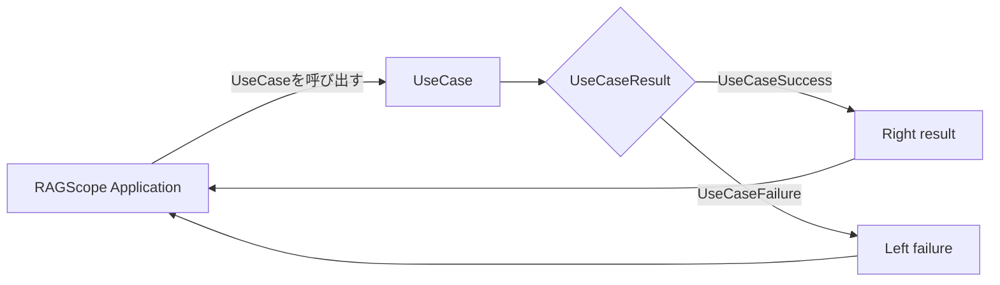

# ユースケース詳細設計

> [!abstract] この文書の役割
> [ユースケース基本設計](./ユースケース基本設計.md)で定義する`UseCaseResult`を、RAGScopeアプリケーションのHaskell実装でどのように表現し、ユースケース境界から受け渡すかを定義する。各[機能設計](./features/README.md)で定義する具体的なユースケース失敗のHaskell表現と、共通の[ErrorType変換詳細設計](./ErrorType変換詳細設計.md)への接続も扱う。
>
> 個々のユースケースで何を`UseCaseSuccess`・`UseCaseFailure`とみなすかは基本設計、具体的にどのような失敗理由があるかは各機能設計、1回の利用者操作全体の実行結果は[利用者操作基本設計](./利用者操作基本設計.md)、利用者操作側でのHaskell表現とfailureの保持方法は[利用者操作詳細設計](./利用者操作詳細設計.md)を正本とする。正確なHaskell型・constructor・関数定義は実装コードを正本とし、この文書では実装が守る表現と受け渡しの契約を扱う。

## 1. 成功と失敗の受け渡し

### 1.1 `UseCaseResult`

1回のユースケース実行の結果は、概念上次の`UseCaseResult`として扱う。

```text
UseCaseResult
├─ UseCaseSuccess
└─ UseCaseFailure
```

`UseCaseSuccess`と`UseCaseFailure`は**ユースケース実行結果の区分**であり、成功時の具体的な結果値の型や、失敗理由を表す具体的なfailure型の名称ではない。

RAGScope Applicationとの呼び出し境界では、この結果をHaskellの`Either failure result`で表す。`Right result`を`UseCaseSuccess`、`Left failure`を`UseCaseFailure`として扱う。



この`Either`は**ユースケース実行の結果だけ**を表す。CLIやAPIのrouting・command判定、入力の変換・検証、ユースケース終了後の結果処理など、[ユースケース基本設計](./ユースケース基本設計.md)でユースケース実行の外側と定める処理の失敗を、ユースケース固有のfailure型へ混在させない。

### 1.2 利用者操作全体への受け渡し

利用者操作全体は必要な場合だけUseCaseを実行し、その`UseCaseResult`を内側の結果として受け取る。`Left failure`によって`UseCaseFailure`となった場合、そのfailure値はRAGScope Applicationへ返される。利用者操作側は、その具体的なfailure値を失わずに操作固有failureの対応するconstructorで包み、外側の`OperationFailure`として扱う。正確な保持・受け渡し規則は[利用者操作詳細設計](./利用者操作詳細設計.md)を正本とする。

routing・command判定、入力の変換・検証、ユースケース終了後の結果処理などUseCase外の通常失敗を、UseCase固有failureへ変換しない。

通常のユースケース失敗を例外によってRAGScope Applicationへ伝達しない。ユースケース内部で失敗を短絡的に伝播させる実装には`ExceptT`を使用できるが、その基底Monadはこの設計では固定しない。同期例外・非同期例外を利用者操作全体でどう扱うかは[利用者操作詳細設計](./利用者操作詳細設計.md)で定める。

## 2. ユースケース固有の失敗理由の表現

具体的にどの状況をユースケースの失敗とするかは、その処理を担当する各機能設計で定める。この詳細設計では、その具体的な失敗理由をユースケース境界でどのようなHaskellの値として表現するかを定める。

各ユースケースは、`UseCaseFailure`となった具体的な理由を、そのユースケース固有のfailure型の値として返す。各機能設計で区別する失敗理由をfailure型のconstructorで表す。constructorに値を保持させる場合は、その値が表す情報を各機能設計で定める。正確な型、constructor、fieldは実装コードを正本とする。

たとえばdense検索UseCaseの具体failure型を`DenseSearchFailure`と実装する場合、`DenseSearchFailure`は`UseCaseFailure`という結果区分そのものではなく、dense検索UseCaseが`UseCaseFailure`となった具体的な理由を表す値の型である。

```text
各機能設計で定義した具体的な失敗理由
                ↓
       UseCase固有failure値
                ↓
       Left failureとして返す
                ↓
          UseCaseFailure
                ↓
        Applicationへ返す
```

`Left failure`を受け取った後に利用者操作全体の失敗へどう反映するかは[利用者操作詳細設計](./利用者操作詳細設計.md)で定める。

ユースケース固有のfailure型は、そのユースケースを所有するFeatureの`RAGScope.<Feature>.Failure`に置く。Featureは、ユースケースとその具体的なfailure型を所有する設計・実装上の単位である。各機能設計で定義した失敗理由を識別できるconstructorをこのmoduleに実装する。

## 3. 共通`ErrorType`変換との接続

ユースケースが`Left`として返す具体的なfailure型は、その失敗理由を`error_type`として観測するため、[ErrorType変換詳細設計](./ErrorType変換詳細設計.md)で定義する共通`ToErrorType`契約へ接続する。

UseCase固有failure型に対する`ToErrorType` instanceは、そのfailure型を定義する`RAGScope.<Feature>.Failure`へ置く。UseCase固有failure型自身には、failureであることだけを理由に`ToLogSpec`を要求しない。

ユースケースの失敗を構造化ログへ記録する場合は、その失敗を表すFeature eventをFeature側で定義し、そのeventを`ToLogSpec`によって`LogSpec`へ変換する。`ToLogSpec`による変換は[構造化ログイベント変換設計](./logging/構造化ログイベント変換設計.md)、ユースケース失敗イベントを関連付ける`span`と同じ`error_type`を共有する規則は[実行追跡・構造化ログ契約設計](./logging/実行追跡・構造化ログ契約設計.md)を正本とする。

## 関連文書

- [ユースケース基本設計](./ユースケース基本設計.md)
- [利用者操作基本設計](./利用者操作基本設計.md)
- [利用者操作詳細設計](./利用者操作詳細設計.md)
- [ErrorType変換詳細設計](./ErrorType変換詳細設計.md)
- [機能設計](./features/README.md)
- [システムアーキテクチャ](./システムアーキテクチャ.md)
- [実行追跡・構造化ログ設計](./logging/README.md)
- [構造化ログイベント変換設計](./logging/構造化ログイベント変換設計.md)
