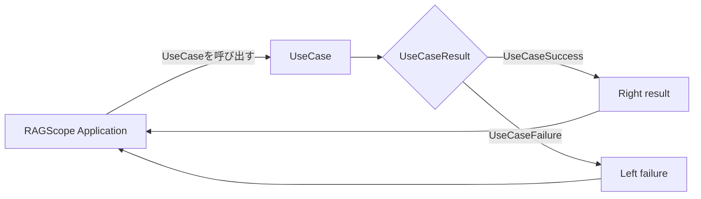

# ユースケース詳細設計

> [!abstract] この文書の役割
> [ユースケース基本設計](./ユースケース基本設計.md)で定義する`UseCaseResult`を、RAGScopeアプリケーションのHaskell実装でどのように表現し、ユースケース境界から受け渡すかを定義する。各ユースケースで定義する具体的な失敗のHaskell表現、そのfailure値を名前付き`ErrorClassifier`で`ErrorType`へ分類する規則、実行に必要な依存能力の所有と受け渡しも扱う。
>
> 個々のユースケースで何を`UseCaseSuccess`・`UseCaseFailure`とみなし、具体的にどのような失敗理由があるかは基本設計とそのユースケースを構成する個別処理の設計、1回の利用者操作全体の実行結果は[利用者操作基本設計](./利用者操作基本設計.md)、利用者操作側でのHaskell表現とfailureの保持方法は[利用者操作詳細設計](./利用者操作詳細設計.md)を正本とする。正確なHaskell型・constructor・関数定義は実装コードを正本とし、この文書では実装が守る表現と受け渡しの契約を扱う。

## 1. 成功と失敗の受け渡し

### 1.1 `UseCaseResult`

1回のユースケース実行の結果は、概念上次の`UseCaseResult`として扱う。

```text
UseCaseResult
├─ UseCaseSuccess
└─ UseCaseFailure
```

`UseCaseSuccess`と`UseCaseFailure`は**ユースケース実行結果の区分**であり、成功時の具体的な結果値の型や、失敗理由を表す具体的なfailure型の名称ではない。

RAGScope Applicationとの呼び出し境界では、この結果をHaskellの`Either failure result`で表す。`Right result`を`UseCaseSuccess`、`Left failure`を`UseCaseFailure`として扱う。



この`Either`は**ユースケース実行の結果だけ**を表す。CLIやAPIのrouting・command判定、入力の変換・検証、ユースケース終了後の結果処理など、[ユースケース基本設計](./ユースケース基本設計.md)でユースケース実行の外側と定める処理の失敗を、ユースケース固有のfailure型へ混在させない。

### 1.2 利用者操作全体への受け渡し

利用者操作全体は必要な場合だけUseCaseを実行し、その`UseCaseResult`を内側の結果として受け取る。UseCaseが`Left failure`を返した場合、RAGScope Applicationはその具体的な`failure`値を受け取る。

UseCaseは`Either failure result`として自身の成功・失敗を返すまでを責務とし、`failure`を`ErrorType`、構造化ログ、Tracingなどの観測用表現へ変換しない。利用者操作も失敗として終了する場合、Applicationは同じ`failure`値と、そのfailure所有側が提供する対応`ErrorClassifier failure`を共通`OperationFailure`で包んで返す。具体的なfailure型に応じたOperation内の処理は、そのfailure値を具体型のまま受け取れる場所で必要に応じて行う。

```haskell
Left
  (OperationFailure
    failure
    useCaseErrorClassifier)
```

`failure`を先に`ErrorType`へ分類してから`OperationFailure`へ入れない。`OperationFailure`は具体的なfailure値そのものを保持するため、failureのconstructor引数として保持している詳細値も失わない。正確な保持・受け渡し規則は[利用者操作詳細設計](./利用者操作詳細設計.md)を正本とする。

routing・command判定、入力の変換・検証、ユースケース終了後の結果処理などUseCase外の通常失敗を、UseCase固有failureへ変換しない。

通常のユースケース失敗をExceptionによってRAGScope Applicationへ伝達しない。ユースケース内部で失敗を短絡的に伝播させる実装には`ExceptT`を使用できるが、その基底Monadはこの設計では固定しない。同期Exception・非同期Exceptionを利用者操作全体でどう扱うかは[利用者操作詳細設計](./利用者操作詳細設計.md)で定める。

### 1.3 UseCaseが必要とする依存能力の受け渡し

各UseCaseが実行時に必要とする能力は、Application全体の環境を直接受け取るのではなく、そのUseCaseが所有する依存recordへ必要な能力だけをまとめて受け取る。UseCaseはApplication全体の`AppEnv`のような型をimportせず、`ragscope-application`へ依存しない。

dense検索UseCaseを例にすると、概念上は次のような形になる。

```haskell
data SearchDependencies m =
  SearchDependencies
    { observability :: Observability m SearchFailure
    , logger :: Logger m SearchEvent
    -- dense検索UseCaseが実際に必要とする他の能力
    }

runSearch
  :: SearchDependencies m
  -> SearchInput
  -> m (Either SearchFailure SearchResult)
```

`Observability m SearchFailure`は、`SearchFailure`を返す処理を追跡できる能力である。UseCase自身は`ErrorClassifier SearchFailure`、`ErrorType`、`SpanOutcome`、Tracing Portを受け取らない。Application composition rootが`SearchFailure`用ClassifierとTracing実装からこのObservability値を組み立てる。

`SearchDependencies`は例示名であり、正確な型名・field・module名は実装コードで確定する。依存recordには、そのUseCaseが実際に必要とする能力だけを含める。別UseCaseやApplication全体だけが必要とする能力を、共通環境だからという理由でUseCaseへ公開しない。

Applicationのcomposition rootは、UseCase固有のClassifierから組み立てたObservability、UseCase別Logger、その他そのUseCaseが必要とする具体的な能力を組み立て、UseCase所有の依存recordを構築してUseCaseへ渡す。UseCase別Loggerの組み立ては[RAGScopeアプリケーション構造化ログイベント変換詳細設計](./logging/RAGScopeアプリケーション構造化ログイベント変換詳細設計.md)に従う。

この依存recordはUseCase実行に必要な能力を表すものであり、利用者操作全体の依存を表すものではない。routing・command判定、入力変換・検証、UseCase後の結果処理などOperation側の処理に必要な依存をどの型でまとめるかは別の設計判断とする。Application全体の長寿命な依存を保持する`AppEnv`を導入するかどうかも、このUseCase依存recordの採用だけを理由には決めない。将来`AppEnv`を導入する場合も、UseCaseへその値自体を渡すことを前提にしない。

## 2. ユースケース固有の失敗理由の表現

具体的にどの状況をユースケースの失敗とするかは、そのユースケースの基本設計と、必要に応じてユースケースを構成する個別処理の設計で定める。この詳細設計では、その具体的な失敗理由をユースケース境界でどのようなHaskellの値として表現するかを定める。

各ユースケースは、`UseCaseFailure`となった具体的な理由を、そのユースケース固有のfailure型の値として返す。ユースケースの設計で区別する失敗理由をfailure型のconstructorで表す。constructorに値を保持させる場合は、その値が表す情報をユースケースの設計で定める。正確な型、constructor、fieldは実装コードを正本とする。

たとえばdense検索UseCaseの具体failure型を`DenseSearchFailure`と実装する場合、`DenseSearchFailure`は`UseCaseFailure`という結果区分そのものではなく、dense検索UseCaseが`UseCaseFailure`となった具体的な理由を表す値の型である。

```text
ユースケースの設計で定義した具体的な失敗理由
                ↓
       UseCase固有failure値
                ↓
       Left failureとして返す
                ↓
          UseCaseFailure
                ↓
        Applicationへ返す
```

`Left failure`を受け取った後に利用者操作全体の失敗へどう反映するかは[利用者操作詳細設計](./利用者操作詳細設計.md)で定める。

ユースケース固有のfailure型は、そのUseCaseが所有する`RAGScope.<UseCase>.Failure`に置く。ユースケースの設計で定義した失敗理由を識別できるconstructorをこのmoduleに実装する。

## 3. `ErrorType`への分類

ユースケースが`Left failure`として返す具体的なfailure型を`error_type`として観測する場合、そのUseCaseはfailure型そのものとは別に、名前付き`ErrorClassifier`値を提供する。

概念上は次の形である。

```haskell
denseSearchErrorClassifier
  :: ErrorClassifier DenseSearchFailure
```

UseCase固有failure型は`RAGScope.<UseCase>.Failure`が所有し、そのfailureから`ErrorType`への分類規則は`RAGScope.<UseCase>.ErrorClassification`が所有する。

```text
RAGScope.<UseCase>.Failure
  <UseCase>Failure

RAGScope.<UseCase>.ErrorClassification
  <useCase>ErrorClassifier
    :: ErrorClassifier <UseCase>Failure
```

`RAGScope.<UseCase>.Failure`は`RAGScope.ErrorType`をimportしない。`RAGScope.<UseCase>.ErrorClassification`がfailure型と`RAGScope.ErrorType`をimportする。これにより、failure型自身へ観測用`ErrorType`の依存を持ち込まない。

UseCase本体はfailure値を返し、`ErrorClassifier`や`ErrorType`を直接扱わない。Application composition rootは名前付きClassifierとTracing実装を`makeObservability`へ渡し、そのUseCase向け`Observability m <UseCase>Failure`を組み立てる。

ユースケースの失敗を構造化ログへ記録する場合は、その失敗を表すUseCase eventをUseCase側で定義し、そのeventから`LogSpec`への純粋変換を提供する。失敗eventで`error_type`が必要な場合は、`RAGScope.<UseCase>.Logging`が同じ名前付きClassifierを利用する。failureが保持する詳細値を`error_type`以外の属性へ記録する場合は、eventまたは具体failureからその値を取得する。Classifierはその詳細値を消去・代替しない。

Applicationのcomposition rootは、eventから`LogSpec`への変換とLogging Runtimeが作る`Logger m LogSpec`を`contramap`で合成し、UseCaseが使う`Logger m <UseCaseEvent>`を作る。この変換境界は[RAGScopeアプリケーション構造化ログイベント変換詳細設計](./logging/RAGScopeアプリケーション構造化ログイベント変換詳細設計.md)、ユースケース失敗イベントを関連付ける`span`と同じ`error_type`を共有する規則は[実行追跡・構造化ログ契約設計](./実行追跡・構造化ログ契約設計.md)を正本とする。

この設計では`ToErrorType`型クラスやinstanceを導入しない。分類規則は名前付きClassifier値として静的に参照する。

## 関連文書

- [ユースケース基本設計](./ユースケース基本設計.md)
- [利用者操作基本設計](./利用者操作基本設計.md)
- [利用者操作詳細設計](./利用者操作詳細設計.md)
- [ErrorType変換詳細設計](./ErrorType変換詳細設計.md)
- [文書処理設計](./文書処理設計.md)
- [システムアーキテクチャ](./システムアーキテクチャ.md)
- [実行追跡・構造化ログ契約設計](./実行追跡・構造化ログ契約設計.md)
- [実行追跡設計](./tracing/README.md)
- [構造化ログ設計](./logging/README.md)
- [RAGScopeアプリケーション構造化ログイベント変換詳細設計](./logging/RAGScopeアプリケーション構造化ログイベント変換詳細設計.md)
