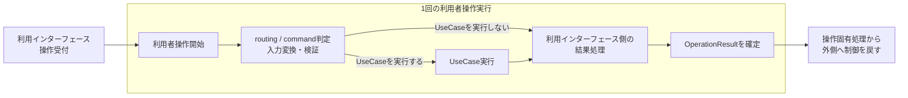

# 利用者操作基本設計

> [!abstract] この文書の役割
> 利用インターフェースが受け付けた1回のトップレベルな利用者操作について、操作固有処理の開始から終了までの実行境界、必要な場合に内包するUseCaseとの関係、操作全体の成功・失敗を定義する。
>
> 個々のUseCaseと`UseCaseResult`は[ユースケース基本設計](./ユースケース基本設計.md)、HaskellのUseCase境界と具体failureの受け渡しは[ユースケース詳細設計](./ユースケース詳細設計.md)、利用者操作全体のHaskell表現と共通`OperationFailure`によるfailureの保持方法は[利用者操作詳細設計](./利用者操作詳細設計.md)、具体的なfailureから共通`ErrorType`への分類は[ErrorType変換詳細設計](./ErrorType変換詳細設計.md)、利用者操作を`trace`・`span`で追跡する規則は[実行追跡・構造化ログ契約設計](./実行追跡・構造化ログ契約設計.md)を正本とする。

## 1. 利用者操作の実行境界

1回の利用者操作は、利用インターフェースが1件のトップレベルな操作について操作固有の処理を開始した時点で開始し、その操作を完了または失敗として終了して操作固有の処理から外側へ制御を戻した時点で終了する。

操作全体には、routing・command判定、入力の変換・検証、必要な場合のUseCase実行、利用インターフェース側の結果処理など、その操作に属する処理を含む。routingや入力検証などでUseCaseを呼び出さずに終了する場合もある。



この図の`UseCase実行`は、[ユースケース基本設計](./ユースケース基本設計.md)で定義する1回のユースケース実行境界である。利用者操作は、そのUseCase実行を必要な場合だけ内包する。

アプリケーションやプロセスの起動・終了など、特定の利用者操作へ属さないライフサイクルは、この実行境界に含めない。

## 2. `OperationResult`

1回の利用者操作全体の結果を、概念上`OperationResult`と呼ぶ。`OperationResult`は次のいずれかである。

```text
OperationResult
├─ OperationSuccess
└─ OperationFailure
```

利用者が依頼した結果を成立させ、操作固有の処理を完了できた場合を`OperationSuccess`とする。利用者が依頼した結果を成立させられなかった場合を`OperationFailure`とする。

UseCaseを実行した場合、その`UseCaseResult`は`OperationResult`を決める内側の結果として扱う。代表的な関係は次のとおりである。

| 状況 | `UseCaseResult` | `OperationResult` |
|---|---|---|
| routing・command判定、入力の変換・検証で失敗し、UseCaseを呼び出さない | 発生しない | `OperationFailure` |
| UseCaseが結果を成立させられない | `UseCaseFailure` | `OperationFailure` |
| UseCaseは結果を成立させたが、その後の操作固有の結果処理で失敗する | `UseCaseSuccess` | `OperationFailure` |
| UseCaseとその前後の操作固有処理が完了し、利用者が依頼した結果が成立する | `UseCaseSuccess` | `OperationSuccess` |

`UseCaseFailure`となった場合は`OperationFailure`となる。一方、`UseCaseSuccess`だけでは`OperationSuccess`は確定しない。

失敗を利用者へ通知するためのHTTPエラーレスポンスやCLIエラー表示を正常に構築できたこと自体は、`OperationFailure`となった利用者操作を`OperationSuccess`へ変更しない。`OperationResult`は、利用者が依頼した結果を成立させられたかで判定する。

UseCase前、UseCase、UseCase後で生じる具体的なfailureのうち、root `span`などへ`error_type`を設定するfailure型には、failure所有側が名前付き`ErrorClassifier failure`を提供する。利用者操作を失敗として終了する場合は、その具体的なfailure値と対応Classifierを共通`OperationFailure`に保持する。UseCase外のfailureをUseCase固有failureへ変換しない。

`OperationResult`のHaskell表現、`OperationFailure`が具体的なfailure値とClassifierを保持する方法、UseCase failureの受け渡し、Exceptionとlogging failureを含む実装上の失敗境界は[利用者操作詳細設計](./利用者操作詳細設計.md)を正本とする。

## 関連文書

- [ユースケース基本設計](./ユースケース基本設計.md)
- [ユースケース詳細設計](./ユースケース詳細設計.md)
- [利用者操作詳細設計](./利用者操作詳細設計.md)
- [ErrorType変換詳細設計](./ErrorType変換詳細設計.md)
- [システムアーキテクチャ](./システムアーキテクチャ.md)
- [実行追跡・構造化ログ設計](./logging/README.md)
- [実行追跡・構造化ログ契約設計](./実行追跡・構造化ログ契約設計.md)
