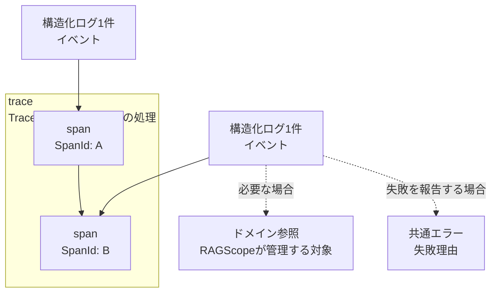

# 実行追跡・構造化ログ契約設計

> [!abstract] この文書の役割
> 構造化ログ1件が表すイベントと、ログを`trace`・`span`やRAGScopeが管理する対象へ関連付けるための論理契約を定義する。ログ重要度、`span`の失敗、共通エラーの関係と、外部表現・実行制御との境界もここで定める。

## 1. 構造化ログ1件が表すもの

構造化ログ1件は、**1つのイベントが1回発生した記録**を表します。同じレコードへ複数のイベントをまとめません。

1件のログは、次の情報を組み合わせて、そのイベントが「いつ、どこで、何が起き、どの処理・対象と関係していたか」を表します。

| 概念 | 必要性 | 意味 |
|---|---|---|
| 発生時刻 | 必須 | イベントが発生した時刻。 |
| 発生元 | 必須 | そのイベントを観測して記録したRAGScopeのコンポーネント。必要な場合は、同じコンポーネントの実行インスタンスも区別する。 |
| 重要度 | 必須 | そのイベントを運用上どの程度重く扱うかを表す順序付き分類。 |
| イベント | 必須 | 発生した事実の種類を機械的に識別する安定した名称。 |
| メッセージ | 任意 | 人が読むための補足説明。機械判定には使用しない。 |
| 属性 | 任意 | 所要時間やHTTPパスなど、その1回の発生について補足する構造化された値。 |
| `trace` / `span` | 任意 | このイベントが、一連の処理のどの`span`で起きたか。`span`に属するログでは`TraceId`と`SpanId`によって関連付ける。 |
| ドメイン参照 | 任意 | このイベントが、RAGScopeが管理するどの対象について起きたかを示す参照。 |
| 共通エラー | 任意 | イベントが失敗を報告する場合の失敗理由。[共通エラー契約設計](./共通エラー契約設計.md)に従う。 |

イベント名は、「何が起きたか」の種類を表す安定した名称とします。HTTPパス、エラーメッセージ、処理対象の識別子など、その発生ごとに変わる値はイベント名へ含めず、属性、ドメイン参照、共通エラーなど、その値の意味に合う場所へ分けて記録します。

「何が起きたか」と「どこで起きたか」は別の情報として記録します。同じ種類のイベントが複数のコンポーネントから発生する場合でも、発生元はイベント名へ含めず、別に記録します。

例えば、HTTP requestが失敗したログでは、イベントは「HTTP requestが失敗した」という種類を表し、HTTPパスは属性、処理との関係は`TraceId`と`SpanId`、失敗理由は共通エラーに分けます。

## 2. 重要度、イベント、`span`の失敗、共通エラー

重要度は「そのイベントを運用上どの程度重く扱うか」を表します。RAGScopeの論理契約では、次の5段階を使用します。

| 重要度 | 意味 |
|---|---|
| `debug` | 通常運用では不要だが、処理内容を詳しく確認するときに利用する診断情報。 |
| `info` | 処理開始、完了、主要な進行など、正常なイベント。 |
| `warn` | 処理を継続できるが、通常とは異なる状態または注意が必要なイベント。 |
| `error` | 処理の一部または処理全体が成立しなかったイベント。発生元のコンポーネント自体が処理を継続できないことまでは意味しない。 |
| `fatal` | 発生元のコンポーネントが、その後の処理を継続できないイベント。 |

`error`と`fatal`の違いは、失敗した処理の大きさではなく、発生元のコンポーネントが動作を続けられるかどうかです。例えば、1回のrequestに失敗しても次の処理を受けられる場合は`error`、起動に必要な初期化に失敗してコンポーネントとして処理を続けられない場合は`fatal`です。

ログ重要度と`span`の状態は別の情報として扱います。

- イベント名だけから重要度を導出しない。
- `warn`は`span`の失敗を意味しない。
- `error`または`fatal`のログが存在しても、そのログが属する`span`や上位の`span`が必ず失敗したとは限らない。
- `span`が表す処理そのものが失敗した場合は、その`span`のStatusを`Error`として扱う。個々のログ重要度からStatusを自動的に決めない。
- イベントが処理の失敗を報告する場合は、失敗理由として共通エラーを持つ。
- 共通エラーを持つログでは、失敗理由の機械判定をエラー種別で行う。メッセージ文字列や重要度から失敗理由を推測しない。

RAGScopeが機能ごとに保存する`success` / `failure`などの実行結果は、その機能のデータモデルを正本とします。この文書では、ログ重要度、`span`の状態、共通エラーの関係だけを定義します。

## 3. `trace`、`span`、ログの関係

RAGScopeでは、一連の処理を`trace`、その中で開始から終了までを個別に追跡する1つの処理を`span`として扱います。

| 概念 | 意味 |
|---|---|
| `trace` | 親子関係でつながる複数の`span`からなる一連の処理。`TraceId`によって識別する。 |
| `span` | 開始時刻と終了時刻を持つ1つの処理。`SpanId`によって識別し、必要な場合は親`span`を持つ。 |
| 構造化ログ1件 | ある時点で発生した1つのイベントの記録。`span`の中で起きたイベントなら`TraceId`と`SpanId`によってその`span`へ関連付ける。 |

個別に追跡する処理は`span`で表します。

### 3.1 何を`span`として追跡するか

すべての関数呼び出しや処理ステップを`span`にするのではなく、その処理の開始・終了、所要時間、失敗、親子関係を個別に確認する必要がある場合に`span`として追跡します。

CLI / APIから入る処理、RAGScopeの機能処理、コンポーネント間のHTTP request、コンポーネントの起動・停止も、個別に追跡する必要があれば`span`として表します。

| 状況 | `trace` / `span`での扱い |
|---|---|
| CLIから新しい処理を開始する | 受け取ったtrace contextがなければ、新しい`TraceId`を持つroot `span`から開始する。 |
| API requestを受ける | 有効な`traceparent`を受け取った場合はその`trace`を継続し、受け取っていない場合は新しい`trace`を開始する。 |
| 検索、`reranking`、回答生成などを個別に計測する | 上位の処理からchild `span`を作り、それぞれの開始・終了と所要時間を追跡する。 |
| 別コンポーネントへHTTP requestを送る | 現在の`span`からchild `span`を作り、そのtrace contextを送信先へ伝播する。 |
| コンポーネントの起動・停止を追跡する | 実際の親処理がなければroot `span`として独立した`trace`を開始する。 |

どの処理を`span`として分けるかは、「個別に追跡する必要があるか」で決めます。単に実装上の関数が分かれていることを理由に`span`を増やしません。

### 3.2 HTTP境界でのtrace context

`TraceId`と`SpanId`はOpenTelemetryの`SpanContext`と同じ意味で扱います。HTTP境界での伝播にはW3C Trace Contextの`traceparent`を使用します。

受信した有効な`traceparent`がある場合は、その`trace-id`を引き継ぎ、`parent-id`が示す送信元の処理を親として新しい`span`を開始します。有効な`traceparent`がない場合は、新しい`TraceId`を生成してroot `span`を開始します。

HTTP requestを送信する場合は、現在の`span`を親として送信用のchild `span`を開始し、その`TraceId`と`SpanId`に対応するtrace contextを`traceparent`で伝播します。

`tracestate`を扱う場合は、外部トレーシング情報を伝播するために使用します。RAGScopeが管理する対象の識別子など、ドメイン情報を`tracestate`へ格納しません。

### 3.3 ドメイン参照

`TraceId`と`SpanId`は、一時的な処理のつながりを追うための識別子です。RAGScopeが継続して管理する対象の識別には、ドメイン参照を使います。

> [!important] trace contextとドメイン識別子は別のもの
> 1つの管理対象が複数の`trace`にまたがることも、1つの`trace`が複数の管理対象を参照することもある。`TraceId`や`SpanId`を、管理対象の識別子の代わりに使用しない。

ログは、必要な場合にRAGScopeが管理する対象への参照を持ちます。参照には、何の種類の対象かと、その対象の識別子を含めます。何を参照対象とするか、その識別子をどう定めるかは、それぞれの機能の正本が定義します。

この文書が定義するのは、ログから管理対象を参照する関係までです。参照先の対象そのものをどう保存するかは、それぞれを管理する機能設計とデータモデルで定義します。

ログからは、例えば次を別々に検索できます。

- 同じ`TraceId`に属するログ
- 同じ`SpanId`に属するログ
- 同じ管理対象に関係するログ
- 特定コンポーネントから発生したログ

## 4. `span`とログの役割

`span`と構造化ログは、同じ情報を別名で表すものではありません。

`span`は処理の開始時刻、終了時刻、親子関係、Statusなどを持ち、その処理がどれだけ続き、どの処理から呼ばれたかを表します。構造化ログは、その処理中などに起きた個々のイベントを記録します。

そのため、`span`の開始と終了を表すためだけに、開始ログと終了ログを必須にはしません。処理開始や完了そのものを運用上のイベントとして残す必要がある場合は、通常の構造化ログとして記録できます。

検索、`reranking`、回答生成などの処理時間を追跡する場合は、対応する`span`の開始・終了から所要時間を確認できます。一方、実験結果として保存・評価する正確な処理時間や実行結果の正本は、その結果を管理する機能設計とデータモデルに置きます。

## 5. 外部標準との関係

RAGScopeの論理契約では、外部標準にある概念のうち、RAGScopeでも同じ意味で扱うものを利用します。標準が定める具体的なSDKや転送方式まで、この契約へ取り込みません。

| 標準 | この契約で使う考え方 | この契約では決めないこと |
|---|---|---|
| OpenTelemetry Trace API | `TraceId`、`SpanId`、親子関係を持つ`span`、開始・終了時刻、Span Status。 | OpenTelemetry SDKやExporterの採用、sampling、OTLPの具体的な送信方法。 |
| OpenTelemetry Logs Data Model | 1件のLogRecordがイベントを記録し、発生時刻、発生元、重要度、イベント名、属性、`TraceId`、`SpanId`を別の意味として扱うこと。 | OpenTelemetry Logging SDK、Collector、OTLPの導入や具体的なシリアライズ形式。 |
| W3C Trace Context | HTTP境界で`traceparent`を使い、`trace-id`と親処理の識別子を伝播すること。 | vendor固有の`tracestate`内容をRAGScopeのドメイン契約として解釈すること。 |
| RFC 5424 | 重要度、発生元、構造化データ、本文を分けて扱い、メッセージ内容と転送方式を分離すること。 | syslogのFacility値、PRI計算、syslog wire formatをRAGScope内部契約として採用すること。 |

この文書でいう構造化ログ1件は、OpenTelemetry Logs Data ModelのLogRecordに近い役割を持ちます。OpenTelemetryのSpan Eventとして表現できる場合があっても、RAGScopeの論理契約をSpan Eventだけに限定しません。

RAGScopeの各重要度が対応するOpenTelemetryの重要度範囲は一意に定まります。RFC 5424へ出力する場合は、その出力境界でsyslog Severityへ対応付けます。OpenTelemetryやsyslogの数値表現そのものは、RAGScopeの論理契約には含めません。

## 6. 外部表現と実装言語

この文書は、JSON、TSV、syslog、OTLPなどの具体的な列名、階層、エンコーディングを定義しません。Haskell / Pythonでこの契約を表す具体的な型も、それぞれの実装側で定義します。

外部表現への変換では、少なくとも次の意味を失わないことが必要です。

- ログの発生時刻
- 発生元
- 重要度
- イベント
- 必要な属性
- ログに関連する`TraceId`と`SpanId`
- `span`の`TraceId`、`SpanId`、親`SpanId`、開始・終了、Status
- 必要なドメイン参照
- 失敗時の共通エラー

JSONやTSVへの具体的な投影は、この論理契約とは別に定義・検証します。

## 7. 実行制御

retry / timeoutは、処理を続けるか、やり直すか、打ち切るかを決める実行制御です。そこで起きたイベントをこの契約に従ってログへ記録することはできますが、retry / timeoutそのものの条件や動作はこの文書では定義しません。

## 関連文書

- [RAGScope要求定義](../RAGScope要求定義.md)
- [システムアーキテクチャ](./システムアーキテクチャ.md)
- [共通エラー契約設計](./共通エラー契約設計.md)
- [OpenTelemetry Trace API](https://opentelemetry.io/docs/specs/otel/trace/api/)
- [OpenTelemetry Logs Data Model](https://opentelemetry.io/docs/specs/otel/logs/data-model/)
- [W3C Trace Context](https://www.w3.org/TR/trace-context/)
- [RFC 5424: The Syslog Protocol](https://www.rfc-editor.org/rfc/rfc5424.html)
