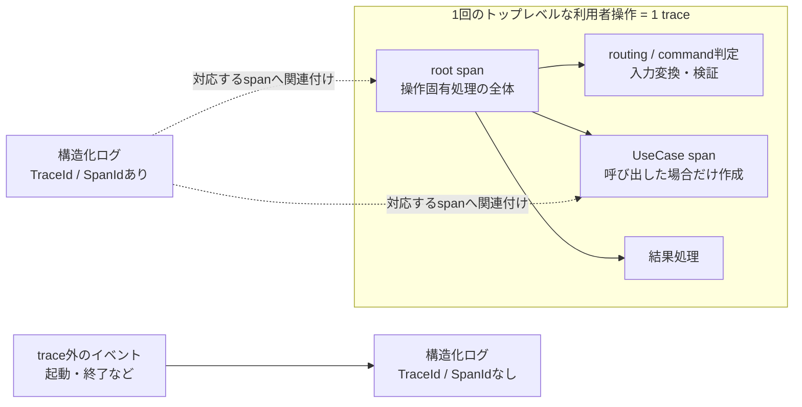

# 実行追跡・構造化ログ契約設計

> [!abstract] この文書の役割
> RAGScopeでは、利用インターフェースが受け付けた1回のトップレベルな操作をOpenTelemetryの`trace`・`span`で追跡し、RAGScopeで起きた意味のある出来事を構造化ログへ記録する。この文書は、`trace`・`span`の使い方、trace内外の構造化ログの共通構造と記録規則、失敗理由を表す`error_type`、ログからRAGScopeの管理対象を参照する規則を定義する。

## 1. 実行追跡と構造化ログの関係

RAGScopeは、**利用インターフェースが受け付けた1回のトップレベルな操作を1つの`trace`**として追跡する。`trace`は1個のroot `span`と、その配下の0個以上の子`span`からなる。CLIとAPIでプロセスの生存期間や操作の受け付け方が異なっても、`trace`が表す単位は変えない。

root `span`は、利用インターフェースが1回の操作について操作固有の処理を開始した時点から、その操作に対する処理を完了または失敗として終了し、操作固有の処理から外側へ制御を戻す時点までを表す。routing・command判定、入力の変換・検証、RAGScope Applicationによるユースケース呼び出し、ユースケース終了後のインターフェース固有の結果処理は、その操作に属する限りroot `span`の時間区間に含む。

[ユースケース基本設計](./ユースケース基本設計.md)で定義する1回のユースケース実行は、root `span`そのものではない。RAGScope Applicationがユースケースを呼び出した場合、その呼び出しからApplicationへ制御が戻るまでをroot `span`配下の子`span`として追跡する。routingや入力検証などで操作が終了してユースケースを呼び出さない場合は、ユースケース実行`span`を作らない。

構造化ログは、ある時点で起きた1つのイベントを表す。特定の`span`中で起きたイベントには`TraceId`・`SpanId`を記録し、その`span`へ関連付ける。コンポーネントの起動・終了など、特定の利用者操作や`span`へ属さないイベントも構造化ログへ記録でき、その場合は`TraceId`・`SpanId`を持たない。

失敗した`span`と、その失敗を報告する構造化ログの両方を記録する場合は、同じ失敗理由を`error_type`で記録する。構造化ログがRAGScopeの管理対象に関係する場合は、その対象の識別子を属性として記録する。構造化ログには、そのイベントを記録した発生元コンポーネントも記録する。



## 2. 構造化ログ

### 2.1 ログ1件の構造

構造化ログ1件は、ある時点で起きた1つのイベントを記録する。

| 情報 | 必要性 | 意味 |
|---|---|---|
| 発生時刻 | 必須 | イベントが発生した時刻 |
| 発生元 | 必須 | イベントを観測して記録したコンポーネントを識別する |
| イベント名 | 必須 | 何が起きたかの種類を機械的に識別する安定した名称 |
| 重要度 | 必須 | そのイベントを運用上どの程度重く扱うか |
| メッセージ | 任意 | 人が読むための補足説明 |
| 属性 | 任意 | イベント固有の名前付きの値。失敗を報告する場合の`error_type`や、必要なドメイン参照も属性として記録する |
| `TraceId` / `SpanId` | 条件付き | イベントが特定の`span`中で起きた場合に両方を記録し、その`span`へ関連付ける。特定の`span`へ属さない場合は両方とも持たない |

`TraceId`と`SpanId`は必ず組として扱う。`TraceId`だけ、または`SpanId`だけを持つ構造化ログは定義しない。

属性は、属性名と値の組を0件以上持つ。属性名は値の意味を安定して識別する。1件の構造化ログでは同じ属性名を複数回使用せず、属性の並び順には意味を持たせない。

属性値は、文字列、数値、真偽値、array、objectのいずれかとする。arrayは0件以上の属性値を順序付きで持つ。objectは0件以上の名前と属性値の組を持ち、同じ名前を複数回使用せず、組の並び順には意味を持たせない。arrayの要素とobjectの値には、同じ属性値を再帰的に使用できる。属性値として`null`に相当する値は定義しない。値が存在しない属性やobjectの項目は、その名前自体を持たない。

イベント固有の属性の意味、記録条件、使用する属性値の型、その値に対する制約は、そのイベントを定義する正本で定める。

発生元として使用する具体的な値は、各コンポーネントのコード、設定、Schemaなどの機械可読な正本で定める。正確な項目名・外部表現上の型・各外部形式での表現は、外部表現を担当する設計とSchemaなどの機械可読な正本で定める。

### 2.2 記録するイベント

構造化ログには、処理の進行や失敗、コンポーネントの状態変化を後から確認するために意味のある出来事を記録する。具体的なイベント、その記録条件、既定の重要度、必要な属性は、そのイベントを担当する正本で定める。

| 状況 | 記録規則 | Trace Context |
|---|---|---|
| コンポーネントの起動・終了など、特定の利用者操作へ属さない状態変化 | その状態変化を担当する設計・契約またはコード・設定・テストで記録対象とした場合に記録する | 持たない |
| routing・command判定、入力変換・検証、結果処理など利用インターフェースに属する出来事 | 利用インターフェースを担当する正本で記録対象とした場合に記録する | その操作の対応する`span`へ関連付ける |
| 主要な機能処理段階への到達、検索候補の取得、再試行など | その処理を定義する機能設計で定めたイベントを、その設計で定めた条件で記録する | その処理が属する`span`へ関連付ける |
| ユースケースの失敗 | その失敗を表すUseCase eventを、ユースケース実行`span`が終了するまでに1件記録する | ユースケース実行`span`へ関連付ける |
| ユースケース内部の処理失敗 | その失敗を扱う機能設計で失敗イベントとして定めた場合に記録する | その失敗を扱う`span`へ関連付ける |

処理の開始・完了は、処理の進行をログとして残すイベントに定めた場合だけ記録する。処理時間の計測は`span`が担当する。

子`span`の失敗が親`span`やroot `span`の失敗へ伝播したという理由だけで、同じ失敗を報告する構造化ログを各階層へ重複して記録しない。失敗イベントは、その失敗を意味として所有する処理または境界で記録し、親`span`は自身の最終結果に従ってSpan Statusと`error_type`を更新する。

プロセスが強制終了する、構造化ログ基盤が利用できないなど、イベントを記録する処理自体を実行できない終了は、そのイベントの構造化ログ記録保証の対象外である。ログ基盤自身の失敗を失敗した同じログ経路へ再帰的に記録する方法は採用しない。

### 2.3 イベント名

イベント名には次の共通規則を適用する。

- 小文字を使用し、意味のまとまりを`.`で区切る。1つのまとまりが複数語なら`_`でつなぐ。
- 出来事の種類だけを表し、識別子、エラーメッセージ、件数など発生ごとに変わる値を含めない。
- 同じ意味のイベントには同じ名前を使用し、同じ名前へ異なる意味を割り当てない。
- 処理の開始、成功、失敗を記録する場合は、それぞれ`.started`、`.succeeded`、`.failed`を使用する。
- 発生元コンポーネントはイベント名へ含めず、構造化ログの発生元として記録する。

### 2.4 重要度

ログの重要度には`debug`、`info`、`warn`、`error`、`fatal`の5段階を使用する。

| 重要度 | 意味 |
|---|---|
| `debug` | 通常運用では不要だが、問題を詳しく調べるときに利用する診断情報 |
| `info` | 通常の処理進行や結果を知らせるイベント |
| `warn` | エラーではないが、通常とは異なる状態や注意が必要なイベント |
| `error` | エラーが起きたイベント。発生元コンポーネントがその後も処理を続けられる場合に使用する |
| `fatal` | 発生元コンポーネントが、その後の通常処理を続けられない致命的なエラーイベント |

重要度は、そのイベントを運用上どの程度重く扱うかを表す。イベントの既定の重要度は、そのイベントを定義する正本で定める。`span`が表す処理の結果は、3.4のSpan Statusで表す。

## 3. 実行追跡

### 3.1 `trace`とroot `span`

1つの`trace`は、利用インターフェースが受け付けた1回のトップレベルな操作に属する処理のまとまりであり、同じ`TraceId`で識別する。CLIの1コマンド実行とAPIの1リクエスト処理のようにインターフェースやプロセス生存期間が異なっても、1回のトップレベルな操作ごとに別の`trace`を使用する。プロセスの起動から終了までを1つの`trace`として扱わない。

root `span`は、利用インターフェースが1回の操作について操作固有の処理を開始する境界で開始する。この境界はrouting・command判定、入力の変換・検証より前に置く。root `span`は、その操作に対する処理が完了または失敗として確定し、利用インターフェースが操作固有の処理を終了する境界で終了する。

root `span`には、その操作に属する次の処理を含める。

- routingまたはcommand判定
- 入力のdecode、変換、検証
- RAGScope Applicationへ処理をつなぐ処理
- 呼び出したユースケース実行
- ユースケース終了後に行う、利用者へ返す結果の構築などの操作固有処理

Web serverの待機、プロセス起動、設定読み込み、shutdownなど、特定の1操作へ属さない処理はroot `span`に含めない。これらの出来事を構造化ログへ記録する場合は2.1のTrace Contextを持たないログとして扱う。

```text
process lifecycle
│
├─ trace外のlifecycle event
│
├─ 利用者操作 A
│   └─ TraceId: T1
│      └─ root SpanId: S1
│         ├─ interface処理
│         ├─ UseCase SpanId: S2
│         │  └─ 内部処理 SpanId: S3 ...
│         └─ 結果処理
│
├─ 利用者操作 B
│   └─ TraceId: T2
│      └─ root SpanId: S4
│
└─ trace外のlifecycle event
```

### 3.2 ユースケース実行と子`span`

[ユースケース基本設計](./ユースケース基本設計.md)で定義する1回のユースケース実行は、root `span`配下の子`span`として追跡する。ユースケース実行`span`はRAGScope Applicationがユースケースを呼び出す時点で開始し、その呼び出しからApplicationへ制御が戻る時点で終了する。

利用インターフェースでのrouting、入力変換・検証などで操作が終了し、RAGScope Applicationがユースケースを呼び出さなかった場合はユースケース実行`span`を作らない。

ユースケース内部で、開始・終了、所要時間、エラーを独立して確認する必要がある処理を、ユースケース実行`span`または他の内部`span`の子`span`として追跡する。RAGScopeでは、AI推論サービスで開始する処理や、RAGScopeが再試行を制御する場合の各試行がこの例である。

同じ`trace`に属する`span`は同じ`TraceId`を共有し、それぞれ異なる`SpanId`を持つ。子`span`は1つの親`span`を持ち、処理の親子関係を表す。

どの機能内部処理を子`span`として追跡し、その`span`をどの条件で`Error`とするかは、その処理を定義する機能設計で定める。routingや入力検証など利用インターフェース固有処理を独立した子`span`として分けるかは、そのインターフェースの設計・実装で定める。root `span`の時間全体を子`span`で隙間なく覆う必要はない。

### 3.3 再試行

RAGScopeが再試行を制御し、各試行の境界を識別できる場合は、再試行を含む処理全体を親`span`として追跡し、各試行をその子`span`として追跡する。次は、1回目が失敗し、2回目で成立した場合の例である。

```text
再試行を含む処理全体 span（親）: Status Unset
├─ 試行1 span（子）: Status Error
├─ 再試行待機（子spanなし）
└─ 試行2 span（子）: Status Unset
```

- 処理全体の`span`は最初の試行前に開始し、最終結果または失敗が確定した時点で終了する。
- 各試行の`span`は、その試行の開始から結果確定までを表す。試行間の待機は処理全体の`span`には含めるが、各試行の`span`には含めない。
- 各試行のSpan Statusはその試行自身の結果から、処理全体のSpan Statusは全試行を含む最終結果から決める。

下位ライブラリの内部だけで再試行が完結し、RAGScopeから各試行の境界を識別できない場合は、RAGScopeから見える処理全体の`span`だけを追跡する。

### 3.4 Span Status

Span Statusは、その`span`が表す処理自身の最終結果から決める。RAGScopeがエラーとして扱う場合は`Error`にし、それ以外は`Unset`のまま終了する。

代表的な扱いは次のとおりである。

| 状況 | ユースケース実行`span` | root `span` | 失敗ログ |
|---|---|---|---|
| 入力検証などで失敗し、ユースケースを呼び出さず操作が失敗した | 作らない | `Error`。操作を失敗させた理由の`error_type`を関連付ける | その失敗を所有する利用インターフェースまたはApplicationのイベントをroot `span`へ関連付けて記録する |
| ユースケースが成立し、利用者操作全体も成立した | `Unset` | `Unset` | 失敗ログは不要 |
| ユースケース内部に失敗があったが、再試行や代替処理によってユースケースと操作全体が成立した | ユースケース自身が成立していれば`Unset`。失敗した内部`span`は`Error` | `Unset` | 機能設計で記録対象とした内部失敗だけ記録する |
| ユースケースが失敗し、そのため利用者操作全体も失敗した | `Error`。ユースケース失敗理由の`error_type`を関連付ける | `Error`。同じ失敗が操作失敗の理由なら同じ`error_type`を関連付ける | UseCaseが所有する失敗イベントをユースケース実行`span`へ1件記録する。root `span`へ同じ失敗ログを重複して記録しない |
| ユースケースは成立したが、その後の結果処理で操作全体が失敗した | `Unset` | `Error`。結果処理の失敗理由を表す`error_type`を関連付ける | その失敗を所有する利用インターフェースまたはApplicationのイベントをroot `span`へ関連付けて記録する |

`Unset`はRAGScopeの機能上の`success`を意味しない。成功、回答拒否、対象なしなど、その処理の仕様どおりに成立した結果は、`span`をエラーとして扱わない限り`Unset`である。機能が保存する状態や実行結果は、その機能のデータモデルを正本とする。

各`span`のStatusは、その`span`が表す処理自身の最終結果から決める。このため、子`span`が`Error`でも、親`span`やroot `span`はそれぞれが表す処理の最終結果に従ってStatusを決める。

### 3.5 コンポーネント間の引き継ぎ

RAGScopeアプリケーションがAI推論サービスへ処理を依頼するときは、AI推論サービス側でも同じ`trace`を継続できるように実行追跡情報を通信で渡す。AI推論サービスは同じ`TraceId`を使用し、呼び出し元の`SpanId`で識別される`span`を親とする新しい`span`を開始する。

通信で渡す正確な項目と形式は、その通信方式を定義する設計と機械可読な契約で定める。

## 4. 失敗理由と`error_type`

### 4.1 `error_type`が表すもの

イベント名が「何が起きたか」を表すのに対し、`error_type`は「なぜ処理が成立しなかったか」の種類を機械的に識別する安定した名称である。

具体的な値は、その失敗条件を定義する正本で定める。機能処理の失敗はその機能設計を正本とする。利用インターフェースやコンポーネントのライフサイクルに固有の失敗は、それぞれの責務を持つ設計・契約またはコード・設定・テストを正本とする。ログ基盤自身の失敗などコンポーネント実装に固有の失敗は、そのコンポーネントのコード・設定・テストなど、正確な失敗条件と挙動を定義する正本で扱う。同じ失敗理由には同じ値を使い、識別子やメッセージなど発生ごとに変わる情報は値に含めない。

### 4.2 `span`と構造化ログへの記録

1つの失敗を`span`と構造化ログの両方へ記録する場合は、両方に同じ`error_type`の値を使用する。

| 記録先 | 規則 |
|---|---|
| `span` | `Error`で終了する場合、その失敗理由を表す`error_type`を関連付ける |
| trace内の構造化ログ | 失敗を報告するイベントに、その失敗理由を表す`error_type`を属性として記録し、対応する`span`へ関連付ける |
| trace外の構造化ログ | 失敗を報告するイベントに、その失敗理由を表す`error_type`を属性として記録する。対応する`span`がないためTrace Contextは持たない |

## 5. ドメイン参照と識別子の使い分け

ドメイン参照とは、構造化ログのイベントがRAGScopeのどの管理対象に関係するかを、その対象の識別子によって示すことである。構造化ログには、その対象の正本が定める識別子を属性として記録する。

実行追跡の識別子と、RAGScopeが継続して管理する対象の識別子は分けて使用する。

| 識別子 | 識別するもの |
|---|---|
| `TraceId` | 利用インターフェースが受け付けた1回のトップレベルな操作に属する処理のまとまり |
| `SpanId` | `trace`の中で追跡する個別の`span` |
| ドメイン対象の識別子 | `実験`、`評価データごとの実行結果`、`文書バージョン`などRAGScopeが継続して管理する対象 |

`TraceId`・`SpanId`は実行中の処理を追跡するための識別子であり、RAGScopeが継続して管理する対象の識別子とは役割が異なる。1つの管理対象が複数の`trace`に関係することも、1つの`trace`が複数の管理対象に関係することもある。trace外の構造化ログは`TraceId`・`SpanId`を持たない。

`TraceId`と`SpanId`の生成アルゴリズム、ドメイン参照の正確な属性名・型・外部表現は、この論理契約では定義しない。

## 6. 責務の分担

具体的なイベント、記録条件、既定の重要度、イベント固有の属性とその記録条件・値の型・値の制約、失敗に対応する`error_type`は、その出来事を意味として所有する設計・契約を正本とする。各コンポーネントで共通契約をどう実現するかという正確な内部型、発生元の値、実行追跡情報の実装、ログ受付・出力の境界、実装固有のログ基盤失敗の挙動は、コード、設定、Schema、テストなどの機械可読な正本で定める。

| 正本 | 担当すること |
|---|---|
| この文書 | 構造化ログ、trace内外でのTrace Context、`trace`・`span`、Span Status、`error_type`、属性、ドメイン参照の共通の意味と規則 |
| [ユースケース基本設計](./ユースケース基本設計.md) | ユースケースの意味、1回のユースケース実行境界、ユースケースの成功・失敗 |
| 各機能設計 | 機能上の処理、成功・失敗条件、機能に属する具体的なイベントと記録条件、既定の重要度、イベント固有の属性、機能処理として作成する`span`とその`Error`条件、機能固有の`error_type` |
| 利用インターフェースの設計・契約 | routing・command判定、入力変換・検証、結果処理などインターフェース固有処理に属する具体的なイベントと失敗条件、利用者へ返す情報 |
| 各コンポーネントの設計・契約またはコード・設定・テスト | 起動・終了などコンポーネントのライフサイクルに属する具体的なイベント、共通契約を実現する内部型、発生元として使用する値、ログ受付・出力の境界、ログ基盤自身の失敗 |
| 構造化ログの外部表現設計 | この論理契約を外部形式へ写す項目名、外部表現上の型、Trace Contextの省略方法、形式固有の補助情報 |
| 通信方式を定義する設計・契約 | 同じ`trace`と親子関係を継続するために通信で渡す項目と形式 |
| Schema、OpenAPIなどの機械可読な契約 | 外部形式や通信で機械的に検証する正確な型、項目名、必須条件など |

### 6.1 イベントを定義するときの設計契約

出来事を構造化ログへ記録する場合、その出来事を意味として所有する正本で次を定義する。

1. 記録するイベントと、そのイベントを記録する条件。
2. 2.3の規則に従うイベント名と、2.4の規則に従う既定の重要度。
3. イベント固有の属性、その属性を記録する条件、属性値の型と値の制約。
4. 失敗を報告するイベントでは、その失敗理由に対応する`error_type`。
5. trace内の処理として独立した`span`を作成する場合は、追跡する処理と、その`span`を`Error`とする条件。

ライフサイクルイベントなど特定の`span`へ属さないイベントを定義するときに、Trace Contextを作るためだけの`trace`や`span`を開始しない。

### 6.2 コンポーネント実装との分担

コンポーネント固有の正確な実装情報を重複して説明するための構造化ログ設計書は設けない。実装から独立して長期的に管理すべき新しい設計判断が生じた場合だけ、その責務を持つ既存設計へ反映するか、新規設計書が必要かを判断する。

`実験`や`評価データごとの実行結果`として保存する状態、処理時間、エラーなどは、それらを管理する機能設計とデータモデルで定める。構造化ログとSpan Statusは実行追跡・運用確認の情報として扱う。

## 関連文書

- [RAGScope要求定義](../RAGScope要求定義.md)
- [RAGScope用語集](../RAGScope用語集.md)
- [RAGScopeドメインモデル](./RAGScopeドメインモデル.md)
- [ユースケース基本設計](./ユースケース基本設計.md)
- [システムアーキテクチャ](./システムアーキテクチャ.md)
- [構造化ログ外部表現共通設計](./logging/構造化ログ外部表現共通設計.md)
- [ADR-0005 — 実行追跡をOpenTelemetryのtrace・spanで表現し、イベントを構造化ログとして記録する](<../adr/ADR-0005 実行追跡をOpenTelemetryのtrace・spanで表現し、イベントを構造化ログとして記録する.md>)
- [OpenTelemetry Logs Data Model](https://opentelemetry.io/docs/specs/otel/logs/data-model/)
- [OpenTelemetry Trace API](https://opentelemetry.io/docs/specs/otel/trace/api/)
