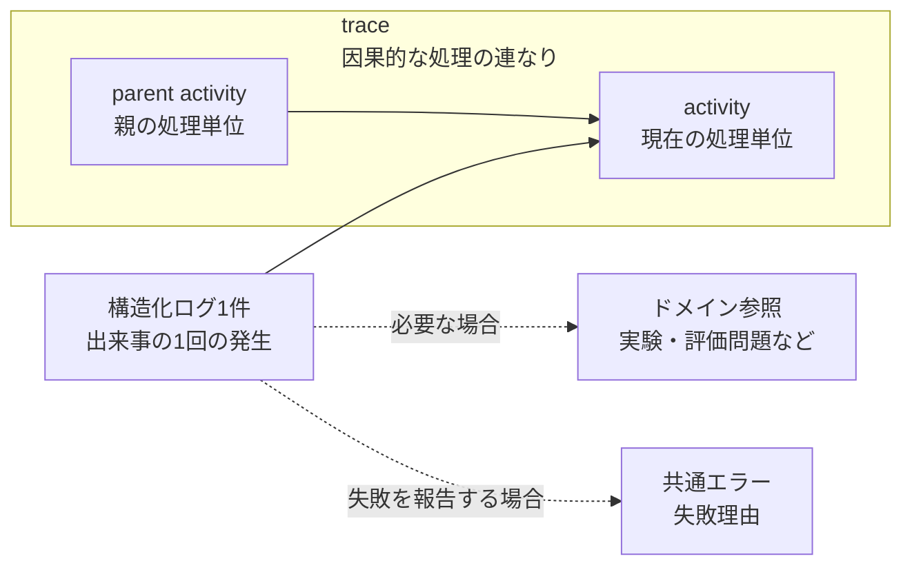

# 実行追跡・構造化ログ契約設計

> [!abstract] この文書の役割
> RAGScopeで何が起き、それがどの処理・どのドメイン対象と関係しているかを、ログから追えるようにするための論理契約を定義する。構造化ログ1件の意味、処理の因果関係、ドメイン参照、処理結果と失敗理由の関係を、実装言語や外部表現から独立して扱う。

## 1. この文書の範囲

この文書が答える問いは、次のとおりです。

> **「RAGScopeで何が起き、それがどの処理・どのドメイン対象と関係しているかを、ログからどう追うか？」**

この文書では、次を扱います。

- 構造化ログ1件が何を表すか
- 出来事の発生時刻、発生元、重要度、種類、補足情報
- `trace`、`activity`、`parent activity`を使った処理の因果関係
- 実験や評価問題などへのドメイン参照
- 処理の開始、進行、正常終了、失敗終了
- 失敗した出来事と[共通エラー](./共通エラー契約設計.md)の関係

一方、次はこの文書では扱いません。

- 実験結果そのものをどう永続化するか
- JSON / TSV / syslog / OTLPの具体的な列名、階層、エンコーディング
- Haskell / Pythonの具体的な型
- retry / timeoutなどの実行制御

ここでいう「追跡」は、実験結果そのものを保存して管理することではありません。要するに、この文書が担当するのは、**ログに記録した出来事が、どの処理・どのドメイン対象と関係しているかを追えるようにすること**です。

## 2. 構造化ログ1件が表すもの

構造化ログ1件は、**1つの出来事が1回発生したという事実**を表します。同じレコードへ複数の出来事をまとめず、その発生ごとに変わる値を出来事の識別子へ埋め込みません。

1件のログは、次の情報を組み合わせて、その出来事が「いつ、どこで、何として起き、何と関係していたか」を表します。

| 概念 | 必要性 | 意味 |
|---|---|---|
| 発生時刻 | 必須 | 出来事が発生した時刻。 |
| 発生元 | 必須 | その出来事を観測して記録したRAGScopeのコンポーネント。必要な場合は、同じコンポーネントの実行インスタンスも区別する。 |
| 重要度 | 必須 | その出来事を運用上どの程度重く扱うかを表す順序付き分類。 |
| 出来事 | 必須 | 発生した事実の種類を機械的に識別する安定した名称。 |
| メッセージ | 任意 | 人が読むための補足説明。機械判定には使用しない。 |
| 属性 | 任意 | その発生に固有の構造化された追加情報。 |
| 処理関係 | 任意 | この出来事が属する因果的な処理の連なりと、現在の処理単位。 |
| ドメイン参照 | 任意 | 実験、評価問題など、RAGScopeが永続的に管理する対象への参照。 |
| 共通エラー | 任意 | 出来事が失敗を報告する場合の失敗理由。[共通エラー契約設計](./共通エラー契約設計.md)に従う。 |

発生元と出来事の種類は別に保持します。同じ出来事がRAGScopeアプリケーションとAI推論サービスの両方から発生し得る場合でも、出来事名へコンポーネント名を埋め込んで発生元を表しません。

出来事の名称は、出来事の**種類**を識別するためのものです。実験識別子、HTTPパス、エラーメッセージなど、その発生ごとに変わる値は、属性またはドメイン参照として記録します。

## 3. 重要度、出来事、処理結果、共通エラー

重要度は「その出来事を運用上どの程度重く扱うか」を表します。RAGScopeの論理契約では、次の5段階を使用します。

| 重要度 | 意味 |
|---|---|
| `debug` | 通常運用では不要だが、処理内容を詳しく確認するときに利用する診断情報。 |
| `info` | 処理開始、完了、主要な進行など、正常な出来事。 |
| `warn` | 処理を継続できるが、通常とは異なる状態または注意が必要な出来事。 |
| `error` | 処理の一部または処理全体が成立しなかった出来事。 |
| `fatal` | 発生元のコンポーネントが処理を継続できない出来事。 |

重要度、出来事、処理結果、共通エラーは、それぞれ別の意味を持ちます。1つから別のものを推測する契約にはしません。

- 出来事名だけから重要度を導出しない。
- `warn`は処理失敗を意味しない。
- `error`または`fatal`のログが存在しても、より上位の処理全体が必ず失敗したとは限らない。
- 追跡対象の処理単位が失敗して終了したことを記録する場合は、重要度を`error`以上とし、共通エラーを必須とする。
- 共通エラーを持つログでは、失敗理由の機械判定をエラー種別で行う。メッセージ文字列や重要度から失敗理由を推測しない。

この分離によって、途中で失敗を検出して別経路へ切り替えた処理と、最終的に失敗して終了した処理を区別できます。

## 4. 処理関係とドメイン参照

ログから処理を追うには、「どの因果的な処理に属するか」と「RAGScope上のどの対象に関係するか」を分けて記録します。

前者を`trace`、`activity`、`parent activity`で表し、後者をドメイン参照で表します。

### 4.1 処理単位の種類

RAGScopeは、因果関係を追跡する必要がある処理を「処理単位」として扱います。処理単位は共通の親子関係を持ちますが、意味の異なる処理まで同じ種類にはしません。

| 種類 | 表すもの |
|---|---|
| `entrypoint` | 利用者または外部ツールからRAGScopeへ入った1回のCLI実行またはAPI request。 |
| `operation` | 実験、質問処理、検索段階、モデル呼び出しなど、RAGScopeが実行するまとまりのある処理。 |
| `request` | RAGScopeアプリケーションとAI推論サービスなどの間で行う1回の通信。 |
| `lifecycle` | コンポーネントの起動、準備、停止など、そのコンポーネント自身のライフサイクル処理。 |

CLI / APIの入口、ドメイン上の処理、コンポーネント間のrequest、コンポーネント自身のライフサイクルは、それぞれ別の意味を持ちます。追跡方法は共通化しても、種類を失って1つの概念へ統合しません。

### 4.2 `trace`、`activity`、`parent activity`

処理の因果関係は、次の3つで表します。

| 概念 | 意味 |
|---|---|
| `trace` | 1つの入口から派生する、コンポーネントをまたいだ因果的な処理の連なり。 |
| `activity` | 現在実行している1つの処理単位。 |
| `parent activity` | 現在の処理単位を直接開始した親の処理単位。根の処理単位には存在しない。 |

親を持つ`activity`では、関係は次のようになります。

根の処理単位では`parent activity`を持ちません。

### 4.3 HTTP境界でのtrace context

`trace`の識別子には、W3C Trace Contextの`trace-id`と同じ意味を採用します。

HTTP境界では`traceparent`を使って、`trace`と親処理の関係を伝播します。受信した有効なtrace contextがある場合はその`trace`を継続し、ない場合はRAGScope側で新しい`trace`を開始します。

`activity`は、W3C Trace Contextにおける処理位置と対応できる単位として扱います。HTTP requestを送る場合は、現在の`activity`を親として下位の処理を開始します。

`tracestate`を扱う場合は、外部トレーシング情報を伝播するために使用します。RAGScopeの実験識別子など、ドメイン情報を`tracestate`へ格納しません。

### 4.4 ドメイン参照

`trace`は、一時的な処理の因果関係を追うための識別です。実験や評価問題など、RAGScopeが永続的に管理する対象の識別にはドメイン参照を使います。

> [!important] `trace`とドメイン識別子は別のもの
> 1つのドメイン対象が複数の`trace`にまたがることも、1つの`trace`が複数のドメイン対象を参照することもある。`trace`や`activity`の識別子を、実験識別子、質問識別子、文書識別子などの代わりに使用しない。

ログは、必要な場合に実験、評価問題などのドメイン対象への型付き参照を持ちます。ドメイン参照で使う識別子は、それぞれの機能の正本が定義します。

処理関係とドメイン参照を分けることで、例えば次を別々に検索できます。

- 同じ因果的な処理に属するログ
- 同じ実験や評価問題に関係するログ
- 特定コンポーネントまたは特定種類の処理に属するログ

## 5. 処理の開始、進行、終了

追跡対象の処理単位は、少なくとも開始と終了を記録できるようにします。処理の途中の出来事は、進行として記録できます。

| 記録 | 必須情報 |
|---|---|
| 開始 | 処理単位の種類と名称、処理関係、必要なドメイン参照 |
| 進行 | 発生した出来事、必要な属性、処理関係 |
| 正常終了 | 終了した処理単位、成功したこと、必要な結果の要約 |
| 失敗終了 | 終了した処理単位、失敗したこと、共通エラー |

処理結果は`success`または`failure`として扱い、終了記録でのみ必須とします。途中のログ重要度から最終結果を推測しません。

処理時間をログへ記録する場合は、開始・終了時刻または計測した所要時間を属性として保持できます。一方、実験結果として保存・評価する正確な処理時間の正本は、その処理結果を管理する機能設計とデータモデルに置きます。

## 6. 外部標準との関係

この論理契約では、外部標準をそのままRAGScope内部の形式として採用するのではなく、RAGScopeでも同じ意味で扱いたい概念を利用します。

| 標準 | この契約で使う考え方 | この契約では決めないこと |
|---|---|---|
| OpenTelemetry Logs Data Model | 発生時刻、発生元、重要度、出来事、属性、trace contextを、それぞれ別の意味として扱う。 | OpenTelemetry SDK、Collector、OTLPの導入や具体的なシリアライズ形式。 |
| W3C Trace Context | コンポーネントをまたぐ`trace`の識別と、親処理の伝播。 | vendor固有の`tracestate`内容をRAGScopeのドメイン契約として解釈すること。 |
| RFC 5424 | 重要度、発生元、構造化データ、本文を分けて扱い、メッセージ内容と転送方式を分離する。 | syslogのFacility値、PRI計算、syslog wire formatをRAGScope内部契約として採用すること。 |

RAGScopeの各重要度が対応するOpenTelemetryの重要度範囲は一意に定まります。RFC 5424へ出力する場合は、その出力境界でsyslog Severityへ対応付けます。OpenTelemetryやsyslogの数値表現そのものは、RAGScopeの論理契約には含めません。

## 7. 外部表現との境界

この文書は、JSON、TSV、syslog、OTLPなどの具体的な列名、階層、エンコーディングを定義しません。外部表現への変換は、この論理契約で定めた意味を保ったまま、それぞれの形式に合わせて行います。

外部表現へ投影するときは、少なくとも次の意味を失わないことが必要です。

- 出来事の発生時刻
- 発生元
- 重要度
- 出来事
- 必要な属性
- `trace`と`activity`の関係
- 必要なドメイン参照
- 処理終了時の結果
- 失敗時の共通エラー

JSONやTSVへの具体的な投影は、この論理契約とは別に定義・検証します。

## 関連文書

- [RAGScope要求定義](../RAGScope要求定義.md)
- [システムアーキテクチャ](./システムアーキテクチャ.md)
- [共通エラー契約設計](./共通エラー契約設計.md)
- [OpenTelemetry Logs Data Model](https://opentelemetry.io/docs/specs/otel/logs/data-model/)
- [W3C Trace Context](https://www.w3.org/TR/trace-context/)
- [RFC 5424: The Syslog Protocol](https://www.rfc-editor.org/rfc/rfc5424.html)
