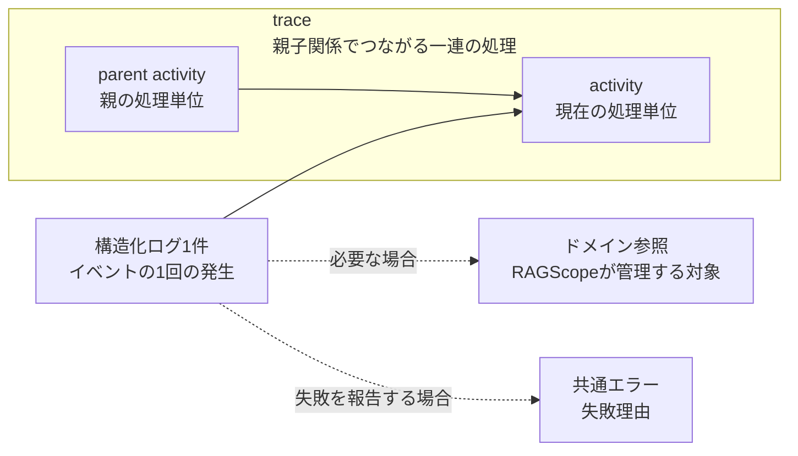

# 実行追跡・構造化ログ契約設計

> [!abstract] この文書の役割
> 構造化ログ1件が表す事実と、ログを処理やRAGScopeが管理する対象へ関連付けるための論理契約を定義する。重要度、処理結果、共通エラーの関係と、外部表現・実行制御との境界もここで定める。

## 1. 構造化ログ1件が表すもの

構造化ログ1件は、**1つのイベントが1回発生した記録**を表します。同じレコードへ複数のイベントをまとめません。

1件のログは、次の情報を組み合わせて、そのイベントが「いつ、どこで、何が起き、どの処理・対象と関係していたか」を表します。

| 概念 | 必要性 | 意味 |
|---|---|---|
| 発生時刻 | 必須 | イベントが発生した時刻。 |
| 発生元 | 必須 | そのイベントを観測して記録したRAGScopeのコンポーネント。必要な場合は、同じコンポーネントの実行インスタンスも区別する。 |
| 重要度 | 必須 | そのイベントを運用上どの程度重く扱うかを表す順序付き分類。 |
| イベント | 必須 | 発生した事実の種類を機械的に識別する安定した名称。 |
| メッセージ | 任意 | 人が読むための補足説明。機械判定には使用しない。 |
| 属性 | 任意 | 所要時間やHTTPパスなど、その1回の発生について補足する構造化された値。 |
| 処理関係 | 任意 | このイベントが、どの一連の処理のどの処理単位で起きたか。 |
| ドメイン参照 | 任意 | このイベントが、RAGScopeが管理するどの対象について起きたかを示す参照。 |
| 共通エラー | 任意 | イベントが失敗を報告する場合の失敗理由。[共通エラー契約設計](./共通エラー契約設計.md)に従う。 |

イベント名は、「何が起きたか」の種類を表す安定した名称とします。HTTPパス、エラーメッセージ、処理対象の識別子など、その発生ごとに変わる値はイベント名へ含めず、属性、ドメイン参照、共通エラーなど、その値の意味に合う場所へ分けて記録します。

「何が起きたか」と「どこで起きたか」は別の情報として記録します。同じ種類のイベントが複数のコンポーネントから発生する場合でも、発生元はイベント名へ含めず、別に記録します。

例えば、ある対象について処理を開始したログでは、イベントは「処理開始」という種類を表し、何を処理していたかはドメイン参照に分けます。HTTP requestが失敗したログでは、HTTPパスは属性、失敗理由は共通エラーに分けます。

## 2. 重要度、イベント、処理結果、共通エラー

重要度は「そのイベントを運用上どの程度重く扱うか」を表します。RAGScopeの論理契約では、次の5段階を使用します。

| 重要度 | 意味 |
|---|---|
| `debug` | 通常運用では不要だが、処理内容を詳しく確認するときに利用する診断情報。 |
| `info` | 処理開始、完了、主要な進行など、正常なイベント。 |
| `warn` | 処理を継続できるが、通常とは異なる状態または注意が必要なイベント。 |
| `error` | 処理の一部または処理全体が成立しなかったイベント。発生元のコンポーネント自体が処理を継続できないことまでは意味しない。 |
| `fatal` | 発生元のコンポーネントが、その後の処理を継続できないイベント。 |

`error`と`fatal`の違いは、失敗した処理の大きさではなく、発生元のコンポーネントが動作を続けられるかどうかです。例えば、1回のrequestに失敗しても次の処理を受けられる場合は`error`、起動に必要な初期化に失敗してコンポーネントとして処理を続けられない場合は`fatal`です。

処理結果は、追跡対象の処理単位が最終的に成功したか失敗したかを表し、`success`または`failure`とします。

重要度、イベント、処理結果、共通エラーは、それぞれ独立して記録します。

- イベント名だけから重要度を導出しない。
- `warn`は処理失敗を意味しない。
- `error`または`fatal`のログが存在しても、より上位の処理全体が必ず失敗したとは限らない。
- 追跡対象の処理単位が失敗して終了したことを記録する場合は、重要度を`error`以上とし、共通エラーを必須とする。
- 共通エラーを持つログでは、失敗理由の機械判定をエラー種別で行う。メッセージ文字列や重要度から失敗理由を推測しない。

この分離によって、途中で失敗を検出して別経路へ切り替えた処理と、最終的に失敗して終了した処理を区別できます。

共通エラーそのものが持つ失敗情報は[共通エラー契約設計](./共通エラー契約設計.md)で定義します。この文書では、構造化ログが共通エラーを持つ条件と、重要度・処理結果との関係だけを扱います。

## 3. 処理関係とドメイン参照

ログから処理を追うには、「そのイベントが処理の流れのどこで起きたか」と「RAGScope上の何について起きたか」を分けて記録します。この文書では、前者を処理関係、後者をドメイン参照と呼びます。

### 3.1 処理単位の種類

RAGScopeは、処理のつながりを追跡する必要があるまとまりを「処理単位」として扱います。処理単位は必要に応じて親子関係でつなぎますが、意味の異なる処理まで同じ種類にはしません。

| 論理上の種類 | 表すもの |
|---|---|
| 入口（`entrypoint`） | 利用者または外部ツールからRAGScopeへ入った1回のCLI実行またはAPI request。 |
| 機能処理（`operation`） | RAGScopeの機能として、開始・終了・失敗を個別に追跡する意味があるまとまりのある処理。 |
| 通信（`request`） | コンポーネント間で行う1回の通信。 |
| ライフサイクル（`lifecycle`） | コンポーネントの起動、準備、停止など、そのコンポーネント自身のライフサイクル処理。 |

処理単位は、実装言語上の関数呼び出しや個々の処理ステップと1対1に対応させるものではありません。個別に開始・終了・失敗を追跡する意味があるまとまりを、1つの処理単位として扱います。

CLI / APIから入る処理、機能としてまとまりのある処理、コンポーネント間の通信、コンポーネント自身の起動・停止は、それぞれ別の意味を持ちます。追跡方法は共通化しても、種類を失って1つの概念へ統合しません。

### 3.2 `trace`、`activity`、`parent activity`

一連の処理がどのようにつながっているかを、次の3つで表します。

| 概念 | 意味 |
|---|---|
| `trace` | 1つの入口から始まり、親子関係でつながる一連の処理。コンポーネントをまたいで継続できる。 |
| `activity` | 現在実行している1つの処理単位。 |
| `parent activity` | 現在の処理単位を直接開始した親の処理単位。根の処理単位には存在しない。 |

イベントと`activity`は同じものではありません。`activity`は一定のまとまりを持つ処理単位で、その処理中に起きたことをイベントとしてログへ記録します。1つの`activity`から複数のイベントを記録できます。

この章で使う`entrypoint`、`operation`、`request`、`lifecycle`、`trace`、`activity`、`parent activity`は、論理契約上の種類や概念を表す名称です。JSON / TSVのキー名、列名、列挙値としてどの文字列を使うかは、この文書では決めません。一方、3.3節の`trace-id`、`traceparent`、`tracestate`はW3C Trace Contextが定義する正式な名称です。

親を持つ`activity`では、関係は次のようになります。

### 3.3 HTTP境界でのtrace context

`trace`の識別子には、W3C Trace Contextの`trace-id`と同じ意味を採用します。

HTTP境界では`traceparent`を使って、`trace`と親処理の関係を伝播します。受信した有効なtrace contextがある場合はその`trace`を継続し、ない場合はRAGScope側で新しい`trace`を開始します。

`activity`は、W3C Trace Contextにおける処理位置と対応できる単位として扱います。HTTP requestを送る場合は、現在の`activity`を親として下位の処理を開始します。

`tracestate`を扱う場合は、外部トレーシング情報を伝播するために使用します。RAGScopeが管理する対象の識別子など、ドメイン情報を`tracestate`へ格納しません。

### 3.4 ドメイン参照

`trace`は、一時的な処理のつながりを追うための識別です。RAGScopeが継続して管理する対象の識別には、ドメイン参照を使います。

> [!important] `trace`とドメイン識別子は別のもの
> 1つの管理対象が複数の`trace`にまたがることも、1つの`trace`が複数の管理対象を参照することもある。`trace`や`activity`の識別子を、管理対象の識別子の代わりに使用しない。

ログは、必要な場合にRAGScopeが管理する対象への参照を持ちます。参照には、何の種類の対象かと、その対象の識別子を含めます。何を参照対象とするか、その識別子をどう定めるかは、それぞれの機能の正本が定義します。

この文書が定義するのは、ログから管理対象を参照する関係までです。参照先の対象そのものをどう保存するかは、それぞれを管理する機能設計とデータモデルで定義します。

処理関係とドメイン参照を分けることで、例えば次を別々に検索できます。

- 同じ`trace`に属するログ
- 同じ管理対象に関係するログ
- 特定コンポーネントまたは特定種類の処理に属するログ

ここまでの関係を1件のログで見ると、例えば、ある文書を処理している途中に別コンポーネントへの通信が完了したログは次のように整理できます。

| 情報 | このログで表す例 | 分かること |
|---|---|---|
| イベント | 通信が完了した | 何が起きたか |
| 属性 | 所要時間 83 ms | その1回の発生に固有の補足情報 |
| 処理関係 | 同じ入口から続く`trace`、現在の`activity`である通信、その`parent activity`である上位処理 | 処理の流れのどこで起きたか |
| ドメイン参照 | 対象の文書 | RAGScope上の何について起きたか |

## 4. 処理の開始、進行、終了

追跡対象の処理単位は、少なくとも開始と終了を記録できるようにします。処理の途中で起きたことは、進行中のイベントとして記録できます。

| 記録 | 必須情報 |
|---|---|
| 開始 | 開始イベント、処理単位の種類と名称、処理関係、必要なドメイン参照 |
| 進行 | 発生したイベント、必要な属性、処理関係 |
| 正常終了 | 終了イベント、終了した処理単位、`success`、必要な結果の要約 |
| 失敗終了 | 終了イベント、終了した処理単位、`failure`、共通エラー |

処理結果は終了記録でのみ必須とします。途中のログ重要度から最終結果を推測しません。

処理時間をログへ記録する場合は、開始・終了時刻または計測した所要時間を属性として保持できます。一方、処理結果として保存・評価する正確な処理時間の正本は、その処理結果を管理する機能設計とデータモデルに置きます。

## 5. 外部標準との関係

RAGScopeの論理契約では、外部標準にある概念のうち、RAGScopeでも同じ意味で扱うものを利用します。標準が定める具体的な転送形式や実装方式まで、この契約へ取り込みません。

| 標準 | この契約で使う考え方 | この契約では決めないこと |
|---|---|---|
| OpenTelemetry Logs Data Model | 発生時刻、発生元、重要度、イベント、属性、trace contextを、それぞれ別の意味として扱う。 | OpenTelemetry SDK、Collector、OTLPの導入や具体的なシリアライズ形式。 |
| W3C Trace Context | コンポーネントをまたぐ`trace`の識別と、親処理の伝播。 | vendor固有の`tracestate`内容をRAGScopeのドメイン契約として解釈すること。 |
| RFC 5424 | 重要度、発生元、構造化データ、本文を分けて扱い、メッセージ内容と転送方式を分離する。 | syslogのFacility値、PRI計算、syslog wire formatをRAGScope内部契約として採用すること。 |

RAGScopeの各重要度が対応するOpenTelemetryの重要度範囲は一意に定まります。RFC 5424へ出力する場合は、その出力境界でsyslog Severityへ対応付けます。OpenTelemetryやsyslogの数値表現そのものは、RAGScopeの論理契約には含めません。

## 6. 外部表現と実装言語

この文書は、JSON、TSV、syslog、OTLPなどの具体的な列名、階層、エンコーディングを定義しません。Haskell / Pythonでこの契約を表す具体的な型も、それぞれの実装側で定義します。

外部表現への変換では、少なくとも次の意味を失わないことが必要です。

- イベントの発生時刻
- 発生元
- 重要度
- イベント
- 必要な属性
- `trace`と`activity`の関係
- 必要なドメイン参照
- 処理終了時の結果
- 失敗時の共通エラー

JSONやTSVへの具体的な投影は、この論理契約とは別に定義・検証します。

## 7. 実行制御

retry / timeoutは、処理を続けるか、やり直すか、打ち切るかを決める実行制御です。そこで起きたイベントをこの契約に従ってログへ記録することはできますが、retry / timeoutそのものの条件や動作はこの文書では定義しません。

## 関連文書

- [RAGScope要求定義](../RAGScope要求定義.md)
- [システムアーキテクチャ](./システムアーキテクチャ.md)
- [共通エラー契約設計](./共通エラー契約設計.md)
- [OpenTelemetry Logs Data Model](https://opentelemetry.io/docs/specs/otel/logs/data-model/)
- [W3C Trace Context](https://www.w3.org/TR/trace-context/)
- [RFC 5424: The Syslog Protocol](https://www.rfc-editor.org/rfc/rfc5424.html)
