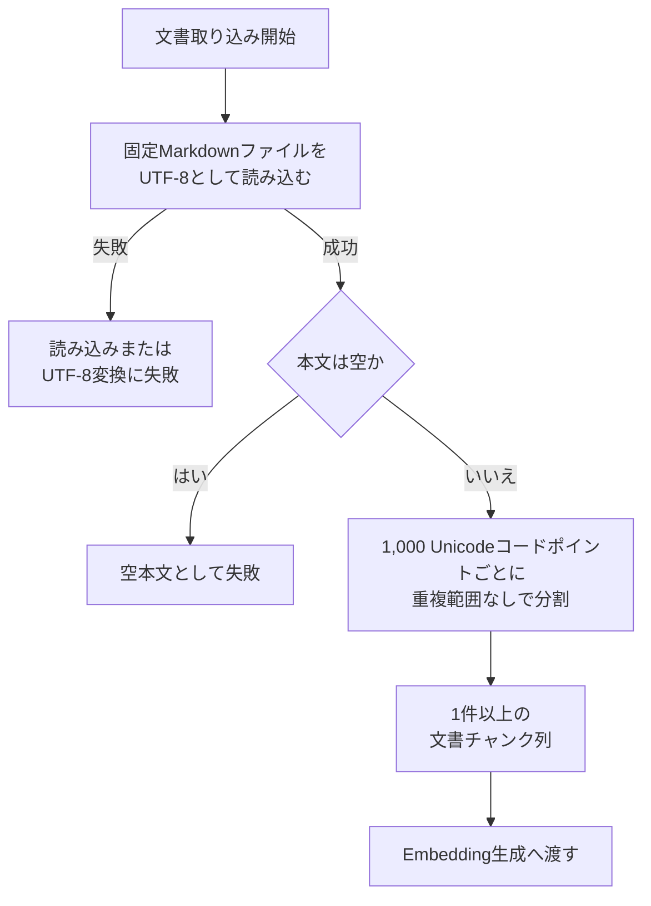

# 文書処理設計

> [!abstract] この文書の役割
> RAGScope v0.0で、固定されたUTF-8 Markdown文書1件を読み込み、正常な文書チャンク列を後続のEmbedding生成へ渡すまでの処理フロー、責務境界、チャンク契約を定義する。文書処理固有の`error_type`、子`span`、ログevent、属性の具体定義はこの文書で先行固定せず、実装対象として必要になった時点で現在の実行追跡・構造化ログ契約に従って定義する。

## 1. 目的と適用範囲

v0.0では、固定Markdownファイル1件を読み込み、本文を1,000 Unicodeコードポイントごとに分割する。検索品質に最適な分割方式や恒久的な文書データモデルの確立は対象としない。

| 現在の設計で扱うこと | 現在は扱わないこと |
|---|---|
| 固定Markdownファイル1件の読み込み | 複数文書、TXT、PDF、画像の取り込み |
| UTF-8として文字列へ変換した本文の保持 | Unicode・改行コードの正規化、Markdown構造の解析 |
| 空本文の拒否 | 空白だけ、空行だけ、Markdown記号だけの本文を意味上の空として扱うこと |
| 1,000コードポイント、重複範囲なしの固定分割 | Tokenizer、意味境界、可変チャンクサイズ、比較実験 |
| 元文書、順序、本文を識別できるチャンク列 | offset、文書バージョン、文書集合、チャンク条件・チャンク集合の管理 |
| 文書読み込み・検証・チャンク化の失敗条件 | 文書処理固有の`error_type`、子`span`、ログevent、属性の具体定義 |
| 正常な文書チャンク列をEmbedding生成へ引き渡す境界 | Embedding生成API、通信、保存、dense検索 |

## 2. 処理フローと境界



実行対象の固定パスはRAGScopeアプリケーション側が選択し、文書読み込みはパスを受け取る独立した境界とする。

いずれかの段階で失敗した場合は処理を終了し、部分的な本文、途中まで生成したチャンク、空のチャンク列を正常結果として返さず、Embedding生成へ進まない。

### 2.1 文書読み込み

- 対象は固定されたUTF-8 Markdownファイル1件とする。
- ファイル全体をUTF-8として文字列へ変換し、本文として扱う。
- Unicode正規化、改行コードの統一、Markdown記法の除去・解析、前後空白の削除、文字列置換は行わない。
- 本文の同一性は元ファイルのバイト列ではなく、UTF-8として文字列へ変換した本文に対して定義する。

### 2.2 空本文の検証

Unicodeコードポイント数が0件の場合は処理全体を失敗とする。

空白だけ、空行だけ、Markdown記号だけの本文は、内容の意味を解釈せず有効な本文としてチャンク化する。

### 2.3 自動再試行

v0.0の文書読み込みとチャンク化では自動再試行を行わない。

| 処理 | 理由 |
|---|---|
| 文書読み込み | ファイル不存在、不正なUTF-8などは、同じ入力のまま再試行しても解消しない |
| チャンク化 | 同じ入力に対して同じ結果を返す決定的な処理であり、再試行しても結果が変わらない |

原因を修正した後に、利用者がCLIコマンド全体を再実行する。

## 3. 文書チャンクの契約

各文書チャンクは、少なくとも次の概念を保持する。

```text
source      元文書を識別する情報
chunkIndex  文書内の順序を表す0始まりのindex
content     分割された本文
```

チャンク化はファイル入出力とEmbedding生成から分離した副作用のない処理とし、本文を先頭から1,000 Unicodeコードポイントごとに分割する。チャンク間に重複範囲は設けない。

ここでいうUnicodeコードポイントは、UTF-8のバイト数でも書記素クラスタでもない。結合文字や複数コードポイントからなる絵文字の途中がチャンク境界になることを許容する。

入力本文のコードポイント数を $$n$$、チャンクサイズを $$s = 1000$$ とすると、チャンク数 $$m$$ は次のとおりである。

$$
m = \left\lceil \frac{n}{s} \right\rceil
$$

0始まりの $$i$$ 番目のチャンク本文 $$C_i$$ は、入力本文 $$T$$ の次の半開区間とする。

$$
C_i =
T\left[
is :
\min\left((i+1)s,\ n\right)
\right]
\qquad
0 \le i < m
$$

正常に生成したチャンク列は、次をすべて満たす。

1. チャンク数は1件以上である。
2. `chunkIndex`は0から始まる欠番のない連続した値である。
3. 各`content`は1以上1,000以下のUnicodeコードポイントである。
4. 最後のチャンク以外は1,000 Unicodeコードポイントである。
5. `chunkIndex`順に全`content`を連結すると入力本文と完全に一致する。
6. すべてのチャンクは同じ`source`を持つ。
7. 同じ`source`と同じ本文からは、同じ順序・同じ本文のチャンク列を生成する。

チャンク本文へ見出し、接頭文字列、正規化結果などを追加せず、分割によって得た本文そのものを後続処理へ渡す。

## 4. 実行追跡・構造化ログとの境界

文書読み込み・検証・チャンク化は、[ユースケース基本設計](./ユースケース基本設計.md)で定義する「文書を検索可能にする」UseCaseを構成する内部処理である。この文書では、第2章で定義した処理境界と失敗条件を正本とし、それらへ対応する具体的な`error_type`、子`span`、ログevent、属性は先行して固定しない。

文書処理へ実行追跡や構造化ログを追加する場合は、[実行追跡・構造化ログ契約設計](./実行追跡・構造化ログ契約設計.md)に従う。内部処理を子`span`として追跡するか、どのeventを記録するかは、その処理を実装するときに必要な範囲で定義する。同じ失敗を階層ごとに重複してログへ記録せず、同じ失敗を`span`とログの両方で観測する場合は同じ`error_type`を使用する。処理時間は`span`で確認し、ログ属性へ重複して保持しない。

## 関連文書

- [RAGScope要求定義「1.1 文書」](<../RAGScope要求定義.md#1.1 文書>)
- [ユースケース基本設計「2.1.1 文書を検索可能にする」](<./ユースケース基本設計.md#2.1.1 文書を検索可能にする>)
- [システムアーキテクチャ「4.1 文書を検索可能にする」](<./システムアーキテクチャ.md#4.1 文書を検索可能にする>)
- [実行追跡・構造化ログ契約設計](./実行追跡・構造化ログ契約設計.md)
