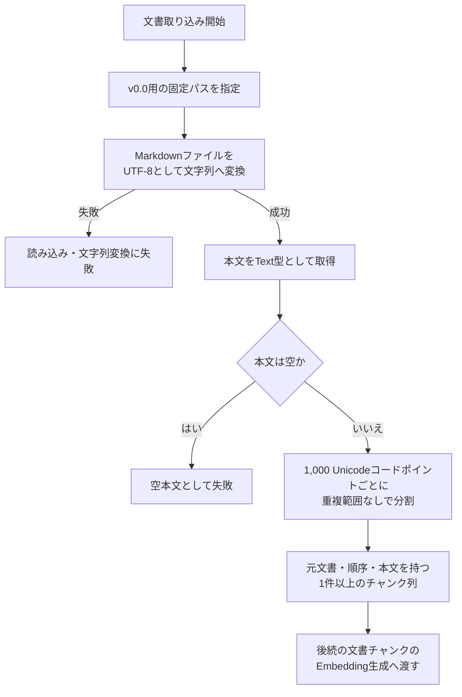
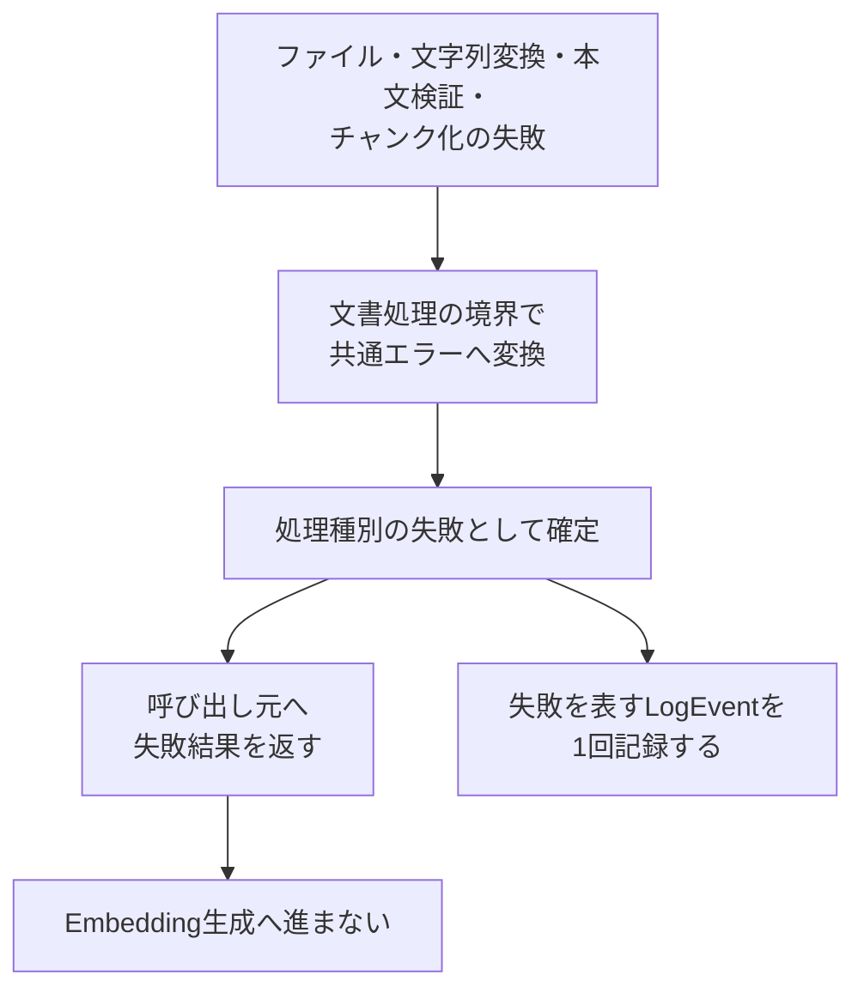

# 文書処理設計

> [!abstract] この文書の役割
> 固定Markdown文書を読み込み、固定ルールで文書チャンクへ分割し、後続の文書チャンクのEmbedding生成へ渡すまでの設計を説明する。
>
> v0.0で採用する処理フロー、責務境界、入出力、エラー・構造化ログとの対応、固定チャンクルール、不変条件を扱う。

## 1. 目的と適用範囲

### 1.1 目的

v0.0では、RAGScopeアプリケーションが固定されたUTF-8 Markdownファイル1件を読み込み、その本文を固定ルールで複数の文書チャンクへ分割する。

正常に生成したチャンク列は、後続の文書チャンクのEmbedding生成処理へ渡せる状態にする。

この設計は、文書読み込みとチャンク化を別々の実装Ticketで進めても、次を一貫して判断できる基準を提供する。

- 文書処理が担当する責務と、後続機能へ引き渡す境界
- 読み込んだMarkdown本文の扱い
- 文書チャンクの概念上の構造と固定分割ルール
- 正常結果として後続へ渡してよい状態
- エラー、構造化ログ、再試行、境界条件、不変条件
- 設計書とコード・テストの正本の分担

### 1.2 適用範囲

本設計は、[v0.0 — 最小のdense検索を実行できる](<../project-management/milestones/v0.0/v0.0.md>)で実装する、固定Markdown文書1件の読み込みとチャンク化へ適用する。具体的な処理順序は[4.1 文書処理の全体フロー](<#4.1 文書処理の全体フロー>)を正本とする。

| この設計で決めること | 後続Milestoneまたは別の機能設計で決めること |
|---|---|
| 固定Markdownファイルの読み込み | 複数文書、TXT、PDF、画像の取り込み |
| UTF-8として文字列へ変換した後の本文の扱い | Unicode・改行コードの正規化 |
| 空本文の扱い | Markdown構造やTokenizerを利用した分割 |
| 固定チャンクルール | 可変チャンク条件と比較実験 |
| 文書チャンクの概念と不変条件 | 位置情報（offset）、文書バージョン、文書集合の管理 |
| 共通エラー契約と構造化ログ契約への対応 | Embedding生成APIと通信形式 |
| 文書処理に自動再試行を適用しない方針 | 外部依存処理の再試行・タイムアウト方針 |
| Embedding生成へ渡す境界 | PostgreSQLへの保存形式とdense検索 |

v0.0の目的は、文書取り込みからdense検索までの最小経路を動作させることである。検索品質に最適な分割方式を確立することではないため、入力文書、実行時の入力パス、チャンクサイズ、重複範囲（overlap）を固定する。

### 1.3 この設計を利用する作業

- [v0.0 固定Markdown文書の取り込みとチャンク化](<../project-management/milestones/v0.0/document-ingestion/v0.0 固定Markdown文書の取り込みとチャンク化.md>)
- [RS-0011 固定Markdown文書の取り込みとチャンク化を設計する](<../project-management/milestones/v0.0/document-ingestion/RS-0011 固定Markdown文書の取り込みとチャンク化を設計する.md>)
- [RS-0001 固定Markdownファイルを読み込む](<../project-management/milestones/v0.0/document-ingestion/RS-0001 固定Markdownファイルを読み込む.md>)
- [RS-0002 固定ルールでMarkdown文書をチャンク化する](<../project-management/milestones/v0.0/document-ingestion/RS-0002 固定ルールでMarkdown文書をチャンク化する.md>)

RS-0011で現在設計を完成させる。RS-0001とRS-0002の実装によって設計が具体化または変更された場合は、同じ`文書処理設計.md`へ反映する。

## 2. 関連する要求と上位設計

### 2.1 要求

| 要求 | 本設計が担当する範囲 |
|---|---|
| [`REQ-DOC-001`](<../RAGScope要求定義.md#2.1 文書の取り込みと追跡>) | 固定パスのMarkdown文書1件を読み込み、後続処理で利用できる本文として取り込む |
| [`REQ-DOC-002`](<../RAGScope要求定義.md#2.1 文書の取り込みと追跡>) | 取り込んだMarkdown本文を、固定ルールで複数の文書チャンクへ分割する |
| [`REQ-NF-REL-001`](<../RAGScope要求定義.md#3.3 信頼性と保守性>) | 文書読み込みとチャンク化の主要な正常系・異常系・境界値を自動テストで確認できるようにする |

`REQ-DOC-001`が要求するMarkdown / TXTのうち、v0.0で扱う形式はMarkdownだけとする。TXT対応は本設計の対象外である。

### 2.2 上位設計

| 参照先 | この設計が従う内容 |
|---|---|
| [システムアーキテクチャ「3.1 RAGScopeアプリケーションの責務境界」](<./システムアーキテクチャ.md#3.1 RAGScopeアプリケーションの責務境界>) | RAGScopeアプリケーションが文書取り込みから検索準備までの処理順序とデータ整合性を管理する |
| [システムアーキテクチャ「6. 文書取り込みの全体フロー」](<./システムアーキテクチャ.md#6. 文書取り込みの全体フロー>) | 文書の取り込み、分割、文書チャンクのEmbedding生成、保存を段階的な処理として扱う |
| [エラー設計](./エラー設計.md) | 共通エラーの意味、公開情報と内部原因の境界、機能固有エラーとの分担 |
| [構造化ログ設計](./構造化ログ設計.md) | `phase`の共通語彙、`event`生成、`LogEvent`、実行追跡、JSON変換と出力処理 |
| [ADR-0002](<../adr/ADR-0002 共通実行基盤の契約とコンポーネント実装を分離する.md>) | 共通契約とコンポーネント実装の分離、処理種別ごとの再試行・タイムアウト方針 |

システムアーキテクチャは、将来の正規化、保存、位置情報、バージョン管理を含む全体像を定義する。本設計はその全体像を置き換えず、v0.0で先行して実装する最小範囲を定義する。

### 2.3 関連するプロジェクト管理文書

- [v0.0 — 最小のdense検索を実行できる](<../project-management/milestones/v0.0/v0.0.md>)
- [v0.0 固定Markdown文書の取り込みとチャンク化](<../project-management/milestones/v0.0/document-ingestion/v0.0 固定Markdown文書の取り込みとチャンク化.md>)
- [RS-0011 固定Markdown文書の取り込みとチャンク化を設計する](<../project-management/milestones/v0.0/document-ingestion/RS-0011 固定Markdown文書の取り込みとチャンク化を設計する.md>)
- [RS-0001 固定Markdownファイルを読み込む](<../project-management/milestones/v0.0/document-ingestion/RS-0001 固定Markdownファイルを読み込む.md>)
- [RS-0002 固定ルールでMarkdown文書をチャンク化する](<../project-management/milestones/v0.0/document-ingestion/RS-0002 固定ルールでMarkdown文書をチャンク化する.md>)

## 3. 責務と境界

### 3.1 担当する責務

文書処理を制御するRAGScopeアプリケーションは、次を担当する。

1. v0.0用の固定パスを文書読み込み処理へ渡す。
2. UTF-8 Markdownファイル1件を読み込み、ファイル全体の本文をHaskellの`Text`型として取得する。
3. 読み込んだ本文が空でないことを確認する。
4. 本文を1,000 Unicodeコードポイントごとの固定ルールで分割する。
5. 元文書、文書内の順序、本文を識別できる文書チャンクを生成する。
6. 1件以上の正常なチャンク列だけを、後続の文書チャンクのEmbedding生成処理へ渡す。
7. 失敗を共通エラーへ変換し、文書処理で定義した処理種別と観測点を構造化ログ契約へ渡す。
8. 文書読み込みとチャンク化を個別にテストできる境界へ分離する。

### 3.2 他の機能・コンポーネントとの境界

| 境界 | 上流側の責務 | 下流側の責務 |
|---|---|---|
| RAGScopeアプリケーション → 文書読み込み | v0.0用の固定パスを選択して渡す | 渡されたパスからMarkdown本文を取得する |
| 文書読み込み → 本文検証・チャンク化 | UTF-8として文字列へ変換した本文を追加変換せず返す | 空本文を拒否し、正常な本文を固定ルールで分割する |
| チャンク化 → 文書チャンクのEmbedding生成 | 順序付けされた正常なチャンク列を返す | モデルとTokenizerを使用して各文書チャンクのEmbeddingを生成する |
| 文書処理 → 共通エラー | 文書処理固有の失敗条件、エラーコード、安全な補助情報を定義する | 共通エラーの意味と公開境界に従って失敗を表現する |
| 文書処理 → 構造化ログ基盤 | 文書処理固有の`operation`、ログ上の`phase`、イベント固有情報、必要な場合は共通エラーを渡す | 共通契約に従って`event`と`LogEvent`を組み立て、出力判定、JSON変換、出力処理を通して記録する |
| 文書処理 → PostgreSQL | v0.0では直接保存しない | 後続Epicで文書、文書チャンクとそのEmbeddingを永続化する |

> [!important] 文書処理が知らないこと
> 文書読み込みとチャンク化は、`event`文字列やJSONの組み立て方、標準エラー出力への書き方、Embeddingモデル、AI推論サービスとの通信、PostgreSQLスキーマ、dense検索を扱わない。

### 3.3 対象外

| 分類 | v0.0で扱わない内容 |
|---|---|
| 入力 | 複数ファイル、ディレクトリ走査、TXT、PDF、画像、実行時に変更できる入力パス |
| Markdown解析 | Frontmatter、見出し、段落、コードブロックなどの構造解析 |
| チャンク化 | 意味境界、Tokenizer、重複範囲、可変チャンクサイズ、複数条件の比較 |
| 追跡・バージョン | `start_offset`、`end_offset`、文書バージョン、文書集合、チャンク条件、チャンク集合 |
| 後続処理 | Embedding生成API、正規化済み本文・チャンク・Embeddingの永続化、dense検索、検索品質評価 |
| 実行制御 | 外部依存処理向けの汎用的な再試行・タイムアウト実行機構 |

### 3.4 機械可読な定義を正本とする事項

| 正確に定義する内容 | 正本 |
|---|---|
| Haskellの型名、関数名、モジュール名 | RAGScopeアプリケーションのコード |
| 使用するライブラリと具体的なAPI | コードとプロジェクト設定 |
| エラー型、コンストラクタ、例外の捕捉方法 | コード |
| 固定パスの正確な文字列と設定場所 | コードまたは設定 |
| 元文書を識別する値の正確な型と表現 | コード |
| 文字列分割の具体的な実装 | コード |
| `LogEvent`の共通項目、型、必須条件 | [`log-event.schema.json`](../../contracts/logging/v1/log-event.schema.json) |
| 文書処理の`operation`、`phase`、イベント固有情報の型と文字列変換 | RAGScopeアプリケーションのコード |
| 具体的なテストケース、検証用データ、テストコマンド | テストコードとプロジェクト設定 |

本設計では、実装が守る責務、概念、処理フロー、契約、不変条件、文書処理固有のエラーとログ観測点を定義する。コードやSchemaの正確な構造は逐語的に複製しない。

## 4. 基本設計

### 4.1 文書処理の全体フロー



読み込み、UTF-8から文字列への変換、空本文判定のいずれかで失敗した場合は、チャンクを生成せず、文書チャンクのEmbedding生成へ進まない。

### 4.2 処理段階と責務

| 段階 | 入力 | 行うこと | 成功出力 | 主な失敗 |
|---|---|---|---|---|
| 文書読み込み | 固定パス | ファイルを読み込み、UTF-8として文字列へ変換する | 読み込み済み本文 | ファイルを利用できない、入出力エラー、不正なUTF-8 |
| 本文検証 | 読み込み済み本文 | 本文が空でないことを確認する | 有効な本文 | 空本文 |
| チャンク化 | 有効な本文 | 1,000コードポイントごとに分割する | 1件以上の文書チャンク | 予期しない内部失敗 |
| 受け渡し | 文書チャンク列 | 正常結果だけを後続処理から利用できる値として返す | Embedding生成が利用できるチャンク列 | 前段失敗時は実行しない |

> [!note] 処理段階とログ上のphaseは別の概念
> この表の「文書読み込み」「本文検証」「チャンク化」「受け渡し」は文書処理内部の段階である。構造化ログの`phase`は、各`operation`を`started`、`succeeded`、`failed`のどの観測点で記録したかを表す。

### 4.3 主要な概念

```text
文書処理
├── 元文書の識別情報
├── 読み込み済み本文
├── 文書チャンク
│   ├── 元文書を識別する情報（source）
│   ├── 文書内の順序（chunkIndex）
│   └── チャンク本文（content）
└── 文書処理結果
    ├── 成功：1件以上の文書チャンク
    └── 失敗：読み込み・文字列変換・空本文
```

| 概念 | 意味 | 主な規則 |
|---|---|---|
| 元文書の識別情報 | v0.0で処理する固定Markdown文書を後続処理で区別する最小限の情報 | 永続的な文書ID体系、文書バージョン、文書集合は導入しない |
| 読み込み済み本文 | UTF-8 Markdownファイル全体を文字列へ変換した`Text` | Markdown記法、Frontmatter、空行、改行、前後空白を保持する |
| 文書チャンク | 入力本文の連続した一部分 | 元文書を識別する`source`、0始まりの`chunkIndex`、チャンク本文を表す`content`を概念上持つ |
| 文書処理結果 | 成功と失敗を呼び出し元が区別できる結果 | 空のチャンク列を正常結果として返さない |

これは概念モデルである。`source`、`chunkIndex`、`content`が表す意味を示しており、正確な型名とデータ構造はコードを正本とする。

### 4.4 入出力と成功条件

#### 入力

文書処理全体の入力は、v0.0で使用する固定Markdownファイルを指すパスである。

実行時のパスはRAGScopeアプリケーション側の固定値とする。一方、文書読み込み処理はテスト可能な境界として分離し、呼び出し元からパスを受け取れる構造にしてよい。

#### 成功出力

| 条件 | 保証する内容 |
|---|---|
| 件数 | 1件以上である |
| 順序 | 0から始まる`chunkIndex`順に並んでいる |
| 元文書 | すべて同じ元文書を指す |
| チャンク長 | 各本文は1,000 Unicodeコードポイント以下である |
| 本文保持 | 全チャンク本文を順に連結すると入力本文と一致する |

#### 失敗出力

失敗時は、呼び出し元が正常結果と区別し、少なくとも失敗した段階と文書処理固有の共通エラーを判断できる結果を返す。

> [!important] 部分成功を返さない
> 部分的に読み込んだ本文、途中まで生成したチャンク、空の`Text`、空のチャンク列を、正常結果として返さない。

### 4.5 失敗が処理されるまで



下位の入出力処理やライブラリで発生したエラーや例外を、そのまま利用者表示や`LogEvent`へ流さない。文書処理固有の共通エラーへ変換し、安全な情報だけを呼び出し元とログへ渡す。

> [!important] 失敗を記録する境界
> エラー値自身や下位の関数はログを出さない。文書読み込みまたはチャンク化の処理結果を確定する境界が、同じ失敗を表すログイベントを1回だけ記録する。

### 4.6 retryの基本方針

> [!important] 文書処理では自動再試行を行わない
> v0.0の文書読み込みとチャンク化には、自動再試行を適用しない。

| 処理種別 | 自動再試行を行わない理由 |
|---|---|
| 文書読み込み | ファイル不存在、権限、不正なUTF-8、空本文は、同じ入力のまま再実行しても解消しない。自動再試行は原因の発見を遅らせる |
| チャンク化 | 同じ入力に対して同じ結果を返す決定的な処理であり、再試行しても結果は変わらない |

原因を修正した後に、利用者がCLIコマンド全体を再実行する。具体的な利用箇所がない汎用的な再試行・タイムアウト実行機構は、文書処理へ先行導入しない。

## 5. 詳細設計

### 5.1 文書読み込みの規則

- 対象はUTF-8 Markdownファイル1件とする。
- RAGScopeアプリケーション実行時は、v0.0用の固定パスを使用する。
- 読み込み処理は固定パスを内部へ埋め込まず、パスを受け取り本文を返すテスト可能な境界として分離してよい。
- ファイル全体をUTF-8として文字列へ変換し、`Text`型として呼び出し元へ返す。
- 複数ファイル、ディレクトリ走査、ファイル名のパターン検索、再帰探索は行わない。

> [!important] 文字列へ変換した後の本文を加工しない
> 文書処理は、読み込んだ本文を検索品質に適した形へ整える処理ではない。UTF-8として文字列へ変換した`Text`を、そのまま本文検証とチャンク化へ渡す。

次の変換は行わない。

- Unicode正規化
- 改行コードの統一
- Markdown記法の除去
- Frontmatter、見出し、段落、コードブロックの解析
- 前後空白の削除
- 空行の削除
- 文字列の置換

本文の同一性は、元ファイルのバイト列ではなく、UTF-8として文字列へ変換した`Text`に対して定義する。

### 5.2 空本文の検証規則

ファイルの読み込みとUTF-8から文字列への変換に成功しても、本文が空なら文書処理全体を失敗とする。

| 本文 | 判定 |
|---|---|
| コードポイントが0件 | 空本文として失敗 |
| 空白だけ | 有効な本文としてチャンク化 |
| 空行だけ | 有効な本文としてチャンク化 |
| Markdown記号だけ | 有効な本文としてチャンク化 |

前後空白の削除やMarkdown解析を行わないため、「意味上は空」という判定は行わない。

この規則により、文書処理の正常結果は常に1件以上のチャンクを持つ。

### 5.3 チャンク化の規則

Markdown本文を、先頭から1,000 Unicodeコードポイントごとに分割する。

- `chunkIndex`は0から始める。
- `chunkIndex`は欠番のない連続した整数とする。
- 各チャンクは入力本文中の連続した範囲を保持する。
- チャンク間に重複範囲を設けない。
- 最後のチャンクだけが1,000 Unicodeコードポイント未満になり得る。
- 空でない本文からは、必ず1件以上のチャンクを生成する。
- Markdownの構文上または意味上の境界は考慮しない。
- チャンク化は、ファイル入出力や文書チャンクのEmbedding生成から分離した副作用のない処理とする。

#### 5.3.1 Unicodeコードポイント

ここでいうUnicodeコードポイントは、UTF-8のバイト数でも、利用者が見た1文字を表す書記素クラスタ（grapheme cluster）でもない。

> [!note] v0.0で許容する境界
> 結合文字や、複数コードポイントからなる絵文字の途中がチャンク境界になることを許容する。

#### 5.3.2 数式による定義

入力本文のUnicodeコードポイント数を$$n$$、固定チャンクサイズを$$s = 1000$$とする。

空でない本文に対するチャンク数$$m$$は、次のとおりとする。

$$
m = \left\lceil \frac{n}{s} \right\rceil
$$

0始まりの$$i$$番目のチャンク本文$$C_i$$は、入力本文$$T$$の次の半開区間とする。

$$
C_i
=
T
\left[
is :
\min\left((i+1)s,\ n\right)
\right]
\qquad
0 \le i < m
$$

この式は概念上の仕様であり、具体的なHaskell実装はコードを正本とする。

### 5.4 エラーと境界条件

| 状態 | 文書処理の結果 | 後続処理 |
|---|---|---|
| ファイルが存在しない | 読み込み失敗 | 進めない |
| ファイルを開けない | 読み込み失敗 | 進めない |
| 読み込み途中で入出力エラーが発生した | 読み込み失敗 | 進めない |
| UTF-8として文字列へ変換できない | 入力形式の失敗 | 進めない |
| 本文が空 | 空本文として失敗 | 進めない |
| 本文が1コードポイント | 長さ1のチャンク1件 | 進める |
| 本文が1,000コードポイント | 長さ1,000のチャンク1件 | 進める |
| 本文が1,001コードポイント | 長さ1,000と1のチャンク2件 | 進める |
| 本文が空白・空行・Markdown記号だけ | 文字を保持してチャンク化 | 進める |

文書処理は部分成功を返さない。読み込みまたは文字列への変換に失敗した入力から得られた部分的な本文や、失敗前に生成できた一部の値を、正常なチャンク列として扱わない。

### 5.5 共通エラーへの対応

文書処理で発生する失敗を、[エラー設計](./エラー設計.md)の共通エラーへ次のように対応付ける。

| 失敗 | `category` | `code` | 安全な`message`の意味 |
|---|---|---|---|
| 固定Markdownファイルが存在しない | `resource` | `document.file_not_found` | 対象文書を見つけられない |
| ファイルを開けない、または読み込み中に入出力エラーが発生した | `resource` | `document.read_failed` | 対象文書を読み込めない |
| UTF-8として文字列へ変換できない | `data` | `document.invalid_utf8` | 対象文書をUTF-8として解釈できない |
| 本文が空 | `input` | `document.empty` | 対象文書の本文が空である |
| チャンク化で予期しない失敗が発生した | `internal` | `document.chunk_failed` | 対象文書をチャンク化できない |

- `cause`には元の入出力エラーや例外を内部で保持し、利用者表示、`LogEvent`、HTTPレスポンスへ出さない。
- `context`には、元文書を識別する安全な値だけを入れる。固定パス、本文、チャンク本文、スタックトレース、元の例外メッセージは入れない。
- エラーコードへ可変値、ライブラリ名、例外クラス名を埋め込まない。
- 同じ原因へ複数のコードを割り当てず、既存のコードへ後から別の意味を追加しない。

### 5.6 構造化ログへの対応

文書処理は、[構造化ログ設計](./構造化ログ設計.md)が定める共通の`phase`、`event`生成、`LogEvent`、実行追跡、出力規則を利用する。

#### operation

| `operation` | 追跡する範囲 |
|---|---|
| `document.read` | 固定パスを受け取り、ファイル読み込み、UTF-8から文字列への変換、空本文検証を完了するまで |
| `document.chunk` | 有効な本文を受け取り、1件以上の文書チャンクを生成するまで |

`document.read`と`document.chunk`の意味と追跡範囲は、本設計を正本とする。処理種別（`operation`）は関数名ではなく、処理結果を追跡する単位である。

#### ログイベントの観測点

| `operation` | `phase` | 記録する時点 | `level` | 記録する主な情報 |
|---|---|---|---|---|
| `document.read` | `started` | 固定パスを受け取り、ファイル読み込みを開始する直前 | `info` | 元文書を識別する安全な値 |
| `document.read` | `succeeded` | 読み込み、UTF-8からの文字列変換、空本文検証が完了した後 | `info` | バイト数、コードポイント数、処理時間 |
| `document.read` | `failed` | 文書読み込みの失敗結果を確定した後 | `error` | 共通エラー、処理時間 |
| `document.chunk` | `started` | 有効な本文を受け取り、チャンク化を開始する直前 | `info` | 元文書を識別する安全な値、入力コードポイント数 |
| `document.chunk` | `succeeded` | 1件以上の正常な文書チャンクを生成した後 | `info` | 入力コードポイント数、チャンク件数、処理時間 |
| `document.chunk` | `failed` | チャンク化の失敗結果を確定した後 | `error` | 共通エラー、処理時間 |

`event`は独立して定義・入力せず、構造化ログ設計の規則に従って`operation`と`phase`から生成する。

```text
operation = document.read
phase     = succeeded
                   ↓
event     = document.read.succeeded
```

> [!important] ログイベント名を手書きしない
> 実装では、定義済みの文書処理の`operation`と、構造化ログ共通の`phase`から`event`を組み立てる。任意の文字列をログ受付処理へ渡せる形にはしない。

#### ログへ記録しない情報

| 記録しないもの | 代わりに使用する情報 |
|---|---|
| 固定パスの全文 | 元文書を識別する安全な値 |
| Markdown本文、部分的に読み込んだ本文 | バイト数、コードポイント数 |
| 文書チャンク本文 | チャンク件数 |
| 元の入出力エラー・例外メッセージ・スタックトレース | エラー分類、コード、安全なメッセージ |

同じCLIコマンドに属するログイベントは、同じ`execution_id`を使用する。`event_id`と時刻の生成、`event`の組み立て、JSONへの変換、出力判定、出力処理は共通ログ基盤の責務とする。

### 5.7 契約と不変条件

空でない入力本文$$T$$から正常に生成されたチャンク列$$C_0, C_1, \ldots, C_{m-1}$$は、次をすべて満たす。

#### 1件以上のチャンク

$$
m \ge 1
$$

#### 連続したindex

$$
\mathrm{chunkIndex}(C_i) = i
\qquad
0 \le i < m
$$

#### チャンク長

$$
1 \le |C_i| \le 1000
$$

最後以外のチャンクは、必ず1,000 Unicodeコードポイントとする。

$$
|C_i| = 1000
\qquad
0 \le i < m - 1
$$

#### 本文の完全な復元

$$
T
=
C_0 \mathbin{+\!\!+}
C_1 \mathbin{+\!\!+}
\cdots
\mathbin{+\!\!+}
C_{m-1}
$$

ここで$$+\!\!+$$は、`chunkIndex`順の文字列連結を表す。

この不変条件により、入力本文のコードポイントについて、欠落、重複、置換、並べ替えがないことを保証する。

#### 元文書の対応

すべてのチャンクは、入力となった文書と同じ元文書の識別情報を持つ。

#### 決定性

同じ元文書の識別情報と同じ本文を入力した場合、同じ順序・同じ本文のチャンク列を生成する。

### 5.8 他コンポーネントへの受け渡し

文書処理は、正常に生成したチャンク列を、後続の文書チャンクのEmbedding生成処理から利用できる値として返す。

各チャンクは、少なくとも次の概念を保持する。

```text
- 元文書を識別するsource
- 文書内の順序を表す0始まりのchunkIndex
- Embedding入力となるcontent
```

> [!important] チャンク本文を加工しない
> チャンク本文には、Embedding生成のための見出し、接頭文字列、正規化結果などを追加しない。v0.0では、分割によって得たチャンク本文そのものを渡す。

次は、文書チャンクのEmbedding生成と保存を扱うEpicで定義する。

- AI推論サービスへ送るリクエストとレスポンス
- 一括処理
- 文書チャンクとそのEmbeddingの対応付け
- 通信失敗、タイムアウト、再試行
- EmbeddingモデルとTokenizer
- PostgreSQLへの保存形式

## 6. テスト観点

| 対象 | 確認すること |
|---|---|
| 文書読み込み | 見出し、複数段落、Markdown記法、空行、改行を含むUTF-8 Markdownを読み込める |
| 本文保持 | UTF-8として文字列へ変換した読み込み前後の本文が一致する |
| 読み込み失敗 | 存在しないファイル、利用できないファイル、不正なUTF-8を正常終了と区別できる |
| 空本文 | 空本文を失敗とし、チャンク化と後続処理へ進まない |
| 境界値 | 1、999、1,000、1,001、2,000コードポイントで期待した件数と長さになる |
| Markdown保持 | 改行・Markdown記法・空白を変換せず分割する |
| Unicode | 結合文字や絵文字を、バイト数ではなくコードポイント数として扱う |
| 不変条件 | 1件以上、連続した`chunkIndex`、最大長、完全復元、同一`source`、決定性を満たす |
| 共通エラー | 各失敗が定義した`category`と`code`へ対応し、元の例外や本文を公開しない |
| operation | `document.read`と`document.chunk`が、本設計で定義した範囲を表す |
| ログ観測点 | 各`operation`の開始・成功・失敗を定義した時点で1回だけ記録する |
| event | 正式な`operation`と共通の`phase`から正しいログイベント名を生成し、任意の文字列を渡せない |
| 情報保護 | 固定パス、本文、チャンク本文、例外メッセージ、スタックトレースをログへ含めない |
| 再試行 | 文書読み込みとチャンク化で自動再試行を行わない |

具体的な例示テストやプロパティベーステストの選択、テストライブラリ、検証用データ、時計・ID生成の差し替え方、テストコマンドはテストコードとプロジェクト設定を正本とする。

## 7. 将来設計との境界

v0.0では、固定Markdown文書1件を追加変換せず読み込み、固定長で分割して、元文書と順序を識別できるチャンク列を返すところまでを扱う。後続Milestoneとの違いを次に示す。

| 後続Milestoneで具体化する内容 | v0.0との違い |
|---|---|
| 正規化規則と`normalization_version` | UTF-8として文字列へ変換した後の本文を規則に従って変換する |
| 正規化済み本文の保存 | 文書処理結果を永続化する |
| `start_offset`・`end_offset` | チャンクから元本文の厳密な位置を追跡する |
| 文書バージョンと文書集合 | 文書更新と複数文書を識別する |
| `ChunkingConfig`と`ChunkSet` | 分割条件と生成結果を識別する |
| 可変チャンク条件と比較実験 | 固定値ではなく、条件ごとの検索品質を比較する |
| Markdown構造またはTokenizerを利用した分割 | コードポイント数以外の境界を利用する |
| 複数文書とTXT形式の取り込み | 入力形式と件数を拡張する |
| 文書更新時の検索用データ再生成 | 既存のチャンクとEmbeddingを更新する |

v0.0の固定ルールを、将来の検索品質に最適な方式または恒久的なデータモデルとして扱わない。

## 8. 変更時の注意

> [!warning] 文書処理の変更は後続の検索用データへ影響する
> 本文の変換、チャンク境界、識別情報、エラー契約、ログ観測点、後続処理へ渡す値を変更するときは、関係する要求、設計、コード、テストを同時に確認する。

- 実装によって本設計の変更が必要になった場合は、該当Ticketで理由と影響範囲を確認し、同じ`文書処理設計.md`へ現在設計を反映する。
- 正確な型、関数、モジュール、Schema、テストケースを設計書へ逐語的に複製せず、コードや専用形式との正本の分担を維持する。
- チャンク本文の変換を追加する場合は、本文の完全復元という不変条件への影響を確認する。
- チャンクサイズ、重複範囲、正規化、位置情報、バージョン管理を追加する場合は、v0.0の局所変更として暗黙に導入せず、対象Milestone、要求、システムアーキテクチャ、関連設計への影響を確認する。
- エラーコードを変更する場合は、[エラー設計](./エラー設計.md)、RAGScopeアプリケーションの型とテストへの影響を確認する。
- `operation`、ログ観測点、イベント固有情報を変更する場合は、本設計を正本として変更し、[構造化ログ設計](./構造化ログ設計.md)、JSON Schema、RAGScopeアプリケーションの型とテストへの影響を確認する。
- 文書処理から文書チャンクのEmbedding生成へ渡す情報を変更する場合は、文書チャンクのEmbedding生成・保存側の設計と実装への影響を確認する。
