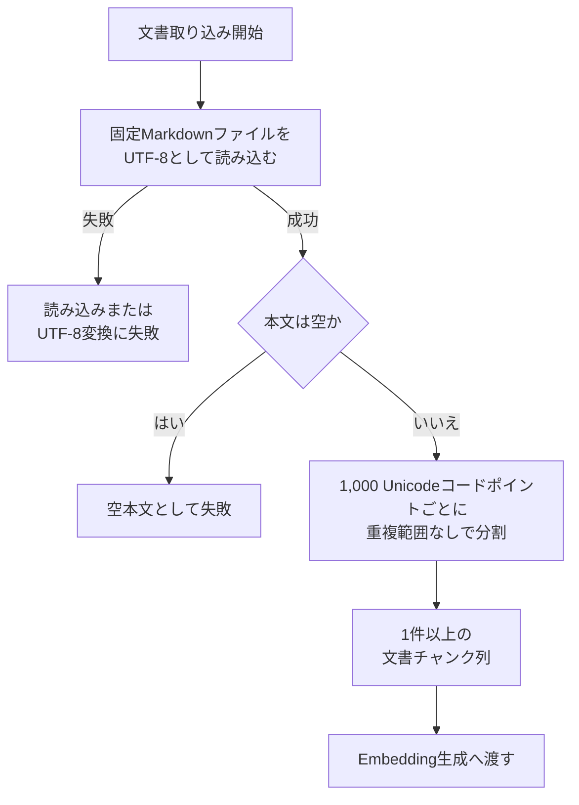

# 文書処理設計

> [!abstract] この文書の役割
> 固定されたUTF-8 Markdown文書1件を読み込み、本文を固定ルールで文書チャンクへ分割し、正常なチャンク列を後続のEmbedding生成へ渡すまでの設計を定義する。
>
> v0.0で採用する責務境界、入出力、処理規則、エラー・ログ契約、不変条件を扱う。

## 1. 目的と適用範囲

v0.0では、RAGScopeアプリケーションが固定されたMarkdownファイル1件を読み込み、その本文を1,000 Unicodeコードポイントごとに分割する。正常に生成した1件以上の文書チャンクだけを、後続の文書チャンクのEmbedding生成へ渡す。

| 現在の設計で扱うこと | 現在は扱わないこと |
|---|---|
| 固定Markdownファイル1件の読み込み | 複数文書、TXT、PDF、画像の取り込み |
| UTF-8として文字列へ変換した本文の保持 | Unicode・改行コードの正規化、Markdown構造の解析 |
| 空本文の拒否 | 空白だけ、空行だけ、Markdown記号だけの本文を意味上の空として扱うこと |
| 1,000コードポイント、重複範囲なしの固定分割 | Tokenizer、意味境界、可変チャンクサイズ、比較実験 |
| 元文書、順序、本文を識別できるチャンク列 | offset、文書バージョン、文書集合、チャンク条件・チャンク集合の管理 |
| 文書処理固有の共通エラーとログイベント契約 | Embedding生成API、通信、保存、dense検索 |
| 文書読み込みとチャンク化で自動再試行しない方針 | 外部依存処理の再試行・タイムアウト制御 |

v0.0の目的は、文書取り込みからdense検索までの最小経路を動作させることであり、検索品質に最適な分割方式または恒久的な文書データモデルを確立することではない。

## 2. 責務と入出力

### 2.1 責務と境界

文書処理は、固定パスの選択、Markdown本文の読み込み、空本文の検証、固定ルールによるチャンク化、正常なチャンク列の受け渡しを制御する。読み込みとチャンク化は、それぞれ独立してテストできる境界へ分離する。

| 境界 | 上流側の責務 | 下流側の責務 |
|---|---|---|
| RAGScopeアプリケーション → 文書読み込み | v0.0用の固定パスを選択して渡す | 渡されたパスからMarkdown本文を取得する |
| 文書読み込み → 本文検証・チャンク化 | UTF-8として文字列へ変換した本文を追加変換せず返す | 空本文を拒否し、正常な本文を固定ルールで分割する |
| チャンク化 → 文書チャンクのEmbedding生成 | 順序付けされた正常なチャンク列だけを返す | モデルとTokenizerを使用して各チャンクのEmbeddingを生成する |
| 文書処理 → 共通エラー | 文書処理固有の失敗条件とエラーコードを定義する | 共通エラーの意味と公開境界に従って失敗を表現する |
| 文書処理 → 構造化ログ基盤 | 許可された`operation`、`event`、`payload`、必要な場合は共通エラーを渡す | `LogEvent`を組み立て、JSONへ変換して出力する |

> [!important] 文書処理が扱わないこと
> 文書読み込みとチャンク化は、ログJSONの組み立て、ID・時刻の生成、標準エラー出力への書き込み、Embeddingモデル、AI推論サービスとの通信、PostgreSQLスキーマ、dense検索を扱わない。

### 2.2 入力と結果

文書処理全体の入力は、v0.0で使用する固定Markdownファイルを指すパスである。実行時のパスはRAGScopeアプリケーション側の固定値とするが、文書読み込み処理はテスト可能な境界としてパスを受け取れる構造にしてよい。

正常結果は、次を満たす1件以上の文書チャンク列である。

| 条件 | 保証する内容 |
|---|---|
| 件数 | 1件以上である |
| 順序 | 0から始まる`chunkIndex`順に並ぶ |
| 元文書 | すべて同じ`source`を持つ |
| チャンク長 | 各`content`は1,000 Unicodeコードポイント以下である |
| 本文保持 | 全`content`を順に連結すると入力本文と一致する |

失敗時は、失敗した処理を識別できる共通エラーを返し、後続のEmbedding生成へ進まない。部分的に読み込んだ本文、途中まで生成したチャンク、空の`Text`、空のチャンク列を正常結果として返さない。

## 3. 処理規則

### 3.1 全体フロー



いずれかの失敗が確定した時点で処理を終了し、チャンク化または後続処理へ進まない。

### 3.2 文書読み込み

- 対象はUTF-8 Markdownファイル1件とする。
- ファイル全体をUTF-8として文字列へ変換し、Haskellの`Text`として返す。
- 読み込み処理は固定パスを内部へ埋め込まず、パスを受け取るテスト可能な境界として分離してよい。
- 複数ファイル、ディレクトリ走査、ファイル名のパターン検索、再帰探索は行わない。

UTF-8として文字列へ変換した本文には、次の加工を行わない。

- Unicode正規化
- 改行コードの統一
- Markdown記法の除去
- Frontmatter、見出し、段落、コードブロックの解析
- 前後空白または空行の削除
- 文字列の置換

本文の同一性は元ファイルのバイト列ではなく、UTF-8として文字列へ変換した`Text`に対して定義する。

### 3.3 空本文の検証

本文のUnicodeコードポイント数が0件なら、文書処理全体を失敗とする。それ以外は、内容の意味を解釈せず有効な本文として扱う。

| 本文 | 判定 |
|---|---|
| コードポイントが0件 | 空本文として失敗 |
| 空白だけ | チャンク化する |
| 空行だけ | チャンク化する |
| Markdown記号だけ | チャンク化する |

### 3.4 チャンク化

本文を先頭から1,000 Unicodeコードポイントごとに分割する。

- `chunkIndex`は0から始まる欠番のない整数とする。
- 各`content`は入力本文中の連続した範囲を保持する。
- チャンク間に重複範囲を設けない。
- 最後のチャンクだけが1,000コードポイント未満になり得る。
- Markdownの構文上または意味上の境界は考慮しない。
- チャンク化は、ファイル入出力とEmbedding生成から分離した副作用のない処理とする。

ここでいうUnicodeコードポイントは、UTF-8のバイト数でも、書記素クラスタでもない。結合文字や複数コードポイントからなる絵文字の途中がチャンク境界になることを許容する。

入力本文のコードポイント数を$$n$$、固定チャンクサイズを$$s = 1000$$とすると、空でない本文のチャンク数$$m$$は次のとおりである。

$$
m = \left\lceil \frac{n}{s} \right\rceil
$$

0始まりの$$i$$番目のチャンク本文$$C_i$$は、入力本文$$T$$の次の半開区間である。

$$
C_i
=
T
\left[
is :
\min\left((i+1)s,\ n\right)
\right]
\qquad
0 \le i < m
$$

代表的な境界値を次に示す。

| 本文の長さ | 結果 |
|---:|---|
| 1 | 長さ1のチャンク1件 |
| 999 | 長さ999のチャンク1件 |
| 1,000 | 長さ1,000のチャンク1件 |
| 1,001 | 長さ1,000と1のチャンク2件 |
| 2,000 | 長さ1,000のチャンク2件 |

具体的なHaskell実装とテストケースはコードを正本とする。

### 3.5 自動再試行

v0.0の文書読み込みとチャンク化では、自動再試行を行わない。

| 処理 | 理由 |
|---|---|
| 文書読み込み | ファイル不存在、権限、不正なUTF-8、空本文は、同じ入力のまま再実行しても解消しない |
| チャンク化 | 同じ入力に対して同じ結果を返す決定的な処理であり、再試行しても結果が変わらない |

原因を修正した後に、利用者がCLIコマンド全体を再実行する。具体的な利用箇所がない汎用的な再試行・タイムアウト機構は先行導入しない。

## 4. エラーとログ

### 4.1 失敗を処理する境界

下位の入出力処理やライブラリで発生したエラーや例外を、そのまま利用者表示や`LogEvent`へ流さない。文書読み込みまたはチャンク化の結果を確定する境界で、文書処理固有の共通エラーへ変換する。

同じ境界が、失敗結果を呼び出し元へ返し、対応する`failed`ログイベントを1回だけ記録する。エラー値自身や下位の関数はログを出さない。

### 4.2 共通エラーへの対応

| 失敗 | `category` | `code` | 安全な`message`の意味 |
|---|---|---|---|
| 固定Markdownファイルが存在しない | `resource` | `document.file_not_found` | 対象文書を見つけられない |
| ファイルを開けない、または読み込み中に入出力エラーが発生した | `resource` | `document.read_failed` | 対象文書を読み込めない |
| UTF-8として文字列へ変換できない | `data` | `document.invalid_utf8` | 対象文書をUTF-8として解釈できない |
| 本文が空 | `input` | `document.empty` | 対象文書の本文が空である |
| チャンク化で予期しない失敗が発生した | `internal` | `document.chunk_failed` | 対象文書をチャンク化できない |

- 元の入出力エラーや例外は`cause`として内部で保持し、利用者表示、`LogEvent`、HTTPレスポンスへ出さない。
- v0.0の文書処理エラーでは`error.context`を使用しない。
- 将来`error.context`を追加する場合は、そのエラーコードに固有で、`payload`と重複しない安全な情報だけを許可する。
- エラーコードへ可変値、ライブラリ名、例外クラス名を埋め込まない。

### 4.3 ログイベント契約

文書処理固有のログイベントは、`operation`と`event`の組で識別する。

| `operation` | 追跡する処理と成功条件 |
|---|---|
| `document.read` | 固定パスを受け取り、ファイル読み込み、UTF-8変換、空本文検証を完了する |
| `document.chunk` | 有効な本文を受け取り、1件以上の正常な文書チャンクを生成する |

| `operation` | `event` | 記録する時点 | `level` | `payload` | `error` |
|---|---|---|---|---|---|
| `document.read` | `started` | ファイル読み込みを開始する直前 | `info` | `source` | なし |
| `document.read` | `succeeded` | 読み込み、UTF-8変換、空本文検証が完了した後 | `info` | `source`, `byte_count`, `code_point_count`, `duration_ms` | なし |
| `document.read` | `failed` | 文書読み込みの失敗結果を確定した後 | `error` | `source`, `duration_ms` | [4.2 共通エラーへの対応](<#4.2 共通エラーへの対応>)の共通エラー |
| `document.chunk` | `started` | 有効な本文を受け取り、チャンク化を開始する直前 | `info` | `source`, `input_code_point_count` | なし |
| `document.chunk` | `succeeded` | 1件以上の正常なチャンクを生成した後 | `info` | `source`, `input_code_point_count`, `chunk_count`, `duration_ms` | なし |
| `document.chunk` | `failed` | チャンク化の失敗結果を確定した後 | `error` | `source`, `input_code_point_count`, `duration_ms` | [4.2 共通エラーへの対応](<#4.2 共通エラーへの対応>)の共通エラー |

| `payload`項目 | 意味と制約 |
|---|---|
| `source` | 固定パスそのものではない、元文書を識別する安全な値 |
| `byte_count` | ファイルから読み込んだバイト数。0以上 |
| `code_point_count` | 空本文検証に成功した本文のUnicodeコードポイント数。1以上 |
| `input_code_point_count` | チャンク化へ渡した本文のUnicodeコードポイント数。1以上 |
| `chunk_count` | 正常に生成したチャンク件数。1以上 |
| `duration_ms` | 単調時計で計測した処理時間。ミリ秒、0以上 |

> [!important] `payload`と`error`を重複させない
> `payload`は、何を処理し、処理について何を観測したかを表す。`error`は、処理がなぜ失敗したかを表し、`failed`イベントだけが持つ。
>
> `category`、`code`、`message`、エラー固有の`context`を`payload`へ入れない。`source`、処理時間、サイズ、件数を`error`または`error.context`へ入れない。

各イベントの`payload`項目を許可リストとする。固定パスの全文、Markdown本文、部分的に読み込んだ本文、チャンク本文、元の例外メッセージ、スタックトレース、`cause`は記録しない。

実装では、許可された`operation`と`event`の組および対応する`payload`を閉じた型で表現する。任意の識別子や任意項目を機能処理から渡せる形にしない。

同じCLIコマンドに属するログイベントは同じ`execution_id`を使用する。`event_id`と時刻の生成、JSON変換、出力判定、出力処理は共通ログ基盤の責務とする。

## 5. 契約と受け渡し

### 5.1 チャンク列の不変条件

空でない入力本文$$T$$から正常に生成されたチャンク列$$C_0, C_1, \ldots, C_{m-1}$$は、次をすべて満たす。

$$
m \ge 1
$$

$$
\mathrm{chunkIndex}(C_i) = i
\qquad
0 \le i < m
$$

$$
1 \le |C_i| \le 1000
$$

最後以外のチャンクは1,000コードポイントである。

$$
|C_i| = 1000
\qquad
0 \le i < m - 1
$$

`chunkIndex`順に本文を連結すると入力本文と一致する。

$$
T
=
C_0 \mathbin{+\!\!+}
C_1 \mathbin{+\!\!+}
\cdots
\mathbin{+\!\!+}
C_{m-1}
$$

すべてのチャンクは同じ元文書の`source`を持つ。同じ`source`と同じ本文からは、同じ順序・同じ本文のチャンク列を生成する。

### 5.2 後続処理への受け渡し

各文書チャンクは、少なくとも次の概念を保持する。

```text
source      元文書を識別する情報
chunkIndex  文書内の順序を表す0始まりのindex
content     Embedding入力となるチャンク本文
```

チャンク本文へ見出し、接頭文字列、正規化結果などを追加せず、分割によって得た本文そのものを渡す。

Embedding生成API、一括処理、通信失敗、タイムアウト、再試行、EmbeddingモデルとTokenizer、PostgreSQLへの保存形式は後続機能の責務とする。

> [!warning] 変更の影響
> 本文の変換、チャンク境界、識別情報、エラー契約、ログイベント契約、受け渡す値を変更すると、後続のEmbedding生成・保存・検索用データへ影響する。関係する要求、設計、コード、テスト、Schemaを同じ変更で確認する。

本設計の処理規則、境界条件、不変条件、共通エラー、ログイベント契約は自動テストで確認する。具体的なテストケース、検証用データ、時計・ID生成の差し替え、テストコマンドはテストコードとプロジェクト設定を正本とする。

## 関連文書

| 参照先 | 本設計との関係 |
|---|---|
| [`REQ-DOC-001`・`REQ-DOC-002`](<../RAGScope要求定義.md#2.1 文書の取り込みと追跡>) | 固定文書の取り込みとチャンク化の要求 |
| [`REQ-NF-REL-001`](<../RAGScope要求定義.md#3.3 信頼性と保守性>) | 正常系・異常系・境界値を自動テストで確認する要求 |
| [システムアーキテクチャ](./システムアーキテクチャ.md) | 文書取り込みから保存・検索までの全体的な責務と処理順序 |
| [エラー設計](./エラー設計.md) | 共通エラーの意味、公開範囲、内部原因との境界 |
| [構造化ログ設計](./構造化ログ設計.md) | `LogEvent`、実行追跡、JSON変換、出力規則 |
| [ADR-0002](<../adr/ADR-0002 共通実行基盤の契約とコンポーネント実装を分離する.md>) | 共通契約とコンポーネント実装の分離 |
| [`log-event.schema.json`](../../contracts/logging/v1/log-event.schema.json) | `LogEvent`の共通項目、型、必須条件の正本 |

正確なHaskellの型、関数、モジュール、固定パス、文字列変換、文書処理固有のログ型と文字列変換はRAGScopeアプリケーションのコードを正本とする。
