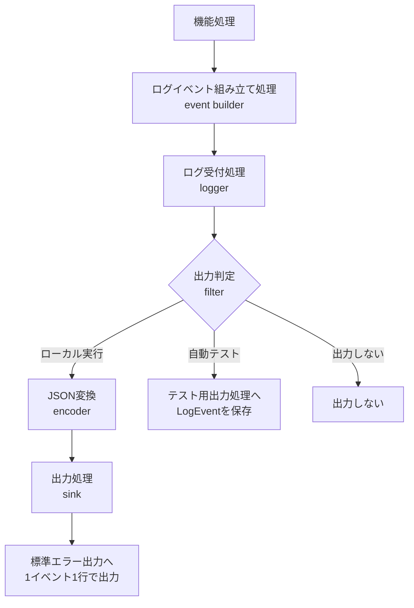

# 構造化ログ設計

> [!abstract] この文書の役割
> RAGScopeの各コンポーネントが、処理中の出来事を同じJSON契約で記録し、1回の実行に属するログイベントを追跡するための共通設計を定義する。
>
> 具体的な処理種別（`operation`）、観測点、イベント固有情報は各機能設計を正本とし、正確なJSON項目と必須条件はJSON Schemaを正本とする。

## 1. ログ契約の概要

### 1.1 代表的なログJSON

```json
{
  "schema_version": 1,
  "event_id": "550e8400-e29b-41d4-a716-446655440000",
  "timestamp": "2026-07-28T10:00:00.123Z",
  "level": "info",
  "event": "document.read.succeeded",
  "component": "ragscope_app",
  "operation": "document.read",
  "context": {
    "scope": "execution",
    "execution_id": "7d9c35b8-7980-4b20-a86c-7220e67276cc"
  },
  "payload": {
    "byte_count": 2048,
    "duration_ms": 12
  }
}
```

RAGScopeの構造化ログは、ログイベント1件をこのような1つのJSONオブジェクトとして表す。以降では、各キーの意味、キーどうしの関係、生成・出力時に守る規則を説明する。

### 1.2 主要なJSONキー

| キー | 例 | 意味 | 主な必須条件 |
|---|---|---|---|
| `schema_version` | `1` | ログ契約のバージョン | 常に必須。v1では`1` |
| `event_id` | UUIDv4 | ログイベント1件の識別子 | 常に必須。イベントごとに異なる |
| `timestamp` | `2026-07-28T10:00:00.123Z` | ログイベントを記録したUTC時刻 | 常に必須。RFC 3339、ミリ秒3桁、末尾`Z` |
| `level` | `info` | 処理への影響の大きさ | 常に必須。失敗イベントは`error` |
| `event` | `document.read.succeeded` | 1つの観測結果を表すJSON上のログイベント名 | 常に必須。`operation`と`phase`から生成する |
| `component` | `ragscope_app` | ログイベントを生成したコンポーネント | 常に必須 |
| `operation` | `document.read` | 追跡する意味のある処理種別 | 常に必須。具体値は各機能設計が定義する |
| `context` | `{"scope":"execution", ...}` | 実行またはサービスとの関連情報 | 常に必須。`scope`に応じて形が変わる |
| `payload` | `{"byte_count":2048}` | イベント固有の安全な情報 | 常に必須。情報がない場合も空オブジェクトとし、`null`にしない |
| `error` | `{"category":"resource", ...}` | 失敗の安全な情報 | `.failed`で終わるイベントだけ必須。それ以外には入れない |

`LogEvent`は、概念上、次の4種類の情報から構成する。共通項目（Envelope）はJSONのルートに置き、実行との関連情報（Context）は`context`、イベント固有情報（Payload）は`payload`、失敗情報（Error）は`error`へ表現する。

```text
LogEvent
├── 共通項目（Envelope）
├── 実行との関連情報（Context）
├── イベント固有情報（Payload）
└── 失敗情報（Error）
```

### 1.3 `operation`、`phase`、`event`の関係

```text
operation = document.read  （具体値と意味は各機能設計が定義）
phase     = succeeded      （構造化ログの共通語彙）
                    ↓
event     = document.read.succeeded
```

| 概念 | 表すもの | 正本 |
|---|---|---|
| 処理種別（`operation`） | 追跡したい意味のある処理単位。同じ処理の開始・成功・失敗をまとめて扱うための軸 | 具体値、処理範囲、成功条件は各機能設計 |
| ログ上の段階（`phase`） | 処理の開始・成功・失敗という観測区分 | 共通語彙は本設計、閉じた型はコード |
| ログイベント名（`event`） | 1つの観測結果を単一の識別名として表すJSON項目 | 独立した一覧を持たず、コードで導出する |

`operation`と`event`は一部の情報が重なるが、役割が異なる。`operation`は`document.read`に関係するログイベントを処理単位でまとめるために使用し、`event`は`document.read.succeeded`という1つの観測結果をJSON上で識別する。現在のJSON Schemaは、`event`が`.failed`で終わる場合に`error`を必須とし、`level`を`error`へ制約する。

`event`は独立した設計情報ではなく、`operation`と`phase`から必ず導出する。v0.0ではCloudWatch上の具体的な検索・集計方法をまだ定義していないため、特定の検索方法を前提として`event`を設けているわけではない。

> [!note] `phase`は現在のJSONキーではない
> `phase`は、コード内部で`event`を組み立てるための共通語彙である。JSONへは、生成した`event`と元の`operation`を出力する。

> [!important] ログイベント名を手書きしない
> コードでは、定義済みの`operation`と`phase`から`event`を生成する。表記揺れと、`operation`・`event`の不一致を防ぐ。

## 2. 項目・概念とその意味

### 2.1 `operation`

`operation`は単なる関数名ではなく、処理結果を追跡する意味のある単位である。

- `<domain>.<action>`形式の小文字ASCIIを使用する。
- 具体的な値、追跡する範囲、成功条件、観測点は各機能設計で定義する。
- 正確な閉じた型と文字列変換は、各コンポーネントのコードを正本とする。
- 共通ログ設計へ、すべての機能の`operation`一覧を集約しない。

文書処理における`document.read`と`document.chunk`の意味は、[文書処理設計](./文書処理設計.md)を正本とする。

### 2.2 `phase`と`event`

`phase`は機能内部の細かな処理段階ではなく、1つの`operation`をどの観測点で記録したかを表す。

| `phase` | 意味 |
|---|---|
| `started` | 機能設計で定義した`operation`を開始した |
| `succeeded` | 機能設計で定義した成功条件を満たした |
| `failed` | 機能設計で定義した失敗結果として確定した |

文書読み込み、本文検証、チャンク化などの機能内部の処理段階と、ログ上の`phase`を混同しない。

### 2.3 `scope`、ID、時刻

| 項目 | 意味と規則 |
|---|---|
| `context.scope = execution` | 1回のCLIコマンドに属するログイベント。`execution_id`が必須 |
| `context.scope = service` | サービスの起動・終了などの状態変化。`execution_id`を入れない |
| `execution_id` | 1回のCLIコマンドを識別するUUIDv4。最も外側の境界で最初のログイベントより前に1回生成し、同じコマンドではコンポーネント境界を越えて引き継ぐ |
| `event_id` | `LogEvent`1件を識別するUUIDv4。同じイベントを複数の出力処理へ渡しても作り直さない |
| `timestamp` | ログイベントを記録したUTC時刻。RFC 3339、ミリ秒3桁、末尾`Z` |
| 所要時間 | 単調時計で計測し、`duration_ms`のように項目名へ単位を含める |

文書取り込みコマンドと検索コマンドなど、別のCLIコマンドには別の`execution_id`を使用する。`execution_id`は複数の独立したコマンドを1つの実行として束ねる識別子ではない。

生存確認（health）・準備完了確認（readiness）などの稼働確認リクエストは、v1の共通アプリケーションログイベントへ含めない。

### 2.4 `level`と`error`

| `level` | 使用する状況 | 既定で出力するか |
|---|---|---|
| `debug` | 開発・調査時だけ必要な詳しい情報 | 出力しない |
| `info` | 通常の処理進行と結果 | 出力する |
| `warn` | 処理は続けられるが注意が必要 | 出力する |
| `error` | 処理種別が失敗した | 出力する |

`.failed`で終わるログイベントは、`error`を持ち、`level`を`error`にする。失敗以外のログイベントには`error`を入れない。

`level`は処理への影響、`error.category`は失敗の種類を表す。エラー分類からログレベルを機械的に決めない。

`error`へ渡せる情報は、[エラー設計](./エラー設計.md)が公開を許可した`category`、`code`、`message`、許可された`context`だけである。`cause`、元の例外メッセージ、スタックトレースは渡さない。

### 2.5 `component`と`payload`

`component`は次の閉じた値を使用する。

| 値 | コンポーネント |
|---|---|
| `ragscope_app` | RAGScopeアプリケーション |
| `ai_service` | AI推論サービス |

`payload`はイベント固有の安全な情報を保持する。各イベントで記録してよい項目は各機能設計で定義し、何でも入れられる値を機能処理へ公開しない。

- 項目名は小文字の`snake_case`とする。
- 値へ`null`を入れない。
- 所要時間やサイズの項目名には単位を含める。
- 関係のない項目を多数持つ大きなnullable recordへ集約しない。

## 3. 規則と不変条件

### 3.1 識別子を自由入力させない

機能処理から、任意の`operation`、`phase`、`event`、`component`、`level`をログ受付処理へ渡せる形にしない。閉じた型から文字列へ変換する処理を1か所へ集める。

識別子を追加するときは、既存の処理境界では表せないか、意味・追跡範囲・観測点を各機能設計で説明できるか、期待した文字列をテストしているかを確認する。同じ意味の別名を増やさず、既存の識別子へ別の意味を割り当てない。

### 3.2 JSON出力

| 項目 | 規則 |
|---|---|
| JSON Schema | Draft 2020-12 |
| 文字コード | UTF-8 |
| 項目名・列挙値 | 小文字の`snake_case` |
| 契約の配置 | `contracts/logging/v1/` |
| `schema_version` | `1` |
| ローカルの出力先 | 正常なCLI結果は標準出力、構造化ログは標準エラー出力 |
| 出力単位 | 1ログイベントを1行のJSONとして出力する |

標準エラー出力へ、JSON以外の接頭辞、色制御文字、説明文、通常のテキスト形式のエラーを混ぜない。

`context`と`payload`は常にJSONへ出力する。`error`などの任意項目は、該当しない場合に`null`ではなく省略する。

標準JSON Schemaだけでは、`event`と`operation`の一致や、正しい観測点で記録したかを完全には確認できない。`event`の生成はコード、観測点とイベント固有情報は各機能設計と自動テストで保証する。

### 3.3 情報保護

| 情報の種類 | そのまま記録しないもの | 代わりに使用する情報 |
|---|---|---|
| 文書・生成内容 | 文書、文書チャンク、回答の全文 | 安定したID、件数、バイト数 |
| AI入力 | プロンプト、`context`の全文、Embedding | トークン数、モデルID |
| 認証・接続情報 | 秘密情報、認証情報、DB接続文字列 | 記録しない |
| HTTP | 本文、ヘッダーの全文 | ステータス、許可した要約 |
| 例外 | スタックトレース、元の例外メッセージ | エラー分類、コード、安全なメッセージ |

> [!important] 許可リストを先に決める
> 各機能設計で、記録してよいイベント固有情報を先に定義する。後から正規表現で伏せ字にする方法だけへ依存しない。

`debug`を有効にしても、情報保護の規則は変わらない。安全性を確認できない値は、一部を伏せ字にするより項目自体を省略する。

### 3.4 ログ出力自体が失敗した場合

| 状況 | 扱い |
|---|---|
| JSON変換の失敗 | `logging.encode_failed`として区別する |
| 出力処理の失敗 | `logging.sink_failed`として区別する |
| 元の処理は成功し、必須ログイベントの出力に失敗 | 外側の境界へ内部エラーとして返す |
| 元の処理とログ受付処理の両方が失敗 | 元の処理のエラーを主な原因として残す |

> [!warning] 失敗したログ経路へ再び記録しない
> ログ受付処理の失敗を、同じログ受付処理や失敗した出力先へ書き込まない。再帰的な失敗を防ぐ。

v0.0では代替出力を採用しない。壊れたJSONや通常テキストを代わりに標準エラー出力へ出さず、代替出力自身が失敗する経路を作らない。

### 3.5 互換性

項目の削除、名前変更、型の変更、必須条件や意味の変更など、互換性のない変更を行う場合は新しい契約バージョンを作る。保存済みのログを読めなくしないよう、既存の項目や識別子へ別の意味を割り当てない。

## 4. ログを扱う実装部品

ログの構造を組み立ててから、出力またはテスト用の保存へ渡すまでを、次の役割へ分ける。



| 部品 | 役割 | 知らないこと |
|---|---|---|
| ログイベント組み立て処理（event builder） | 意味のある値から`event`と`LogEvent`を組み立て、ID・時刻・共通項目を加える | 標準エラー出力への書き方 |
| ログ受付処理（logger） | 完成した`LogEvent`を受け取る | 機能処理の詳細 |
| 出力判定（filter） | 現在の設定で出力するか判断する | JSONへの変換方法 |
| JSON変換（encoder） | 完成した`LogEvent`をJSONへ忠実に変換する | イベントを記録した理由 |
| 出力処理（sink） | JSONまたは`LogEvent`を最終的な行き先へ渡す | 処理種別の内容 |
| JSON復元処理（decoder） | JSONを`LogEvent`へ戻す | JSONを生成した機能処理 |

機能処理は、JSONの作り方、完成した`event`、標準エラー出力への書き方を知らない。意味のある`operation`、`phase`、イベント固有情報、必要な場合は共通エラーを組み立て処理へ渡す。

JSON復元処理は、ログを出力するだけのv0.0の本番処理には必須ではない。JSONから`LogEvent`へ戻す利用方法が生じたコンポーネントだけが実装する。

## 5. 利用側との責務分担

| 定義・実装する場所 | 担当する内容 |
|---|---|
| 構造化ログ設計 | `LogEvent`の意味、共通項目、`phase`、`event`生成、実行との関連付け、出力・保護・失敗時の共通規則 |
| 各機能設計 | 具体的な`operation`、処理範囲、成功条件、開始・成功・失敗の観測点、`payload`、通常時の`level`、機能固有の記録禁止情報 |
| JSON Schema | JSON項目、型、必須条件、列挙値、形式、項目間のSchemaで表現できる条件 |
| 各コンポーネントのコード | 閉じた型、event builder、logger、filter、encoder、sink、必要な場合のdecoder |
| 検証用データ（fixture） | Schemaへ適合する例と適合しない例。仕様の正本ではなく代表的な検証入力 |
| 自動テスト | `event`生成、観測点、Schema適合、情報保護、出力先の分離、ログ出力失敗の挙動 |
| API設計・OpenAPI | HTTPエラー、`execution_id`のHTTP上の引き継ぎ、稼働確認リクエストの扱い |

RAGScopeアプリケーションとAI推論サービスは同じJSON契約へ適合するが、ログの型と実装部品は各コンポーネントで個別に実装し、相手側の実装へ依存しない。

PostgreSQL自身が出力するログは共通Schemaの対象外とする。RAGScopeアプリケーションが実行・観測するデータベース処理は、各機能設計に従ってアプリケーションのログイベントとして記録する。

CloudWatchの収集・検索・保持設定、分散追跡の`trace_id`・`span_id`、バッチ処理・非同期ジョブの関連付けは、利用方法を具体化する後続設計で定義する。先回りして`LogEvent`へ項目を追加しない。

## 6. 機械可読な正本

| 正確に定義する内容 | 正本 |
|---|---|
| JSONの項目、型、必須条件 | [`log-event.schema.json`](../../contracts/logging/v1/log-event.schema.json) |
| Schemaへ適合する例・適合しない例 | [`fixtures/`](../../contracts/logging/v1/fixtures/) |
| 具体的な`operation`、観測点、イベント固有情報 | 各機能設計と各コンポーネントのコード |
| ログ受付、JSON変換、出力処理 | 各コンポーネントのコード |
| 具体的なテストケース | 各コンポーネントのテストコード |

検証用データ内の`operation`と`event`は、共通契約を確認する代表例であり、正式な処理一覧ではない。

## 関連文書

- [RAGScope要求定義「3.3 信頼性と保守性」](<../RAGScope要求定義.md#3.3 信頼性と保守性>)
- [システムアーキテクチャ「3.4 共通実行基盤の責務境界」](<./システムアーキテクチャ.md#3.4 共通実行基盤の責務境界>)
- [ADR-0002 — 共通実行基盤の契約とコンポーネント実装を分離する](<../adr/ADR-0002 共通実行基盤の契約とコンポーネント実装を分離する.md>)
- [エラー設計](./エラー設計.md)
- [文書処理設計](./文書処理設計.md)
