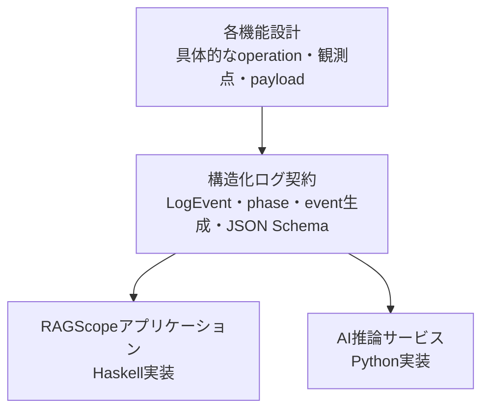
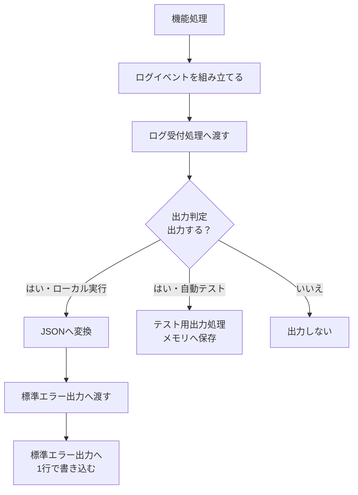
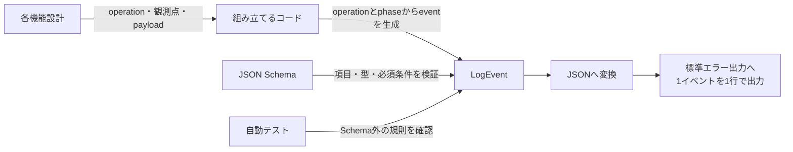

# 構造化ログ設計

> [!abstract] この文書の役割
> RAGScopeの処理中に起きた出来事を、コンポーネントをまたいで追跡できる構造化ログとして記録するための共通設計を説明する。
>
> `LogEvent`の共通構造、`operation`・`phase`・`event`の分担、実行との関連付け、JSON変換、出力処理、情報保護、ログ出力自体が失敗した場合の規則を扱う。

## 1. 目的と適用範囲

### 1.1 目的

RAGScopeでは、文書読み込み、AI推論サービスとの通信、PostgreSQLへの保存など、複数の処理が連続して動く。

この設計は、処理の開始、成功、失敗などの出来事を構造化して記録し、「どの処理で何が起きたか」を1回の実行単位で追跡できるようにする。

### 1.2 適用範囲

| この設計で決めること | 各機能または後続設計で決めること |
|---|---|
| ログ1件分の共通構造 | 具体的な`operation`と、その処理範囲 |
| `phase`の共通語彙と`event`の生成規則 | 各処理で開始・成功・失敗を記録する正確な時点 |
| 1回の実行を追跡する方法 | 各イベントで記録する固有の`payload` |
| ローカル環境での出力方法 | 再試行回数やタイムアウト値 |
| ログ出力そのものに失敗したときの扱い | CloudWatchや分散追跡（tracing）の設定 |

v0.0では、RAGScopeアプリケーションとAI推論サービスが同じ構造化ログ契約を利用する。

### 1.3 この設計を利用する作業

- [RS-0014 共通エラーと構造化ログを設計する](<../project-management/milestones/v0.0/error-logging/RS-0014 共通エラーと構造化ログを設計する.md>)
- [RS-0015 RAGScopeアプリケーションの共通エラー・構造化ログ基盤を実装する](<../project-management/milestones/v0.0/error-logging/RS-0015 RAGScopeアプリケーションの共通エラー・構造化ログ基盤を実装する.md>)
- [RS-0018 AI推論サービスの共通エラー・構造化ログ基盤を実装する](<../project-management/milestones/v0.0/error-logging/RS-0018 AI推論サービスの共通エラー・構造化ログ基盤を実装する.md>)

## 2. 関連する要求と上位設計

### 2.1 要求

[RAGScope要求定義「3.3 信頼性と保守性」](<../RAGScope要求定義.md#3.3 信頼性と保守性>)のうち、次の範囲を担当する。

- 処理の進行と失敗を追跡できるようにする
- 主要な正常系と異常系を検証できるようにする
- 機密情報や本文を不用意に記録しない

### 2.2 上位設計

| 参照先 | この設計が従う内容 |
|---|---|
| [システムアーキテクチャ「1.4 共通データ表現」](<./システムアーキテクチャ.md#1.4 共通データ表現>) | コンポーネント間で共有するデータ表現 |
| [システムアーキテクチャ「3.4 共通実行基盤の責務境界」](<./システムアーキテクチャ.md#3.4 共通実行基盤の責務境界>) | ログと実行制御、具体的な出力先の責務分離 |
| [ADR-0002](<../adr/ADR-0002 共通実行基盤の契約とコンポーネント実装を分離する.md>) | 共通契約とコンポーネント実装の分離 |
| [エラー設計](./エラー設計.md) | 失敗イベントへ格納できる共通エラー情報と公開境界 |

### 2.3 関連するプロジェクト管理文書

- [v0.0 — 最小のdense検索を実行できる](<../project-management/milestones/v0.0/v0.0.md>)
- [v0.0 共通エラーと構造化ログによる実行追跡](<../project-management/milestones/v0.0/error-logging/v0.0 共通エラーと構造化ログによる実行追跡.md>)

## 3. 責務と境界

### 3.1 担当する責務

この設計では、次を決める。

1. ログ1件分の共通構造
2. ログイベントを処理と実行へ関連付ける方法
3. `phase`の共通語彙と、`operation`から`event`を生成する規則
4. 各コンポーネントが同じJSON形式を出力するための契約
5. ログ受付処理、出力判定、JSON変換、出力処理の責務分離
6. ログ出力自体が失敗した場合と、記録してはいけない情報の扱い

### 3.2 共通するものと個別に定義・実装するもの



| 共通ログ設計で揃える | 各機能設計で定義する | 各コンポーネントで実装する |
|---|---|---|
| `LogEvent`の意味とJSON項目 | 具体的な`operation`と追跡範囲 | ログイベント組み立て処理 |
| `phase`の共通語彙 | 各処理の開始・成功・失敗を記録する時点 | ログ受付処理（logger）と出力判定（filter） |
| `event`の生成規則 | 各イベント固有の`payload`と`level` | JSON変換（encoder）と出力処理（sink） |
| `scope`、ID、時刻、情報保護 | 機能固有の記録禁止情報 | 必要になった場合のJSON復元処理（decoder） |

具体的な`operation`は、ログ出力の都合で新しく作るのではなく、各機能設計で定義した意味のある処理境界を使用する。

### 3.3 対象外

| 対象外 | 決定する場所・時期 |
|---|---|
| 具体的な`operation`と処理範囲 | 各機能設計とコード |
| 各処理のログ観測点、`payload`、通常時の`level` | 各機能設計とコード |
| 機能ごとのエラーコード | 各機能設計、[エラー設計](./エラー設計.md)、コード |
| 再試行回数、待ち時間、タイムアウト値 | 処理種別ごとの機能設計 |
| CloudWatchの具体設定 | v0.1.5 |
| 分散追跡、バッチ処理、非同期ジョブの関連付け情報 | v0.5以降 |
| PostgreSQL自身が出力するログ | PostgreSQLの運用設計 |
| 実験状態とエラーの永続化 | 実験管理の設計 |

生存確認（health）や準備完了確認（readiness）などの稼働確認リクエストは、v1の共通ログイベントには含めない。

### 3.4 機械可読な定義を正本とする事項

| 正確に定義する内容 | 正本 |
|---|---|
| JSONの項目、型、必須条件 | [`log-event.schema.json`](../../contracts/logging/v1/log-event.schema.json) |
| Schemaへ適合する例・適合しない例 | [`fixtures/`](../../contracts/logging/v1/fixtures/) |
| 具体的な`operation`、`phase`、イベント固有情報の型 | 各コンポーネントのコード |
| ログ受付処理、JSON変換、出力処理 | 各コンポーネントのコード |
| 具体的なテストケース | 各コンポーネントのテストコード |

> [!note] 検証用データ（fixture）の位置付け
> 検証用データは仕様の正本ではなく、Schemaの代表的な検証入力である。検証用データ内の`operation`と`event`は正式な処理一覧ではない。

## 4. 基本設計

### 4.1 ログが出力されるまで



> [!important] 機能処理が知る範囲
> 機能処理は、JSONの作り方や標準エラー出力への書き方を知らない。各機能設計で定義した`operation`、ログ上の`phase`、イベント固有情報、必要な場合は共通エラーを、ログイベント組み立て処理へ渡す。

### 4.2 operation、phase、eventの分担

| 概念 | 所有する設計 | 表すもの |
|---|---|---|
| 処理種別（`operation`） | 具体値と意味は各機能設計 | 追跡したい意味のある処理単位 |
| ログ上の段階（`phase`） | 構造化ログ設計 | `operation`を開始・成功・失敗のどの観測点で記録したか |
| ログイベント名（`event`） | 独立した正本を持たず導出する | `operation`と`phase`を結合したJSON上の識別名 |

#### operation

`operation`は単なる関数名ではなく、処理結果を追跡する意味のある単位である。

- `<domain>.<action>`形式の小文字ASCIIを使用する。
- 具体的な値、追跡する範囲、成功条件は各機能設計で定義する。
- 正確な閉じた型と文字列変換は各コンポーネントのコードを正本とする。
- 共通ログ設計へ、すべての機能の`operation`一覧を集約しない。

#### phase

`phase`は機能内部の詳細な処理段階ではなく、ログへ記録するライフサイクル上の観測区分である。

| `phase` | 意味 |
|---|---|
| `started` | 機能設計で定義した`operation`を開始した |
| `succeeded` | 機能設計で定義した成功条件を満たした |
| `failed` | 機能設計で定義した失敗結果として確定した |

文書処理の「文書読み込み」「本文検証」「チャンク化」のような機能内部の処理段階と、ログ上の`phase`を混同しない。

#### event

`event`は独立して手書きせず、次の規則で生成する。

```text
operation = document.read  （各機能設計が定義する代表例）
phase     = succeeded      （構造化ログの共通語彙）
                   ↓
event     = document.read.succeeded
```

`document.read`と、その開始・成功・失敗をどこで記録するかは[文書処理設計](./文書処理設計.md)を正本とする。この例は共通ログ契約を説明するためのものであり、具体的な処理一覧の正本ではない。

> [!important] ログイベント名は手書きしない
> コードでは、定義済みの`operation`と`phase`から`event`を作る。`document.read.completed`のような表記揺れや、`operation`と`event`の不一致を防ぐ。

### 4.3 LogEventの構造

`LogEvent`は、ログ1件分の情報をまとめたコード内部のデータである。

```text
LogEvent
├── 共通項目（Envelope）       すべてのログイベントが持つ情報
├── 実行との関連情報（Context） どの実行に属するか
├── イベント固有情報（Payload） 各機能設計が定義する情報
└── エラー情報（Error）        失敗した場合だけ持つ情報
```

| 概念上の区分 | 主な内容 | 詳しい規則 |
|---|---|---|
| 共通項目（Envelope） | スキーマバージョン、時刻、ログレベル、コンポーネント、`operation`、`event_id` | [5.4 JSONとして出力するときの規則](<#5.4 JSONとして出力するときの規則>) |
| 実行との関連情報（Context） | 適用範囲（`scope`）、実行ID | [5.1 scope、ID、時刻](<#5.1 scope、ID、時刻>) |
| イベント固有情報（Payload） | 件数、処理時間など | 各機能設計と[5.4 JSONとして出力するときの規則](<#5.4 JSONとして出力するときの規則>) |
| エラー情報（Error） | エラー分類、コード、安全なメッセージ、許可された補助情報 | [エラー設計](./エラー設計.md) |

JSONでは、共通項目をルートに置き、`context`、`payload`、`error`を必要に応じて使用する。

> [!note] `context.scope`が表すもの
> `execution`か`service`かを表す。成功・失敗は表さない。

#### JSONの例

```json
{
  "schema_version": 1,
  "event_id": "550e8400-e29b-41d4-a716-446655440000",
  "timestamp": "2026-07-28T10:00:00.123Z",
  "level": "info",
  "event": "document.read.succeeded",
  "component": "ragscope_app",
  "operation": "document.read",
  "context": {
    "scope": "execution",
    "execution_id": "7d9c35b8-7980-4b20-a86c-7220e67276cc"
  },
  "payload": {
    "byte_count": 2048,
    "duration_ms": 12
  }
}
```

正確な項目と条件はJSON Schemaを正本とし、同じ例を[`execution-succeeded.json`](../../contracts/logging/v1/fixtures/valid/execution-succeeded.json)で確認できる。

### 4.4 ログを扱う部品

`LogEvent`を組み立ててから出力またはテストで保存するまでを、6つの役割に分ける。

| 部品 | 役割 | 知らないこと |
|---|---|---|
| ログイベント組み立て処理（event builder） | 意味のある値から`LogEvent`を組み立てる | 標準エラー出力への書き方 |
| ログ受付処理（logger） | 完成した`LogEvent`を受け取る | 機能処理の詳細 |
| 出力判定（filter） | 現在の設定で出力するか判断する | JSONへの変換方法 |
| JSON変換（encoder） | `LogEvent`をJSONへ変換する | ログイベントを記録した理由 |
| 出力処理（sink） | ログを最終的な行き先へ渡す | 処理種別の内容 |
| JSON復元処理（decoder） | JSONを`LogEvent`へ戻す | JSONを生成した処理 |

#### event builder

機能処理は、JSONや完成したログイベント名ではなく、意味のある値を渡す。

```text
operation = DocumentRead
phase     = Succeeded
payload   = ByteCount 2048
```

ログイベント組み立て処理は、正式な`operation`と`phase`から`event`を生成し、共通のID、時刻、コンポーネント、実行との関連情報、ログレベルを加えて`LogEvent`を完成させる。

`event builder`は役割を表す名前である。実際のモジュール名や関数名は、各コンポーネントの実装で決める。

> [!note] JSON変換との違い
> `event`を作るのはログイベント組み立て処理である。JSON変換は、完成した`LogEvent`をJSONへ忠実に変換する。

#### sink

```text
標準エラー出力用のsink ──→ JSONを標準エラー出力へ書く
テスト用のsink           ──→ LogEventをメモリへ保存する
```

テスト用の出力処理を使うと、標準エラー出力の文字列ではなく、ログイベントの意味や`execution_id`を直接検査できる。

#### decoder

JSON復元処理はJSON変換の逆だが、ログを出力するだけのv0.0の本番処理には必須ではない。JSONから`LogEvent`へ戻す必要が生じたコンポーネントだけが実装する。

## 5. 詳細設計

### 5.1 scope、ID、時刻

#### scope

`scope`は、ログイベントが1回のコマンド実行に属するか、サービス自体の状態変化に属するかを表す。

| `scope` | 対象 | `execution_id` |
|---|---|---|
| `execution` | 1回のCLIコマンドに属するログイベント | 必須 |
| `service` | サービスの起動・終了など | 入れない |

`execution_id`は、CLIコマンドの一番外側で、最初のログイベントより前に1回だけ生成する。

同じコマンドでは、コンポーネント境界を越えて同じ値を引き継ぐ。文書取り込みコマンドと検索コマンドは別の値を使う。

#### IDと時刻

| 項目 | 規則 |
|---|---|
| `execution_id` | 1回のCLIコマンドを識別するUUIDv4 |
| `event_id` | `LogEvent`を1件ずつ識別するUUIDv4 |
| UUIDの表現 | 小文字・ハイフン付きの標準形式 |
| `timestamp` | ログイベントを記録したUTC時刻 |
| 時刻の表現 | RFC 3339、ミリ秒3桁、末尾`Z` |
| 所要時間 | 単調時計で測り、項目名へ単位を含める |

同じ`LogEvent`を複数の出力処理へ渡す場合は、出力処理ごとに`event_id`を作り直さない。

### 5.2 識別子を自由入力させない

#### 共通の選択肢

| 識別子 | 使用できる値 |
|---|---|
| `component` | `ragscope_app` / `ai_service` |
| `scope` | `execution` / `service` |
| `phase` | `started` / `succeeded` / `failed` |
| `level` | `debug` / `info` / `warn` / `error` |

具体的な`operation`は、各機能設計で意味と追跡範囲を定義し、機能ごとの閉じた型として実装する。Haskellでは列挙型や直和型、Pythonでは`Enum`や`Literal`などを使用できる。

> [!important] 生の文字列を渡さない
> 機能処理から、任意の`operation`や`event`をログ受付処理へ渡せる形にはしない。正式な`operation`と`phase`から文字列へ変換する処理を1か所へ集める。

識別子を追加するときは、次を確認する。

1. 既存の処理境界では表せないか
2. 各機能設計で意味、追跡範囲、観測点を説明できるか
3. どの文字列として出力するか
4. 期待した文字列になることをテストしているか

同じ意味の別名を増やさず、既存の識別子へ後から別の意味を割り当てない。

### 5.3 ログlevel

| `level` | 使用する状況 | 既定で出力するか |
|---|---|---|
| `debug` | 開発・調査時だけ必要な詳しい情報 | 出力しない |
| `info` | 通常の処理進行と結果 | 出力する |
| `warn` | 処理は続けられるが注意が必要 | 出力する |
| `error` | 処理種別が失敗した | 出力する |

`failed`のログイベントは、`error`情報を持ち、`level`を`error`にする。開始・成功などの通常時に使用する`level`は、共通の意味に従って各機能設計で決める。

> [!note] ログレベルとエラー分類は別のもの
> `level`は処理への影響、`category`は失敗の種類を表す。エラー分類からログレベルを機械的に決めない。

`debug`を有効にしても、機密情報を記録しない規則は変わらない。

### 5.4 JSONとして出力するときの規則

`LogEvent`のJSONは、内容に応じてSchema、コード、テストで分担して保証する。



正確なJSONの形は、[`log-event.schema.json`](../../contracts/logging/v1/log-event.schema.json)で定義する。

#### JSONの基本形式

| 項目 | 規則 |
|---|---|
| JSON Schema | Draft 2020-12 |
| 文字コード | UTF-8 |
| 項目名・列挙値 | 小文字の`snake_case` |
| Schemaのバージョン | `contracts/logging/v1/`という配置で管理 |
| `LogEvent`内のバージョン | `"schema_version": 1` |

> [!important] 互換性のない変更
> 項目の削除、名前変更、型の変更、必須条件や意味の変更を行う場合は、新しい契約バージョンを作る。

#### eventごとの規則

| 条件・対象 | 規則 |
|---|---|
| `failed`で終わるログイベント | `error`を持ち、`level`を`error`にする |
| `execution`のログイベント | `execution_id`を入れる |
| `service`のログイベント | `execution_id`を入れない |
| ログイベント名 | 同じ`LogEvent`の`operation`と`phase`から生成する |
| 関係のない項目 | `null`ではなく省略する |
| `payload` | ログイベントごとに分け、任意項目を多数持つ大きなオブジェクトへまとめない |

標準JSON Schemaだけでは、`event`と`operation`の一致や、各機能が正しい観測点でログを記録したかを確認できない。`event`の生成はコード、観測点とイベント固有情報は各機能設計と自動テストで保証する。

#### ローカル実行での出力

```text
正常なCLI結果 ──→ stdout
構造化ログ     ──→ stderr ──→ 1イベントを1行のJSON
```

標準エラー出力には、JSON以外の接頭辞、色制御文字、説明文、通常のテキスト形式のエラーを混ぜない。

### 5.5 logger自身が失敗した場合

```text
ログ受付処理の失敗
├── JSON変換の失敗  LogEventをJSONへ変換できない
└── 出力の失敗      JSONを出力先へ書き込めない
```

| 状況 | 扱い |
|---|---|
| JSON変換の失敗 | `logging.encode_failed`として区別する |
| 出力の失敗 | `logging.sink_failed`として区別する |
| 処理は成功、必須ログイベントの出力は失敗 | 外側の境界へ内部エラーとして返す |
| 処理とログ受付処理の両方が失敗 | 処理のエラーを主な原因として残す |

`logging.encode_failed`と`logging.sink_failed`が表す失敗は、[エラー設計](./エラー設計.md)の共通規則に従う。

> [!warning] 同じログ受付処理へ失敗を記録しない
> ログ受付処理の失敗を、同じログ受付処理や失敗した出力先へ再び書くと、処理が繰り返される可能性がある。

v0.0では代替出力を採用しない。壊れたJSONや代わりの通常テキストを標準エラー出力へ出さず、代替出力自身が失敗する経路も作らない。

### 5.6 ログへ記録しない情報

| 情報の種類 | そのまま記録しないもの | 代わりに使う情報 |
|---|---|---|
| 文書・生成内容 | 文書、チャンク、回答の全文 | 安定したID、件数、バイト数 |
| AI入力 | プロンプト、`context`の全文、Embedding | トークン数、モデルID |
| 認証・接続情報 | 秘密情報、認証情報、DB接続文字列 | 記録しない |
| HTTP | 本文、ヘッダーの全文 | ステータス、許可した要約 |
| 例外 | スタックトレース、元の例外メッセージ | エラー分類、コード、安全なメッセージ |

> [!important] 許可リストを先に決める
> 何でも入れられる連想配列をログへ渡さず、各機能設計で記録してよいイベント固有情報を先に決める。後から正規表現で伏せ字にする方法だけには依存しない。

安全性を確認できない値は、一部を伏せ字にするより項目自体を省略する。

### 5.7 HTTPと診断requestの境界

| 内容 | この設計で共有する | API設計で決める |
|---|---|---|
| エラー | 失敗イベントへ安全な共通エラー情報を記録する原則 | レスポンス本文、ステータス |
| 実行追跡 | `execution_id`の意味 | ヘッダーや本文での引き継ぎ方法 |
| 稼働確認リクエスト | アプリケーションのログイベントと分ける方針 | アクセスログ、リクエストID |

生存確認や準備完了確認などの稼働確認リクエストは、v1の共通ログイベントには含めない。

## 6. テスト観点

| 対象 | 確認すること |
|---|---|
| 共通Schema | `valid/`をすべて受理し、`invalid/`を意図した規則で拒否する |
| 各コンポーネント | 生成したJSONがSchemaへ適合する |
| operation | 各機能設計で定義した正式な処理だけを使用できる |
| phase | `started`、`succeeded`、`failed`の共通語彙だけを使用できる |
| event | 正式な`operation`と`phase`から正しいログイベント名を生成し、任意の文字列を渡せない |
| 観測点 | 各機能設計で定義した開始・成功・失敗の時点で1回だけ記録する |
| 実行との関連情報 | `execution`と`service`で`execution_id`の扱いが変わる |
| JSON | UUID、時刻、エラー情報、任意項目を正しく出力する |
| 出力 | 標準出力と標準エラー出力が混ざらず、JSONの項目順に依存しない |
| 情報保護 | 記録しないと決めた情報が含まれない |
| テスト用出力処理 | 完成した`LogEvent`の意味を検査できる |
| 失敗する出力処理 | ログ出力の失敗が元の処理エラーを上書きしない |

時刻とIDは実行ごとに変わるため、テストでは時計とID生成処理を差し替える。

## 7. 将来設計との境界

将来必要になりそうな項目を先回りして`LogEvent`へ追加せず、利用方法が決まったMilestoneで設計する。

| 時期・設計 | 後から決めること |
|---|---|
| v0.1.5 | CloudWatchでの収集、検索、保持、権限、料金対策 |
| v0.5 | `trace_id`、`span_id`、親子関係、バッチ処理・非同期ジョブの追跡 |
| 実験管理の導入時 | 実験IDと永続化する実行状態 |
| API設計時 | 稼働確認リクエスト、HTTPエラー、`execution_id`のHTTP上の引き継ぎ方法 |

複数の機能で同じ処理概念を共有する必要が生じた場合は、各機能設計の責務と利用実態を確認してから、より上位の設計へ処理識別子を移す。ログへ出力するという理由だけで、機能固有の`operation`を共通ログ設計へ集約しない。

## 8. 変更時の注意

> [!warning] 共通ログ契約の変更は複数コンポーネントへ影響する
> JSON項目、`phase`、`scope`、ログレベル、コンポーネント、`event`生成規則、ID、時刻、バージョンを変更するときは、契約を利用するすべてのコンポーネントを確認する。

具体的な`operation`、観測点、イベント固有情報を変更するときは、その機能設計とコードを正本として変更し、共通ログ設計へ一覧を複製しない。

変更時に確認する正本を次に示す。

- システムアーキテクチャ
- ADR-0002
- エラー設計
- 各機能設計
- JSON Schemaと検証用データ
- 各コンポーネントの型とテスト

保存済みのログを読めなくしないよう、既存の項目や識別子へ別の意味を割り当てない。
