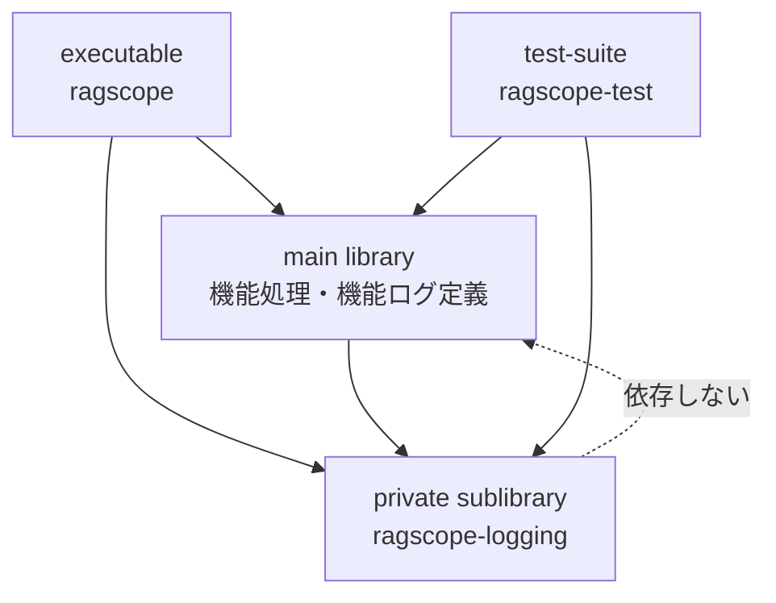
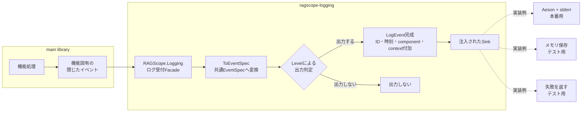

# 構造化ログ詳細設計

> [!abstract] この文書の役割
> [構造化ログ基本設計](./構造化ログ基本設計.md)で定義した共通契約を、**RAGScopeアプリケーションのHaskell実装でどのように成立させるか**を、パッケージ境界、モジュール責務、依存方向、実行時の流れとして定義する。
>
> ログの意味とJSON契約は基本設計とJSON Schemaを正本とし、正確な型、関数、export list、依存パッケージはHaskellコードとCabal設定を正本とする。

## 1. パッケージ境界

共通ログ基盤は独立パッケージにはせず、RAGScopeアプリケーションと同じパッケージ内の**private sublibrary `ragscope-logging`**として分離する。main libraryはログ基盤へ依存できるが、ログ基盤からmain libraryへは依存しない。

この境界により、機能固有の処理・エラーをmain libraryが所有し、JSON変換、ID・時刻付加、出力判定、具体的な出力処理を共通ログ基盤へ隔離する。

## 2. ログ出力の流れ

通常の機能処理は、機能固有の閉じたイベントをログ受付処理へ渡す。Runtimeはログレベルを判定した後、出力対象のイベントだけにID・時刻・`component`・`context`を付加し、注入されたSinkへ渡す。

Runtimeは実行環境を判定してSinkを選ばない。Loggerの初期化時に用途に合うSinkを注入し、Runtimeは具体的なSink実装を知らない。

## 3. モジュールの責務

| モジュール・境界 | 公開範囲 | 責務 |
|---|---|---|
| `RAGScope.Logging` | sublibrary公開Facade | 通常の機能処理から、型付きの機能イベントを受け付ける |
| `RAGScope.Logging.EventSpec` | sublibrary公開Facade | 機能ログ定義が、閉じたイベントを共通`EventSpec`へ対応付けるための低水準APIを提供する |
| `RAGScope.Logging.Setup` | sublibrary公開Facade | composition rootからLoggerを初期化する境界を提供する |
| `RAGScope.Logging.Testing` | sublibraryテスト向け公開Facade | 固定ID・時刻、メモリSink、失敗するSinkなど、ログ基盤を検査する手段を提供する |
| `RAGScope.Logging.Core` | sublibrary内部 | 共通ログの純粋な型と不変条件を保持する |
| `RAGScope.Logging.Runtime` | sublibrary内部 | 共通イベントへの変換、Level判定、ID・時刻等の付加、Sink呼び出し、ログ基盤失敗の返却を行う |
| `RAGScope.Logging.Backend.AesonStderr` | sublibrary内部 | `LogEvent`のJSON変換と、標準エラー出力への1イベント1行の書き込みを行う |
| 機能ログ定義 | main library内部 | 機能固有の閉じたイベント、`operation`・`event`・`payload`の対応、エラーの安全な投影を所有する |

低水準の`RAGScope.Logging.EventSpec`を利用するのは機能ログ定義境界に限定する。通常の機能処理は`RAGScope.Logging`と自機能の閉じたイベントだけを使用する。

## 4. 実装で保証すること

1. **通常の機能処理から任意のログ契約を組み立てさせない**  
   通常の機能処理は、任意の`operation`、`event`、`level`、`payload`を直接ログ受付処理へ渡さず、機能固有の閉じたイベントを使用する。文字列識別子と共通`EventSpec`の組み立ては機能ログ定義境界へ集める。

2. **失敗イベントの不変条件を生成経路で保証する**  
   通常イベントと失敗イベントの生成経路を分け、失敗イベントでは`event = failed`、`level = error`、`error`必須を同時に成立させる。

3. **JSON変換をtotalな純粋変換にする**  
   完成した`LogEvent`からJSON値への変換は入力値による回復可能な失敗を持たせず、契約不適合は型、変換テスト、JSON Schema適合テストで検出する。標準エラー出力で発生するIO失敗はJSON変換失敗ではなくSinkの失敗として扱う。

4. **Sink失敗を元の処理失敗と分離する**  
   Sinkの失敗はログ基盤自身の失敗として呼び出し側へ返し、失敗したSinkへ同じログ経路から再帰的に書き込まない。元の処理も失敗している場合、その失敗をログ基盤の失敗で上書きしない。

## 5. 正確な実装の正本

| 正確に定義する内容 | 正本 |
|---|---|
| private sublibrary、公開・内部モジュール、依存パッケージ | [`ragscope.cabal`](../../ragscope-app/ragscope.cabal) |
| 共通ログ型と不変条件 | [`RAGScope.Logging.Core`](../../ragscope-app/logging-src/RAGScope/Logging/Core.hs) |
| 出力判定、ID・時刻付加、Sink呼び出し、失敗返却 | [`RAGScope.Logging.Runtime`](../../ragscope-app/logging-src/RAGScope/Logging/Runtime.hs) |
| JSON変換と標準エラー出力 | [`RAGScope.Logging.Backend.AesonStderr`](../../ragscope-app/logging-src/RAGScope/Logging/Backend/AesonStderr.hs) |
| JSONの項目、型、必須条件 | [`log-event.schema.json`](../../contracts/logging/v1/log-event.schema.json) |
