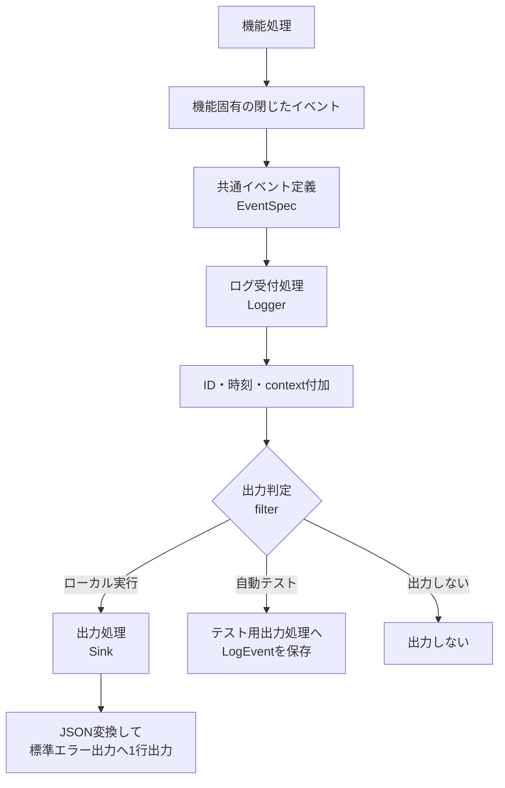
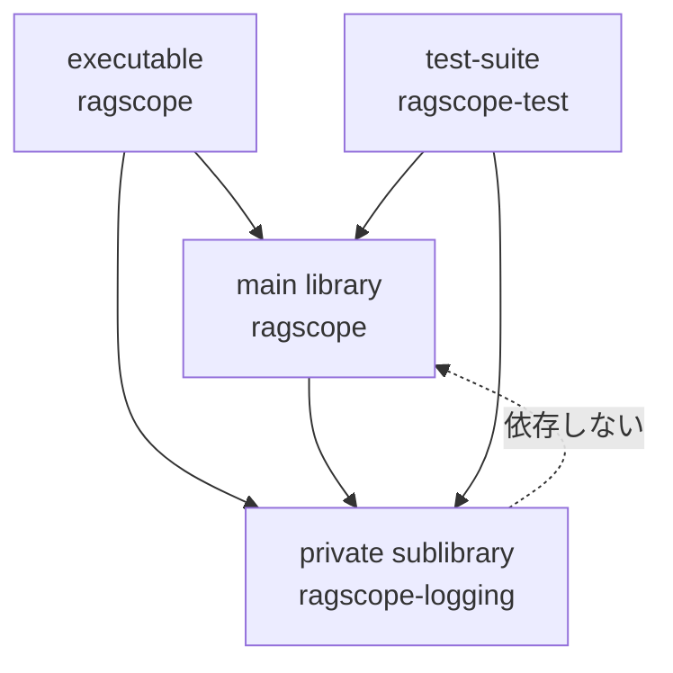
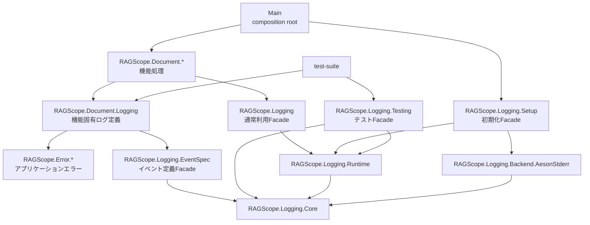
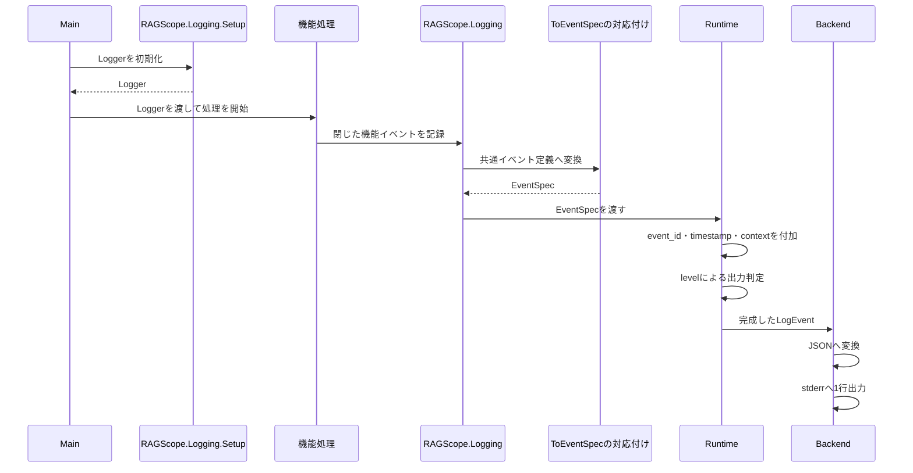

# 構造化ログ詳細設計

> [!abstract] この文書の役割
> [構造化ログ基本設計](./構造化ログ基本設計.md)で定義する共通契約を、RAGScopeアプリケーションのHaskell実装で成立させるためのコンポーネント境界、モジュール責務、依存方向、実行時の流れを定義する。
>
> ログの意味、JSON契約、`operation`・`event`・`context`・`payload`・`error`の共通規則は構造化ログ基本設計を正本とする。正確な型、関数、export list、依存パッケージはHaskellコードとCabal設定を正本とする。

## 1. 実装構造の概要

通常の機能処理は、機能固有の閉じたイベントだけをログ受付処理へ渡す。JSON変換、ID・時刻の付加、出力判定、標準エラー出力は共通ログ基盤の責務とする。

| 部品 | 役割 | 知らないこと |
|---|---|---|
| 機能固有イベント | その機能で起き得る出来事と必要な値を閉じた型で表す | JSON、UUID、時刻、出力先 |
| 共通イベント定義 | 機能固有イベントを`operation`、`event`、`level`、`payload`、必要な場合は`error`へ対応付ける | UUID・時刻の生成、標準エラー出力 |
| Logger | 共通イベント定義を受け付け、完成済みログイベントの生成と出力判定を進める | 機能処理の詳細 |
| Runtime | `event_id`、`timestamp`、`component`、`context`を付加し、出力判定後にSinkへ渡す | 機能固有の処理内容 |
| Sink | 完成した`LogEvent`を最終的な出力先へ渡す | イベントを記録した理由 |

v0.0の本番処理はログを出力することだけを必要とし、JSONからコード内部のログ表現へ戻すdecoderは要求しない。

## 2. Cabalコンポーネントの境界

共通ログ基盤は、RAGScopeアプリケーションと同じパッケージ内のprivate sublibrary `ragscope-logging`として分離する。独立した共通パッケージにはせず、RAGScopeアプリケーション内部で責務と依存方向を分離する。

| Cabalコンポーネント | 担当する内容 |
|---|---|
| executable `ragscope` | composition root。実行IDを生成し、実行またはサービス用のLoggerを初期化してmain libraryを呼び出す |
| main library `ragscope` | 機能処理、機能固有イベント、機能固有エラーから安全なログ情報への投影を所有する |
| private sublibrary `ragscope-logging` | 共通ログ型、イベント生成API、ログ受付、ID・時刻付加、filter、JSON変換、出力処理を所有する |
| test-suite `ragscope-test` | 機能イベントの対応付け、Schema適合、固定ID・時刻、メモリ出力、出力失敗を検証する |

private sublibraryは、`RAGScope.Document.*`などの機能モジュールや、main libraryが所有するアプリケーションエラー型へ依存しない。機能固有エラーからログへ記録可能な安全な情報への変換は、main library側の機能ログ定義境界が担当する。

## 3. モジュールの役割と公開境界

正確なexport list、型、関数、依存パッケージはHaskellコードと[`ragscope.cabal`](../../ragscope-app/ragscope.cabal)を正本とする。設計上の役割と利用範囲は次のとおりとする。

| モジュール | Cabalでの扱い | 主な利用者 | 責務 |
|---|---|---|---|
| `RAGScope.Logging` | private sublibraryの公開Facade | 通常の機能処理 | 型付きの機能イベントを受け付けるLoggerとログ記録入口を提供する |
| `RAGScope.Logging.EventSpec` | private sublibraryの公開Facade | `RAGScope.Document.Logging`などの機能ログ定義 | 機能固有イベントを共通イベント定義へ対応付ける低水準APIを提供する |
| `RAGScope.Logging.Setup` | private sublibraryの公開Facade | executableなどのcomposition root | 実行ID、context、時計、ID生成、出力先を組み合わせてLoggerを初期化する |
| `RAGScope.Logging.Testing` | private sublibraryのテスト向けFacade | test-suite | 固定ID・時刻、メモリ出力、失敗する出力処理など、本番内部表現を公開せずに検査する手段を提供する |
| `RAGScope.Logging.Core` | private sublibrary内部 | Logging内部モジュール | 共通ログの純粋な型と不変条件を保持する |
| `RAGScope.Logging.Runtime` | private sublibrary内部 | Logging Facade、Setup、Testing | 共通イベント定義の完成、出力判定、出力処理の呼び出し、失敗の返却を担当する |
| `RAGScope.Logging.Backend.AesonStderr` | private sublibrary内部 | Setup | JSON変換と、標準エラー出力への1イベント1行の出力を担当する |
| `RAGScope.Document.Logging` | main library内部 | 文書処理 | 文書処理固有の閉じたイベント、`operation`・`event`・`payload`の対応、エラーの安全な投影を所有する |

低水準の`RAGScope.Logging.EventSpec`をimportしてよいのは、`RAGScope.*.Logging`のような機能ログ定義モジュールに限定する。通常の機能処理は`RAGScope.Logging`と自機能のイベント型だけを使用し、低水準APIへ依存しない。

Cabalはprivate sublibraryと内部モジュールの境界を強制するが、main library内で特定Facadeをimportできるモジュール名までは制限しない。この利用範囲はコーディング規約、レビュー、必要な静的検査によって維持する。

## 4. 依存関係と実行時の流れ

### 4.1 モジュールの依存関係

### 4.2 実行時の流れ

機能処理は、JSON変換、UUID・時刻の生成、標準エラー出力の方法を知らない。通常の機能処理から直接扱えるのは、Loggerと機能固有の閉じたイベントだけとする。

## 5. 共通契約を保証する場所

| 保証する内容 | RAGScopeアプリケーションでの主な保証手段 |
|---|---|
| execution contextには`execution_id`があり、service contextにはない | コード内部の直和型 |
| 通常イベントに`error`を持たせず、失敗イベントを`event = failed`、`level = error`、`error`必須とする | 共通イベント定義の非公開内部表現と用途別の生成経路 |
| 通常処理が任意の`operation`、`event`、`level`、`payload`を直接渡さない | Facade分離、import規約、機能固有の閉じたイベント |
| 具体的な`operation`と`event`の組、通常イベントへ`failed`を割り当てないこと | 機能ログ定義の対応付けと自動テスト |
| イベントごとに許可された`payload`と記録禁止情報 | 各機能設計、専用の組み立て処理、自動テスト |
| JSON項目、型、必須条件、`null`禁止 | JSON Schema、Schema適合テスト、コード内部のログ値型 |
| ID・時刻の生成と実行中の引き継ぎ | composition root、Runtime、自動テスト |
| ログ出力失敗で元の処理失敗を上書きせず、再帰的にログを書かない | Runtimeの失敗処理と失敗する出力処理を使った自動テスト |

## 6. 正確な実装の正本

| 正確に定義する内容 | 正本 |
|---|---|
| private sublibrary、公開・内部モジュール、依存パッケージ、言語設定 | [`ragscope.cabal`](../../ragscope-app/ragscope.cabal) |
| Haskellの型、関数、export list、失敗表現 | `ragscope-app/logging-src/`配下のHaskellソースコード |
| 機能固有イベントと共通イベント定義の対応 | main library側の機能ログ定義と各機能設計 |
| JSON変換と標準エラー出力 | `RAGScope.Logging.Backend.AesonStderr`の実装 |
| Runtimeの出力判定、ID・時刻付加、失敗返却 | `RAGScope.Logging.Runtime`の実装 |
| 具体的なテストケース | `ragscope-app/test/`配下のテストコード |

共通JSONの項目、型、必須条件は本書ではなく[`log-event.schema.json`](../../contracts/logging/v1/log-event.schema.json)を正本とする。

## 7. 実装で解消する未決定事項

### 7.1 JSON変換に回復可能な失敗経路を設けるか

完成したログイベントからJSONへ変換するHaskell実装が、通常の入力値に対して回復可能な失敗を返す必要があるかは、RS-0015で確定する。使用するAeson APIが失敗値を返さないことだけを理由に「JSON変換は失敗しない」とは扱わない。

実装時に、少なくとも次を確認する。

- コード内部のすべてのログ値を、部分関数を使わず網羅的にJSONへ変換できるか
- 変換前の検証で失敗として扱う必要がある条件が存在するか
- 使用するJSON変換APIが、回復可能な失敗を返すか、例外を発生させ得るか
- JSON変換失敗を独立したログ基盤上の失敗として扱うことが、実際の失敗経路と一致するか
- Schema適合テストと実行時検証の責務が重複しないか

| 案 | 内容 | 主な影響 |
|---|---|---|
| totalな純粋変換とする | コード内部の閉じたログ値からJSONへ網羅的に変換し、通常の回復可能な失敗経路を設けない。契約不適合は型、変換テスト、Schema適合テストで検出する | Runtimeの失敗型とテストが単純になる。実装が本当にtotalであることを確認する必要がある |
| 明示的な失敗経路を設ける | JSON変換または変換前検証が失敗結果を返し、Runtimeが出力失敗と区別して扱う | 失敗の分類とテストが増える。Schema検証との責務重複を避ける必要がある |

この判断はRS-0015のJSON変換実装とテストを進め、実際のAPIと値域を確認した時点で確定する。決定後は、本節、[構造化ログ基本設計「3.4 ログ出力自体が失敗した場合」](<./構造化ログ基本設計.md#3.4 ログ出力自体が失敗した場合>)、Haskell実装、テスト、RS-0015の完了条件を同じ変更で整合させる。

## 関連文書

- [構造化ログ基本設計](./構造化ログ基本設計.md)
- [エラー設計](./エラー設計.md)
- [システムアーキテクチャ「3.4 共通実行基盤の責務境界」](<./システムアーキテクチャ.md#3.4 共通実行基盤の責務境界>)
- [ADR-0002 — 共通実行基盤の契約とコンポーネント実装を分離する](<../adr/ADR-0002 共通実行基盤の契約とコンポーネント実装を分離する.md>)
