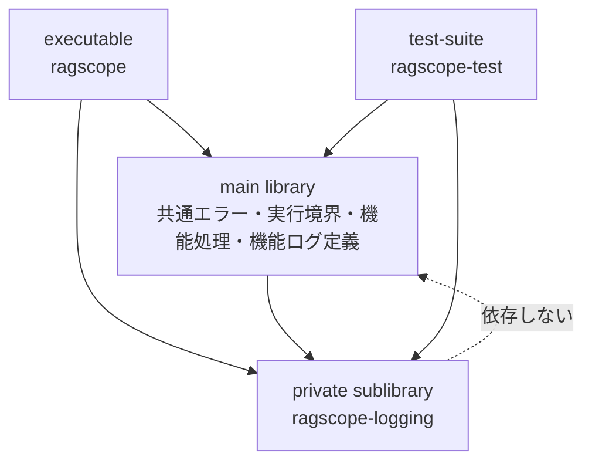
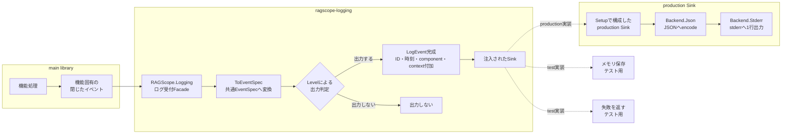
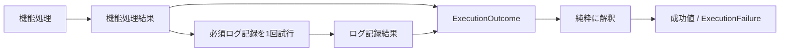

# 構造化ログ詳細設計

> [!abstract] この文書の役割
> [構造化ログ基本設計](./構造化ログ基本設計.md)で定義した共通契約を、**RAGScopeアプリケーションのHaskell実装でどのように成立させるか**を、パッケージ境界、モジュール責務、依存方向、実行時の流れとして定義する。
>
> ログの意味とJSON契約は基本設計とJSON Schemaを正本とし、正確な型、関数、export list、依存パッケージはHaskellコードとCabal設定を正本とする。

## 1. パッケージ境界

共通ログ基盤は独立パッケージにはせず、RAGScopeアプリケーションと同じパッケージ内の**private sublibrary `ragscope-logging`**として分離する。main libraryはログ基盤へ依存できるが、ログ基盤からmain libraryへは依存しない。

この境界により、機能固有の処理・エラーとアプリケーション実行結果の合成をmain libraryが所有し、共通ログ型、JSON変換、ID・時刻付加、出力判定、具体的なログ出力処理をprivate sublibraryへ隔離する。

## 2. ログ出力の流れ

通常の機能処理は、機能固有の閉じたイベントをログ受付処理へ渡す。Runtimeはログレベルを判定した後、出力対象のイベントだけにID・時刻・`component`・`context`を付加して`LogEvent`を完成させ、注入されたSinkへ渡す。

Runtimeは実行環境を判定してSinkを選ばない。Loggerの構築時に用途に合うSinkを注入し、RuntimeはJSON、Aeson、stderrなど具体的な出力形式・出力先を知らない。

productionでは`RAGScope.Logging.Setup`が`Backend.Json`と`Backend.Stderr`を組み合わせたSinkを構築する。JSON変換とstderrへのIOを別モジュールへ分離し、JSON生成までの純粋処理と、その後のIO失敗境界を混在させない。

## 3. モジュールの責務

| モジュール・境界 | 公開範囲 | 責務 |
|---|---|---|
| `RAGScope.Logging` | sublibrary公開Facade | 通常の機能処理から、型付きの機能イベントを受け付ける |
| `RAGScope.Logging.EventSpec` | sublibrary公開Facade | 機能ログ定義が、閉じたイベントを共通`EventSpec`へ対応付けるための低水準APIを提供する |
| `RAGScope.Logging.Setup` | sublibrary公開Facade | production用Sink、ID・時刻取得処理、context、設定を組み合わせてLoggerを構築する |
| `RAGScope.Logging.Testing` | sublibraryテスト向け公開Facade | 固定ID・時刻、メモリSink、失敗Sinkなど、ログ基盤を検査する手段を提供する |
| `RAGScope.Logging.Core` | sublibrary内部 | AesonやIOに依存しない共通ログの純粋な型と生成時の不変条件を保持する |
| `RAGScope.Logging.Runtime` | sublibrary内部 | 共通イベントへの変換、Level判定、ID・時刻等の付加、Sink呼び出し、ログ基盤失敗の返却を行う |
| `RAGScope.Logging.Backend.Json` | sublibrary内部 | `LogEvent`とJSON契約の対応、Aesonによるtotalな純粋変換とproduction向けencodingを担当する |
| `RAGScope.Logging.Backend.Stderr` | sublibrary内部 | encoding済みの1イベントをstderrへ1行出力し、書き込み・flushのIO失敗を`LoggingSinkFailure`へ変換する |
| `RAGScope.Execution.Result` | main library公開 | 機能処理結果と必須ログ記録結果を独立した事実として保持し、アプリケーション実行結果へ純粋に解釈する |
| `RAGScope.Execution.Observation` | main library公開 | 機能処理と必須ログ記録を順番に1回ずつ実行し、`RAGScope.Execution.Result`の規則へ合成を委ねる |
| 機能ログ定義 | main library内部 | 機能固有の閉じたイベント、`operation`・`event`・`payload`の対応、アプリケーションエラーから安全なログ情報への投影を所有する |

低水準の`RAGScope.Logging.EventSpec`を利用するのは機能ログ定義境界に限定する。通常の機能処理は`RAGScope.Logging`と自機能の閉じたイベントだけを使用する。

`RAGScope.Logging.Setup`によるLogger構築自体は純粋に行い、EventId生成と現在時刻取得は`emit`時に実行するIOアクションとしてRuntimeへ注入する。

## 4. 機能処理と必須ログ記録の合成境界

`RAGScope.Execution.Observation`は機能処理を実行し、その結果を変更せず必須ログ記録へ1回渡す。2つの結果は`ExecutionOutcome`として`RAGScope.Execution.Result`へ渡し、純粋な解釈によって`AppAction`の成功値または`ExecutionFailure`へ変換する。

機能処理とログ基盤が失敗した場合の意味、元の`AppError`を保持する規則、同じログ経路へ再帰的に記録しない規則は[エラー設計「3.1 機能処理と必須ログ記録の結果合成」](<./エラー設計.md#3.1 機能処理と必須ログ記録の結果合成>)を正本とする。

## 5. 実装で保証すること

1. **通常の機能処理から任意のログ契約を組み立てさせない**  
   通常の機能処理は、任意の`operation`、`event`、`level`、`payload`を直接ログ受付処理へ渡さず、機能固有の閉じたイベントを使用する。文字列識別子と共通`EventSpec`の組み立ては機能ログ定義境界へ集める。

2. **失敗イベントの不変条件を生成経路で保証する**  
   通常イベントと失敗イベントの生成経路を分け、失敗イベントでは`event = failed`、`level = error`、`error`必須を同時に成立させる。JSONではこれらを`spec`配下へ表現し、通常イベントでは`error`キー自体を省略する。

3. **JSON変換をtotalな純粋変換にする**  
   `Backend.Json`は完成した`LogEvent`を、通常の入力値に対する回復可能な失敗経路を持たずJSONへ変換する。JSON契約への不適合は型、変換テスト、JSON Schema適合テストで検出する。CoreとRuntimeはAesonへ依存しない。

4. **JSON変換と出力IOを分離する**  
   `Backend.Stderr`はJSONやAesonを知らず、encoding済みのデータをstderrへ1行で書き込むことだけを担当する。書き込み・flushで発生するIO失敗だけをSinkの失敗として扱い、`Setup`が`Backend.Json`と`Backend.Stderr`をproduction用Sinkとして合成する。

5. **Sink失敗を元の処理失敗と分離する**  
   Sinkの失敗はログ基盤自身の失敗として呼び出し側へ返し、失敗したSinkへ同じログ経路から再帰的に書き込まない。元の処理も失敗している場合、その失敗をログ基盤の失敗で上書きしない。

6. **stdoutとstderrの責務を分ける**  
   利用者へ返す正常なCLI結果はstdout、構造化ログはstderrへ出力する。ログ基盤のproduction Sinkはstderrだけを担当し、正常結果の出力責務を持たない。

## 6. 正確な実装の正本

| 正確に定義する内容 | 正本 |
|---|---|
| private sublibrary、公開・内部モジュール、依存パッケージ | [`ragscope.cabal`](../../ragscope-app/ragscope.cabal) |
| 共通ログ型と生成時の不変条件 | [`RAGScope.Logging.Core`](../../ragscope-app/logging-src/RAGScope/Logging/Core.hs) |
| 出力判定、ID・時刻付加、Sink呼び出し、失敗返却 | [`RAGScope.Logging.Runtime`](../../ragscope-app/logging-src/RAGScope/Logging/Runtime.hs) |
| JSON契約への変換とencoding | [`RAGScope.Logging.Backend.Json`](../../ragscope-app/logging-src/RAGScope/Logging/Backend/Json.hs) |
| stderrへの1行出力とIO失敗処理 | [`RAGScope.Logging.Backend.Stderr`](../../ragscope-app/logging-src/RAGScope/Logging/Backend/Stderr.hs) |
| production用LoggerとSinkの組み立て | [`RAGScope.Logging.Setup`](../../ragscope-app/logging-src/RAGScope/Logging/Setup.hs) |
| 機能処理結果と必須ログ記録結果の解釈 | [`RAGScope.Execution.Result`](../../ragscope-app/src/RAGScope/Execution/Result.hs) |
| 機能処理と必須ログ記録の実行順序 | [`RAGScope.Execution.Observation`](../../ragscope-app/src/RAGScope/Execution/Observation.hs) |
| JSONの項目、型、必須条件 | [`log-event.schema.json`](../../contracts/logging/v1/log-event.schema.json) |
