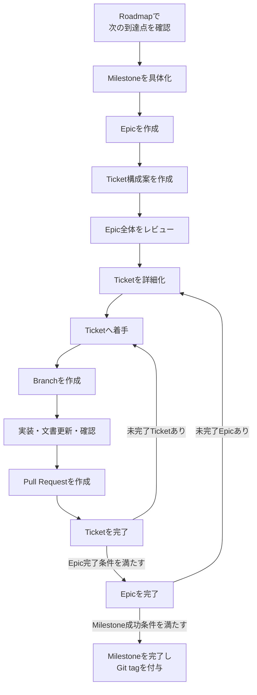

# RAGScope開発運用ガイド

> [!abstract] この文書の役割
> RAGScopeのプロジェクト管理で行う具体的な操作を、作業の流れに沿ってまとめる。  
> 定義、状態遷移、完了条件、配置、Frontmatterの規則は複製せず、各規約を参照する。

## 1. 参照する規約とファイル

| 確認する内容 | 正本 |
|---|---|
| Milestone・Epic・Ticketの定義、状態遷移、完了条件 | [RAGScopeプロジェクト管理規約](../RAGScopeプロジェクト管理規約.md) |
| 文書の配置、責務、参照関係 | [RAGScope文書管理規約](../RAGScope文書管理規約.md) |
| Frontmatterのプロパティ、型、許容値 | [Obsidianメタデータ規約](../Obsidianメタデータ規約.md) |
| バージョン全体の計画 | [RAGScopeロードマップ](../project-management/ロードマップ.md) |
| ノートへ挿入する実際の雛形 | [Milestoneテンプレート](../templates/Milestoneテンプレート.md)・[Epicテンプレート](../templates/Epicテンプレート.md)・[Ticketテンプレート](../templates/Ticketテンプレート.md) |
| Pull Requestへ挿入する実際の雛形 | [Pull Requestテンプレート](../../.github/pull_request_template.md) |

> [!important] 正本との分離
> このガイドでは、各規約にある定義や完了条件を全文で再掲しない。  
> 判断に迷った場合は、リンク先の正本を確認する。

## 2. 初回セットアップ

### 2.1 Obsidian Templatesを設定する

1. ObsidianでVaultを開く。
2. **Settings → Core plugins**で`Templates`を有効にする。
3. **Settings → Templates → Template folder location**へ`templates`を設定する。
4. コマンドパレットで`Templates: Insert template`を実行できることを確認する。

この設定は、Vaultを利用する環境ごとに一度だけ行う。

### 2.2 Pull Requestテンプレートを有効にする

リポジトリルートの`.github/pull_request_template.md`がデフォルトブランチへ反映されると、新しいPull Requestの本文へ自動的に読み込まれる。追加のローカル設定は不要である。

## 3. 全体の作業フロー



## 4. Milestoneを具体化する

次に着手すると決定したMilestoneだけを具体化する。具体化の対象は、[プロジェクト管理規約の「着手するMilestoneだけを具体化する」](<../RAGScopeプロジェクト管理規約.md#2.2 着手するMilestoneだけを具体化する>)に従う。

### 4.1 Milestoneノートを作成する

1. Roadmapで対象バージョンの到達点を確認する。
2. `project-management/milestones/<version>/`を作成する。
3. 同フォルダへ`<version>.md`を作成する。
4. Obsidianのコマンドパレットから`Templates: Insert template`を実行し、`Milestoneテンプレート`を挿入する。
5. `{{title}}`をバージョン番号へ置き換え、H1の到達点、目標、対象範囲、対象外を記入する。
6. [RAGScope要求定義](./RAGScope要求定義.md)を確認し、このMilestoneで直接扱う要求だけを選ぶ。
7. `対象要求`へ、要求IDから要求定義の該当節への相対リンクと、このMilestoneで実現する範囲を記入する。複数のMilestoneにまたがる要求は、要求全体ではなく今回の担当範囲だけを書く。
8. `成功条件`を記入し、対象要求に記載した範囲を実際に確認できることを確認する。
9. Roadmapの対象バージョン見出しを、作成したMilestoneノートへの相対リンクへ変更する。

配置、命名、必須項目は[プロジェクト管理規約の第4章](<../RAGScopeプロジェクト管理規約.md#4. フォルダ構成と命名>)と[第7.2節](<../RAGScopeプロジェクト管理規約.md#7.2 Milestone>)を確認する。

### 4.2 Epicノートを作成する

1. Milestoneで獲得する能力を1つ定義する。
2. Milestoneフォルダ直下へ、能力を表す英語・kebab-caseのEpicフォルダを作成する。
3. Epicフォルダへ`<version> <日本語タイトル>.md`を作成する。
4. `Epicテンプレート`を挿入する。
5. `{{title}}`をファイル名に対応する題名へ置き換える。
6. Frontmatterの`milestone`を、所属Milestoneへの内部リンクへ置き換える。
7. 能力、Milestoneでの役割、完了条件を記入する。

Epic一覧はMilestoneノートのBasesへ反映されるため、手作業の一覧は更新しない。

### 4.3 EpicのTicket構成案を作成する

1. Epicの能力、Milestoneでの役割、完了条件を確認する。
2. Epicの完了に必要な変更結果を、Ticket候補として列挙する。
3. 各Ticket候補について、仮のタイトル、主な成果物、前提となる成果、確認方法を整理する。
4. 作成または更新する要求、機能設計書、ADR、Experiment、OpenAPI、migrationなどを確認する。
5. Ticket間の依存関係と、自然な実行順序を整理する。
6. 複数の実装Ticketが共通の機能設計を前提とする場合は、Epicの冒頭に初期設計を作成または更新するTicketを含める。

Ticket構成案は、個別Ticketを詳細化する前の作業用の整理である。新しい管理階層や恒久的な手作業一覧は作成しない。

### 4.4 Epic全体のTicket構成をレビューする

1. Epicのすべての完了条件が、いずれかのTicketとEpic全体の確認によって満たせることを確認する。
2. 各Ticketが、1つの確認可能な変更結果として大きすぎず、実装手順だけの細かすぎる単位にもなっていないことを確認する。
3. 後続Ticketで初めて作成する成果物を、先行Ticketが暗黙に必要としていないことを確認する。
4. 最初の実装Ticketへ着手するために必要な要求、設計、判断、検証結果が揃っていることを確認する。
5. 共通する機能設計が必要な場合は、初期設計Ticketが実装Ticketより先に配置されていることを確認する。
6. Markdownの設計書と、コード、OpenAPI、migration、テストなどの機械可読な正本の責務が重複していないことを確認する。
7. Epic全体として能力を確認する方法が、いずれかのTicketまたはEpicの完了確認に含まれていることを確認する。
8. 問題がある場合はTicket構成案を見直し、問題がなければ各Ticketノートを詳細化する。

> [!important] 初期設計の完成度
> 初期設計Ticketでは、後続Ticketが実装へ着手できる見通しと判断基準を整える。  
> 実装前にすべての詳細を固定せず、実装で具体化または変更された現在設計は、後続Ticketで同じ設計書へ反映する。

### 4.5 Ticketノートを作成する

1. レビュー済みのTicket構成案に従い、Vault内の既存Ticketを検索して最大Ticket IDを確認する。
2. 次の連番を`RS-0001`形式で採番する。
3. 所属Epicフォルダへ`<Ticket ID> <日本語タイトル>.md`を作成する。
4. `Ticketテンプレート`を挿入する。
5. `{{title}}`をファイル名に対応する題名へ置き換える。
6. Frontmatterの`milestone`と`epic`を、実際の所属先への内部リンクへ置き換える。
7. 目的、完了条件、必要な場合は対象外・関連文書・実装メモを記入する。
8. 前提となる成果や先行Ticketがある場合は、着手条件と作業範囲が本文から判断できる状態にする。

Ticketの粒度と採番規則は[プロジェクト管理規約の第3.4節](<../RAGScopeプロジェクト管理規約.md#3.4 Ticket>)と[第4.3節](<../RAGScopeプロジェクト管理規約.md#4.3 Ticket ID>)、Epic全体の実行計画は[第2.4節](<../RAGScopeプロジェクト管理規約.md#2.4 Epic全体の実行計画を確認してから着手する>)を確認する。

## 5. Ticketへ着手する

1. Ticketの目的、完了条件、対象外、関連文書を確認する。
2. Ticketが前提とする先行Ticketの成果、初期設計、要求、ADR、Experimentが反映されていることを確認する。
3. 所属EpicとMilestoneの状態を確認する。
4. [親子状態の整合](<../RAGScopeプロジェクト管理規約.md#6.1 親子状態の整合>)に従い、必要なノートを`in_progress`へ変更する。
5. Ticket自身を`in_progress`へ変更する。
6. Ticket IDを含むBranchを作成する。

```bash
# 例
git switch -c feat/RS-0001-read-fixed-markdown
```

Branch名のprefixと形式は[プロジェクト管理規約の第9.2節](<../RAGScopeプロジェクト管理規約.md#9.2 ブランチ名>)を確認する。

## 6. 実装・文書更新・確認を行う

1. Ticketの完了条件を満たす変更を実装する。
2. テストまたは実行によって結果を確認する。
3. 変更によって、完了後も有効な要求・設計・判断・実験結果が生じたかを確認する。
4. 対応する正本がある場合は更新し、必要な正本がまだない場合だけ新しく作成する。
5. Ticketの`結果`へ、実装内容、確認方法、既知の制約、関連PRを記入する。

文書の記載先は[RAGScope文書管理規約](../RAGScope文書管理規約.md)に従う。

### 6.1 機能設計書を作成・更新する

変更によって完了後も有効な設計情報が生じる場合は、[文書管理規約の`docs/design/`](<../RAGScope文書管理規約.md#4.4 docs/design/>)と[機能設計の粒度と作業記録との分離](<../RAGScope文書管理規約.md#4.5 機能設計の粒度と作業記録との分離>)に従う。

1. 変更が、機能の責務、入出力、処理フロー、コンポーネント間の関係、データ構造、不変条件、エラー処理、境界条件などへ影響するか確認する。
2. 既存の機能設計書で現在設計を自然に説明できる場合は、その設計書を更新する。
3. 既存の設計書とは異なる機能・責務を扱う場合だけ、新しい機能設計書を作成する。
4. 今回だけの作業内容や実施結果はTicketへ残し、機能設計書には現在有効な設計を記載する。
5. 重要な判断理由がある場合はADR、実測や比較を伴う場合はExperimentを作成または更新する。
6. 作業上参照する必要がある場合は、Epic・Ticketの`関連文書`から該当文書へリンクする。

Epic冒頭の初期設計Ticketで作成した設計書も、後続の実装Ticketで具体化した内容に合わせて更新する。初期設計と現在の実装が不一致のまま残らないことを確認する。

すべてのTicketで設計書を作成する必要はない。

### 6.2 文書を作成・更新する

1. [RAGScope文書管理規約](../RAGScope文書管理規約.md)で、その情報の正本、配置先、文書の責務を確認する。
2. [Obsidianメタデータ規約](../Obsidianメタデータ規約.md)に従ってFrontmatterを設定する。
3. 既存文書または機械可読な正本と重複しないことを確認し、既存の正本で扱える場合は新しい文書を作らず更新する。
4. 関連する要求、設計、ADR、Experiment、Ticketを必要な範囲で更新し、リンク、Frontmatter、配置の整合を確認する。
5. 解消できない矛盾がある場合は、その内容と影響を明示してから作業を進める。

## 7. Pull Requestを作成してTicketを完了する

1. Ticketの`結果`を記入し、完了用の変更として`status: done`を含める。
2. 変更をcommitし、Branchをremoteへpushする。
3. Pull Requestを作成する。
4. 自動挿入されたPull Requestテンプレートへ、目的、主な変更、確認方法、関連Ticketを記入する。
5. テンプレートの完了確認を埋める。
6. レビューと必要な修正を完了し、デフォルトブランチへマージする。
7. マージ後、Ticketに記録した結果と実際の結果に差異がないこと、および`done`の完了条件が成立したことを確認する。

Ticketを`done`にできる条件は、[プロジェクト管理規約の第8.1節](<../RAGScopeプロジェクト管理規約.md#8.1 Ticket>)を正本とする。

## 8. Epicを完了する

1. 所属Ticketの状態を確認する。
2. [Epicの完了条件](<../RAGScopeプロジェクト管理規約.md#8.2 Epic>)を満たすことを確認する。
3. Epicの`結果`へ、実現した能力、確認方法、残った制約を記入する。
4. Epicを`done`へ変更する。
5. 変更をデフォルトブランチへ反映する。

## 9. Milestoneを完了してリリースする

1. 所属Epicの状態を確認する。
2. `対象要求`に記載した、このMilestoneで実現する範囲が実際のリリース内容と一致していることを確認する。
3. [Milestoneの完了条件](<../RAGScopeプロジェクト管理規約.md#8.3 Milestone>)を満たすことを確認する。
4. Milestoneの`リリース結果`へ、実現した内容、確認方法、既知の制約を記入する。
5. Milestoneを`done`へ変更する。
6. 変更をデフォルトブランチへ反映する。
7. 反映されたcommitへ、Milestone名と同じGit tagを付ける。
8. 必要な場合だけGitHub Releaseを作成し、Milestoneノートの対象要求IDとリンクを必要な範囲で再利用する。

```bash
# 例
git switch main
git pull
git tag v0.0
git push origin v0.0
```

リリース順序は[プロジェクト管理規約の第9.5節](<../RAGScopeプロジェクト管理規約.md#9.5 Git tag・GitHub Release>)を正本とする。

## 10. Ticketを移動・中止する

### 10.1 Ticketを移動する

1. Ticketが`planned`であることを確認する。
2. Ticketファイルを移動先Epicフォルダへ移動する。
3. Frontmatterの`milestone`と`epic`を更新する。
4. 本文中の関連リンクを確認し、必要なリンクを更新する。

移動条件は[プロジェクト管理規約の第4.4節](<../RAGScopeプロジェクト管理規約.md#4.4 Ticketの移動>)に従う。

### 10.2 Ticketを中止する

1. Ticketを実施しない理由を本文へ記録する。
2. `status`を`cancelled`へ変更する。
3. Epicの完了条件への影響を確認する。
4. Epicの完了条件を損なう場合は、親を完了させず、必要な対応を決定する。

EpicまたはMilestoneを中止する場合も、[親子状態の整合](<../RAGScopeプロジェクト管理規約.md#6.1 親子状態の整合>)に従って子ノートを処理する。

## 11. 操作方法を変更するとき

- 状態遷移、完了条件、配置、命名などのルールを変える場合は、先に対応する規約を変更する。
- ObsidianやGitHubの具体的な操作だけを変える場合は、このガイドを変更する。
- テンプレートから挿入される本文を変える場合は、該当テンプレートを変更する。
- 同じ説明を規約、ガイド、テンプレートへ重複して記載しない。
