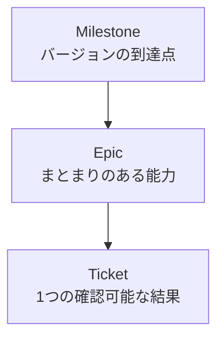

---
aliases:
  - RAGScopeプロジェクト管理規約
  - RAGScopeチケット運用規約
tags:
  - ragscope
  - obsidian
  - project-management
note_type: reference
status: stable
---
# RAGScope — Obsidianプロジェクト管理規約

> [!abstract] このノートの役割
> RAGScopeの開発作業を、Obsidian上で**Milestone → Epic → Ticket**の3層に分けて管理する。  
> 個人開発の負担を増やさず、AIが独断で作業・構造・メタデータを増やさないための最小限のルールを定める。

> [!tip] 日常運用
> 迷ったときは[[#6. 操作別チェックリスト]]を見る。  
> Ticketは原則として、**作る → `active` → 実装・検証 → 結果を書く → `stable`**だけで運用する。

## 1. 参照順序

1. [[ragscope-design|RAGScope設計書]]
   - バージョンの範囲、対象外、成功条件を定義する。
2. [[obsidian-metadata-rules|Obsidianメタデータ規約]]
   - Frontmatter、`note_type`、`status`、`tags`を定義する。
3. 本規約
   - Milestone、Epic、Ticketの配置と運用を定義する。

> [!important] 優先順位
> 矛盾した場合は、設計書、メタデータ規約、本規約の順に優先する。  
> AIは矛盾を独断で解消せず、ユーザーへ報告する。

## 2. 基本原則

### 2.1 現在のMilestoneだけを具体化する

- 現在取り組むMilestoneだけをEpicとTicketへ分解する。
- 次のMilestoneは、必要ならMilestoneノートだけ作る。
- それ以降は[[ragscope-design#10.2 バージョン別計画|設計書のロードマップ]]だけで管理する。
- 将来のMilestoneやTicketを一括生成しない。
- 将来バージョンの機能を現在のTicketへ混ぜない。

### 2.2 1 Ticket、1つの確認可能な結果

Ticketは、完了したかを確認できる単位にする。

- 適切：固定Markdown文書を読み込める、Embeddingを1件生成できる、候補モデルの採否を決められる
- 大きすぎる：RAGを作る、Python AI Serviceを完成させる
- 細かすぎる：ファイルを1つ作る、importを追加する

細かな実装手順はTicket内のチェックリストや作業メモに置く。

### 2.3 同じ情報を複数箇所で管理しない

- MilestoneとEpicの所属はフォルダ階層で表す。
- Ticketの状態は、そのTicketの`status`を正本とする。
- 現在の作業は`status: active`で判断する。
- Ticket一覧はObsidian Basesまたはフォルダ表示から取得する。
- Epic、Milestone、ダッシュボードへTicket一覧を手作業で複製しない。

### 2.4 管理より実装を優先する

- 小さなTicketでは不要な見出しを省略してよい。
- 形式を整えるためだけのTicketを原則として作らない。
- 管理が負担になった場合は、自動化より先に記録項目を減らす。
- 記録は、後から目的・結果・判断を追える程度で十分とする。

## 3. 3層構造と配置



| 層 | 役割 | 例 |
|---|---|---|
| Milestone | RAGScopeのバージョン単位 | `v0.0`、`v0.1`、`v1.0` |
| Epic | Milestoneを構成する能力・作業領域 | 文書取り込み、Embedding、Haskell CLI |
| Ticket | 日々取り組む最小の管理単位 | 固定Markdown文書を読み込める |

Milestoneの範囲と成功条件は、必ず設計書を起点にする。

### 3.1 フォルダ構成

```text
project-management/
├── ragscope-project-dashboard.md
└── milestones/
    └── v0.0/
        ├── v0.0.md
        └── document-ingestion/
            ├── v0.0-document-ingestion.md
            └── RS-0001-read-fixed-markdown.md
```

- Milestoneは`milestones/<version>/`へ置く。
- Epicは対象Milestoneフォルダの直下へ置く。
- Ticketは対象Epicフォルダの直下へ置く。
- `project-management`には管理ノートだけを置き、ソースコードは置かない。

## 4. 命名・Frontmatter・状態

### 4.1 Ticket IDと種別

- Ticket IDは`RS-0001`形式の一意な連番とする。
- 作成前に既存の最大IDを確認する。
- 完了・中止・移動後も変更せず、削除したIDも再利用しない。

```text
RS-0001-read-fixed-markdown.md
```

```markdown
# RS-0001 — [Feature] 固定Markdown文書を読み込む
```

| 種別 | 用途 |
|---|---|
| `[Feature]` | 新しい動作や能力 |
| `[Fix]` | 不具合や不整合の修正 |
| `[Spike]` | 不確実な技術の小規模検証 |
| `[Design]` | APIやデータ構造などの決定 |
| `[Test]` | 独立した検証 |
| `[Docs]` | README、設計書、手順の更新 |

### 4.2 Frontmatter

[[obsidian-metadata-rules]]に登録されたプロパティだけを使用する。

```yaml
aliases:
tags:
note_type:
status:
cssclasses:
```

`milestone`、`epic`、`ticket_type`、`priority`、`blocked`、`due_date`などは追加しない。  
所属はフォルダ、Ticket種別は見出し、状態は`status`で表す。

| `status` | Ticketでの意味 |
|---|---|
| `draft` | 未着手 |
| `active` | 作業中 |
| `stable` | 完了 |
| `deprecated` | 後継Ticketや別方針に置き換えられた |
| `archived` | 実施しないと判断した |

原則として、同時に`active`にする主要Ticketは1件とする。

| ノート | 推奨`note_type` |
|---|---|
| ダッシュボード、Milestone、Epic | `moc` |
| 実装・修正・Test・Docs Ticket | `implementation` |
| Spike・比較検証 | `experiment` |
| 設計書 | `design` |
| ADR | `adr` |
| 規約 | `reference` |

## 5. 各ノートに最低限書くこと

### 5.1 Milestoneノート

- 設計書へのリンク
- 到達点と成功条件
- EpicへのWikiリンク
- 完了時の結果・制約・持ち越し

Ticket一覧や現在の作業は記載しない。

### 5.2 Epicノート

- Epicの完了状態
- 対象となる設計書の節
- Epicの完了条件

Ticket一覧は記載せず、EpicフォルダまたはBasesから確認する。

### 5.3 Ticketノート

```yaml
---
aliases:
  - 日本語のTicket名
tags:
  - ragscope
note_type: implementation
status: draft
---
```

```markdown
# RS-0001 — [Feature] Ticket名

## 目的

## 完了条件

- [ ] 確認可能な結果

## 対象外

## 作業メモ

## 結果
```

`目的`、`完了条件`、`対象外`、`結果`は原則として残す。  
`作業メモ`は不要なら省略してよい。Spikeでは`結果`に採用・不採用・保留の結論を書く。

## 6. 操作別チェックリスト

> [!important] 日常運用の正本
> Milestone、Epic、Ticket、その他ノートを追加・変更するときは、この章に従う。

### 6.1 早見表

| 操作 | 必須作業 | 他ノートの更新 |
|---|---|---|
| Milestone作成 | フォルダとMilestoneノートを作る | ダッシュボードへリンク追加 |
| Epic作成 | フォルダとEpicノートを作る | 親Milestoneへリンク追加 |
| Ticket作成 | EpicフォルダへTicketを作る | 不要 |
| Ticket着手 | `status: active` | 不要 |
| Ticket完了 | 結果を書き`status: stable` | 原則不要 |
| Ticket置換 | 理由を書き`status: deprecated` | 必要なら後継Ticket作成 |
| Ticket中止 | 理由を書き`status: archived` | 不要 |
| ADR・実験作成 | 対応するノートを作る | 関連Ticketからリンク |
| 設計変更 | 設計書またはADRを更新 | 関連Ticketへリンク |

Basesを使う場合、Ticket追加と`status`変更は一覧へ自動反映される。  
Ticketリンクをダッシュボード、Milestone、Epicへ手作業で並べない。

### 6.2 Milestoneを作る

1. 設計書で対象バージョンの範囲と成功条件を確認する。
2. `milestones/<version>/`とMilestoneノートを作る。
3. ダッシュボードのMilestone一覧へリンクを追加する。
4. 現在取り組む場合だけ、必要なEpicを作る。

将来のEpicやTicketまで作らない。

### 6.3 Epicを作る

1. Milestoneの成功条件から、まとまりのある能力を1つ切り出す。
2. EpicフォルダとEpicノートを作る。
3. 親MilestoneノートのEpic一覧へリンクを追加する。

ダッシュボードとTicket一覧は更新しない。

### 6.4 Ticketを作る・着手する・完了する

作成：

1. 1つの確認可能な結果になっているか確認する。
2. 最大Ticket IDを確認して採番する。
3. 対象EpicフォルダへTicketを作る。
4. `目的`、`完了条件`、`対象外`を書き、`status: draft`にする。

着手：

1. Ticketの内容を確認する。
2. `status: active`へ変更する。
3. 実装・調査・検証を行う。

完了：

1. 完了条件を確認する。
2. `結果`へ、何を確認できたかを書く。
3. 重要な設計変更がある場合だけ、設計書またはADRを更新する。
4. `status: stable`へ変更する。

いずれも、通常は他のノートを更新しない。  
結果未記録、完了条件未確認、設計上の矛盾放置の状態では`stable`にしない。

### 6.5 Ticketを置換・中止する

- 置換：理由と後継Ticketを書き、`status: deprecated`にする。
- 中止：実施しない理由を書き、`status: archived`にする。
- Ticket IDは再利用しない。

### 6.6 Milestoneを完了する

1. 設計書の成功条件を実行結果で確認する。
2. 必須Epicの完了を確認する。
3. Milestoneノートへ結果、制約、持ち越しを記録する。
4. `status: stable`へ変更する。
5. 次へ進む場合だけ、次のMilestoneを作る。

Ticket数ではなく、設計書の成功条件で完了を判定する。

### 6.7 その他ノートの記載先

| 内容 | 記載先 |
|---|---|
| バージョンの範囲・成功条件 | [[ragscope-design]] |
| 作業の目的・完了条件・結果 | Ticket |
| 長期的に残す重要な設計判断 | ADR |
| モデルや方式の比較・検証 | `note_type: experiment`のノート |
| 一般的なAI・LLM・RAG知識 | [[ai-llm-rag-notes]] |
| メタデータの規則 | [[obsidian-metadata-rules]] |

Ticketを長期的な仕様書にしない。完了後も有効な設計情報だけを設計書またはADRへ移す。

## 7. ダッシュボードとBases

`ragscope-project-dashboard.md`はプロジェクト管理全体の入口とし、次だけを持つ。

- 設計書・規約など主要ノートへのリンク
- Milestone一覧
- BasesによるActive・Draft・Stable Ticket一覧

手動更新は、新しいMilestoneまたは主要ノートへのリンク追加だけとする。  
Ticket一覧、状態、現在作業中のTicketはBasesから自動表示し、Ticket追加や状態変更のたびにBase定義を変えない。

Basesは派生表示であり、正本は各MarkdownノートとFrontmatterである。

## 8. AI向け必須ルール

AIは次を必ず守る。

1. 作業前に[[ragscope-design]]、[[obsidian-metadata-rules]]、本規約を読む。
2. ユーザーが指定した範囲だけを作成・更新する。
3. 依頼されていない将来のMilestone、Epic、Ticketを作らない。
4. 現在のMilestoneを超える機能をTicketへ混ぜない。
5. 未登録のプロパティ、`note_type`、`status`を追加しない。
6. Ticket IDを重複・再利用・変更しない。
7. Ticket一覧や現在の作業を複数ノートへ重複記載しない。
8. 設計書と矛盾した場合は勝手に直さず報告する。
9. 必要な最小限のファイルだけを変更し、変更ファイルをユーザーへ示す。
10. Mermaid図内の改行には`<br>`を使用する。

> [!danger] 禁止
> 「将来便利そう」「一般的には必要」という理由だけで、プロパティ、フォルダ、ノート、Ticket、手順を増やしてはならない。

## 9. 最小運用

```text
project-management/
├── ragscope-project-dashboard.md
└── milestones/
    └── v0.0/
        ├── v0.0.md
        └── <最初のEpic>/
            ├── <Epicノート>.md
            └── RS-0001-<最初のTicket>.md
```

```text
Ticketを作る
→ statusをactiveにする
→ 実装・検証する
→ 結果を書く
→ statusをstableにする
```

> [!success] この運用の狙い
> 人間の管理作業は軽く保ち、AIに対してだけ、範囲・命名・メタデータ・変更対象を明確に制限する。  
> RAGScopeの価値は管理の厳密さではなく、実装・検証・設計判断の過程を説明できることに置く。
